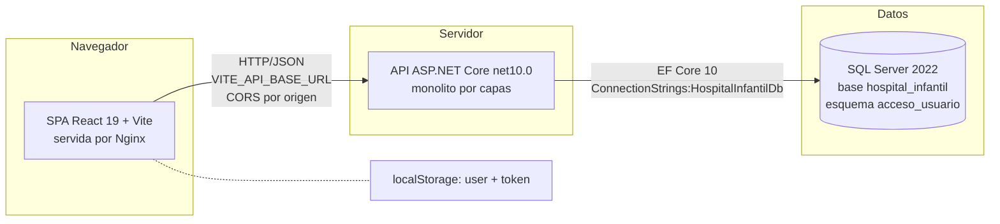
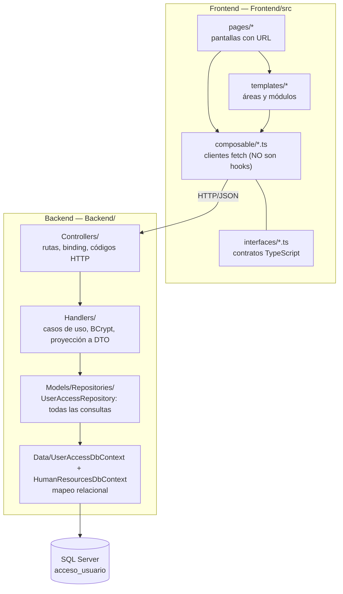
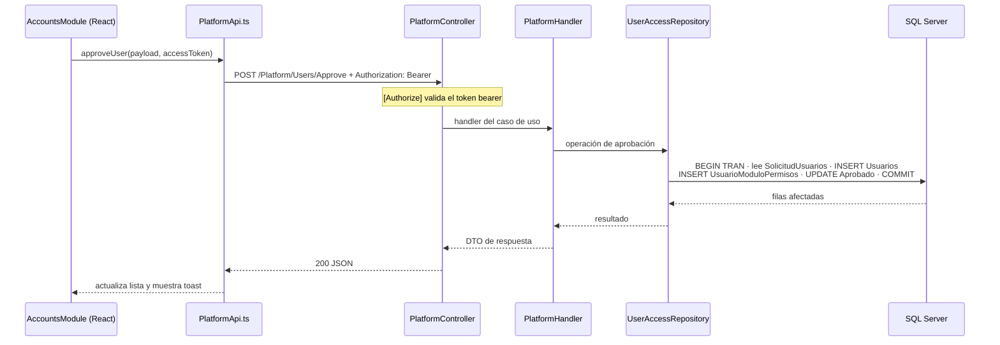
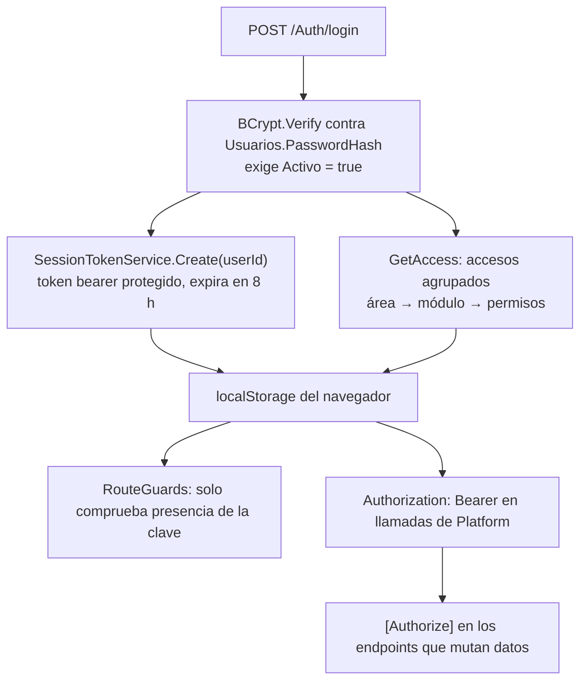
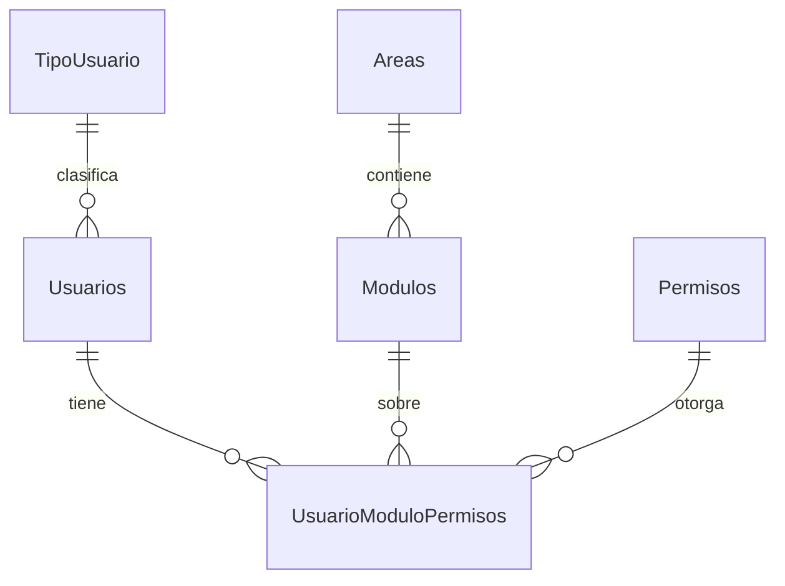
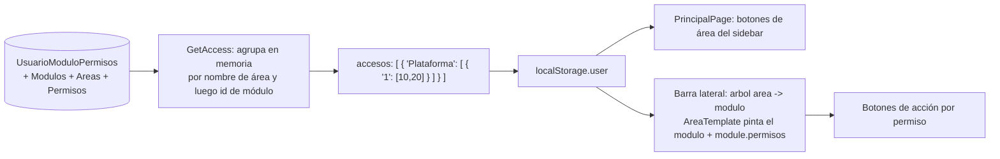
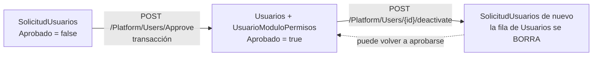
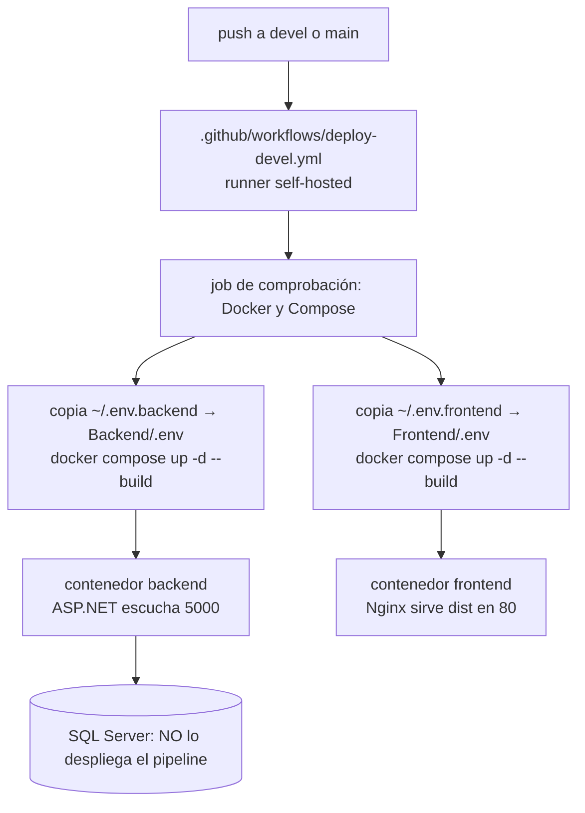

# Arquitectura general del sistema

Documento de entrada de la bóveda. Describe la forma **real** del sistema verificada contra el código del 2026-09-18, no la forma deseada. Para el detalle de cada capa ve a [[be-architecture]], [[fe-architecture]] y [[db-schema-acceso-usuario]].

## 1. Qué es el sistema

Plataforma web administrativa del Hospital Infantil de México Federico Gómez. El dominio implementado hoy es **acceso y administración de usuarios**: solicitud de cuenta, aprobación, asignación de permisos por módulo, desactivación, cambio de contraseña y navegación por áreas.

Las áreas **Recursos Humanos** y **Contabilidad** existen como andamiaje: hay controladores y vistas, pero sin entidades, tablas ni reglas de negocio. Ver [[be-controllers]] y [[fe-pages]].

## 2. Forma general: tres piezas desplegables

No hay microservicios, ni bus de eventos, ni BFF, ni gateway de aplicación. Son **tres contenedores independientes** con tres `docker-compose.yml` separados (`Backend/`, `Frontend/`, `DataBase/`); no existe un compose unificado ni una solución `.sln`. Detalle en [[be-deployment]], [[fe-config-deployment]] y [[db-infrastructure]].

## 3. Capas y límites reales

Puntos clave del diseño, todos verificados:

- **Un único repositorio** (`UserAccessRepository`) concentra todas las lecturas y escrituras del dominio. Ver [[be-repository]].
- **Clases concretas, sin interfaces.** `UserAccessRepository`, `AuthHandler`, `PlatformHandler` y `SessionTokenService` se registran como `Scoped` en `Backend/Program.cs:35-43`. No hay inversión de dependencias por abstracción, ni mediador, ni unidad de trabajo propia: EF Core es la unidad de trabajo.
- **Separación parcial de contratos**: el repositorio conoce DTO de petición HTTP, así que el límite entre persistencia y transporte está perforado. Ver [[be-repository]].
- **El frontend no tiene estado global**: ni Context, ni Redux, ni store. El usuario se lee de `localStorage` en `PrincipalPage` y baja por props (`user`, `catalogs`, `module`) hasta los módulos. Ver [[fe-architecture]] y [[fe-session-state]].
- **No hay capa de mapeo automático** (AutoMapper o similar): las proyecciones a DTO se escriben a mano en los handlers.

## 4. Ciclo de vida de una petición

Ejemplo con la aprobación de una solicitud, el flujo más completo del sistema:

Convenciones de transporte que aplican a todo el sistema:

- Las rutas se derivan de `[Route("[controller]")]`: **no hay prefijo `/api` ni versionado**. Rutas reales: `/Auth/...`, `/Platform/...`, `/HumanResources/...`, `/Contability` (nótese la grafía `Contability`).
- Serialización JSON por defecto de ASP.NET Core: propiedades en **camelCase** y claves de diccionario numéricas convertidas a **string**.
- `[ApiController]` produce `400` automático ante DataAnnotations inválidas, antes de entrar al handler.
- Tabla maestra de endpoints: [[be-api-reference]]. Clientes que los consumen: [[fe-api-clients]].

## 5. Modelo de autenticación y autorización

Este es el punto donde el sistema cambió más recientemente, y donde conviven dos mecanismos de distinta fuerza.

Lo que **sí** existe, verificado:

- Esquema de token bearer registrado en `Backend/Program.cs:32-34`, con expiración de **8 horas**, y `app.UseAuthentication()` / `app.UseAuthorization()` activos (`Backend/Program.cs:65-66`).
- `SessionTokenService` (`Backend/Handlers/SessionTokenService.cs`) emite un ticket protegido con un único claim: `ClaimTypes.NameIdentifier` = id de usuario.
- `[Authorize]` protege los **cinco endpoints que mutan o exponen permisos** de `/Platform`: desactivar usuario, actualizar comentario, aprobar usuario, leer permisos de un usuario y sobreescribir permisos (`Backend/Controllers/PlatformControler.cs:41,76,101,133,152`).
- El frontend envía `Authorization: Bearer` en esas llamadas desde `Frontend/src/composable/PlatformApi.ts`.
- **Esos cinco endpoints además comprueban autorización en el servidor**, no solo identidad: el repositorio verifica que el usuario del token tenga una asignación en `UsuarioModuloPermisos`, con su cuenta activa y con módulo y área activos (`Backend/Models/Repositories/UserAccessRepository.cs:151,222,241,312`). Es una comprobación real contra la base, no confianza en el JSON del navegador.

Lo que **no** existe, y condiciona cualquier implementación futura:

- **Los dos listados de `/Platform` no están protegidos**: `GET /Platform/Users` y `GET /Platform/UserRequest` (`Backend/Controllers/PlatformControler.cs:24,31`) no llevan `[Authorize]`, así que devuelven datos personales de todas las cuentas y solicitudes sin token.
- **Todo `/Auth` es anónimo**, incluido `POST /Auth/changePassword`, que cambia una contraseña conociendo solo el correo: no hay token temporal, envío de correo ni prueba de titularidad.
- **La comprobación de permisos está cableada a `ModuloId == 1`.** Las cuatro verificaciones del repositorio exigen literalmente una asignación sobre el módulo con id `1`, sin distinguir *qué* permiso concreto (`editar`, `crear`, `eliminar`) requiere cada operación. Es autorización "por pertenencia al módulo de cuentas", no por permiso: quien tenga cualquier fila en el módulo 1 puede aprobar, dar de baja, comentar y reescribir permisos. Y si el catálogo se recrea con otros ids, la comprobación se rompe en silencio.
- **Los permisos finos siguen siendo solo presentación.** La distinción entre `editar`, `crear` y `eliminar` existe únicamente en el frontend para decidir qué botones pinta; el servidor no la replica.
- `TipoUsuario.TipoId` clasifica cuentas pero **no otorga privilegios** en el código.
- Los guards del frontend (`Frontend/src/components/RouteGuards.jsx`) solo comprueban que la clave de `localStorage` no esté vacía: son navegación de interfaz, **no** control de acceso.

Consecuencia arquitectónica: **la superficie de autorización real es parcial**. Ver el detalle en [[be-auth-session]], [[fe-session-state]] y los riesgos en [[be-findings]].

## 6. El modelo de accesos, de punta a punta

Es el concepto central del sistema y atraviesa las tres capas.

Una fila de `UsuarioModuloPermisos` significa **un permiso, para un usuario, sobre un módulo**. Varios permisos sobre el mismo módulo son varias filas; la PK compuesta `(UsuarioId, ModuloId, PermisoId)` evita duplicados exactos. No hay relación directa usuario–área: el área se deduce recorriendo `UsuarioModuloPermisos → Modulos → Areas`. Tampoco hay jerarquía de permisos, herencia de roles, denegaciones explícitas ni superadministrador. Detalle en [[db-relationships]] y [[db-table-usuario-modulo-permisos]].

Ese grafo se aplana en el login a la estructura `accesos`, que el navegador guarda y usa para dibujar el menú:

`accesos` es un **array de diccionarios** área → array de diccionarios id de módulo → array de ids de permiso. No incluye nombres de módulo ni de permiso: esos se resuelven contra los catálogos que `PrincipalPage` pide aparte (`/Auth/areas`, `/Auth/access`, `/Auth/modules`). Ver [[fe-templates-areas-modules]] y [[be-flows]].

### Ciclo de vida de una cuenta

Atención a la segunda flecha, porque el nombre engaña: **"dar de baja" no desactiva, borra**. La operación copia los datos del usuario —incluido el `PasswordHash`— de vuelta a `SolicitudUsuarios`, elimina sus filas de la tabla puente y ejecuta `_context.Usuarios.Remove(usuario)` (`Backend/Models/Repositories/UserAccessRepository.cs:141-202`). En consecuencia, la columna `Usuarios.Activo` **nunca se pone en 0** por ningún camino del código: esa columna y el filtro `Activo == true` del login son, hoy, código muerto. Es un ciclo destructivo y reversible solo aproximadamente. Detalle en [[db-table-usuarios]] y [[db-findings]].

## 7. Acoplamientos que hay que respetar

El punto más frágil de la arquitectura: **hay datos de SQL cableados en el código del frontend**.

| Acoplamiento | Dónde vive | Qué rompe si cambia |
| --- | --- | --- |
| Nombre de área → componente | `TEMPLATE_REGISTRY` en `Frontend/src/pages/principalPage/principalPage.jsx:10-15`, claves `inicio`, `plataforma`, `recursos humanos`, `contabilidad` | Renombrar `Areas.Nombre` deja el área sin vista, aunque conserve su id |
| Id de módulo → componente | `MODULE_REGISTRY` en `Frontend/src/templates/shared/areaTemplate.jsx:8-12`, ids fijos `1`, `2`, `3` | Recrear o reordenar `Modulos` monta el componente equivocado. El registro es **global por id**, no por combinación área+nombre |
| Semántica de permisos | `AccountsModule` resuelve los ids de `module.permisos` a los nombres `editar` y `crear` vía el catálogo | Renombrar filas de `Permisos` apaga botones silenciosamente |
| Nombre de la cadena de conexión | `ConnectionStrings:HospitalInfantilDb`, `Backend/Program.cs:48` | Renombrar la clave deja EF sin conexión |

Antes de crear o migrar catálogos, confirma los ids y nombres reales. Ver [[db-findings]] y [[fe-findings]].

## 8. Lo que el repositorio NO tiene

Ausencias verificadas, relevantes al planear trabajo:

- **Sin migraciones EF.** El esquema vive en la instancia SQL. Sus descripciones versionadas son el mapeo de `UserAccessDbContext` para `acceso_usuario`, y para `recursos_humanos` el de `HumanResourcesDbContext` más el script `DataBase/scripts/RecursosHumanos.sql` (ver [[db-schema-recursos-humanos]]). La imagen `useraccess_schema.png` ya no existe en el repositorio.
- **`DataBase/scripts/Init.sql` existe pero NO está versionado ni es fiable.** Apareció sin seguimiento en Git y diverge del mapeo EF en dos puntos que rompen la aplicación: crea `SolicitudUsuarios` sin `PRIMARY KEY` y no crea la columna `comentario`. Además su seed deja el sistema sin nadie autorizado. No lo uses para provisionar sin corregirlo antes. Ver [[db-scripts-and-migrations]].
- **Sin seed de catálogos**: áreas, módulos, permisos y tipos deben existir en la base para que la aplicación sea usable.
- **Sin pruebas**: no hay proyecto de test en el backend ni suite en el frontend.
- **Sin typecheck**: el frontend no tiene `tsconfig.json` ni script de comprobación de tipos; Vite transpila los `.ts` sin validarlos, por lo que las interfaces pueden mentir sin romper el build. Ver [[fe-interfaces]].
- **Sin `.dockerignore`** en Backend ni Frontend: ambos contextos de build copian el árbol completo.
- **Sin `DataBase/nginx.conf`**, aunque el compose de la base lo monta para su proxy TCP. Ver [[db-infrastructure]].
- **Sin manejo central de errores** en el backend: no hay middleware de excepciones ni traducción de errores de EF, BCrypt o formato de fecha a respuestas de negocio.

## 9. Topología de despliegue

El pipeline despliega backend y frontend; **no despliega la base ni aplica cambios de esquema**. Tampoco corre lint, tests, healthcheck posterior ni rollback, y elimina el contenedor anterior antes de construir el nuevo, así que un build fallido deja indisponibilidad. La rama `main` cambia nombres y puertos pero no sobreescribe los tags de imagen. Detalle en [[be-deployment]] y [[fe-config-deployment]].

Configuración por entorno, **siempre por nombre de variable, nunca por valor**: el backend consume `ConnectionStrings__HospitalInfantilDb`, `Cors__AllowedOrigins__*` y `ASPNETCORE_ENVIRONMENT`; el frontend consume `VITE_API_BASE_URL`, que se **compila dentro del bundle** y por tanto es pública y debe ser resoluble por el navegador del usuario final. Nunca pongas secretos en variables `VITE_*`.

## 10. Cómo extender el sistema sin romperlo

| Quieres… | Recorrido obligado | Nota de referencia |
| --- | --- | --- |
| Un endpoint nuevo | Controller del área → handler → repositorio → EF; registra servicios nuevos en `Program.cs` | [[be-architecture]] |
| Una operación protegida | Añade `[Authorize]`, identifica al usuario por el claim del token y **comprueba su asignación en el servidor**; no confíes en que la interfaz ocultó el botón | [[be-auth-session]] |
| Un módulo de interfaz | Confirma `Modulos.Id` y `AreaId` reales, regístralo en `MODULE_REGISTRY`, crea el componente bajo `templates/<area>/<modulo>/` | [[fe-templates-areas-modules]] |
| Cambiar el esquema | Verifica metadatos en la instancia, conserva nombres SQL, `TipoId` como `short` y la PK compuesta; actualiza entidad, mapeo, DTO, cliente y esta bóveda | [[db-schema-acceso-usuario]] |
| Datos de negocio de RH o Contabilidad | Diseño nuevo desde cero: no hay entidades, tablas ni reglas que heredar de los placeholders | [[be-controllers]] |

## Enlaces

- [[index]] — índice general de la bóveda
- Bóvedas: [[db-index]] · [[be-index]] · [[fe-index]]
- Documentos centrales de cada capa: [[db-schema-acceso-usuario]] · [[be-architecture]] · [[fe-architecture]]
- Contratos: [[be-api-reference]] · [[be-dto-contracts]] · [[fe-api-clients]] · [[fe-interfaces]]
- Seguridad y sesión: [[be-auth-session]] · [[fe-session-state]]
- Despliegue: [[be-deployment]] · [[fe-config-deployment]] · [[db-infrastructure]]
- Deuda: [[db-findings]] · [[be-findings]] · [[fe-findings]]
