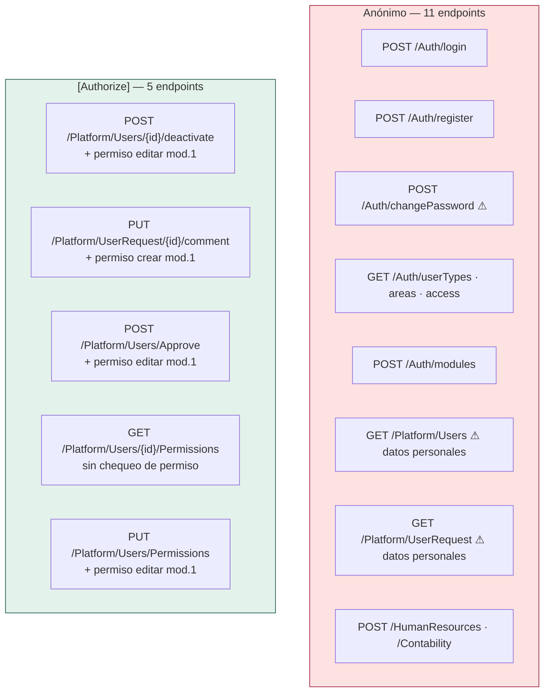

# Referencia de la API HTTP

**31 endpoints** verificados uno por uno en el código; los de `/HumanResources` corresponden al 2026-09-19. Las rutas respetan **exactamente la grafía del código** (incluidas las mayúsculas y la mezcla de idiomas). Detalle de DTO en [[be-dto-contracts]]; cadenas internas en [[be-flows]].

## 0. Reglas generales

**[verificado]**

- Ruteo por atributo: `[Route("[controller]")]` en los 4 controllers → prefijos `/Auth`, `/Platform`, `/HumanResources`, `/Contability`. **No hay prefijo `/api` ni versionado.**
- Todos los controllers llevan `[ApiController]`: si un DTO viola sus `DataAnnotations`, ASP.NET devuelve **400 con `ValidationProblemDetails`** *antes* de entrar al controller.
- `[FromBody]` explícito en todos los DTO de entrada.
- Respuestas en **camelCase**; las **claves de diccionario se preservan literalmente**; `DateOnly` → `"yyyy-MM-dd"`. Ver [[be-architecture]] §8.
- **Base URL:** el frontend compone `${VITE_API_BASE_URL}/Auth` y `${VITE_API_BASE_URL}/Platform` — ver [[fe-api-clients]].
- Un solo endpoint acepta paginación, ordenación y filtros por query string: `GET /HumanResources/Plazas` (§4.1b). El resto devuelve la colección completa.
- `CancellationToken` en las 5 acciones de `Platform` y en todas las de `/HumanResources`.

## 1. Tabla maestra

| # | Método | Ruta exacta | Auth | Petición | Éxito | Otros códigos |
| --- | --- | --- | --- | --- | --- | --- |
| 1 | `POST` | `/Auth/login` | — | `AuthRequest` | `200` `AuthResponse` | `401` `{message}`, `400` validación |
| 2 | `POST` | `/Auth/register` | — | `RegisterRequest` | `200` `{success,message}` | `400` validación, `500` fecha inválida |
| 3 | `POST` | `/Auth/changePassword` | — | `ChangePasswordRequest` | `200` **`true`/`false` desnudo** | `400` validación |
| 4 | `GET` | `/Auth/userTypes` | — | — | `200` `{userTypes:{…}}` | `500` claves duplicadas |
| 5 | `GET` | `/Auth/areas` | — | — | `200` `{areas:{…}}` | — |
| 6 | `GET` | `/Auth/access` | — | — | `200` `{permisos:{…}}` | — |
| 7 | `POST` | `/Auth/modules` | — | `ModuleRequest` | `200` `{modulos:{…}}` | `400` validación |
| 8 | `GET` | `/Platform/Users` | **—** | — | `200` `{usuarios:[…]}` | — |
| 9 | `GET` | `/Platform/UserRequest` | **—** | — | `200` `{solicitudes:[…]}` | `401` (rama inalcanzable) |
| 10 | `POST` | `/Platform/Users/{id:int}/deactivate` | **`[Authorize]`** | ruta | `200` `{success,code,message}` | `400`, `401`, `403`, `404`, `409`, `500` |
| 11 | `PUT` | `/Platform/UserRequest/{id:int}/comment` | **`[Authorize]`** | `UpdateCommentRequest` | `200` `{success,message}` | `400`, `401`, `403`, `404`, `500` |
| 12 | `POST` | `/Platform/Users/Approve` | **`[Authorize]`** | `ApproveUserRequest` | `200` `{success,code,message}` | `400`, `401`, `403`, `404`, `409`, `500` |
| 13 | `GET` | `/Platform/Users/{id:int}/Permissions` | **`[Authorize]`** | ruta | `200` `UserPermissionsResponse` | `400`, `401`, `404`, `500` |
| 14 | `PUT` | `/Platform/Users/Permissions` | **`[Authorize]`** | `UpdateUserPermissionsRequest` | `200` `{success,code,message}` | `400`, `401`, `403`, `404`, `500` |
| 15 | `GET` | `/HumanResources/Plazas` | **—** | query `PlazaQueryRequest` | `200` `PlazasResponse` | — |
| 15a | `POST` | `/HumanResources/Plazas` | **—** | `PlazaRequest` | `201` `CatalogOperationResponse` | `400` `invalid`, `409` `conflict` |
| 15b | `PUT` | `/HumanResources/Plazas/{id:int}` | **—** | `PlazaRequest` | `200` `CatalogOperationResponse` | `400`, `404`, `409` |
| 15c | `DELETE` | `/HumanResources/Plazas/{id:int}` | **—** | ruta | `200` `CatalogOperationResponse` | `400`, `404`, `409` si tiene empleados o registros de codigo federal |
| 15d | `GET` | `/HumanResources/Unidades` | **—** | — | `200` `UnidadesResponse` | — |
| 16 | `GET` | `/HumanResources/TiposContratacion` | **—** | — | `200` `TiposContratacionResponse` | — |
| 17 | `GET` | `/HumanResources/Areas` | **—** | — | `200` `AreasResponse` | — |
| 18 | `POST` | `/HumanResources/Areas` | **—** | `AreaRequest` | `201` `CatalogUploadResponse` | `400` rechazo, `409` ya existía |
| 19 | `POST` | `/HumanResources/Areas/Upload` | **—** | `UploadAreasRequest` | `200` `CatalogUploadResponse` | `400` todo rechazado, `409` integridad |
| 20 | `PUT` | `/HumanResources/Areas/{id:int}` | **—** | `AreaRequest` | `200` `CatalogOperationResponse` | `400` `invalid`, `404` `not_found`, `409` `conflict` |
| 21 | `DELETE` | `/HumanResources/Areas/{id:int}` | **—** | ruta | `200` `CatalogOperationResponse` | `400`, `404`, `409` si tiene plazas adscritas |
| 22 | `GET` | `/HumanResources/Puestos` | **—** | — | `200` `PuestosResponse` | — |
| 23 | `POST` | `/HumanResources/Puestos` | **—** | `PuestoRequest` | `201` `CatalogUploadResponse` | `400` rechazo, `409` ya existía |
| 24 | `POST` | `/HumanResources/Puestos/Upload` | **—** | `UploadPuestosRequest` | `200` `CatalogUploadResponse` | `400` todo rechazado, `409` integridad |
| 25 | `PUT` | `/HumanResources/Puestos/{id:int}` | **—** | `PuestoRequest` | `200` `CatalogOperationResponse` | `400` `invalid`, `404` `not_found`, `409` `conflict` |
| 26 | `DELETE` | `/HumanResources/Puestos/{id:int}` | **—** | ruta | `200` `CatalogOperationResponse` | `400`, `404`, `409` si tiene plazas asociadas |
| 27 | `POST` | `/Contability` | — | — | `200` `text/plain` | — |

> **Atención:** los endpoints **8 y 9 devuelven datos personales de todos los usuarios y solicitudes sin ninguna autenticación**. Ver [[be-auth-session]] y [[be-findings]].

## 2. `/Auth` — `Backend/Controllers/AuthController.cs`

### 2.1 `POST /Auth/login` · `AuthController.cs:18-26`

**Petición** — `AuthRequest` (`Models/Request/UserAccess/AuthRequest.cs`)

| Campo | Tipo | Anotaciones |
| --- | --- | --- |
| `User` | `string` | `[Required]` |
| `Password` | `string` | `[Required]` |

```json
{ "user": "jmonroy", "password": "…" }
```

**Respuesta 200** — `AuthResponse`

```json
{
  "id": 100,
  "nombre": "Nombre Ejemplo",
  "alias": "ejemplo",
  "correo": "ejemplo@example.invalid",
  "accessToken": "CfDJ8…",
  "accesos": [
    { "Plataforma": [ { "1": [1, 2] }, { "3": [1] } ] },
    { "Recursos Humanos": [ { "2": [1] } ] }
  ]
}
```

- **[verificado]** `accesos` es `List<Dictionary<string, List<Dictionary<int, List<int>>>>>`: lista de *{nombre de área → lista de {id de módulo → lista de ids de permiso}}*. **No** es un diccionario plano. No incluye nombres de módulos ni de permisos, ni `tipoId`, ni expiración.
- **[verificado]** `accessToken` es un token opaco protegido por Data Protection, válido 8 h. Se añadió en este ciclo — **`.agent/CONTEXT.md` afirma que el login no establece sesión; eso ya es falso**.
- Un usuario activo sin filas en `UsuarioModuloPermisos` recibe `accesos: []` y token válido.

**Respuesta 401** — `{"message":"Credenciales inválidas"}` cuando el handler devuelve `null` (alias inexistente, usuario `Activo=false`, o contraseña que no verifica).

**Cadena interna:** `AuthController.Login` → `AuthHandler.Authenticate` → `UserAccessRepository.GetUserAuth(alias)` → `BCrypt.Verify` → `UserAccessRepository.GetAccess(id)` → `SessionTokenService.Create(id)`.

### 2.2 `POST /Auth/register` · `AuthController.cs:28-36`

**Petición** — `RegisterRequest`. Ocho campos, **todos `[Required]`, todos `string`, en minúscula**: `name`, `lastName`, `lastNameTwo`, `sex`, `birthDate`, `user`, `email`, `password`.

```json
{
  "name": "Nombre", "lastName": "Paterno", "lastNameTwo": "Materno",
  "sex": "M", "birthDate": "1990-01-31",
  "user": "alias10", "email": "correo@example.invalid", "password": "…"
}
```

**Respuesta 200** — `{"success":bool,"message":string}`. **También devuelve 200 en el fracaso lógico** (duplicado, fecha vacía, error de inserción); el frontend debe leer `success`.

Mensajes posibles (`AuthHandler.cs:45-70`): `"El usuario ya existe o el correo ya está registrado"`, `"La fecha de nacimiento es requerida"`, `"Error al registrar el usuario"`, `"Usuario registrado exitosamente"`.

**`400`** solo por `DataAnnotations`; la rama `if (response is null)` de `AuthController.cs:33` es **inalcanzable** porque `AuthHandler.Register` nunca devuelve `null`.

**`500` [verificado]:** `DateOnly.ParseExact(request.birthDate, "yyyy-MM-dd")` en `AuthHandler.cs:61` no está protegido — cualquier formato distinto lanza `FormatException` sin capturar.

**Cadena interna:** → `AuthHandler.Register` → `GetUserKeyAuth` (**con defecto lógico**, ver [[be-repository]]) → `BCrypt.HashPassword` → `CreateUserSolicitado` → `INSERT acceso_usuario.SolicitudUsuarios` con `Aprobado = false`.

### 2.3 `POST /Auth/changePassword` · `AuthController.cs:38-44`

**Petición** — `ChangePasswordRequest`: `email` (`[Required]`, `[EmailAddress]`), `password` (`[Required]`).

**Respuesta 200** — un **booleano JSON desnudo**: `true` o `false`. No es un objeto. Ver [[fe-api-clients]], que lo consume como `Promise<boolean>`.

**[verificado]** Sin token, sin correo de confirmación, sin contraseña anterior, sin filtro por `Activo`. Cualquiera que conozca un correo registrado puede sustituir esa contraseña. Riesgo crítico en [[be-findings]].

**Cadena interna:** → `AuthHandler.ChangePassword` → `GetUserByEmail` → `BCrypt.HashPassword` → `UpdatePassword` → `UPDATE acceso_usuario.Usuarios`.

### 2.4 `GET /Auth/userTypes` · `AuthController.cs:46-54`

**Respuesta 200:** `{"userTypes": {"<NivelUsuario>": <Id>}}` — diccionario **nombre de nivel → id `short`**.

**[verificado]** `AuthHandler.cs:91` hace `response.UserTypes.Add(t.NivelUsuario, t.Id)`. El DbContext **no declara índice único sobre `NivelUsuario`** (`UserAccessDbContext.cs:105-113`), por lo que dos tipos con el mismo nombre lanzan `ArgumentException` → **500**. Ver [[be-findings]].

### 2.5 `GET /Auth/areas` · `AuthController.cs:56-64`

**Respuesta 200:** `{"areas": {"Plataforma": 1, "Recursos Humanos": 2}}` — **nombre → id**, solo áreas con `Activo = true` (`UserAccessRepository.cs:99-106`). Seguro contra duplicados: existe `UQ_Areas_Nombre`.

### 2.6 `GET /Auth/access` · `AuthController.cs:66-74`

**Respuesta 200:** `{"permisos": {"1": "ver", "2": "editar", "3": "crear"}}` — **id (como string JSON) → nombre**. Devuelve **todos** los permisos; la tabla `Permisos` no tiene columna `Activo`.

**Es el catálogo global, no los accesos de la sesión.** Los accesos del usuario vienen en `accesos` del login. Los nombres del ejemplo son ilustrativos; los reales están en [[db-index]].

### 2.7 `POST /Auth/modules` · `AuthController.cs:76-84`

**Petición** — `ModuleRequest`: `areasId` (`List<int>`, `[Required]`, inicializado a lista vacía).

```json
{ "areasId": [1, 2] }
```

**[verificado]** `[Required]` sobre una lista ya inicializada **no exige al menos un elemento**: `{"areasId":[]}` pasa la validación y devuelve `{"modulos":{}}`. El frontend envía `AreasId` en PascalCase y liga correctamente por *case-insensitive*.

**Respuesta 200:** `{"modulos": {"1": "Configuración de cuentas"}}` — **id → nombre**, filtrando `Modulo.Activo` y `AreaId ∈ areasId`. **No** verifica que el área esté activa ni que quien pregunta tenga acceso a ella.

## 3. `/Platform` — `Backend/Controllers/PlatformControler.cs`

> **[verificado]** El archivo se llama `PlatformControler.cs` (falta una `l`), pero la clase es `PlatformController` y la ruta es `/Platform`. Al buscar el archivo, respetar la errata.

### 3.1 `GET /Platform/Users` · `PlatformControler.cs:24-29` — **sin `[Authorize]`**

**Respuesta 200:**

```json
{ "usuarios": [ {
  "id": 1, "tipoId": 1,
  "nombre": "Nombre", "apellidoPaterno": "Paterno", "apellidoMaterno": "Materno",
  "fechaNacimiento": "1990-01-31", "sexo": "M", "fechaIngreso": "2026-01-15",
  "alias": "alias10", "correo": "correo@example.invalid", "activo": true
} ] }
```

- Incluye **activos e inactivos**; sin paginación; ordenado por `Nombre`, `ApellidoPaterno`, `Id` (`UserAccessRepository.cs:131-139`, con `AsNoTracking`).
- **No expone `PasswordHash`** ni navegaciones: el DTO `RegisteredUser` es explícito.
- **Nunca devuelve 404 ni 401.** Devuelve `{"usuarios":[]}` si la tabla está vacía.

### 3.2 `GET /Platform/UserRequest` · `PlatformControler.cs:31-39` — **sin `[Authorize]`**

**Respuesta 200:**

```json
{ "solicitudes": [ {
  "id": 7, "usuario": "alias10",
  "nombre": "Nombre", "apellidoPaterno": "Paterno", "apellidoMaterno": "Materno",
  "fechaIngreso": "2026-09-18", "correo": "correo@example.invalid",
  "aprobado": false, "comentario": null
} ] }
```

- `usuario` proviene de `SolicitudUsuario.Username`. **[nuevo respecto a `.agent/CONTEXT.md`]** el DTO ahora incluye `comentario` (`UsersRequestResponse.cs:26`, `PlatformHandler.cs:82`).
- No incluye `fechaNacimiento`, `sexo` ni `passwordHash`.
- Devuelve **todas** las solicitudes, aprobadas y pendientes, sin orden explícito ni paginación (`UserAccessRepository.cs:124-129`, **sin** `AsNoTracking`).
- La rama `401` de `PlatformControler.cs:36-37` es **inalcanzable**: `PlatformHandler.GetAllUsers` siempre devuelve un objeto. Además no autentica a nadie: es un chequeo de `null`.

### 3.3 `POST /Platform/Users/{id:int}/deactivate` · `PlatformControler.cs:41-74` — **`[Authorize]`**

Sin cuerpo. `{id}` = `Usuarios.Id`.

| Código | Cuándo | Cuerpo |
| --- | --- | --- |
| `200` | `code == "success"` | `{"success":true,"code":"success","message":"Usuario dado de baja y trasladado a solicitudes correctamente."}` |
| `400` | `id <= 0` | `{"message":"El usuario indicado no es válido."}` |
| `401` | sin token válido, o claim `NameIdentifier` no parseable | `{"message":"Inicia sesión nuevamente para realizar la baja."}` |
| `403` | el actor no tiene permiso `editar` en el módulo 1 | `{"success":false,"code":"forbidden","message":"No tienes permiso para editar cuentas."}` |
| `404` | el usuario no existe | `{"…","code":"not_found",…}` |
| `409` | conflicto de alias/correo con solicitudes, o `SqlException` 2601/2627/547, o *deadlock* 1205 | `{"message":"…"}` |
| `500` | cualquier otra excepción (se registra con `ILogger`) | `{"message":"No se pudo completar la baja. Consulta la lista antes de reintentar."}` |

> **La operación NO pone `Activo = false`: elimina la fila de `Usuarios`.** Copia los datos a `SolicitudUsuarios` con `Aprobado = false`, borra las filas de `UsuarioModuloPermisos` y ejecuta `DELETE` sobre `Usuarios`, todo en una transacción `Serializable`. Ver [[be-flows]] §8 y [[be-findings]].

### 3.4 `PUT /Platform/UserRequest/{id:int}/comment` · `PlatformControler.cs:76-99` — **`[Authorize]`**

**Petición** — `UpdateCommentRequest`: un solo campo `Comentario` (`string?`, **sin ninguna anotación**).

```json
{ "comentario": "Pendiente de validar con RH" }
```

**Respuesta 200:** objeto anónimo `{"success":true,"message":"Comentario actualizado correctamente."}`.

| Código | Cuándo |
| --- | --- |
| `400` | `id <= 0` |
| `401` | token ausente/inválido o claim no parseable |
| `403` | el actor **no tiene permiso `crear`** en el módulo 1 → `UnauthorizedAccessException` capturada en `:90-93` |
| `404` | `{id}` no existe en `SolicitudUsuarios` |
| `500` | otra excepción |

**[verificado]** Es el **único** endpoint que exige `crear` en lugar de `editar` (`UserAccessRepository.cs:223`). `Comentario` se escribe tal cual, incluyendo `null` y cadenas arbitrariamente largas (la columna es `nvarchar(max)`). **No hay límite de longitud ni saneamiento.**

### 3.5 `POST /Platform/Users/Approve` · `PlatformControler.cs:101-132` — **`[Authorize]`**

**Petición** — `ApproveUserRequest`:

| Campo | Tipo | Anotación | Validación adicional |
| --- | --- | --- | --- |
| `SolicitudId` | `int` | `[Required]` (no-op en tipo valor) | `> 0` manual en `:105` |
| `TipoId` | `short` | `[Required]` (no-op) | `> 0` manual en `:105` |
| `Permisos` | `List<ModulePermissionRequest>` | `[Required]` | **ninguna**: lista vacía aceptada |

`ModulePermissionRequest` = `{ ModuloId: int, PermisosIds: List<int> }`.

```json
{
  "solicitudId": 7,
  "tipoId": 1,
  "permisos": [ { "moduloId": 1, "permisosIds": [1, 2] }, { "moduloId": 3, "permisosIds": [1] } ]
}
```

| Código | Cuándo | `code` |
| --- | --- | --- |
| `200` | creado | `success` |
| `400` | `solicitudId <= 0` o `tipoId <= 0` | — |
| `401` | sin identidad válida | — |
| `403` | actor sin `editar` en módulo 1 | `forbidden` |
| `404` | solicitud inexistente **o ya aprobada** | `not_found` |
| `409` | ya existe un `Usuario` con ese alias o correo; **o** `SqlException` 2601/2627/**547** | `conflict` |
| `500` | otra excepción | — |

**[verificado]** El `547` (violación de FK) se traduce a `409` con el mensaje *"conflicto con registros únicos"*, que es **engañoso**: ese error aparece cuando `tipoId`, `moduloId` o un `permisoId` **no existen** en sus catálogos. Ver [[be-findings]].

**Cuerpo de respuesta:** reutiliza `DeactivateUserResponse` → `{success, code, message}`.

### 3.6 `GET /Platform/Users/{id:int}/Permissions` · `PlatformControler.cs:133-150` — **`[Authorize]`**

**[verificado]** Lleva `[Authorize]` pero **no comprueba ningún permiso de módulo**: cualquier usuario autenticado puede leer los permisos de cualquier otro.

**Respuesta 200** — `UserPermissionsResponse`:

```json
{
  "success": true,
  "message": "",
  "code": "success",
  "tipoId": 1,
  "permisos": [
    { "areaId": 1, "areaName": "Plataforma", "moduloId": 1,
      "moduloName": "Configuración de cuentas", "permisosIds": [1, 2] }
  ]
}
```

| Código | Cuándo |
| --- | --- |
| `400` | `id <= 0` |
| `401` | sin token válido |
| `404` | usuario inexistente **o con `Activo = false`** → `{"message":"Usuario no encontrado"}` |
| `500` | excepción registrada en log |

**[verificado]** En el `404` el controller **descarta** el DTO y devuelve solo `{message}` (`PlatformControler.cs:142`), así que la forma de la respuesta de error **no coincide** con la de éxito.

### 3.7 `PUT /Platform/Users/Permissions` · `PlatformControler.cs:152-177` — **`[Authorize]`**

**Petición** — `UpdateUserPermissionsRequest`: `UserId` (`int`), `TipoId` (`short`), `Permisos` (misma forma que en aprobación). El `id` va **en el cuerpo, no en la ruta** — asimetría con el `GET` de §3.6.

```json
{ "userId": 42, "tipoId": 2, "permisos": [ { "moduloId": 1, "permisosIds": [1] } ] }
```

| Código | Cuándo | `code` |
| --- | --- | --- |
| `200` | reescritura completada | `success` |
| `400` | `userId <= 0` o `tipoId <= 0` | — |
| `401` | sin identidad válida | — |
| `403` | actor sin `editar` en módulo 1 **o cualquier `code` desconocido** (rama `_ =>`) | `forbidden` |
| `404` | usuario inexistente o inactivo | `not_found` |
| `500` | otra excepción — **incluye violación de FK por `moduloId`/`permisoId`/`tipoId` inexistente**, que aquí *no* se traduce a 409 | — |

**Semántica destructiva [verificado]:** borra **todas** las filas de `UsuarioModuloPermisos` del usuario y escribe las enviadas. Un `permisos: []` deja al usuario sin ningún acceso. Además actualiza `Usuarios.TipoId`. Todo dentro de una transacción de aislamiento por defecto.

## 4. `/HumanResources` — `Backend/Controllers/HumanResourcesController.cs`

Primer corte del módulo de **administración de plazas**: solo los catálogos de áreas y puestos. Sustituye al `POST /HumanResources` que devolvía texto plano.

> **Ningún endpoint lleva `[Authorize]`.** Es una decisión explícita del usuario: la disponibilidad se pinta en el frontend según el `userAccess` y la protección real llegará con un gateway. Hasta entonces, cualquiera con acceso de red al backend puede alterar los catálogos. Ver [[be-findings]].

### 4.1 Semántica compartida de carga

Las cuatro rutas `POST` pasan por el mismo camino: `HumanResourcesHandler` valida **fila por fila** y devuelve `CatalogUploadResponse` con `recibidas`, `insertadas`, `omitidas`, `rechazadas` y un `detalle` con el índice, la clave y el motivo de cada rechazo.

- **Todo texto se homologa a mayúsculas.** El handler aplica `Trim()` y `ToUpperInvariant()` a cada campo de texto antes de comparar y de insertar: descripción y clave de área, y código, descripción y grado salarial de puesto. Así `direccion medica` reconoce a `DIRECCION MEDICA` como la misma fila, y todo el catálogo se almacena en un solo registro tipográfico. Verificado en base: 0 áreas con caracteres minúsculos.
- **Idempotente por clave de negocio.** Reenviar la misma carga da `insertadas: 0` y `omitidas: N`. Verificado: dos envíos consecutivos de los 96 puestos dan 96 y luego 0.
- **Una fila mala no tumba el lote.** Los DTO de petición **no llevan `[MaxLength]` ni `[Required]` en los campos**, deliberadamente: con esos atributos, `[ApiController]` aborta la petición completa con `ProblemDetails` y se pierde el reporte por fila. Toda la validación de longitud y obligatoriedad vive en el handler.
- `code` vale `success` si no hubo rechazos, `partial` si hubo rechazos pero también inserciones, y `rejected` si no se insertó nada.
- Las rutas de alta individual (`POST /Areas`, `POST /Puestos`) envuelven un solo elemento y traducen el resultado: `201` si insertó, `409` si ya existía, `400` si lo rechazó.

### 4.1b Plazas: consulta paginada y filtrada

`GET /HumanResources/Plazas` es el único endpoint de lectura con **paginado en servidor**. Acepta por *query string*:

| Parámetro | Tipo | Comportamiento |
| --- | --- | --- |
| `pagina` | `int` | Por defecto 1. Un valor menor que 1 se corrige a 1; si excede el total, **se acota a la última página** en lugar de devolver vacío |
| `tamano` | `int` | Solo **10, 50 o 100**. Cualquier otro valor cae a 10, sin error |
| `texto` | `string` | Busca en clave de plaza, código y descripción de puesto, denominación, nombre de área, código federal y clave presupuestal |
| `areaId`, `puestoId`, `tipoContratacionId` | `int?` | Igualdad exacta |
| `ocupabilidad` | `bool?` | `true` ocupadas, `false` vacantes, ausente todas |
| `fechaVacancia` | `DateOnly?` | Igualdad exacta sobre `FechaVacancia`. Solo las 134 plazas vacantes tienen ese dato |

La respuesta trae `pagina`, `tamano`, `total`, `totalPaginas` y `plazas`, con los nombres de puesto, área, tipo de contratación y unidad ya resueltos por `Include`, para que el cliente no tenga que cruzar catálogos.

**El orden es numérico, no lexicográfico.** `ClavePlaza` es `varchar`, así que un `ORDER BY` directo daría `1, 10, 100, 2`. Se ordena por `ClavePlaza.Length` y luego por el valor, que con claves de solo dígitos equivale al orden numérico: verificado, devuelve `1, 2, 3 … 10`.

### 4.1c Plazas: escritura

`POST`, `PUT` y `DELETE` comparten `PlazaRequest` y devuelven `CatalogOperationResponse`. Obligatorios: `clavePlaza` (≤10, única, homologada a mayúsculas), `puestoId`, `tipoContratacionId` y `unidadId`. Opcionales: `areaId`, `tipoPlazaId`, `denominacionPuesto` (≤150), `cantidadPlazaHora`, `ocupabilidad`, `fechaVacancia`, `codigoSHCP` (≤30), `codigoFederalPuesto` (≤30) y `clavePresupuestalActual` (≤60).

**Las cinco llaves foráneas se comprueban antes de escribir**, así que un `areaId` inexistente devuelve `400 invalid` con el motivo, no un error de integridad de SQL Server.

**La baja comprueba dependientes en dos tablas**: rechaza con `409` si la plaza tiene empleados asignados (`Empleados.PlazaId`) o registros de código federal (`RegistroCodFedPuesto.PlazaId`), diciendo cuántos.

`PlazaItem` expone `puestoId`, `tipoContratacionId`, `tipoPlazaId` y `unidadId` además de los nombres resueltos, precisamente para que un formulario de edición pueda precargar sus desplegables sin una segunda petición.

### 4.2 Áreas

`AreaRequest` es `{ claveArea?, descripcion }`. **Ambos campos son opcionales en el DTO**; el handler exige solo `descripcion`.

**El handler espera el nombre ya limpio.** No parsea ni recorta prefijos: cada campo llega en su propia propiedad. Si `descripcion` viniera como `NBG-01-00-00-01-00 - DEPARTAMENTO DE ASUNTOS JURIDICOS`, esa cadena completa se guardaría como nombre del área. Separar la clave de la descripción es responsabilidad de quien prepara la carga.

Reglas de rechazo: descripción vacía, clave de más de 30 caracteres, descripción de más de 150, o clave ya usada por un área con **otra** descripción. Descripción repetida no es rechazo sino omisión.

### 4.3 Puestos

`PuestoRequest` es `{ codigoPuesto, descripcion, gradoSalarial?, rangoSalarial? }`, todos opcionales en el DTO. El handler exige `codigoPuesto` y `descripcion`, homologa los tres campos de texto y limita a 20, 150 y 10 caracteres; `rangoSalarial` es `short?`.

El recorte de espacios no es cosmético: en el archivo de origen **6 códigos traen dos descripciones que solo difieren en un espacio inicial** (`' MEDICO ESPECIALISTA  A'` frente a `'MEDICO ESPECIALISTA  A'`). Sin `Trim` se duplicarían puestos. El espacio doble interno (`SOPORTE ADMINISTRATIVO  C`) **sí se conserva**: solo se recortan los extremos.

## 4bis. Controller de prueba que queda

| Endpoint | Archivo | Devuelve |
| --- | --- | --- |
| `POST /Contability` | `Controllers/ContabilityController.cs:10-14` | `text/plain`: `Hello from ContabilityController` |

**[verificado]** Es `[HttpPost]` **sin plantilla**, así que la ruta es exactamente el nombre del controller. Conservar la grafía **`Contability`** (no "Accountability"/"Contabilidad") al rastrear rutas. No tiene DTO, handler, persistencia ni `[Authorize]`.

## 5. Rutas que NO existen

**[verificado]** para evitar búsquedas inútiles:

| Ruta | Estado |
| --- | --- |
| `GET /weatherforecast/` | Aparece en `Backend/Backend.http:3` pero **no existe controller**. `Backend/WeatherForecast.cs` es un modelo huérfano. → `404` |
| `GET /Auth/GetAccessCatalog` | La invoca `AuthApi.GetAccessCatalog()` en el frontend; **no existe**. La función no se usa. Ver [[fe-api-clients]] |
| `POST /Auth/logout`, `/Auth/refresh` | No existen: no se llama a `MapIdentityApi`. El cierre de sesión es solo del navegador |
| `PUT`/`DELETE` de áreas, módulos, permisos o tipos **de `acceso_usuario`** | No existen: esos catálogos son **solo lectura**. Los de `recursos_humanos` sí tienen `PUT` y `DELETE` (§4) |
| `POST /Platform/Users/{id}/reject` | No existe: **no hay rechazo de solicitudes**, solo aprobación |

## 6. Matriz resumen de protección



## Enlaces

- [[be-index]] · [[be-architecture]] · [[be-controllers]] · [[be-dto-contracts]]
- [[be-handlers]] · [[be-repository]] · [[be-auth-session]] · [[be-authorization-permissions]]
- [[be-flows]] · [[be-findings]] · [[be-startup-di-config]]
- [[db-queries-by-feature]] · [[db-table-usuarios]] · [[db-table-solicitud-usuarios]] · [[db-table-usuario-modulo-permisos]]
- [[fe-api-clients]] · [[fe-interfaces]] · [[fe-session-state]]
