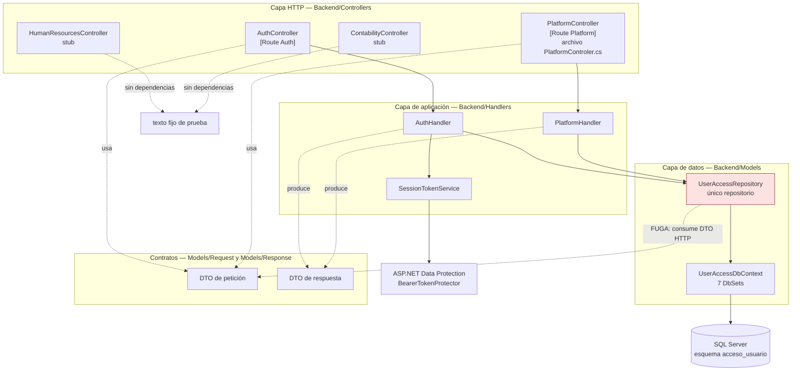
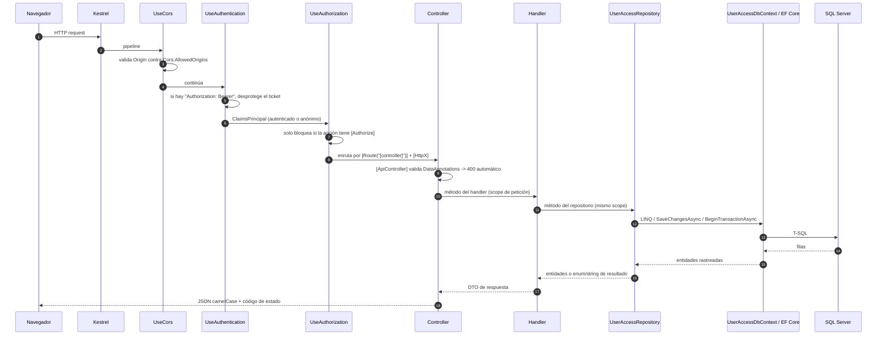
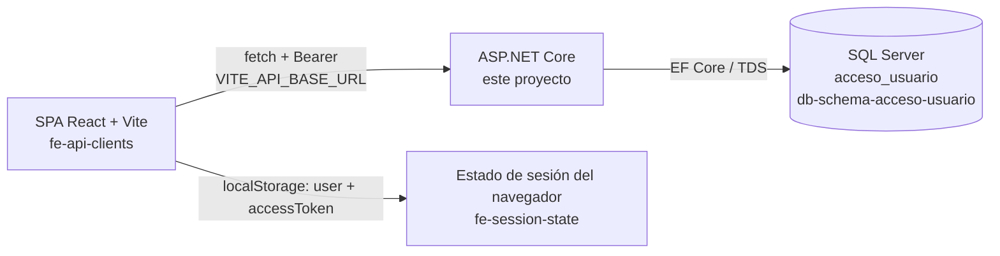

# Arquitectura del backend

Documento central de la bóveda. Describe **las capas que realmente existen**, qué hace cada una, de qué depende concretamente, **dónde se rompe la separación** y **qué patrones no existen**. Entrada al detalle: [[be-controllers]], [[be-handlers]], [[be-repository]], [[be-dbcontext-entities]].

## 1. Qué tipo de arquitectura es

**[verificado]** Es un **monolito de una sola capa de despliegue**: un único proyecto `Backend/Backend.csproj` que contiene simultáneamente presentación HTTP, lógica de negocio y acceso a datos. La separación es **por carpetas dentro del mismo ensamblado**, no por proyectos ni por límites compilados.

No es Clean Architecture, ni Onion, ni Hexagonal, ni Vertical Slice, ni CQRS. Es un **MVC de 3 niveles lógicos** (`Controller → Handler → Repository`) con EF Core como ORM.

```
Backend/
├── Program.cs                    ← composición: DI, CORS, pipeline
├── Controllers/                  ← capa HTTP (4 archivos)
├── Handlers/                     ← capa de aplicación (3 archivos)
├── Models/
│   ├── Repositories/             ← capa de datos (1 repositorio + 1 enum)
│   ├── Request/{UserAccess,Platform}/   ← DTO de entrada
│   ├── Response/{UserAccess,Platform}/  ← DTO de salida
│   └── Schemas/UserAccess/       ← entidades EF (7)
├── Data/UserAccessDbContext.cs   ← mapeo relacional
└── WeatherForecast.cs            ← residuo de plantilla, sin uso
```

**[verificado]** No existe carpeta `Migrations/`, ni `Services/`, ni `Interfaces/`, ni `Middleware/`, ni `Validators/`, ni proyecto de pruebas.

## 2. Diagrama de capas con dependencias concretas



Las flechas punteadas rojas marcan la fuga documentada en §5.

## 3. Responsabilidad y dependencias por capa

| Capa | Archivos | Responsabilidad **real** (no la ideal) | Dependencias directas inyectadas |
| --- | --- | --- | --- |
| **Composición** | `Backend/Program.cs` | Cargar `.env`, registrar DI, configurar CORS/Swagger/autenticación, ordenar el pipeline | — |
| **Controllers** | 4 archivos en `Backend/Controllers/` | Ruteo, *model binding*, validación manual de rangos (`id <= 0`), lectura del claim `NameIdentifier`, **mapeo de códigos de negocio a códigos HTTP**, captura de excepciones SQL | `AuthHandler`; `PlatformHandler` + `ILogger<PlatformController>` |
| **Handlers** | `AuthHandler`, `PlatformHandler` | Hash/verificación BCrypt, emisión de token, **proyección entidad → DTO**, traducción de `enum`/`string` de resultado a DTO con `Code`/`Message` | `UserAccessRepository`; `AuthHandler` además `SessionTokenService` |
| **Servicio de sesión** | `SessionTokenService` | Construir y proteger un ticket de autenticación | `IOptionsMonitor<BearerTokenOptions>` |
| **Repository** | `UserAccessRepository` (350 líneas) | Consultas y escrituras LINQ, **transacciones explícitas**, **comprobación de permisos del actor**, **construcción de entidades desde DTO HTTP**, agrupación en memoria | `UserAccessDbContext` |
| **Data** | `UserAccessDbContext` | Mapeo Fluent API: tablas, esquema, índices únicos, longitudes, FK nombradas, PK compuesta | `DbContextOptions<UserAccessDbContext>` |
| **Schemas** | 7 clases `partial` en `Models/Schemas/UserAccess/` | Propiedades persistentes y navegaciones. Sin lógica, sin invariantes, sin validaciones | — |
| **Request / Response** | 11 archivos | Contrato HTTP. Solo `[Required]` y un `[EmailAddress]` | — |

**[verificado]** Los controllers **nunca** tocan `UserAccessDbContext` ni `UserAccessRepository`: siempre pasan por un handler. Esa regla se cumple en los 16 endpoints.

## 4. Ciclo de vida de una petición



**[verificado]** El orden real del pipeline está en `Backend/Program.cs:63-67`: `UseCors` → `UseAuthentication` → `UseAuthorization` → `MapControllers`. No hay `UseHttpsRedirection`, `UseExceptionHandler`, `UseStatusCodePages`, middleware propio ni filtros globales.

## 5. Dónde se filtran las responsabilidades

Cinco fugas concretas, todas verificadas:

### 5.1 El repositorio conoce DTO HTTP
**[verificado]** `Backend/Models/Repositories/UserAccessRepository.cs:3-4` importa `Backend.Models.Request.UserAccess` y `Backend.Models.Request.Platform`. Tres métodos reciben un DTO de petición HTTP como parámetro:

| Método | Línea | DTO HTTP que recibe |
| --- | --- | --- |
| `CreateUserSolicitado` | `UserAccessRepository.cs:38` | `RegisterRequest` |
| `ApproveUserTransactionAsync` | `UserAccessRepository.cs:236` | `ApproveUserRequest` |
| `UpdateUserPermissionsTransactionAsync` | `UserAccessRepository.cs:308` | `UpdateUserPermissionsRequest` |

**Impacto:** cambiar el nombre de un campo del contrato HTTP obliga a editar la capa de datos. La capa de persistencia no es reutilizable desde un consumidor no-HTTP.

### 5.2 El repositorio toma decisiones de autorización
**[verificado]** Cuatro veces, en `UserAccessRepository.cs:149`, `:220`, `:239` y `:310`, el repositorio consulta `UsuarioModuloPermisos` para decidir si el actor puede operar, y devuelve `Forbidden` / `"forbidden"` / lanza `UnauthorizedAccessException`. Detalle en [[be-authorization-permissions]].

**Impacto:** la regla de negocio de autorización vive en la capa de datos, con el número de módulo **1 escrito a mano** en cada copia. No hay política reutilizable ni `IAuthorizationRequirement`.

### 5.3 Los códigos de negocio son *strings* mágicos que el controller interpreta
**[verificado]** `ApproveUserTransactionAsync` y `UpdateUserPermissionsTransactionAsync` devuelven `string` (`"success"`, `"not_found"`, `"conflict"`, `"forbidden"`); `DeactivateUser` devuelve el `enum UserDeactivationStatus`. El handler los convierte a `DeactivateUserResponse.Code` y el controller hace `switch` sobre ese string para elegir el código HTTP (`PlatformControler.cs:52-58`, `:114-120`, `:165-170`).

**Impacto:** un typo en el string cae en el `_ =>` del `switch` y produce **403 Forbidden** con un mensaje engañoso. Dos representaciones distintas (enum y string) para el mismo concepto.

### 5.4 Un DTO de respuesta reutilizado para tres operaciones distintas
**[verificado]** `DeactivateUserResponse` (`Models/Response/Platform/DeactivateUserResponse.cs`) es el tipo de retorno de `DeactivateUser`, `ApproveUserAsync` **y** `UpdateUserPermissionsAsync` (`PlatformHandler.cs:39,97,151`).

**Impacto:** el contrato de aprobación y de actualización de permisos se llama "DeactivateUser" en OpenAPI/Swagger. Confunde a los generadores de cliente y a [[fe-interfaces]].

### 5.5 El handler hace trabajo de consulta
**[verificado]** `PlatformHandler.GetUserPermissionsAsync` (`PlatformHandler.cs:135-145`) agrupa y proyecta navegaciones (`p.Modulo.Area.Nombre`) **en memoria**, sobre un grafo cargado con `Include` por el repositorio. La forma de la consulta queda partida entre dos capas.

## 6. Patrones que NO existen

Lista explícita para evitar suposiciones al implementar:

| Patrón / mecanismo | Estado | Comprobación |
| --- | --- | --- |
| **Interfaces / abstracciones** (`IUserAccessRepository`, `IAuthHandler`) | **No existe.** Todo se inyecta como clase concreta | `Program.cs:35,41,42,43` registran tipos concretos |
| **Mediador** (MediatR, comandos/consultas) | No existe | Sin paquete en `Backend.csproj` |
| **Unit of Work propio** | No existe. Se usa el *change tracker* de EF y llamadas directas a `SaveChangesAsync` | 9 llamadas a `SaveChangesAsync` en el repositorio |
| **Capas como proyectos separados** (Domain/Application/Infrastructure) | No existe. Un solo `.csproj` | `Backend/Backend.csproj` |
| **AutoMapper / Mapster** | No existe. Mapeo manual campo a campo | `PlatformHandler.cs:22-35` |
| **FluentValidation** | No existe. Solo `DataAnnotations` + `if` manuales | [[be-dto-contracts]] |
| **Middleware de excepciones / ProblemDetails** | No existe. Cada acción de `PlatformController` tiene su propio `try/catch`; `AuthController` no tiene ninguno | `AuthController.cs` completo |
| **Migraciones EF** | No existen. El esquema se administra fuera del repo | sin carpeta `Migrations/` |
| **Repositorio genérico / especificaciones** | No existe. Un repositorio monolítico de 18 métodos | [[be-repository]] |
| **Versionado de API / prefijo `/api`** | No existe. Rutas planas `/Auth`, `/Platform` | `[Route("[controller]")]` |
| **Paginación, filtrado u ordenación por query string** | No existe en ningún endpoint | [[be-api-reference]] |
| **CancellationToken en lectura** | Solo las operaciones de escritura nuevas lo reciben; las 13 consultas originales no | [[be-repository]] |
| **Auditoría / soft delete / `DateTime` de cambio** | No existe. Ni columnas, ni interceptores | [[be-dbcontext-entities]] |
| **Caché (`IMemoryCache`, respuesta HTTP)** | No existe. Los catálogos se consultan en cada petición | `AuthHandler.cs:96-127` |
| **Health checks / métricas / rate limiting** | No existe | `Program.cs` completo |
| **Tests** | No existe ningún proyecto de pruebas | raíz del repo |

## 7. Dos dominios en el mismo proyecto

**[verificado]** El namespace `UserAccess` está implementado de punta a punta. Los "dominios" de Recursos Humanos y Contabilidad son **stubs de una línea**:

```csharp
// Backend/Controllers/HumanResourcesController.cs:10-14
[HttpPost]
public string HumanResources() => "Hello from HumanResourcesController";
```

No tienen entidades, tablas, DTO ni handler. No inferir de ellos ningún diseño futuro.

## 8. Contrato de serialización JSON

**[verificado]** No hay `AddJsonOptions` en `Program.cs`. Por lo tanto aplican los valores por defecto de ASP.NET Core MVC (`JsonSerializerDefaults.Web`):

| Aspecto | Comportamiento | Consecuencia observable |
| --- | --- | --- |
| Nombres de propiedad | **camelCase** | `Usuarios` → `usuarios`, `AccessToken` → `accessToken`, `PermisosIds` → `permisosIds` |
| Lectura de propiedades | *case-insensitive* | El frontend puede enviar `AreasId` y liga a `areasId` |
| **Claves de diccionario** | **Se preservan literalmente** (`DictionaryKeyPolicy` no forma parte de los defaults Web) — **[inferencia de alta confianza]** | `{"areas": {"Plataforma": 1}}` conserva la mayúscula del nombre del área |
| Claves numéricas de diccionario | Se emiten como **string JSON** | `{"permisos": {"1": "ver"}}` |
| `DateOnly` | ISO `"yyyy-MM-dd"` | `fechaIngreso: "2026-09-18"` |
| `null` | Se emiten (no se omiten) | `comentario: null` aparece en la respuesta |

Esto explica la mezcla `UserTypes` vs `userTypes` que el frontend tuvo que tolerar: la **propiedad** es `userTypes`, pero las **claves internas** del diccionario son los nombres de nivel tal como están en SQL. Ver [[be-dto-contracts]] y [[fe-interfaces]].

## 9. Relación con las otras capas del sistema



- El SPA guarda en `localStorage` el DTO de login **incluido el `accessToken`** y lo envía solo en los 5 endpoints protegidos. Ver [[fe-session-state]] y [[fe-api-clients]].
- Las tablas, índices y columnas físicas se documentan en [[db-schema-acceso-usuario]], [[db-relationships]], [[db-table-usuarios]], [[db-table-solicitud-usuarios]] y [[db-table-usuario-modulo-permisos]].
- La vista de conjunto de los tres componentes está en [[architecture-overview]].

## Enlaces

- [[be-index]] · [[be-startup-di-config]] · [[be-api-reference]]
- [[be-controllers]] · [[be-handlers]] · [[be-repository]] · [[be-dbcontext-entities]] · [[be-dto-contracts]]
- [[be-auth-session]] · [[be-authorization-permissions]] · [[be-flows]] · [[be-deployment]] · [[be-findings]]
- [[architecture-overview]] · [[db-index]] · [[db-schema-acceso-usuario]] · [[db-relationships]] · [[db-queries-by-feature]]
- [[fe-index]] · [[fe-api-clients]] · [[fe-interfaces]] · [[fe-session-state]]
