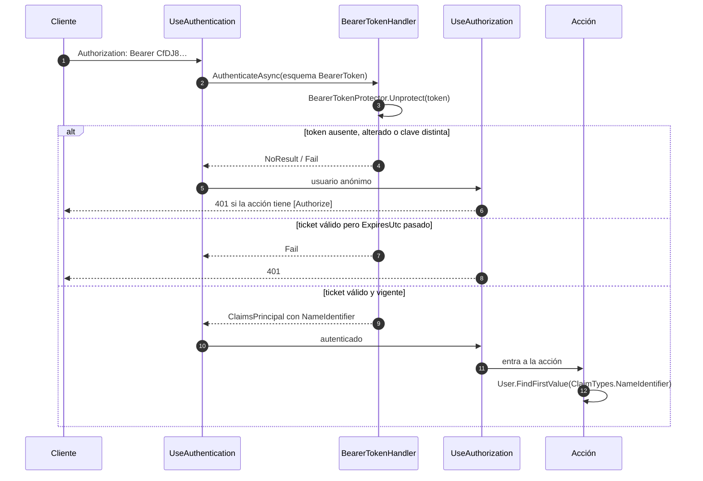
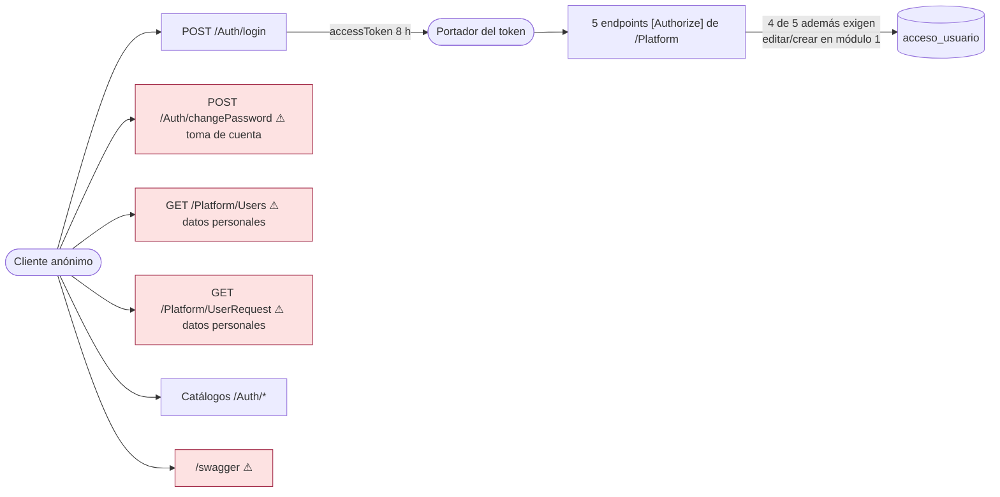

# Autenticación y sesión

**Corrección importante al contexto previo.** `.agent/CONTEXT.md` (2026-09-08) afirma que *"no se configura `AddAuthentication`, `UseAuthentication`, esquema JWT/cookie ni atributos `[Authorize]`"* y que el login *"no establece una sesión autenticada en el servidor"*. **Ambas afirmaciones son falsas en el código del 2026-09-18.** Existe autenticación por bearer token y cinco endpoints la exigen.

Lo que sigue distingue estrictamente **lo implementado** de **lo ausente**.

## 1. Lo implementado

### 1.1 Registro del esquema

```csharp
// Backend/Program.cs:32-35
builder.Services.AddAuthentication(BearerTokenDefaults.AuthenticationScheme)
    .AddBearerToken(options => options.BearerTokenExpiration = TimeSpan.FromHours(8));
builder.Services.AddAuthorization();
builder.Services.AddScoped<SessionTokenService>();
```

```csharp
// Backend/Program.cs:65-66
app.UseAuthentication();
app.UseAuthorization();
```

**[verificado]**

| Elemento | Valor |
| --- | --- |
| Esquema | `BearerTokenDefaults.AuthenticationScheme` — token **opaco** de ASP.NET Core |
| `using` que lo habilita | `Microsoft.AspNetCore.Authentication.BearerToken` (`Program.cs:6`) |
| Vigencia | **8 horas** desde la emisión |
| Middleware | `UseAuthentication()` antes de `UseAuthorization()`, ambos después de `UseCors` |
| `SessionTokenService` | **registrado como `Scoped`** (`Program.cs:35`) — añadido en el commit `d1b78f8` |

**Qué NO es [verificado]:** no es JWT. No hay `AddJwtBearer`, ni clave de firma, ni `Issuer`/`Audience`, ni cabecera/*payload* legibles. Un `jwt.io` no puede decodificar estos tokens.

### 1.2 Emisión: `SessionTokenService`

`Backend/Handlers/SessionTokenService.cs` — **27 líneas, un solo método**:

```csharp
public string Create(int userId)
{
    var configuration = options.Get(BearerTokenDefaults.AuthenticationScheme);
    var identity = new ClaimsIdentity(
        new[] { new Claim(ClaimTypes.NameIdentifier, userId.ToString(CultureInfo.InvariantCulture)) },
        BearerTokenDefaults.AuthenticationScheme);
    var properties = new AuthenticationProperties
    {
        IssuedUtc = DateTimeOffset.UtcNow,
        ExpiresUtc = DateTimeOffset.UtcNow.Add(configuration.BearerTokenExpiration)
    };
    var ticket = new AuthenticationTicket(new ClaimsPrincipal(identity), properties,
        BearerTokenDefaults.AuthenticationScheme);
    return configuration.BearerTokenProtector.Protect(ticket);
}
```

| Aspecto | Hecho |
| --- | --- |
| **Claims emitidos** | **Uno solo: `ClaimTypes.NameIdentifier` = `Usuario.Id`** |
| No contiene | alias, correo, nombre, `TipoId`, roles, permisos, ni identificador de sesión (`jti`) |
| Marcas de tiempo | `IssuedUtc` y `ExpiresUtc` en UTC, dentro del ticket protegido |
| Protección | `BearerTokenProtector.Protect(ticket)` |
| `AuthenticationType` | El nombre del esquema, lo que hace `IsAuthenticated == true` al desproteger |
| Quién lo llama | **Solo** `AuthHandler.Authenticate` (`AuthHandler.cs:39`), después de verificar BCrypt |
| Métodos ausentes | no hay `Validate`, `Revoke`, `Refresh`, `Parse` ni lista de tokens emitidos |

**[inferencia de alta confianza]** `BearerTokenProtector` es, por defecto, un `TicketDataFormat` construido sobre **ASP.NET Core Data Protection**: el token es el ticket serializado, **cifrado y firmado** con la clave del anillo de claves de la aplicación. Como `SessionTokenService` obtiene las **mismas opciones nombradas** que usa el handler de autenticación, el token que emite es exactamente el que el handler sabe desproteger. Esto explica que el flujo funcione sin llamar a `MapIdentityApi`.

### 1.3 Validación en cada petición

**[verificado]** No hay código propio de validación. La hace el handler del esquema `BearerToken` durante `UseAuthentication()`:



**[verificado]** El consumo del claim en el controller (4 acciones, líneas `PlatformControler.cs:46`, `:81`, `:108`, `:159`):

```csharp
if (!int.TryParse(User.FindFirstValue(ClaimTypes.NameIdentifier), out var actorId) || actorId <= 0)
    return Unauthorized(new { message = "…" });
```

Esto es **correcto y no suplantable**: el `actorId` nunca proviene del cuerpo de la petición.

### 1.4 Los 5 endpoints protegidos

**[verificado]** `[Authorize]` aparece exactamente 5 veces, todas en `PlatformControler.cs`:

| Línea | Endpoint | `[Authorize]` | Comprobación de permiso adicional |
| --- | --- | --- | --- |
| `:41` | `POST /Platform/Users/{id:int}/deactivate` | sí | `editar` en módulo 1 |
| `:76` | `PUT /Platform/UserRequest/{id:int}/comment` | sí | **`crear`** en módulo 1 |
| `:101` | `POST /Platform/Users/Approve` | sí | `editar` en módulo 1 |
| `:133` | `GET /Platform/Users/{id:int}/Permissions` | sí | **ninguna** |
| `:152` | `PUT /Platform/Users/Permissions` | sí | `editar` en módulo 1 |

El segundo nivel (permisos por módulo) se documenta en [[be-authorization-permissions]].

### 1.5 Transporte y almacenamiento del token

**[verificado]** El SPA guarda el objeto de login completo —**incluido `accessToken`**— en `localStorage` y envía `Authorization: Bearer <token>` solo en esos 5 endpoints (`Frontend/src/composable/PlatformApi.ts`). Ver [[fe-session-state]] y [[fe-api-clients]].

**[verificado]** `AllowAnyHeader()` en la política CORS permite la cabecera `Authorization` desde el origen del SPA (`Program.cs:27`). **`AllowCredentials()` no está configurado**, lo cual es coherente con un token en cabecera (no en cookie).

## 2. Lo ausente

### 2.1 Endpoints y operaciones que no existen

**[verificado]**

| Ausente | Consecuencia |
| --- | --- |
| **`POST /Auth/logout`** | No se puede invalidar un token en el servidor. Cerrar sesión solo borra `localStorage`; el token **sigue siendo válido hasta 8 h** |
| **Refresh token / renovación** | A las 8 h el usuario recibe `401` en las acciones protegidas y debe volver a autenticarse. No se llama a `MapIdentityApi`, que es lo que habría aportado `/refresh` |
| **Revocación / lista negra** | No hay tabla de sesiones ni `jti`. Un token filtrado no se puede anular sin rotar las claves de Data Protection (lo que invalida **todos** los tokens) |
| **Bloqueo por intentos fallidos** | `POST /Auth/login` se puede llamar ilimitadamente: no hay *lockout*, *rate limiting* ni CAPTCHA |
| **Endpoint "yo" / perfil** | No hay `GET /Auth/me`: el cliente no puede refrescar su identidad ni sus permisos sin volver a hacer login |
| **Segundo factor** | No implementado |
| **Verificación de correo** | No implementada |

### 2.2 Middleware y políticas que no existen

**[verificado]**

- **No hay `FallbackPolicy`**: `AddAuthorization()` se llama sin argumentos (`Program.cs:34`). Por eso `UseAuthorization()` **no protege nada por sí solo**; todo endpoint sin `[Authorize]` es anónimo.
- **No hay `RequireAuthorization()`** en `MapControllers()`.
- **No hay `[Authorize]` a nivel de controller**: solo a nivel de acción, y solo en `PlatformController`.
- **No hay `[AllowAnonymous]`** en ningún sitio (no es necesario, porque el estado por defecto ya es anónimo).
- **No hay políticas con requisitos** (`AddPolicy("PuedeEditarCuentas", …)`), ni `IAuthorizationHandler`, ni `ClaimsTransformation`.
- **No hay roles**: el token no lleva `ClaimTypes.Role` y `TipoUsuario` **no se traduce a roles**. `TipoId` es un dato informativo sin efecto en autorización.

### 2.3 Los 11 endpoints sin proteger

**[verificado]**

| Endpoint | Qué expone anónimamente | Gravedad |
| --- | --- | --- |
| **`GET /Platform/Users`** | Nombre completo, correo, **fecha de nacimiento**, **sexo**, alias, `tipoId`, `activo` de **todo el personal** | **Crítica** |
| **`GET /Platform/UserRequest`** | Mismos datos de todos los solicitantes + `comentario` administrativo | **Crítica** |
| **`POST /Auth/changePassword`** | **Permite sustituir la contraseña de cualquier cuenta conociendo solo el correo** | **Crítica** |
| `POST /Auth/login` | — (es el punto de entrada), pero sin límite de intentos | Alta |
| `POST /Auth/register` | Inserción anónima ilimitada de solicitudes | Media |
| `GET /Auth/areas`, `/Auth/access`, `GET /Auth/userTypes`, `POST /Auth/modules` | Estructura organizativa completa: áreas, módulos, permisos y niveles | Media |
| `POST /HumanResources`, `POST /Contability` | Texto de prueba | Baja |
| `/swagger`, `/openapi/v1.json`, `/swagger/v1/swagger.json` | **Inventario completo de rutas y esquemas, también en producción** | Media |



## 3. Riesgos específicos del mecanismo elegido

### 3.1 Los tokens mueren con el contenedor — **[inferencia de alta confianza]**

`AddBearerToken` protege el ticket con **Data Protection**. En el contenedor `mcr.microsoft.com/dotnet/aspnet:10.0` no se configura ningún repositorio de claves persistente (`PersistKeysToFileSystem`, `PersistKeysToDbContext`, Azure Key Vault): las claves se generan en el sistema de archivos del contenedor.

Consecuencias:

1. El pipeline hace `docker rm -f` y `docker compose up -d --build` en cada push (ver [[be-deployment]]): el contenedor nuevo genera un **anillo de claves nuevo** → **todos los tokens emitidos antes del despliegue dejan de ser válidos** y todos los usuarios quedan con sesiones muertas hasta volver a entrar.

   **Esta es la causa habitual de que una sesión "expire" mucho antes de las 8 horas**, y explica el patrón intermitente: no depende del tiempo transcurrido sino de cuándo se reinició la API. Desde el 2026-09-19 el frontend ya no se queda con la sesión zombi —el primer 401 lo expulsa al login con aviso—, pero eso trata el síntoma: mientras las claves no se persistan, cada despliegue seguirá echando a todos los usuarios conectados. Ver [[fe-session-state]].
2. **No se puede escalar horizontalmente**: dos réplicas de la API no compartirían claves, así que un token emitido por una no sería válido en la otra.

**Mitigación:** persistir el anillo de claves (volumen montado + `PersistKeysToFileSystem`, o `PersistKeysToDbContext` con `SetApplicationName` fijo).

### 3.2 Token en `localStorage`

**[verificado]** El SPA lo guarda en `localStorage` junto al resto del DTO de login. **[inferencia]** Cualquier XSS en el SPA puede leer el token y usarlo durante 8 h sin posibilidad de revocación. Un token en cookie `HttpOnly` + `SameSite` no sería legible por JS, pero requeriría añadir `AllowCredentials()` a CORS y protección CSRF. Ver [[fe-session-state]].

### 3.3 Vigencia larga y permisos congelados

**[verificado]** 8 h sin renovación, y el token **no contiene permisos**: los permisos se consultan en SQL en cada operación protegida (`UserAccessRepository.cs:149`, `:220`, `:239`, `:310`). Esto es **positivo**: revocar un permiso en la base surte efecto de inmediato en el backend.

**Pero** el JSON `accesos` que el SPA guardó en el login **sí está congelado**: la interfaz seguirá mostrando botones que el servidor ya rechaza. La disonancia se resuelve al volver a entrar.

### 3.4 Un solo claim

**[verificado]** El token solo lleva el `Id`. Toda operación protegida hace al menos **una consulta adicional a `UsuarioModuloPermisos`** para autorizar. Es simple y seguro, a cambio de una consulta por petición y de que el backend no pueda saber el alias del actor sin otra consulta (por eso los logs registran solo ids).

## 4. Cuadro resumen: implementado vs. ausente

| Capacidad | Estado |
| --- | --- |
| Emisión de token al autenticarse | ✅ `AuthHandler.cs:39` + `SessionTokenService` |
| Validación automática del token | ✅ handler del esquema `BearerToken` |
| Expiración | ✅ 8 h en el ticket |
| Protección de endpoints por atributo | ✅ 5 endpoints |
| Identidad del actor desde el token | ✅ claim `NameIdentifier` |
| Autorización por permiso de módulo | ⚠️ sí, pero en el repositorio y con módulo `1` fijo — [[be-authorization-permissions]] |
| Hash de contraseña | ✅ BCrypt (`BCrypt.Net-Next` 4.2.0, work factor por defecto) |
| Protección de los listados de datos personales | ❌ anónimos |
| Prueba de titularidad al cambiar contraseña | ❌ ninguna |
| Logout / revocación | ❌ |
| Refresh token | ❌ |
| Roles / políticas / jerarquía | ❌ |
| Rate limiting / lockout | ❌ |
| Persistencia de claves de Data Protection | ❌ |
| Swagger restringido a Development | ❌ (el `if` está comentado) |
| Auditoría de operaciones sensibles | ❌ |

## 5. Orden de trabajo sugerido

Prioridad por impacto, con el detalle en [[be-findings]]:

1. Añadir `[Authorize]` a `GET /Platform/Users` y `GET /Platform/UserRequest`, más comprobación de permiso de lectura del módulo 1.
2. Rediseñar `POST /Auth/changePassword`: exigir token (cambio de contraseña autenticado) **y/o** un flujo de recuperación con token de un solo uso enviado por correo.
3. Condicionar Swagger/OpenAPI a `IsDevelopment()` (descomentar `Program.cs:54-60`).
4. Persistir las claves de Data Protection para que los despliegues no invaliden sesiones.
5. Sustituir el `ModuloId == 1` fijo por una política de autorización reutilizable.
6. Añadir `AddRateLimiter` sobre `/Auth/login`, `/Auth/register` y `/Auth/changePassword`.
7. Añadir auditoría (quién aprobó, dio de baja o cambió permisos, y cuándo): hoy ninguna tabla lo registra.

## Enlaces

- [[be-index]] · [[be-architecture]] · [[be-startup-di-config]] · [[be-authorization-permissions]]
- [[be-handlers]] · [[be-controllers]] · [[be-repository]] · [[be-api-reference]] · [[be-dto-contracts]]
- [[be-flows]] · [[be-findings]] · [[be-deployment]]
- [[db-table-usuarios]] · [[db-table-usuario-modulo-permisos]] · [[db-index]]
- [[fe-session-state]] · [[fe-api-clients]] · [[fe-index]] · [[architecture-overview]]
