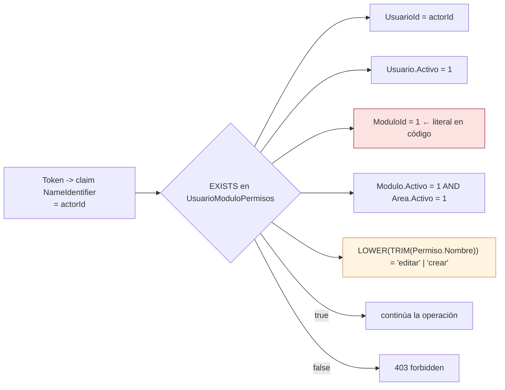

# Autorización por permisos de módulo

Segundo nivel de control, después de la autenticación descrita en [[be-auth-session]]. Está implementado **íntegramente dentro de `UserAccessRepository`**, no como política de ASP.NET Core.

## 1. El patrón, repetido cuatro veces

**[verificado]** La misma consulta aparece copiada en cuatro métodos, con una única variación: el nombre del permiso exigido.

```csharp
var canEdit = await _context.UsuarioModuloPermisos.AnyAsync(access =>
    access.UsuarioId == actorId && access.Usuario.Activo &&
    access.ModuloId == 1 && access.Modulo.Activo && access.Modulo.Area.Activo &&
    access.Permiso.Nombre.Trim().ToLower() == "editar", cancellationToken);
```

| Ubicación | Método | Permiso exigido | ¿Dentro de la transacción? | Qué hace si falla |
| --- | --- | --- | --- | --- |
| `UserAccessRepository.cs:149-153` | `DeactivateUser` | `editar` | **Sí** (tras `BeginTransactionAsync` en `:144`) | `return UserDeactivationStatus.Forbidden` |
| `UserAccessRepository.cs:220-225` | `UpdateUserRequestComment` | **`crear`** | no hay transacción | **`throw new UnauthorizedAccessException`** |
| `UserAccessRepository.cs:239-243` | `ApproveUserTransactionAsync` | `editar` | **No** (la transacción empieza en `:245`) | `return "forbidden"` |
| `UserAccessRepository.cs:310-314` | `UpdateUserPermissionsTransactionAsync` | `editar` | **No** (la transacción empieza en `:316`) | `return "forbidden"` |

## 2. Qué comprueba exactamente la consulta

**[verificado]** Cinco condiciones simultáneas:

| Condición | Significado | Tabla implicada |
| --- | --- | --- |
| `access.UsuarioId == actorId` | El actor es el dueño de la asignación. `actorId` viene del claim `NameIdentifier` del token | `UsuarioModuloPermisos` |
| `access.Usuario.Activo` | La cuenta del actor sigue activa | `Usuarios` |
| **`access.ModuloId == 1`** | **Número de módulo escrito a mano en el código** | `UsuarioModuloPermisos` |
| `access.Modulo.Activo && access.Modulo.Area.Activo` | Ni el módulo ni su área están apagados | `Modulos`, `Areas` |
| `access.Permiso.Nombre.Trim().ToLower() == "editar"` | El permiso se identifica **por nombre normalizado**, no por id | `Permisos` |



**[inferencia de alta confianza]** `AnyAsync` se traduce a un `EXISTS` con tres `JOIN`, y `.Trim().ToLower()` a `LTRIM(RTRIM(…))`/`LOWER(…)` en SQL Server. Al aplicarse una función sobre la columna, **el índice `UQ_Permisos_Nombre` no puede usarse para búsqueda** (no es *sargable*); con un catálogo de permisos pequeño el coste es irrelevante.

## 3. Problemas concretos de este diseño

### 3.1 `ModuloId == 1` es un número mágico — **Alta**

**[verificado]** Aparece literalmente cuatro veces. El comentario del código lo explica:

```csharp
// UserAccessRepository.cs:147-148
// El módulo 1 corresponde a configuración de cuentas en MODULE_REGISTRY.
// La identidad proviene del token; los permisos se consultan dentro de la transacción.
```

`MODULE_REGISTRY` es una tabla **del frontend** (`Frontend/src/templates/shared/areaTemplate.jsx`, ver [[fe-templates-areas-modules]]). Es decir: **la autorización del backend depende de que `acceso_usuario.Modulos.Id = 1` siga siendo "Configuración de cuentas"**, un acuerdo que no está garantizado por ninguna restricción.

**Impacto si ese id cambia** (recreación de catálogos, restauración de respaldo, alta de módulos en otro orden): las cuatro comprobaciones apuntarían a un módulo equivocado. En el mejor caso todos reciben `403`; en el peor, quien tenga `editar` en el módulo que ahora ocupa el id 1 **puede aprobar usuarios y reescribir permisos**.

**Corrección sugerida:** resolver el módulo por `(Area.Nombre, Modulo.Nombre)` o por una constante persistida, y centralizar en un único método.

### 3.2 El permiso se compara por nombre — **Media**

**[verificado]** `Permiso.Nombre` es `varchar(15)` con índice único, pero es un **texto editable**. Renombrar `editar` a `Editar registros` **deshabilita silenciosamente** la aprobación, la baja y la administración de permisos para todo el mundo. El `.Trim().ToLower()` tolera espacios y capitalización, no cambios de palabra.

Nota: el frontend hace exactamente lo mismo (resuelve `editar`/`crear` desde el catálogo de permisos para mostrar botones), así que backend y frontend comparten el acoplamiento al texto. Ver [[db-index]] para los nombres reales.

### 3.3 Un único módulo gobierna todo — **Alta**

**[verificado]** Las cuatro operaciones sensibles se autorizan con el permiso del **mismo módulo 1**. No hay granularidad:

| Quien tiene `editar` en módulo 1 puede… | Endpoint |
| --- | --- |
| Aprobar cualquier solicitud y asignarle cualquier permiso | `POST /Platform/Users/Approve` |
| Borrar cualquier usuario (incluido a sí mismo) | `POST /Platform/Users/{id}/deactivate` |
| Reescribir los permisos y el `TipoId` de cualquier usuario | `PUT /Platform/Users/Permissions` |

Es un **privilegio de administrador total** disfrazado de permiso de módulo. No hay separación entre "administrar cuentas" y "administrar permisos", aunque en la interfaz sean dos módulos distintos (1 y 3).

### 3.4 Sin protección contra auto-degradación ni bloqueo administrativo — **Alta**

**[verificado]** `UpdateUserPermissionsTransactionAsync` no comprueba `userId != actorId`, ni que quede al menos un usuario con `editar` en el módulo 1. Como el método **borra todos los permisos y escribe los enviados** (`:326`), un único `PUT` con `permisos: []` sobre el último administrador **deja el sistema sin nadie capaz de otorgar permisos por la API**. La recuperación exige `INSERT` manual en SQL.

### 3.5 Inconsistencia de permiso exigido — **Media**

**[verificado]** `UpdateUserRequestComment` exige **`crear`** y no `editar` (`:223`). Coincide con la regla visual del frontend (el botón de chat aparece con `crear`), pero significa que **un usuario con `editar` y sin `crear` no puede comentar**, mientras que **uno con `crear` y sin `editar` puede escribir en `SolicitudUsuarios.comentario` sin poder aprobar**. La semántica real de `crear` = "comentar" no está documentada en ningún sitio del código.

### 3.6 Inconsistencia de señalización — **Baja**

**[verificado]** Tres formas distintas de decir "no autorizado" en el mismo archivo: `enum Forbidden`, `string "forbidden"` y `UnauthorizedAccessException`. El controller las une con `switch` y `catch`, y el `_ =>` del `switch` convierte **cualquier código desconocido** en `403`, enmascarando errores.

### 3.7 Un endpoint protegido sin comprobación de permiso — **Media**

**[verificado]** `GET /Platform/Users/{id:int}/Permissions` lleva `[Authorize]` pero **no llama a ninguna comprobación de permiso**: `GetUserPermissionsAdminAsync` (`:299-306`) no tiene cláusula de autorización. Cualquier usuario autenticado —incluso sin ningún permiso— puede leer los permisos y el `TipoId` de cualquier otro.

### 3.8 Aislamiento transaccional inconsistente — **Media**

**[verificado]** `DeactivateUser` comprueba el permiso **dentro** de una transacción `Serializable`; aprobación y permisos lo comprueban **fuera** de su transacción (`READ COMMITTED`). **[inferencia]** En los dos últimos existe una ventana en la que el permiso del actor podría revocarse entre la comprobación y el `COMMIT`, permitiendo completar la operación. La ventana es de milisegundos y el riesgo práctico es bajo, pero el diseño no es uniforme.

### 3.9 `TipoUsuario` no autoriza nada — **Informativo**

**[verificado]** `Usuarios.TipoId` y la tabla `TipoUsuario` **no participan en ninguna decisión de autorización**. Se leen (`GET /Auth/userTypes`), se escriben (aprobación y actualización de permisos) y se devuelven (`RegisteredUser.tipoId`, `UserPermissionsResponse.tipoId`), pero **no otorgan ni restringen nada**. No confundir "nivel de usuario" con privilegio. Ver [[db-index]].

### 3.10 Sin auditoría — **Media**

**[verificado]** Ninguna de las cuatro operaciones registra en base de datos quién la ejecutó. El `actorId` se usa solo para autorizar y luego se descarta. Lo único que queda es la entrada de `ILogger` **en caso de error** (`PlatformControler.cs:70`, `:96`, `:128`, `:147`, `:174`); las operaciones exitosas no dejan rastro.

## 4. Matriz de autorización efectiva

| Endpoint | Token | Permiso requerido | Módulo | Comprobado en |
| --- | --- | --- | --- | --- |
| `POST /Auth/login` | — | — | — | — |
| `POST /Auth/register` | — | — | — | — |
| `POST /Auth/changePassword` | **—** | **—** | — | — |
| `GET /Auth/areas` · `/access` · `/userTypes` | — | — | — | — |
| `POST /Auth/modules` | — | — | — | — |
| `GET /Platform/Users` | **—** | **—** | — | — |
| `GET /Platform/UserRequest` | **—** | **—** | — | — |
| `POST /Platform/Users/{id}/deactivate` | ✅ | `editar` | **1** | `UserAccessRepository.cs:149` |
| `PUT /Platform/UserRequest/{id}/comment` | ✅ | **`crear`** | **1** | `UserAccessRepository.cs:220` |
| `POST /Platform/Users/Approve` | ✅ | `editar` | **1** | `UserAccessRepository.cs:239` |
| `GET /Platform/Users/{id}/Permissions` | ✅ | **ninguno** | — | — |
| `PUT /Platform/Users/Permissions` | ✅ | `editar` | **1** | `UserAccessRepository.cs:310` |
| `POST /HumanResources` · `/Contability` | — | — | — | — |

## 5. Cómo debería hacerse

Propuesta, **no estado actual**:

1. Extraer un único método del repositorio, p. ej. `Task<bool> ActorTienePermiso(int actorId, int moduloId, string permiso, CancellationToken ct)`, y llamarlo desde las cuatro operaciones — elimina la cuadruplicación.
2. Resolver el módulo por nombre + área, o mediante constantes documentadas compartidas con [[fe-templates-areas-modules]], en lugar de `1` literal.
3. Envolverlo en una **política de autorización** de ASP.NET Core (`IAuthorizationRequirement` + `AuthorizationHandler`) para poder escribir `[Authorize(Policy = "EditarCuentas")]` en el controller y sacar la regla de la capa de datos.
4. Añadir un invariante: no permitir que una operación deje el sistema sin ningún usuario con `editar` en el módulo de cuentas, y prohibir que el actor se modifique a sí mismo.
5. Separar los privilegios de "aprobar/dar de baja" (módulo de cuentas) de los de "administrar permisos" (módulo de permisos).
6. Persistir auditoría: actor, operación, objetivo y fecha.
7. Comprobar el permiso **siempre dentro** de la transacción de la operación.

## Enlaces

- [[be-index]] · [[be-auth-session]] · [[be-repository]] · [[be-controllers]] · [[be-handlers]]
- [[be-architecture]] · [[be-api-reference]] · [[be-flows]] · [[be-findings]] · [[be-dbcontext-entities]]
- [[db-table-usuario-modulo-permisos]] · [[db-table-usuarios]] · [[db-relationships]] · [[db-index]] · [[db-queries-by-feature]]
- [[fe-templates-areas-modules]] · [[fe-session-state]] · [[fe-index]]
