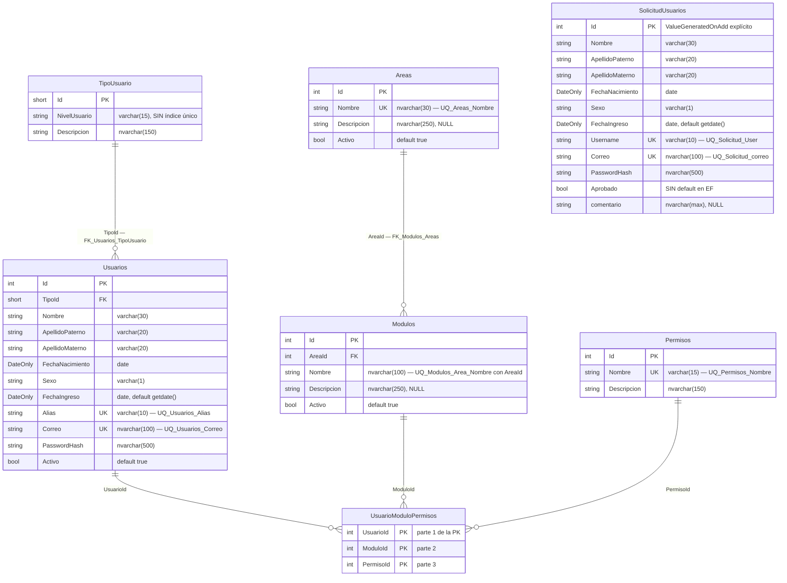

# `UserAccessDbContext` y las 7 entidades

`Backend/Data/UserAccessDbContext.cs` (175 líneas) es el único `DbContext` del proyecto. Las entidades están en `Backend/Models/Schemas/UserAccess/`. La verdad física de la base (tipos reales, IDENTITY, *collation*, triggers) se documenta en [[db-schema-acceso-usuario]]; aquí se describe **el mapeo declarado en C#**.

## 1. Forma del contexto

```csharp
public partial class UserAccessDbContext : DbContext
{
    public UserAccessDbContext(DbContextOptions<UserAccessDbContext> options) : base(options) { }
    public virtual DbSet<Area> Areas { get; set; }
    // … 7 DbSets …
    protected override void OnModelCreating(ModelBuilder modelBuilder) { … OnModelCreatingPartial(modelBuilder); }
    partial void OnModelCreatingPartial(ModelBuilder modelBuilder);
}
```

**[verificado]**

- Clase `partial` con gancho `OnModelCreatingPartial` — **firma típica de `dotnet ef dbcontext scaffold`** (ingeniería inversa desde una base existente). **[inferencia de alta confianza]** El contexto fue generado por scaffolding y luego editado a mano (el mapeo de `Comentario` en `:76-78` está fuera del orden alfabético habitual del generador).
- No existe la implementación parcial de `OnModelCreatingPartial` en el repositorio: es un punto de extensión sin usar.
- `DbSet` declarados `virtual` (habilita *mocking*/proxies, no usado hoy).
- **No hay** `SaveChanges` sobrescrito, ni interceptores, ni `IEntityTypeConfiguration` separadas, ni *global query filters*, ni convenciones personalizadas, ni `ConfigureWarnings`.
- **No hay carpeta `Migrations/`**: el esquema se administra fuera del código. Ver [[db-index]].

## 2. Los 7 DbSets y sus tablas

**[verificado]** Todas las tablas se mapean al esquema SQL **`acceso_usuario`**.

| DbSet (C#) | Entidad | Tabla SQL | Línea | Trampa |
| --- | --- | --- | --- | --- |
| `Areas` | `Area` | `acceso_usuario.Areas` | `:33` | — |
| `Modulos` | `Modulo` | `acceso_usuario.Modulos` | `:44` | — |
| `Permisos` | `Permiso` | `acceso_usuario.Permisos` | `:60` | — |
| `SolicitudUsuarios` | `SolicitudUsuario` | `acceso_usuario.SolicitudUsuarios` | `:74` | — |
| `TipoUsuarios` | `TipoUsuario` | **`acceso_usuario.TipoUsuario`** | `:107` | **El DbSet es plural, la tabla es SINGULAR.** No crear una tabla `TipoUsuarios` por suposición |
| `Usuarios` | `Usuario` | `acceso_usuario.Usuarios` | `:117` | — |
| `UsuarioModuloPermisos` | `UsuarioModuloPermiso` | `acceso_usuario.UsuarioModuloPermisos` | `:153` | PK compuesta, sin columna `Id` |

## 3. Diagrama del modelo tal como lo declara EF



**[verificado]** `SolicitudUsuarios` **no tiene ninguna FK**: está completamente aislada del resto del modelo. No hay relación solicitud → usuario, ni `TipoId`, ni `Activo`, ni columnas de aprobación (quién, cuándo). Ver [[db-table-solicitud-usuarios]] y [[db-relationships]].

## 4. Mapeo declarado, entidad por entidad

### 4.1 `Area` · `UserAccessDbContext.cs:31-40`

| Configuración | Valor |
| --- | --- |
| Tabla | `Areas` en `acceso_usuario` |
| Índice | `UQ_Areas_Nombre` único sobre `Nombre` |
| Defaults | `Activo` → `HasDefaultValue(true)` |
| Longitudes | `Nombre` 30, `Descripcion` 250 |
| Unicode | no se desactiva → **`nvarchar`** |
| Navegación | `ICollection<Modulo> Modulos` |

### 4.2 `Modulo` · `:42-56`

| Configuración | Valor |
| --- | --- |
| Índice | `UQ_Modulos_Area_Nombre` único sobre `(AreaId, Nombre)` — el nombre puede repetirse en áreas distintas |
| Defaults | `Activo` → `true` |
| Longitudes | `Nombre` 100, `Descripcion` 250, ambos `nvarchar` |
| FK | `FK_Modulos_Areas`, `OnDelete(ClientSetNull)` |
| Navegaciones | `Area`, `ICollection<UsuarioModuloPermiso>` |

### 4.3 `Permiso` · `:58-68`

| Configuración | Valor |
| --- | --- |
| Índice | `UQ_Permisos_Nombre` único |
| Longitudes | `Nombre` 15 **con `IsUnicode(false)` → `varchar(15)`**; `Descripcion` 150 `nvarchar` |
| **No tiene columna `Activo`** | Un permiso no se puede desactivar: hay que borrar asignaciones |

**[verificado]** `Permiso.Nombre` es la clave semántica que usa el repositorio: `access.Permiso.Nombre.Trim().ToLower() == "editar"` (ver [[be-authorization-permissions]]). **Renombrar un permiso rompe la autorización del backend.**

### 4.4 `SolicitudUsuario` · `:70-103`

| Configuración | Valor |
| --- | --- |
| PK | `HasKey(e => e.Id)` **explícita** + `ValueGeneratedOnAdd()` (`:92`) |
| `Comentario` | `HasColumnName("comentario")` **en minúscula** + `HasColumnType("nvarchar(max)")` (`:76-78`) — la única propiedad con nombre de columna distinto de la propiedad C# |
| Índices | `UQ_Solicitud_User` sobre `Username`, `UQ_Solicitud_correo` sobre `Correo` (nótese la minúscula en el nombre del índice) |
| Defaults SQL | `FechaIngreso` → `HasDefaultValueSql("(getdate())")` |
| `Aprobado` | **sin default en EF**: se asigna siempre en código |
| `varchar` (no unicode) | `Nombre` 30, `ApellidoPaterno` 20, `ApellidoMaterno` 20, `Sexo` 1, `Username` 10 |
| `nvarchar` | `Correo` 100, `PasswordHash` 500, `comentario` max |
| Navegaciones | **ninguna** |

### 4.5 `TipoUsuario` · `:105-113`

| Configuración | Valor |
| --- | --- |
| Tabla | **`TipoUsuario`, singular** |
| PK | `Id` por convención, tipo C# **`short`** (`smallint`) |
| Longitudes | `NivelUsuario` 15 `varchar`, `Descripcion` 150 `nvarchar` |
| **Sin índice único sobre `NivelUsuario`** | Provoca el riesgo de `ArgumentException` en `GET /Auth/userTypes` — ver [[be-handlers]] §1.4 |
| Navegación | `ICollection<Usuario> Usuarios` |

**[verificado]** `TipoId` es `short`. Los DTO `ApproveUserRequest.TipoId` y `UpdateUserPermissionsRequest.TipoId` también son `short`: coherente. Un JSON con `tipoId: 40000` produce `400` por desbordamiento del binder. **[inferencia de alta confianza]**

### 4.6 `Usuario` · `:115-147`

| Configuración | Valor |
| --- | --- |
| Índices | `UQ_Usuarios_Alias` sobre `Alias`, `UQ_Usuarios_Correo` sobre `Correo` |
| Defaults | `Activo` → `HasDefaultValue(true)`; `FechaIngreso` → `HasDefaultValueSql("(getdate())")` |
| `varchar` | `Alias` 10, `Nombre` 30, `ApellidoPaterno` 20, `ApellidoMaterno` 20, `Sexo` 1 |
| `nvarchar` | `Correo` 100, `PasswordHash` 500 |
| FK | `FK_Usuarios_TipoUsuario` sobre `TipoId`, `OnDelete(ClientSetNull)` |
| Navegaciones | `Tipo`, `ICollection<UsuarioModuloPermiso>` |

**[verificado]** La tabla **no tiene columna `Username`**: el equivalente se llama **`Alias`**, y `SolicitudUsuarios.Username` es su contraparte. La aprobación copia `solicitud.Username → usuario.Alias` (`UserAccessRepository.cs:268`).

**[verificado]** `Sexo` es `varchar(1)` **sin `CHECK` declarado en EF**: el modelo acepta cualquier carácter. La restricción `M/F/X` solo existe en el formulario de React.

### 4.7 `UsuarioModuloPermiso` · `:149-169`

| Configuración | Valor |
| --- | --- |
| PK compuesta | `HasKey(e => new { e.UsuarioId, e.ModuloId, e.PermisoId })` — **ese orden exacto** |
| Columna `Id` | **no existe** |
| FK | `FK_UsuarioModuloPermisos_Modulos`, `…_Permisos`, `…_Usuarios`, todas `ClientSetNull` |
| Navegaciones | `Modulo`, `Permiso`, `Usuario` |
| Columnas extra | ninguna: sin `FechaAsignacion`, sin `AsignadoPor`, **sin auditoría** |

**Semántica [verificado]:** cada fila otorga **un permiso a un usuario sobre un módulo**. Varios permisos sobre el mismo módulo requieren varias filas. La PK impide duplicar exactamente la misma tripleta. No hay jerarquía, herencia, denegaciones ni permisos implícitos. Ver [[db-table-usuario-modulo-permisos]].

## 5. Las 5 relaciones y su `DeleteBehavior`

**[verificado]** Las cinco FK están declaradas con `OnDelete(DeleteBehavior.ClientSetNull)` y nombre explícito:

| Constraint | De → A |
| --- | --- |
| `FK_Modulos_Areas` | `Modulos.AreaId` → `Areas.Id` |
| `FK_Usuarios_TipoUsuario` | `Usuarios.TipoId` → `TipoUsuario.Id` |
| `FK_UsuarioModuloPermisos_Usuarios` | `UsuarioModuloPermisos.UsuarioId` → `Usuarios.Id` |
| `FK_UsuarioModuloPermisos_Modulos` | `UsuarioModuloPermisos.ModuloId` → `Modulos.Id` |
| `FK_UsuarioModuloPermisos_Permisos` | `UsuarioModuloPermisos.PermisoId` → `Permisos.Id` |

**Cómo leer `ClientSetNull` [inferencia de alta confianza]:** al borrar el principal, EF intenta poner la FK del dependiente a `null` **en memoria**; como todas esas columnas son **requeridas** (tipos de valor no anulables), la operación lanza `InvalidOperationException`. En la práctica significa: **hay que borrar los dependientes explícitamente antes del principal**, que es exactamente lo que hace `DeactivateUser` (`UserAccessRepository.cs:192-199`: primero `UsuarioModuloPermisos`, después `Usuarios`).

**No interpretar** `ClientSetNull` como permiso para dejar la FK en `NULL`, ni como borrado en cascada.

## 6. Las 7 entidades como clases C#

**[verificado]** Todas son `partial`, en el namespace `Backend.Models.Schemas.UserAccess`, con BOM UTF-8, y **solo contienen propiedades auto-implementadas y navegaciones**:

| Entidad | Propiedades | Navegaciones | Lógica |
| --- | --- | --- | --- |
| `Area` | 4 | `Modulos` | ninguna |
| `Modulo` | 5 | `Area`, `UsuarioModuloPermisos` | ninguna |
| `Permiso` | 3 | `UsuarioModuloPermisos` | ninguna |
| `SolicitudUsuario` | 12 (incl. `Comentario`) | **ninguna** | ninguna |
| `TipoUsuario` | 3 | `Usuarios` | ninguna |
| `Usuario` | 12 | `Tipo`, `UsuarioModuloPermisos` | ninguna |
| `UsuarioModuloPermiso` | 3 | `Modulo`, `Permiso`, `Usuario` | ninguna |

**Convenciones de nulabilidad [verificado]:**
- `string` requeridos se declaran `= null!` (p. ej. `Usuario.Nombre`).
- Solo tres propiedades son anulables: `Area.Descripcion`, `Modulo.Descripcion`, `SolicitudUsuario.Comentario`.
- Las colecciones se inicializan a `new List<T>()`.
- **No hay `DataAnnotations` en las entidades** (`[Required]`, `[MaxLength]`): toda la configuración está en Fluent API. Por eso una cadena demasiado larga **no se detecta en C#**, solo al llegar a SQL Server.
- **No hay constructores, métodos de fábrica, invariantes ni validación de dominio.** Son contenedores de datos (modelo anémico).
- `DateOnly` para fechas: se serializa a JSON como `"yyyy-MM-dd"` y mapea a `date` en SQL.

## 7. Lo que el mapeo NO declara

**[verificado]** Antes de tocar la base, revisar en SQL (ver [[db-schema-acceso-usuario]]): atributos `IDENTITY`, *collation* por columna, restricciones `CHECK`, triggers, índices no únicos, filegroups, `DEFAULT` de `Aprobado` y de `comentario`, y precisión real de `date`.

**[verificado]** El modelo **no declara**: tokens de concurrencia (`IsRowVersion`), columnas calculadas, *value converters*, *owned types*, herencia, *shadow properties*, *query filters* (p. ej. un filtro global `Activo`), ni *seed data* (`HasData`).

**Consecuencia práctica:** la ausencia de `rowversion` significa que dos actualizaciones simultáneas del mismo usuario se sobrescriben en silencio ("último gana"). Ver [[be-findings]].

## 8. Al cambiar el esquema

1. **No generar migraciones que reconstruyan la base**: el esquema existe y está en uso; el repositorio no tiene historial de migraciones. Ver [[db-index]].
2. Mantener el esquema `acceso_usuario`, la tabla singular `TipoUsuario`, el tipo `short` de `TipoId` y el orden de la PK compuesta.
3. Si se usa scaffolding de nuevo, **revisar el diff**: se pierden las ediciones manuales (`Comentario` y el gancho `OnModelCreatingPartial`).
4. Actualizar en el mismo cambio: entidad, mapeo Fluent, DTO ([[be-dto-contracts]]), proyección en el handler, cliente en [[fe-api-clients]] e interfaz en [[fe-interfaces]].
5. Añadir las longitudes también como `DataAnnotations` en los DTO de entrada, para fallar con `400` en lugar de `500`.

## Enlaces

- [[be-index]] · [[be-architecture]] · [[be-repository]] · [[be-handlers]] · [[be-dto-contracts]]
- [[be-authorization-permissions]] · [[be-flows]] · [[be-findings]] · [[be-api-reference]]
- [[db-index]] · [[db-schema-acceso-usuario]] · [[db-relationships]] · [[db-queries-by-feature]]
- [[db-table-usuarios]] · [[db-table-solicitud-usuarios]] · [[db-table-usuario-modulo-permisos]] · [[db-infrastructure]]
- [[fe-interfaces]] · [[fe-templates-areas-modules]]
