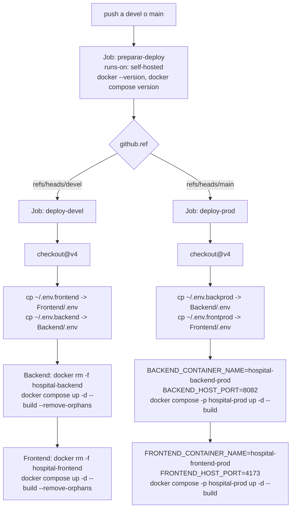

# Configuración, contenedores y despliegue

Cubre `Backend/Dockerfile`, `Backend/docker-compose.yml`, `.github/workflows/deploy-devel.yml` y las variables de entorno **por nombre**. Arranque de la aplicación en [[be-startup-di-config]]; infraestructura SQL en [[db-infrastructure]].

> **Regla de esta bóveda:** **no se reproduce ningún valor** de `.env`, `~/.env.backend`, `~/.env.backprod`, cadenas de conexión ni contraseñas. Solo nombres.

## 1. Variables de entorno (solo nombres)

### 1.1 Consumidas por la aplicación

| Nombre de la variable | Clave de configuración equivalente | Lee | Obligatoria |
| --- | --- | --- | --- |
| `ConnectionStrings__HospitalInfantilDb` | `ConnectionStrings:HospitalInfantilDb` | `Program.cs:48` → `UseSqlServer` | **Sí** |
| `Cors__AllowedOrigins__0` | `Cors:AllowedOrigins[0]` | `Program.cs:16-19` | De hecho sí (ver §1.3) |
| `Cors__AllowedOrigins__1` | `Cors:AllowedOrigins[1]` | idem | no |
| `ASPNETCORE_ENVIRONMENT` | — | framework | no (por defecto `Production`) |

**[verificado]** Esas **cuatro** son exactamente las claves presentes en `Backend/.env`. El archivo está listado en `Backend/.gitignore` y no se versiona.

### 1.2 Consumidas por Docker Compose

| Nombre | Valor por defecto en `docker-compose.yml` | Efecto |
| --- | --- | --- |
| `BACKEND_IMAGE_TAG` | `devel` | Etiqueta de la imagen `hospital-backend:<tag>` |
| `BACKEND_CONTAINER_NAME` | `hospital-backend` | Nombre del contenedor |
| `BACKEND_HOST_PORT` | `8081` | Puerto publicado en el host |

### 1.3 Ausencia crítica: ninguna variable fija el puerto de escucha

**[verificado]** Ni `Backend/.env`, ni `docker-compose.yml`, ni el `Dockerfile`, ni `Program.cs` definen `ASPNETCORE_URLS`, `ASPNETCORE_HTTP_PORTS` o `Kestrel__Endpoints__*`.

**[inferencia de alta confianza]** Las imágenes `mcr.microsoft.com/dotnet/aspnet` desde .NET 8 traen `ASPNETCORE_HTTP_PORTS=8080`, es decir **el contenedor escucha en 8080**. Pero `docker-compose.yml` publica `"${BACKEND_HOST_PORT:-8081}:5000"` y el `Dockerfile` declara `EXPOSE 5000`.

| Qué dice el repositorio | Qué ocurre en realidad |
| --- | --- |
| `EXPOSE 5000` (`Dockerfile:14`) — **solo documentación**, no configura nada | Kestrel escucha en **8080** salvo que una variable lo cambie |
| Compose mapea host `8081` → contenedor **`5000`** | Nada escucha en 5000 → **conexión rechazada** |

**Conclusión:** el despliegue **solo funciona si `~/.env.backend` en el runner define `ASPNETCORE_URLS` o `ASPNETCORE_HTTP_PORTS` apuntando a 5000** — algo que no se puede verificar desde el repositorio y que no está documentado en ningún archivo versionado. Es el primer punto a comprobar ante un fallo de conexión, **antes** de sospechar de CORS o SQL. Ver [[be-findings]].

### 1.4 Del lado del frontend (referencia)

`VITE_API_BASE_URL` es la base que el SPA antepone a `/Auth` y `/Platform`. Se **incrusta en el bundle durante el build**, debe ser resoluble **por el navegador del usuario** (no un nombre de servicio interno de Docker) y **nunca debe contener secretos**. Ver [[fe-api-clients]].

**[verificado]** `Frontend/nginx.conf` **no** hace proxy de `/Auth` ni `/Platform`: el navegador llama directamente a la API, por lo que **CORS es obligatorio** y el origen del SPA debe estar en `Cors__AllowedOrigins__*`.

## 2. Dockerfile

```dockerfile
# Backend/Dockerfile
FROM mcr.microsoft.com/dotnet/sdk:10.0 AS build
WORKDIR /src
COPY . .
RUN dotnet restore
RUN dotnet publish -c Release -o /app/publish /p:UseAppHost=false

FROM mcr.microsoft.com/dotnet/aspnet:10.0 AS final
WORKDIR /app
COPY --from=build /app/publish .
EXPOSE 5000
ENTRYPOINT ["dotnet", "Backend.dll"]
```

| Aspecto | Evaluación |
| --- | --- |
| Multietapa | ✅ El SDK no llega a la imagen final |
| `UseAppHost=false` | ✅ No genera el ejecutable nativo; se arranca con `dotnet Backend.dll` |
| Configuración | ✅ `Release` |
| **`COPY . .` antes de `restore`** | ❌ **Anula la caché de capas**: cualquier cambio en cualquier archivo obliga a re-restaurar todos los paquetes. El patrón correcto es copiar primero el `.csproj`, restaurar, y luego copiar el resto |
| **Sin `.dockerignore`** | ❌ **No existe `Backend/.dockerignore`**. El contexto incluye `bin/`, `obj/`, **y `.env`**, que termina dentro de la imagen de build. `.gitignore` **no** sustituye a `.dockerignore` |
| Etiquetas de imagen base | ⚠️ `sdk:10.0` y `aspnet:10.0` son móviles: dos builds del mismo commit pueden usar parches distintos |
| Usuario | ⚠️ Corre como **root** (no hay `USER app`), pese a que las imágenes .NET incluyen un usuario `app` no privilegiado |
| `EXPOSE 5000` | ❌ Engañoso: no coincide con el puerto real de escucha (§1.3) |
| Healthcheck | ❌ No hay `HEALTHCHECK` ni endpoint `/health` en la aplicación |
| Sin caché de NuGet | ⚠️ No usa `--mount=type=cache`, así que cada build descarga los paquetes |

**Riesgo de fuga [verificado + inferencia]:** al copiar el contexto completo, `Backend/.env` **con la cadena de conexión** queda en una capa de la etapa `build`. Esa capa no se publica en la imagen final (`COPY --from=build /app/publish .` copia solo lo publicado), pero **sí existe en la caché del builder del runner**. En un runner compartido o con la caché exportada es una exposición real.

## 3. Docker Compose

```yaml
# Backend/docker-compose.yml
services:
  backend:
    image: hospital-backend:${BACKEND_IMAGE_TAG:-devel}
    container_name: ${BACKEND_CONTAINER_NAME:-hospital-backend}
    build:
      context: .
      dockerfile: Dockerfile
    ports:
      - "${BACKEND_HOST_PORT:-8081}:5000"
    env_file:
      - .env
    restart: unless-stopped
```

| Aspecto | Evaluación |
| --- | --- |
| `env_file: .env` | ✅ La configuración entra por variables de entorno, no horneada en la imagen |
| `restart: unless-stopped` | ✅ |
| **Mapeo de puertos** | ❌ Apunta a `5000`; ver §1.3 |
| **Sin red compartida con SQL Server** | ⚠️ No define `networks`, ni `depends_on`, ni servicio de base de datos. La conexión a SQL Server debe resolverse desde la red por defecto del proyecto Compose: **el host de la cadena de conexión tiene que ser alcanzable desde ese contenedor** (IP/host externo, no `localhost`) |
| Sin healthcheck | ❌ Compose no puede saber si la API está lista |
| Sin límites de recursos | ⚠️ Sin `deploy.resources` |
| Sin volúmenes | ⚠️ En particular, **el anillo de claves de Data Protection no se persiste** → cada recreación del contenedor **invalida todos los bearer tokens**. Ver [[be-auth-session]] §3.1 |
| Un solo servicio | ℹ️ No hay Compose unificado del sistema; `Backend/`, `Frontend/` y `DataBase/` tienen el suyo (ver [[db-infrastructure]]) |

## 4. CI/CD — `.github/workflows/deploy-devel.yml`



### 4.1 Lo que hace, verificado

| Elemento | Detalle |
| --- | --- |
| Disparador | `push` a `devel` o a `main` (`deploy-devel.yml:3-7`) |
| Runner | **`self-hosted`** en los tres jobs |
| `preparar-deploy` | Solo imprime `$PWD`, `whoami`, `docker --version` y `docker compose version`. **No compila, no prueba, no valida nada del código** |
| Selección de entorno | `if: github.ref == 'refs/heads/devel'` / `'refs/heads/main'` |
| Configuración | Se copia desde el **home del runner**: `~/.env.backend` (devel) o `~/.env.backprod` (prod) → `Backend/.env`. **Los secretos viven en el sistema de archivos del runner, no en GitHub Secrets** |
| Despliegue | `docker rm -f <contenedor>` y después `docker compose up -d --build` |
| Producción | Sobrescribe `BACKEND_CONTAINER_NAME` y `BACKEND_HOST_PORT=8082` por `env:` del step, y usa el proyecto Compose `hospital-prod` |

### 4.2 Limitaciones verificadas

| # | Limitación | Impacto |
| --- | --- | --- |
| 1 | **Sin `dotnet build` ni `dotnet test`** | Un commit que no compila se despliega y el contenedor queda en reinicio perpetuo |
| 2 | **`docker rm -f` ANTES de `docker compose up --build`** | Si el build falla, el contenedor viejo **ya se borró**: **caída total del servicio** sin rollback |
| 3 | **Sin verificación posterior** | No hay `curl` a un endpoint, ni healthcheck, ni espera: el job "pasa" aunque la API no responda |
| 4 | **Sin rollback** | Recuperarse exige intervención manual en el runner |
| 5 | **`BACKEND_IMAGE_TAG` nunca se sobrescribe en producción** | Ambos entornos construyen `hospital-backend:devel`; el job de prod **reemplaza la imagen etiquetada `devel`** en el mismo runner. Si devel y prod comparten máquina, el despliegue de prod afecta a la imagen de devel |
| 6 | **Sin control de concurrencia** (`concurrency:`) | Dos pushes seguidos lanzan despliegues solapados sobre el mismo Docker |
| 7 | **No aplica cambios de esquema** | `DataBase/` no se despliega ni se ejecutan scripts SQL: las migraciones son manuales (ver [[db-index]]) |
| 8 | **Los jobs no fijan una máquina concreta** | Con varios runners `self-hosted`, `deploy-devel` y `deploy-prod` pueden caer en máquinas distintas, y la configuración `~/.env.*` podría no existir allí |
| 9 | **Cada despliegue invalida todas las sesiones** | El contenedor nuevo genera claves de Data Protection nuevas → todos los bearer tokens dejan de valer. Ver [[be-auth-session]] §3.1 |
| 10 | **Sin escaneo de vulnerabilidades ni firma de imagen** | Sin `trivy`, `dotnet list package --vulnerable`, SBOM ni cosign |
| 11 | **Nombre del archivo engañoso** | Se llama `deploy-devel.yml` pero también despliega producción |
| 12 | **Swagger llega a producción** | El `if (IsDevelopment())` está comentado en `Program.cs:54-60`, así que `/swagger` queda público en el entorno de `main` |

## 5. Puertos declarados en el repositorio

| Ejecución | Host | Contenedor / proceso | Fuente |
| --- | --- | --- | --- |
| Backend local, perfil `http` | `5196` | proceso | `Properties/launchSettings.json:8` |
| Backend local, perfil `https` | `7289` + `5196` | proceso | `launchSettings.json:17` |
| Backend Compose devel | `8081` (defecto) | **`5000` declarado** ⚠ | `docker-compose.yml:9` |
| Backend Compose prod | `8082` | **`5000` declarado** ⚠ | workflow `:68` |
| Frontend Compose devel | `5173` | `80` (Nginx) | `Frontend/docker-compose.yml` |
| Frontend Compose prod | `4173` | `80` (Nginx) | workflow `:79` |
| SQL Server | ver [[db-infrastructure]] | — | `DataBase/docker-compose.yml` |

**[inferencia]** El puerto real de escucha del contenedor es **8080** salvo que `.env` lo cambie (§1.3).

## 6. Ejecución local de referencia

Desde `Backend/`, con el SDK .NET 10 instalado y las variables configuradas:

```sh
dotnet restore
dotnet build --no-restore
dotnet run --launch-profile http
```

**[verificado]** `dotnet build` del 2026-09-18 termina con **0 advertencias y 0 errores**.

Comprobaciones disponibles después de arrancar:

| Comprobación | URL |
| --- | --- |
| Swagger UI | `http://localhost:5196/swagger` |
| Documento Swashbuckle | `http://localhost:5196/swagger/v1/swagger.json` |
| Documento OpenAPI nativo | `http://localhost:5196/openapi/v1.json` |
| Endpoint anónimo de humo | `GET http://localhost:5196/Auth/areas` |

**[verificado]** `Backend/Backend.http` contiene una petición a `/weatherforecast/`, **ruta que no existe**: no sirve como prueba de humo. Debería actualizarse a `/Auth/areas`.

**[verificado]** No hay proyecto de pruebas: no existe `dotnet test` que ejecutar. Tampoco `EnsureCreated`/`Migrate`, así que la base y sus catálogos deben existir de antemano.

## 7. Lista de comprobación de despliegue

1. `ConnectionStrings__HospitalInfantilDb` definida y con un host **alcanzable desde el contenedor** (no `localhost`).
2. `Cors__AllowedOrigins__*` con el **origen exacto** (esquema + host + puerto) desde el que el navegador sirve el SPA. Si falta, la API arranca sin error y el SPA falla entero.
3. **Puerto de escucha alineado**: definir `ASPNETCORE_HTTP_PORTS=5000` (o cambiar el mapeo de Compose al puerto real). Es la causa más probable de "conexión rechazada".
4. `VITE_API_BASE_URL` del frontend apuntando a la URL **pública** de la API, coherente con el punto 2.
5. La base, el esquema `acceso_usuario`, las 7 tablas y los catálogos (áreas, módulos, permisos, tipos) deben existir: **el backend no los crea**. Ver [[db-index]].
6. Debe existir al menos un usuario con permiso `editar` en el módulo **1**, o **ninguna operación de administración funcionará**. Ver [[be-authorization-permissions]].
7. Considerar persistir el anillo de claves de Data Protection para no invalidar sesiones en cada despliegue.
8. Antes de exponer a internet: resolver los tres hallazgos críticos de [[be-findings]] (listados anónimos y cambio de contraseña sin verificación) y cerrar Swagger.

## Enlaces

- [[be-index]] · [[be-startup-di-config]] · [[be-architecture]] · [[be-auth-session]] · [[be-authorization-permissions]]
- [[be-api-reference]] · [[be-findings]] · [[be-dbcontext-entities]]
- [[db-infrastructure]] · [[db-index]] · [[db-schema-acceso-usuario]]
- [[fe-api-clients]] · [[fe-index]] · [[architecture-overview]]
