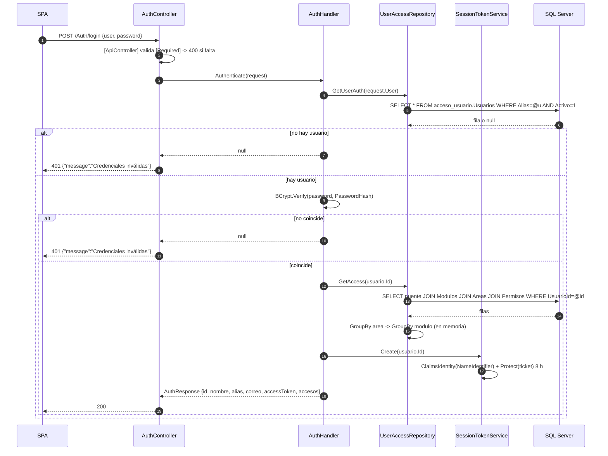
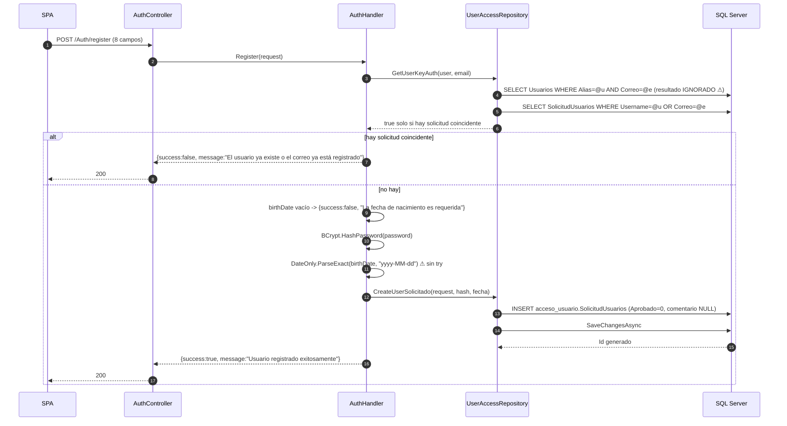
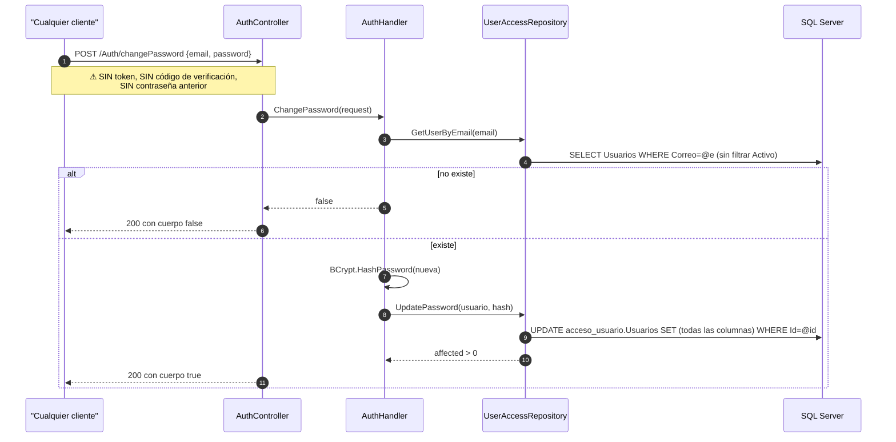
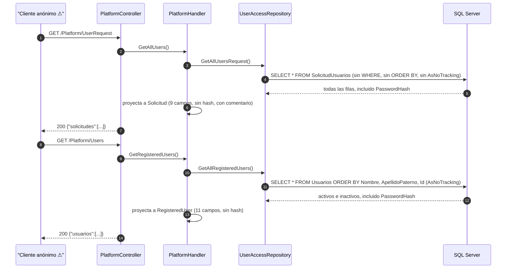
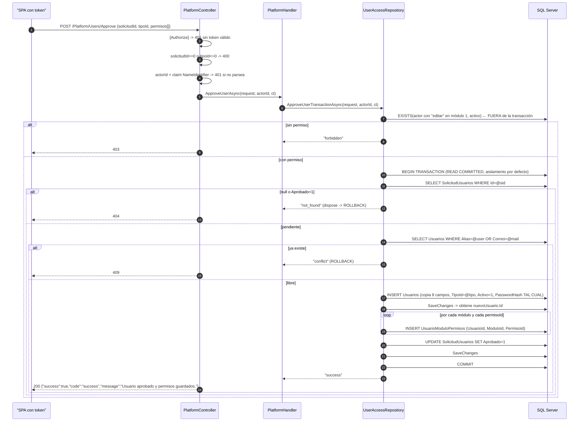

# Flujos end-to-end del servidor

Los ocho flujos implementados, del controller a SQL Server. Cada uno señala **transacciones**, **validaciones presentes y ausentes** y **manejo de errores**. Referencias cruzadas: [[be-api-reference]], [[be-repository]], [[be-authorization-permissions]].

Convención de los diagramas: `C` = Controller, `H` = Handler, `R` = `UserAccessRepository`, `E` = EF Core / `UserAccessDbContext`, `S` = SQL Server.

---

## 1. Login



| Aspecto | Estado |
| --- | --- |
| Consultas SQL | **2 secuenciales** (usuario, accesos) |
| Transacción | no aplica (solo lectura) |
| Validaciones presentes | `[Required]` de `user` y `password`; `Activo = true`; verificación BCrypt |
| Validaciones ausentes | sin `Trim`, sin longitud mínima, **sin límite de intentos ni bloqueo de cuenta** |
| Errores no manejados | `BCrypt.Verify` lanza si `PasswordHash` no es un hash BCrypt válido → **500** |
| Fuga de información | correcta: los tres motivos de fallo dan el mismo `401` |
| Nota | `accesos` **no filtra** módulos/áreas inactivos, a diferencia de los catálogos |

Cliente: `Frontend/src/composable/AuthApi.ts:loginUser` — ver [[fe-api-clients]].

---

## 2. Solicitud de registro



| Aspecto | Estado |
| --- | --- |
| Transacción | **no hay**: un solo `INSERT` |
| Validaciones presentes | 8 × `[Required]`; comprobación de `birthDate` vacío; detección de duplicados **parcial** |
| Validaciones ausentes | longitudes, formato de correo, complejidad de contraseña, valores de `sex`, unicidad frente a `Usuarios` |
| **Defecto 1** | `GetUserKeyAuth` ignora la consulta a `Usuarios` y duplica la condición (`UserAccessRepository.cs:31`) → se admite una solicitud con alias/correo de un usuario ya existente, que **nunca podrá aprobarse** |
| **Defecto 2** | `DateOnly.ParseExact` sin protección (`AuthHandler.cs:61`) → **500** con un formato distinto de `yyyy-MM-dd` |
| **Defecto 3** | Longitudes: el formulario acepta más caracteres que las columnas (`varchar(30)`/`varchar(20)`/`varchar(10)`) → `DbUpdateException` → **500** |
| Resultado del flujo | **Termina en la solicitud.** No crea `Usuarios`, no asigna `TipoId`, no inserta permisos. Requiere aprobación (§6) |
| Códigos posibles | `200` (éxito y fracaso lógico), `400` (anotaciones), `500` (fecha o longitud) |

Ver [[db-table-solicitud-usuarios]].

---

## 3. Cambio de contraseña



| Aspecto | Estado |
| --- | --- |
| Transacción | no hay |
| Validaciones presentes | `[Required]` + `[EmailAddress]` en `email`; `[Required]` en `password` |
| Validaciones ausentes | **titularidad del correo**, complejidad de la contraseña, filtro `Activo`, token de un solo uso, límite de intentos |
| **Riesgo crítico** | Cualquiera que conozca un correo registrado puede **tomar la cuenta**. Enumerar correos es trivial con `GET /Platform/Users`, que también es anónimo |
| Contrato | Devuelve un **booleano JSON desnudo**, no un objeto |
| Efecto lateral | `_context.Usuarios.Update(usuario)` reescribe **todas** las columnas, no solo el hash |
| Lo que no alcanza | Solicitudes pendientes: consulta solo `Usuarios` |

Ver [[be-findings]] (hallazgo #1) y [[be-auth-session]].

---

## 4. Catálogos

```mermaid
sequenceDiagram
    autonumber
    participant N as SPA
    participant C as AuthController
    participant H as AuthHandler
    participant R as UserAccessRepository
    participant S as SQL Server

    N->>C: GET /Auth/areas
    C->>H: GetAreas()
    H->>R: GetAreas()
    R->>S: SELECT Areas WHERE Activo=1
    H->>H: foreach -> Areas[Nombre] = Id
    C-->>N: 200 {"areas":{"Plataforma":1}}

    N->>C: GET /Auth/access
    C->>H: GetAccess()
    H->>R: GetPermisos()
    R->>S: SELECT Permisos  (todos; la tabla no tiene Activo)
    H->>H: foreach -> Permisos[Id] = Nombre
    C-->>N: 200 {"permisos":{"1":"ver"}}

    N->>C: GET /Auth/userTypes
    C->>H: GetUserTypes()
    H->>R: GetUserTypes()
    R->>S: SELECT TipoUsuario  (tabla SINGULAR)
    H->>H: foreach -> UserTypes[NivelUsuario] = Id  ⚠ ArgumentException si hay duplicados
    C-->>N: 200 {"userTypes":{"Administrador":1}}

    N->>C: POST /Auth/modules {areasId:[...]}
    C->>H: GetModules(request)
    H->>R: GetModulos(areasId)
    R->>S: SELECT Modulos WHERE AreaId IN @ids AND Activo=1
    H->>H: foreach -> Modulos[Id] = Nombre
    C-->>N: 200 {"modulos":{"1":"Configuración de cuentas"}}
```

| Aspecto | Estado |
| --- | --- |
| Transacción / caché | ninguna: cada petición ejecuta su `SELECT` |
| Autenticación | **ninguna**: los cuatro catálogos son anónimos y describen la estructura organizativa completa |
| Validaciones | `areasId` con `[Required]` **que no exige elementos**; el resto sin entrada |
| **Defecto** | `GET /Auth/userTypes` lanza `ArgumentException` → **500** si dos filas comparten `NivelUsuario`; la tabla no tiene índice único en ese campo (`UserAccessDbContext.cs:105-113`) |
| Inconsistencia | Áreas y tipos mapean **nombre → id**; permisos y módulos mapean **id → nombre** |
| Filtro de estado | `areas` y `modulos` filtran `Activo`; `permisos` y `userTypes` no pueden (no tienen la columna) |
| Coherencia con el login | `accesos` **no** filtra `Activo`, así que puede referir módulos ausentes del catálogo. Ver [[fe-templates-areas-modules]] |

---

## 5. Listados de la plataforma



| Aspecto | Estado |
| --- | --- |
| Transacción | no aplica |
| **Autenticación** | **ninguna**: los dos endpoints que devuelven datos personales del personal son anónimos |
| Validaciones | ninguna (no hay entrada) |
| Paginación / filtros | **ninguno**: siempre la tabla completa. El filtrado por nombre y correo lo hace el navegador |
| Eficiencia | El `SELECT *` trae **todos los hashes** aunque el DTO los descarte; una proyección en SQL lo evitaría |
| Defecto menor | `GET /Platform/UserRequest` no usa `AsNoTracking`, así que EF rastrea cada solicitud |
| Rama muerta | El `401` de `PlatformControler.cs:36-37` es inalcanzable y **no autentica**: solo comprueba `null` |

---

## 6. Aprobación transaccional de una solicitud



| Aspecto | Estado |
| --- | --- |
| **Transacción** | **Sí** (`UserAccessRepository.cs:245`), aislamiento **por defecto** (`READ COMMITTED`) |
| Alcance de la transacción | Inserción del usuario, inserción de permisos y marcado de la solicitud. **La comprobación de permiso queda fuera** |
| Rollback | Implícito por `await using` en los retornos tempranos |
| Validaciones presentes | `[Authorize]`; `solicitudId > 0`; `tipoId > 0`; permiso `editar` módulo 1; solicitud pendiente; alias/correo libres en `Usuarios` |
| Validaciones ausentes | existencia de `TipoId`, `ModuloId` y `PermisoId`; duplicados en `PermisosIds`; **`permisos` vacío se acepta** |
| Manejo de errores | `DbUpdateException` con SQL **2601/2627/547** → `409`; resto → `500` con log |
| **Defecto 1** | El `547` (FK inexistente) se reporta como *"conflicto con registros únicos"*, mensaje engañoso |
| **Defecto 2** | `permisos: []` crea un usuario que entra y no ve nada |
| **Defecto 3** | La solicitud **no se borra**: conserva el hash y ocupa `UQ_Solicitud_User`/`UQ_Solicitud_correo` de forma permanente |
| **Defecto 4** | `FechaIngreso` se hereda de la solicitud: no se registra la fecha real de alta, ni quién aprobó |
| **[inferencia]** | Con `READ COMMITTED`, dos aprobaciones simultáneas pueden pasar ambas los chequeos; la segunda falla en el índice único (2627) → `409`. La integridad la salva la base, no la lógica |

Ver [[be-repository]] §8.2 y [[db-table-usuario-modulo-permisos]].

---

## 7. Actualización de permisos de un usuario activo

```mermaid
sequenceDiagram
    autonumber
    participant N as "SPA con token"
    participant C as PlatformController
    participant H as PlatformHandler
    participant R as UserAccessRepository
    participant S as SQL Server

    Note over N,S: Lectura previa
    N->>C: GET /Platform/Users/{id}/Permissions
    C->>C: [Authorize] (⚠ sin comprobar permiso de módulo)
    C->>H: GetUserPermissionsAsync(id)
    H->>R: GetUserPermissionsAdminAsync(id)
    R->>S: SELECT Usuarios + Include(puente -> Modulo -> Area) WHERE Id=@id
    H->>H: si null o !Activo -> Success=false
    H->>H: GroupBy {AreaId, AreaName, ModuloId, ModuloName} (en memoria)
    C-->>N: 200 UserPermissionsResponse  ó  404 {message}

    Note over N,S: Escritura
    N->>C: PUT /Platform/Users/Permissions {userId, tipoId, permisos[]}
    C->>C: userId<=0 o tipoId<=0 -> 400 ; actorId desde el claim
    C->>H: UpdateUserPermissionsAsync(request, actorId, ct)
    H->>R: UpdateUserPermissionsTransactionAsync(userId, request, actorId, ct)
    R->>S: EXISTS(actor con "editar" en módulo 1)  ← FUERA de la transacción
    alt sin permiso
        C-->>N: 403
    else con permiso
        R->>S: BEGIN TRANSACTION (por defecto)
        R->>S: SELECT Usuarios + Include(puente) WHERE Id=@userId
        alt null o !Activo
            R-->>H: "not_found"   (ROLLBACK)
            C-->>N: 404
        else activo
            R->>R: RemoveRange(TODOS los permisos actuales)
            R->>R: usuario.TipoId = request.TipoId
            loop por cada módulo y permiso enviados
                R->>R: Add(UsuarioModuloPermiso)
            end
            R->>S: SaveChanges  (DELETE + UPDATE + INSERT)
            R->>S: COMMIT
            C-->>N: 200 {"success":true,"code":"success","message":"Permisos actualizados correctamente."}
        end
    end
```

| Aspecto | Estado |
| --- | --- |
| **Transacción** | **Sí** (`UserAccessRepository.cs:316`), aislamiento por defecto; un único `SaveChanges` para borrado, actualización e inserción |
| Semántica | **Reemplazo total**, no diferencial |
| Validaciones presentes | `[Authorize]`; `userId > 0`; `tipoId > 0`; permiso `editar` módulo 1; usuario existente y activo |
| Validaciones ausentes | existencia de `TipoId`/`ModuloId`/`PermisoId`; duplicados; **`userId != actorId`**; conservar al menos un administrador |
| Manejo de errores | Solo `catch (Exception)` → `500`. **La violación de FK NO se traduce a 409/400**, a diferencia de la aprobación |
| **Riesgo alto** | `permisos: []` sobre el último usuario con `editar` en módulo 1 **bloquea la administración por API** de forma irrecuperable sin SQL |
| **Riesgo alto** | El actor puede modificarse a sí mismo y cambiar cualquier `TipoId` |
| Asimetría de API | El `GET` lleva el id en la ruta; el `PUT` lo lleva en el cuerpo |
| Lectura | El filtro de `Activo` está en el handler, no en la consulta; un usuario inactivo devuelve `404` "Usuario no encontrado" |

---

## 8. "Desactivación" de un usuario — en realidad un borrado

```mermaid
sequenceDiagram
    autonumber
    participant N as "SPA con token"
    participant C as PlatformController
    participant H as PlatformHandler
    participant R as UserAccessRepository
    participant S as SQL Server

    N->>C: POST /Platform/Users/{id}/deactivate
    C->>C: [Authorize]; id>0; actorId desde el claim
    C->>H: DeactivateUser(id, actorId, ct)
    H->>R: DeactivateUser(usuarioId, actorId, ct)
    R->>S: BEGIN TRANSACTION (IsolationLevel.Serializable)
    R->>S: EXISTS(actor con "editar" en módulo 1)  ← DENTRO de la transacción
    alt sin permiso
        R-->>H: Forbidden  (ROLLBACK)
        C-->>N: 403
    else con permiso
        R->>S: SELECT Usuarios WHERE Id=@id
        alt null
            R-->>H: NotFound
            C-->>N: 404
        else existe
            R->>S: SELECT SolicitudUsuarios WHERE Username=@alias OR Correo=@correo
            alt >1 coincidencia o identidad parcial
                R-->>H: Conflict
                C-->>N: 409
            else 0 o 1 coincidencia exacta
                R->>S: INSERT o UPDATE SolicitudUsuarios (copia completa, Aprobado=0,<br/>comentario = "usario previamente registrado")
                R->>S: SaveChanges
                R->>S: DELETE UsuarioModuloPermisos WHERE UsuarioId=@id
                R->>S: SaveChanges
                R->>S: DELETE Usuarios WHERE Id=@id      ⚠ borrado físico
                R->>S: SaveChanges
                R->>S: COMMIT
                R-->>H: Success
                C-->>N: 200 {"success":true,"code":"success",<br/>"message":"Usuario dado de baja y trasladado a solicitudes correctamente."}
            end
        end
    end
```

| Aspecto | Estado |
| --- | --- |
| **Transacción** | **Sí**, la única con **`IsolationLevel.Serializable`** (`UserAccessRepository.cs:144-145`) |
| Alcance | Comprobación de permiso, copia a solicitud, borrado de permisos y borrado del usuario: **todo dentro** |
| **Semántica real** | **NO pone `Activo = false`.** Elimina la fila de `Usuarios` y deja una solicitud pendiente con los mismos datos y el mismo hash |
| Validaciones presentes | `[Authorize]`; `id > 0`; permiso `editar` módulo 1; usuario existente; sin conflicto de alias/correo en solicitudes |
| Validaciones ausentes | **`usuarioId != actorId`** (un administrador puede borrarse a sí mismo); conservar al menos un administrador |
| Manejo de errores | SQL 2601/2627/547 → `409`; **deadlock 1205 → `409`**; resto → `500` con log |
| **Consecuencia 1** | Se pierden el `Id`, la historia y toda referencia futura al usuario |
| **Consecuencia 2** | `Usuario.Activo` **no se usa nunca para desactivar**: `GET /Platform/Users` devolverá prácticamente siempre `activo: true`, y el botón "Desactivar" deshabilitado para inactivos del SPA casi nunca se activa |
| **Consecuencia 3** | Se **sobrescribe el comentario** de una solicitud coincidente con el texto fijo `"usario previamente registrado"` (con el typo) |
| **Consecuencia 4** | Sin auditoría: no queda registro de quién ejecutó la baja ni cuándo |
| **Consecuencia 5** | `Serializable` sobre `Usuarios` + `SolicitudUsuarios` + puente maximiza bloqueos de rango; de ahí la captura explícita del *deadlock* |

---

## 9. Panorama de transacciones y aislamiento

| Operación | Transacción | Aislamiento | Permiso comprobado dentro | `SaveChanges` en la transacción |
| --- | --- | --- | --- | --- |
| Registro de solicitud | no | — | — | 1 |
| Cambio de contraseña | no | — | — | 1 |
| Comentario de solicitud | no | — | n/a (fuera, lanza excepción) | 1 |
| **Aprobación** | sí | por defecto (`READ COMMITTED`) | **no** | 2 |
| **Actualización de permisos** | sí | por defecto | **no** | 1 |
| **"Desactivación"** | sí | **`Serializable`** | **sí** | 3 |

**[verificado]** No hay `IExecutionStrategy` / reintentos automáticos configurados (`EnableRetryOnFailure` ausente en `Program.cs:47-49`). **[inferencia]** Un fallo transitorio de red o un *failover* de SQL Server aborta la operación con `500`; el cliente debe reintentar manualmente.

## 10. Panorama de manejo de errores

| Zona | Manejo |
| --- | --- |
| `AuthController` (7 endpoints) | **Ninguno.** Cualquier excepción sale como `500` genérico de ASP.NET |
| `PlatformController`, endpoints antiguos (2) | **Ninguno** |
| `PlatformController`, endpoints nuevos (5) | `try/catch` por acción, traducción de códigos SQL, log con `ILogger`, y `when (ex is not OperationCanceledException)` salvo en `GetUserPermissions` |
| Middleware global | **No existe** `UseExceptionHandler` ni `AddProblemDetails` |
| Formato de error | Inconsistente: `ValidationProblemDetails` (400 automático), `{message}` anónimo, `{success,code,message}`, o el `500` por defecto del framework |

## Enlaces

- [[be-index]] · [[be-architecture]] · [[be-api-reference]] · [[be-controllers]] · [[be-handlers]] · [[be-repository]]
- [[be-auth-session]] · [[be-authorization-permissions]] · [[be-dto-contracts]] · [[be-dbcontext-entities]] · [[be-findings]]
- [[db-queries-by-feature]] · [[db-table-usuarios]] · [[db-table-solicitud-usuarios]] · [[db-table-usuario-modulo-permisos]] · [[db-relationships]]
- [[fe-api-clients]] · [[fe-session-state]] · [[fe-templates-areas-modules]] · [[architecture-overview]]
