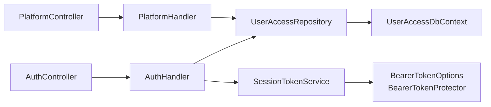

# Handlers y servicios de aplicación

`Backend/Handlers/` contiene **tres clases**, todas registradas como `Scoped` en `Program.cs`. Son clases concretas: **no implementan ninguna interfaz** (ver [[be-architecture]] §6).

| Archivo | Clase | Registro DI | Dependencias | Consumido por |
| --- | --- | --- | --- | --- |
| `AuthHandler.cs` | `AuthHandler` | `Program.cs:42` | `UserAccessRepository`, `SessionTokenService` | `AuthController` |
| `PlatformHandler.cs` | `PlatformHandler` | `Program.cs:43` | `UserAccessRepository` | `PlatformController` |
| `SessionTokenService.cs` | `SessionTokenService` | `Program.cs:35` | `IOptionsMonitor<BearerTokenOptions>` | `AuthHandler` |



## 1. `AuthHandler` — `Backend/Handlers/AuthHandler.cs`

128 líneas, 7 métodos públicos. Es el único lugar del backend donde se usa BCrypt.

### 1.1 `Authenticate(AuthRequest) → AuthResponse?` · `:18-41`

```csharp
var usuario = await _repository.GetUserAuth(request.User);     // alias + Activo
if (usuario is null) return null;
bool passwordValid = BCrypt.Net.BCrypt.Verify(request.Password, usuario.PasswordHash);
if (!passwordValid) return null;
var accesos = await _repository.GetAccess(usuario.Id);
return new AuthResponse { Id, Nombre, Alias, Correo, Accesos = accesos,
                          AccessToken = _sessionTokens.Create(usuario.Id) };
```

| Aspecto | Hecho |
| --- | --- |
| Identificador de login | **Solo `Alias`**, no el correo (`UserAccessRepository.cs:22`) |
| Filtro | `Activo == true`: un usuario inactivo no puede entrar |
| Comparación de alias | La hace SQL Server con la *collation* de la columna → **[inferencia]** normalmente insensible a mayúsculas |
| Motivo del fallo | **Indistinguible**: usuario inexistente, inactivo y contraseña mala devuelven el mismo `null` → `401`. Correcto para no filtrar información |
| Token | Se emite **después** de verificar la contraseña, con el `Id` del usuario (`:39`) |
| Consultas SQL | **2** secuenciales: usuario y accesos |
| Errores | **`BCrypt.Verify` lanza `SaltParseException` si `PasswordHash` está corrupto o no es BCrypt** → excepción no capturada → `500`. Ver [[be-findings]] |

**[nuevo]** La línea `:39` es el cambio más importante de este ciclo respecto a `.agent/CONTEXT.md`, que afirma *"no establece una sesión autenticada en el servidor"*. Hoy sí la establece. Ver [[be-auth-session]].

### 1.2 `Register(RegisterRequest) → RegisterResponse?` · `:43-71`

Orden real de las comprobaciones:

1. Construye una respuesta pesimista: `Success = false`, `Message = "El usuario ya existe o el correo ya está registrado"` (`:45-49`).
2. `GetUserKeyAuth(request.user, request.email)` → si `true`, devuelve ese mensaje (`:50-54`). **Este método tiene un defecto lógico verificado**: ver [[be-repository]] §2.2.
3. `else if (request.birthDate == null || request.birthDate == "")` → `"La fecha de nacimiento es requerida"` (`:55-59`). **[verificado]** Es una rama `else if`, así que solo se evalúa si **no** hubo duplicado; y `[Required]` ya rechazaría `null` antes, por lo que solo cubre la cadena vacía.
4. `BCrypt.HashPassword(request.password)` — **work factor por defecto (11)**, sin configuración explícita (`:60`).
5. `DateOnly.ParseExact(request.birthDate, "yyyy-MM-dd")` (`:61`) — **sin `try` ni `TryParseExact`**: `"31/01/1990"` o `"1990-13-45"` lanzan `FormatException` → **500**.
6. `CreateUserSolicitado(...)` → si `null`, `"Error al registrar el usuario"` (`:62-67`). **[verificado]** El repositorio nunca devuelve `null` en ese método, así que esta rama es inalcanzable.
7. Éxito: `Success = true`, `"Usuario registrado exitosamente"`.

**[verificado]** El handler **no** valida longitudes, formato de correo, complejidad de contraseña ni valores de `sex`. Esas reglas solo existen en el formulario de React (ver [[fe-index]]), por lo que una llamada directa a la API las elude. Un `name` de 40 caracteres pasa el handler y **falla en SQL** (`varchar(30)`) → `DbUpdateException` → `500`.

### 1.3 `ChangePassword(ChangePasswordRequest) → bool` · `:73-83`

```csharp
var usuario = await _repository.GetUserByEmail(request.email);
if (usuario is null) return false;
var passwordHash = BCrypt.Net.BCrypt.HashPassword(request.password);
return await _repository.UpdatePassword(usuario, passwordHash);
```

| Aspecto | Hecho |
| --- | --- |
| Prueba de titularidad | **Ninguna.** Ni token, ni código por correo, ni contraseña anterior |
| Filtro `Activo` | **Ninguno** (`UserAccessRepository.cs:204-208`): también cambia la contraseña de cuentas inactivas |
| Solicitudes pendientes | No las alcanza: consulta solo `Usuarios` |
| Complejidad de la nueva contraseña | No se valida en el servidor |
| Retorno | `bool` crudo, que el controller devuelve como `Ok(result)` → cuerpo `true`/`false` |
| `false` significa | Correo no registrado, **o** `SaveChangesAsync` devolvió 0 filas |

Riesgo crítico documentado en [[be-findings]].

### 1.4 Los cuatro métodos de catálogo · `:85-127`

Todos siguen la misma forma: leer del repositorio y volcar a un diccionario.

| Método | Repositorio | Diccionario resultante | Filtro | Riesgo de clave duplicada |
| --- | --- | --- | --- | --- |
| `GetUserTypes` `:85-94` | `GetUserTypes()` | `UserTypes[NivelUsuario] = Id` | ninguno | **Sí** — no hay índice único sobre `NivelUsuario` → `ArgumentException` → `500` |
| `GetAreas` `:96-105` | `GetAreas()` | `Areas[Nombre] = Id` | `Activo` | No — existe `UQ_Areas_Nombre` |
| `GetAccess` `:107-116` | `GetPermisos()` | `Permisos[Id] = Nombre` | ninguno | No — la clave es la PK |
| `GetModules` `:118-127` | `GetModulos(areasId)` | `Modulos[Id] = Nombre` | `Modulo.Activo` + área en la lista | No — la clave es la PK |

**[verificado]** Ninguno cachea: cada petición ejecuta su `SELECT`. Los cuatro declaran retorno anulable pero **ninguno devuelve `null`**, lo que hace muerto el `if (response is null)` de `AuthController` (ver [[be-controllers]] §1.1).

**[verificado]** `GetAccess` del handler devuelve el **catálogo global de permisos**, mientras que `UserAccessRepository.GetAccess(int)` devuelve **los accesos de un usuario**. Dos métodos con el mismo nombre y semántica distinta en capas distintas: fuente habitual de confusión.

## 2. `PlatformHandler` — `Backend/Handlers/PlatformHandler.cs`

172 líneas, 6 métodos. Su papel real es **proyectar entidades a DTO** y **traducir códigos de resultado del repositorio a DTO con `Code`/`Message`**. No contiene reglas de negocio propias salvo un filtro de `Activo`.

### 2.1 `GetRegisteredUsers() → RegisteredUsersResponse` · `:16-37`

Mapeo manual campo a campo de `Usuario` → `RegisteredUser`, **omitiendo deliberadamente `PasswordHash` y las navegaciones**. Es la razón por la que `GET /Platform/Users` no filtra hashes: la exclusión es explícita en el DTO, no un `[JsonIgnore]`.

### 2.2 `GetAllUsers() → UsersRequestResponse?` · `:66-90`

`foreach` clásico que construye `List<Solicitud>`. Proyecta 9 campos e **incluye `Comentario`** (`:82`) — campo nuevo respecto a `.agent/CONTEXT.md`, que lo describe como no expuesto en DTO. Omite `FechaNacimiento`, `Sexo` y `PasswordHash`.

Declara retorno `UsersRequestResponse?` pero **siempre devuelve un objeto**, por lo que el `401` del controller es inalcanzable.

### 2.3 `DeactivateUser(int userId, int actorId, ct) → DeactivateUserResponse` · `:39-64`

Traduce el `enum UserDeactivationStatus` a DTO:

| `UserDeactivationStatus` | `Success` | `Code` | HTTP final |
| --- | --- | --- | --- |
| `Success` | `true` | `success` | `200` |
| `NotFound` | `false` | `not_found` | `404` |
| `Conflict` | `false` | `conflict` | `409` |
| `Forbidden` *(rama `_`)* | `false` | `forbidden` | `403` |

**[verificado]** El mensaje de éxito es *"Usuario dado de baja y trasladado a solicitudes correctamente"*, que describe con precisión lo que hace el repositorio: **mover la fila a `SolicitudUsuarios` y borrarla de `Usuarios`**, no marcar `Activo = false`.

### 2.4 `UpdateComment(int, string?, int, ct) → bool` · `:92-95`

Delegación de una línea. **No valida nada**: no longitud, no contenido, no si la solicitud ya está aprobada. Un comentario puede escribirse sobre una solicitud ya aprobada.

### 2.5 `ApproveUserAsync(ApproveUserRequest, int actorId, ct) → DeactivateUserResponse` · `:97-121`

Traduce los **strings** del repositorio (`"success"`, `"not_found"`, `"conflict"`, resto) a `DeactivateUserResponse`.

**[verificado]** Dos anomalías de diseño:
1. La firma usa el nombre completo `Backend.Models.Request.Platform.ApproveUserRequest` (`:97`) pese a que el `using` ya está en `:2` — residuo de edición.
2. **Reutiliza `DeactivateUserResponse`** para una operación de aprobación. El nombre del esquema aparece así en Swagger/OpenAPI. Ver [[be-architecture]] §5.4.

### 2.6 `GetUserPermissionsAsync(int) → UserPermissionsResponse` · `:122-149`

```csharp
var usuario = await _repository.GetUserPermissionsAdminAsync(userId);
if (usuario is null || !usuario.Activo)
    return new UserPermissionsResponse { Success = false, Message = "Usuario no encontrado", Code = "not_found" };
```

- **[verificado]** El filtro de `Activo` está **en el handler**, no en la consulta: el repositorio trae al usuario y el handler lo descarta (`:125`). Un usuario inactivo produce `404` con mensaje "Usuario no encontrado", ocultando que existe.
- La proyección (`:135-145`) agrupa **en memoria** por `{AreaId, AreaName, ModuloId, ModuloName}` navegando `p.Modulo.Area.Nombre`. Depende de que el repositorio haya hecho `Include(...).ThenInclude(...)`; si alguien quitara esos `Include`, con *lazy loading* deshabilitado las navegaciones serían `null` → `NullReferenceException` → `500`. **[inferencia de alta confianza]**
- No filtra módulos ni áreas inactivos: devuelve asignaciones a módulos apagados.

### 2.7 `UpdateUserPermissionsAsync(UpdateUserPermissionsRequest, int actorId, ct)` · `:151-170`

Traduce strings a `DeactivateUserResponse`. **[verificado]** No contempla el caso `"conflict"`: su `switch` solo tiene `"success"`, `"not_found"` y `_ => forbidden`. Como el repositorio tampoco devuelve `"conflict"` ahí, es coherente hoy, pero cualquier `string` nuevo caería silenciosamente en `403`.

### 2.8 Lo que `PlatformHandler` no hace

**[verificado]**

- No valida los datos del `request` (`moduloId`/`permisoId` inexistentes llegan intactos a SQL).
- No abre transacciones: todas están en el repositorio.
- No comprueba permisos: eso también está en el repositorio (ver [[be-authorization-permissions]]).
- No usa `ILogger` (solo el controller registra).
- No usa el `actorId` para nada propio: lo reenvía tal cual.

## 3. `SessionTokenService` — `Backend/Handlers/SessionTokenService.cs`

27 líneas. Clase con **constructor primario** (`primary constructor`), la única del backend con esa sintaxis.

```csharp
public class SessionTokenService(IOptionsMonitor<BearerTokenOptions> options)
{
    public string Create(int userId)
    {
        var configuration = options.Get(BearerTokenDefaults.AuthenticationScheme);
        var identity = new ClaimsIdentity(
            new[] { new Claim(ClaimTypes.NameIdentifier, userId.ToString(CultureInfo.InvariantCulture)) },
            BearerTokenDefaults.AuthenticationScheme);
        var properties = new AuthenticationProperties
        {
            IssuedUtc = DateTimeOffset.UtcNow,
            ExpiresUtc = DateTimeOffset.UtcNow.Add(configuration.BearerTokenExpiration)
        };
        var ticket = new AuthenticationTicket(new ClaimsPrincipal(identity), properties,
            BearerTokenDefaults.AuthenticationScheme);
        return configuration.BearerTokenProtector.Protect(ticket);
    }
}
```

| Hecho verificado | Detalle |
| --- | --- |
| Es un **único método**, `Create(int userId)` | No hay `Validate`, `Revoke`, `Refresh` ni `Parse` |
| Claims emitidos | **Uno solo**: `ClaimTypes.NameIdentifier` con el `Usuario.Id` |
| Lo que **no** incluye | Alias, correo, `TipoId`, roles, permisos, `jti`, `iat` legible |
| Vigencia | `BearerTokenExpiration` de las opciones = **8 h** (`Program.cs:33`) |
| Protección | `configuration.BearerTokenProtector.Protect(ticket)` — Data Protection, **no JWT firmado** |
| Registro DI | `Scoped` en `Program.cs:35` — **[verificado], corrige cualquier duda del contexto previo** |
| Quién lo usa | Solo `AuthHandler.Authenticate` (`AuthHandler.cs:39`). Ningún otro punto emite tokens |

Análisis completo del mecanismo, su validación y sus límites en [[be-auth-session]].

## 4. Reglas al escribir un handler nuevo

1. Inyectar `UserAccessRepository` por constructor; el lifetime `Scoped` garantiza el mismo `DbContext` que el resto de la petición.
2. **No** declarar el retorno como anulable si nunca se devuelve `null`: hoy eso genera 5 ramas muertas en `AuthController`.
3. Devolver un DTO **propio de la operación**, no reutilizar `DeactivateUserResponse`.
4. Si se traducen resultados, preferir un `enum` (como `UserDeactivationStatus`) a `string` mágicos.
5. Propagar siempre el `CancellationToken` recibido.
6. Validar en el servidor lo que valida el formulario: longitudes según [[db-table-usuarios]], formato de fecha con `TryParseExact`, formato de correo.
7. Registrar el handler en `Program.cs` (ver [[be-startup-di-config]]).

## Enlaces

- [[be-index]] · [[be-architecture]] · [[be-controllers]] · [[be-repository]]
- [[be-api-reference]] · [[be-dto-contracts]] · [[be-auth-session]] · [[be-authorization-permissions]]
- [[be-flows]] · [[be-findings]] · [[be-startup-di-config]] · [[be-dbcontext-entities]]
- [[db-table-usuarios]] · [[db-table-solicitud-usuarios]] · [[db-queries-by-feature]]
- [[fe-session-state]] · [[fe-api-clients]] · [[fe-index]]
