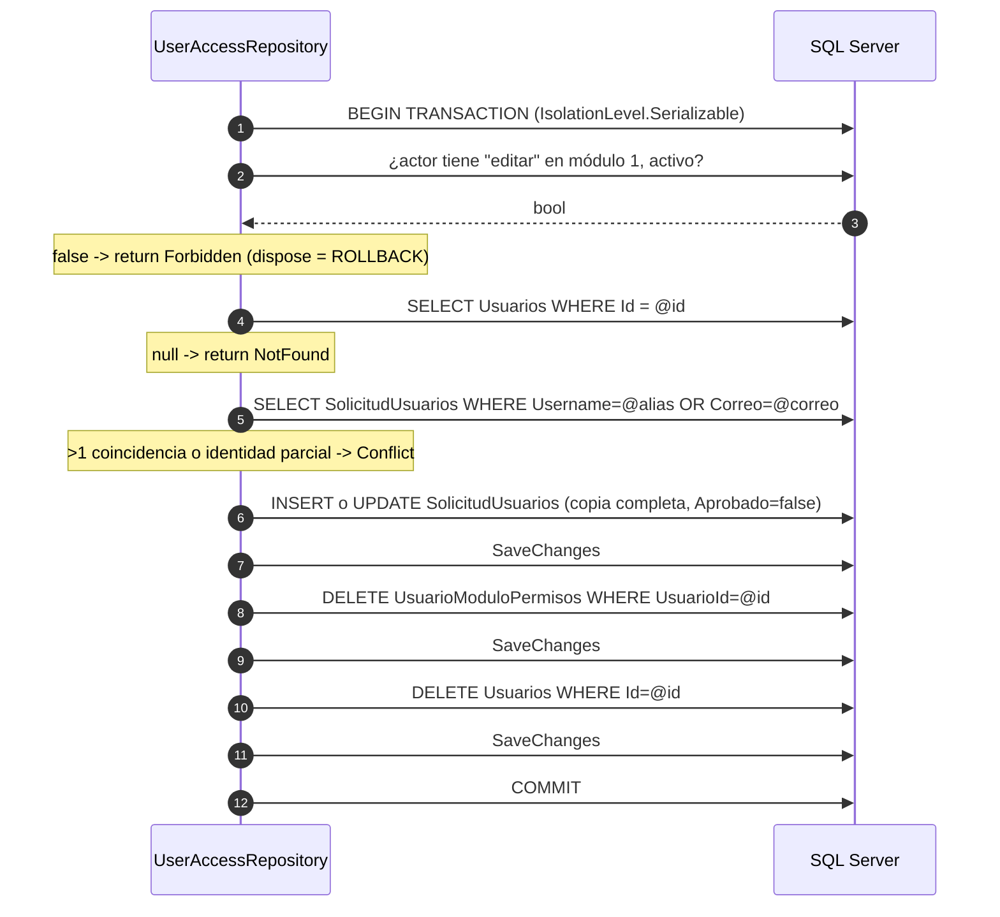

# `UserAccessRepository`

`Backend/Models/Repositories/UserAccessRepository.cs` — **350 líneas, 18 métodos públicos, un único repositorio para todo el dominio**. Depende solo de `UserAccessDbContext` (`:12-17`). Registrado `Scoped` en `Program.cs:41`.

Junto a él vive `Backend/Models/Repositories/UserDeactivationStatus.cs`, un `enum` de 4 valores: `Success`, `NotFound`, `Conflict`, `Forbidden`.

## 1. Inventario completo

| # | Método | Línea | Lee / Escribe | `AsNoTracking` | `CancellationToken` | Transacción | Llamadores |
| --- | --- | --- | --- | --- | --- | --- | --- |
| 1 | `GetUserAuth(string alias)` | `:19` | Lee `Usuarios` | no | no | no | `AuthHandler.Authenticate` |
| 2 | `GetUserKeyAuth(string alias, string correo)` | `:25` | Lee `Usuarios` + `SolicitudUsuarios` | no | no | no | `AuthHandler.Register` |
| 3 | `CreateUserSolicitado(RegisterRequest, hash, fecha)` | `:38` | **Inserta** `SolicitudUsuarios` | — | no | no | `AuthHandler.Register` |
| 4 | `GetAccess(int usuarioId)` | `:61` | Lee puente + `Modulos` + `Areas` + `Permisos` | no | no | no | `AuthHandler.Authenticate` |
| 5 | `GetAreasById(List<int>)` | `:85` | Lee `Areas` activas | no | no | no | **ninguno — código muerto** |
| 6 | `GetUserTypes()` | `:94` | Lee `TipoUsuarios` | no | no | no | `AuthHandler.GetUserTypes` |
| 7 | `GetAreas()` | `:99` | Lee `Areas` activas | no | no | no | `AuthHandler.GetAreas` |
| 8 | `GetPermisos()` | `:108` | Lee `Permisos` (todos) | no | no | no | `AuthHandler.GetAccess` |
| 9 | `GetModulos(List<int>)` | `:116` | Lee `Modulos` activos del área | no | no | no | `AuthHandler.GetModules` |
| 10 | `GetAllUsersRequest()` | `:124` | Lee **todas** las `SolicitudUsuarios` | **no** | no | no | `PlatformHandler.GetAllUsers` |
| 11 | `GetAllRegisteredUsers()` | `:131` | Lee **todos** los `Usuarios` | **sí** | no | no | `PlatformHandler.GetRegisteredUsers` |
| 12 | `DeactivateUser(int, int, ct)` | `:141` | **Inserta/actualiza solicitud, borra puente, BORRA usuario** | no | **sí** | **`Serializable`** | `PlatformHandler.DeactivateUser` |
| 13 | `GetUserByEmail(string)` | `:204` | Lee `Usuarios` (sin filtrar `Activo`) | no | no | no | `AuthHandler.ChangePassword` |
| 14 | `UpdatePassword(Usuario, hash)` | `:210` | **Actualiza** `Usuarios.PasswordHash` | — | no | no | `AuthHandler.ChangePassword` |
| 15 | `UpdateUserRequestComment(int, string?, int, ct)` | `:218` | **Actualiza** `SolicitudUsuarios.comentario` | no | **sí** | no | `PlatformHandler.UpdateComment` |
| 16 | `ApproveUserTransactionAsync(ApproveUserRequest, int, ct)` | `:236` | **Inserta `Usuarios` + puente, marca solicitud** | no | **sí** | **sí (por defecto)** | `PlatformHandler.ApproveUserAsync` |
| 17 | `GetUserPermissionsAdminAsync(int)` | `:299` | Lee `Usuarios` + puente + `Modulos` + `Areas` | **no** | no | no | `PlatformHandler.GetUserPermissionsAsync` |
| 18 | `UpdateUserPermissionsTransactionAsync(int, request, int, ct)` | `:308` | **Borra y reinserta puente, actualiza `TipoId`** | no | **sí** | **sí (por defecto)** | `PlatformHandler.UpdateUserPermissionsAsync` |

**[verificado]** 9 llamadas a `SaveChangesAsync` (líneas 56, 191, 196, 199, 214, 232, 275, 294, 345). 3 transacciones explícitas. **Ninguna consulta usa paginación**; solo `GetAllRegisteredUsers` ordena.

## 2. Lecturas de autenticación y registro

### 2.1 `GetUserAuth` · `:19-23`

```csharp
return await _context.Usuarios.FirstOrDefaultAsync(u => u.Alias == alias && u.Activo);
```

Única puerta de entrada del login. **No acepta correo como alternativa.** Entidad **rastreada** (sin `AsNoTracking`), lo que es innecesario aquí pero inocuo.

### 2.2 `GetUserKeyAuth` · `:25-36` — **defecto lógico verificado**

```csharp
var usuario = await _context.Usuarios
    .FirstOrDefaultAsync(u => u.Alias == alias && u.Correo == correo);     // ← resultado IGNORADO
var usuarioPeticion = await _context.SolicitudUsuarios
    .FirstOrDefaultAsync(u => u.Username == alias || u.Correo == correo);
if (usuarioPeticion != null || usuarioPeticion != null)                   // ← condición DUPLICADA
{
    return true;
}
return false;
```

Dos errores en once líneas:

1. **La variable `usuario` nunca se usa.** La condición repite `usuarioPeticion` dos veces en lugar de comprobar también `usuario`. Resultado: **el registro no detecta colisiones contra usuarios ya existentes**, solo contra otras solicitudes.
2. Aun si la condición fuera correcta, la primera consulta usa **`&&`** (alias *y* correo coinciden a la vez) mientras la segunda usa **`||`**. Con `&&`, alguien que reutilice solo el correo de un usuario existente pasaría el filtro.

**Impacto concreto:** una solicitud puede crearse con el alias o el correo de un usuario ya activo. El `INSERT` en `SolicitudUsuarios` sí funciona (los índices únicos son **por tabla**: `UQ_Solicitud_User`, `UQ_Solicitud_correo`), y el conflicto solo aparece más tarde, al aprobar, donde `ApproveUserTransactionAsync:253-256` sí lo detecta y devuelve `"conflict"`. El usuario final ve un registro "exitoso" que nunca podrá aprobarse. Ver [[be-findings]] y [[db-table-solicitud-usuarios]].

**[verificado]** `dotnet build` no emite advertencia por `usuario` sin usar (CS0219 solo aplica a asignaciones de constantes), así que el compilador no protege contra esto.

### 2.3 `CreateUserSolicitado` · `:38-59`

Construye `SolicitudUsuario` a partir del **DTO HTTP `RegisterRequest`** — la fuga de capas descrita en [[be-architecture]] §5.1.

| Campo asignado | Origen |
| --- | --- |
| `Nombre`, `ApellidoPaterno`, `ApellidoMaterno`, `Sexo`, `Username`, `Correo` | `request.*` sin normalizar (sin `Trim`, sin `ToLower`) |
| `FechaNacimiento` | parámetro `DateOnly` ya parseado por el handler |
| `PasswordHash` | parámetro (hash BCrypt) |
| `Aprobado` | **`false` explícito** |
| `FechaIngreso` | `DateOnly.FromDateTime(DateTime.Now)` — **hora local del servidor**, no UTC |
| `Comentario` | **no se asigna** → se inserta `NULL` |

**[verificado]** `FechaIngreso` se asigna en código aunque la columna tenga `DEFAULT (getdate())`; el valor de EF gana. Usar `DateTime.Now` hace el resultado dependiente del *timezone* del contenedor. **[inferencia]** en un contenedor sin `TZ` configurado esto es UTC, lo que puede desplazar un día respecto a la hora de México.

## 3. Lectura de accesos: `GetAccess` · `:61-83`

```csharp
var permisos = await _context.UsuarioModuloPermisos
    .Include(ump => ump.Modulo).ThenInclude(m => m.Area)
    .Include(ump => ump.Permiso)
    .Where(ump => ump.UsuarioId == usuarioId)
    .ToListAsync();                                   // ← materializa, luego agrupa en memoria

return permisos
    .GroupBy(p => p.Modulo.Area.Nombre)
    .Select(areaGroup => new Dictionary<string, List<Dictionary<int, List<int>>>> { … })
    .ToList();
```

| Aspecto | Hecho |
| --- | --- |
| Forma devuelta | `List<Dictionary<string, List<Dictionary<int, List<int>>>>>` — la estructura de `accesos` del login |
| Agrupación | **En memoria** tras `ToListAsync()`. Correcto (EF no traduce esa forma), pero trae `Modulo`, `Area` y `Permiso` completos |
| Filtro de estado | **No filtra `Modulo.Activo` ni `Area.Activo`** |
| Qué usa de `Permiso` | Solo `p.Permiso.Id`, que ya está en `PermisoId`: **el `Include(ump => ump.Permiso)` es innecesario** y añade un JOIN |
| `AsNoTracking` | ausente: todo el grafo queda rastreado |

**Consecuencia [verificado]:** el JSON de login puede contener módulos o áreas desactivados, mientras que `GET /Auth/areas` y `POST /Auth/modules` **sí** filtran por `Activo`. El frontend termina con una pestaña cuyo nombre no encuentra en el catálogo. Ver [[fe-templates-areas-modules]].

## 4. Catálogos · `:85-122`

| Método | Consulta | Filtro |
| --- | --- | --- |
| `GetAreasById` `:85` | `Areas` donde `Id ∈ lista && Activo` | **sin llamadores: código muerto** |
| `GetUserTypes` `:94` | `TipoUsuarios` completo | ninguno |
| `GetAreas` `:99` | `Areas` donde `Activo` | `Activo` |
| `GetPermisos` `:108` | `Permisos` completo | ninguno (la tabla no tiene `Activo`) |
| `GetModulos` `:116` | `Modulos` donde `AreaId ∈ lista && Activo` | `Activo` del módulo, **no del área** |

**[verificado]** `GetModulos` no comprueba que el área esté activa ni que el solicitante tenga acceso: cualquiera puede enumerar los módulos de cualquier área enviando su id a `POST /Auth/modules`.

## 5. Listados de la plataforma · `:124-139`

```csharp
public async Task<List<SolicitudUsuario>> GetAllUsersRequest()
    => await _context.SolicitudUsuarios.ToListAsync();          // :124-129

public async Task<List<Usuario>> GetAllRegisteredUsers()        // :131-139
    => await _context.Usuarios.AsNoTracking()
        .OrderBy(u => u.Nombre).ThenBy(u => u.ApellidoPaterno).ThenBy(u => u.Id)
        .ToListAsync();
```

| Aspecto | `GetAllUsersRequest` | `GetAllRegisteredUsers` |
| --- | --- | --- |
| Paginación | no | no |
| Orden | **ninguno** (el de SQL Server, no determinista) | `Nombre`, `ApellidoPaterno`, `Id` |
| `AsNoTracking` | **no** | sí |
| Filtro | ninguno: aprobadas y pendientes | ninguno: activos e inactivos |
| Datos sensibles traídos | **`PasswordHash` de todas las solicitudes** | **`PasswordHash` de todos los usuarios** |

**[verificado]** Ambos métodos cargan el `PasswordHash` en memoria aunque el DTO de salida lo excluya. El filtrado ocurre en el handler, no en la consulta: **una proyección `Select` en SQL evitaría mover hashes por la red**. Con `AsNoTracking` ausente en el primero, EF además rastrea cada solicitud, lo que aumenta memoria en listas grandes.

## 6. Cambio de contraseña · `:204-216`

```csharp
public async Task<Usuario?> GetUserByEmail(string correo)
    => await _context.Usuarios.FirstOrDefaultAsync(u => u.Correo == correo);   // sin filtro Activo

public async Task<bool> UpdatePassword(Usuario usuario, string passwordHash)
{
    usuario.PasswordHash = passwordHash;
    _context.Usuarios.Update(usuario);          // marca TODA la entidad como Modified
    var affected = await _context.SaveChangesAsync();
    return affected > 0;
}
```

**[verificado]** `Update(usuario)` sobre una entidad ya rastreada marca **todas** las columnas como modificadas, así que el `UPDATE` generado reescribe todos los campos, no solo `PasswordHash`. Funciona, pero es innecesariamente amplio y abre una ventana de sobrescritura si otra operación modificó la fila entre la lectura y el guardado (**no hay token de concurrencia / `rowversion`**).

## 7. Comentario de solicitud · `:218-234`

```csharp
var canCreate = await _context.UsuarioModuloPermisos.AnyAsync(access =>
    access.UsuarioId == actorId && access.Usuario.Activo &&
    access.ModuloId == 1 && access.Modulo.Activo && access.Modulo.Area.Activo &&
    access.Permiso.Nombre.Trim().ToLower() == "crear", cancellationToken);
if (!canCreate) throw new UnauthorizedAccessException("No tienes permiso para actualizar comentarios.");

var request = await _context.SolicitudUsuarios.FindAsync(new object[] { requestId }, cancellationToken);
if (request == null) return false;
request.Comentario = comment;
_context.SolicitudUsuarios.Update(request);
await _context.SaveChangesAsync(cancellationToken);
return true;
```

| Aspecto | Hecho |
| --- | --- |
| Permiso exigido | **`crear`** — el único método que no exige `editar` |
| Señalización del fallo | **Excepción** (`UnauthorizedAccessException`), no valor de retorno: rompe el patrón de los otros métodos |
| Transacción | **no hay**: es una sola escritura, aceptable |
| Validación del comentario | **ninguna**: longitud, contenido y `null` se aceptan tal cual |
| Estado de la solicitud | no se comprueba: se puede comentar una solicitud ya aprobada |

## 8. Operaciones transaccionales

### 8.1 `DeactivateUser` · `:141-202` — **es un DELETE, no un soft delete**



Pasos verificados:

| Paso | Línea | Detalle |
| --- | --- | --- |
| Transacción | `:144-145` | **`IsolationLevel.Serializable`** — la única con aislamiento explícito |
| Permiso | `:149-153` | `editar` en `ModuloId == 1`, **dentro** de la transacción |
| Búsqueda del usuario | `:155-157` | `SingleOrDefaultAsync` |
| Detección de conflicto | `:160-169` | Busca solicitudes con el mismo `Username` **o** `Correo`; si hay más de una, o alguna coincide solo parcialmente, devuelve `Conflict` |
| Copia a solicitud | `:171-188` | Reutiliza la solicitud existente si la identidad coincide por completo; si no, crea una nueva |
| `Aprobado` | `:187` | se fuerza a `false` |
| `Comentario` | `:188` | se sobrescribe con **`"usario previamente registrado"`** — **con el typo "usario"**, y **pisa cualquier comentario anterior** |
| Borrado de permisos | `:192-196` | `RemoveRange` de todas las filas del puente |
| **Borrado del usuario** | `:198-199` | **`_context.Usuarios.Remove(usuario)`** |
| Commit | `:200` | |

**Impacto concreto [verificado]:**

1. El nombre y el mensaje dicen "baja", pero la fila de `Usuarios` **desaparece**. `Usuario.Activo` **nunca se usa para desactivar**; en la práctica `GET /Platform/Users` devolverá casi siempre `activo: true`.
2. Se pierden el `Id`, la historia y cualquier referencia futura a ese usuario. No hay auditoría de quién ejecutó la baja ni cuándo.
3. La contraseña (hash) queda **duplicada** en `SolicitudUsuarios`, y la cuenta puede "revivirse" aprobando de nuevo esa solicitud, lo que le asigna un **`Id` nuevo** y los permisos que elija el aprobador.
4. Se sobrescribe el comentario que un administrador hubiera escrito en la solicitud coincidente.
5. `Serializable` sobre estas tablas maximiza bloqueos de rango; de ahí que el controller capture el *deadlock* 1205 (`PlatformControler.cs:64-67`).

### 8.2 `ApproveUserTransactionAsync` · `:236-298`

| Paso | Línea | Detalle |
| --- | --- | --- |
| 1. Permiso `editar` mód. 1 | `:239-243` | **FUERA de la transacción** — inconsistente con `DeactivateUser` |
| 2. `BeginTransactionAsync` | `:245` | **Aislamiento por defecto** (`READ COMMITTED` en SQL Server) |
| 3. Buscar solicitud | `:248-250` | `FindAsync`; si es `null` **o ya `Aprobado`** → `"not_found"` |
| 4. Conflicto de identidad | `:253-256` | `Usuarios` con mismo `Alias` **o** `Correo` → `"conflict"` |
| 5. Crear `Usuario` | `:259-275` | Copia 8 campos de la solicitud, aplica `request.TipoId`, `Activo = true`, `SaveChanges` para obtener el `Id` |
| 6. Insertar permisos | `:278-289` | Doble `foreach`: por módulo y por permiso |
| 7. Marcar `Aprobado = true` | `:292` | |
| 8. `SaveChanges` + `Commit` | `:294-295` | |

**Hechos y defectos [verificado]:**

- **El `PasswordHash` se copia tal cual** (`:270`), **sin volver a hashear**: correcto.
- **`FechaIngreso` se hereda de la solicitud** (`:267`), es decir la fecha en que pidió el acceso, no la de aprobación. No queda registro de la fecha de alta real.
- **No valida que `TipoId`, `ModuloId` ni `PermisoId` existan.** La violación de FK (SQL 547) llega al controller y se traduce a `409` con el mensaje *"conflicto con registros únicos"*, engañoso.
- **`request.Permisos` vacío es válido**: crea un usuario que puede autenticarse y no ve ningún módulo.
- **`PermisosIds` con duplicados** provoca violación de la PK compuesta (2627) → `409`.
- **No elimina la solicitud**: la fila queda con `Aprobado = true`, conservando el hash y ocupando los índices únicos `UQ_Solicitud_User`/`UQ_Solicitud_correo` **para siempre**. Ese alias no puede volver a solicitarse.
- **Aislamiento insuficiente [inferencia de alta confianza]:** con `READ COMMITTED`, dos aprobaciones simultáneas de la misma solicitud pueden pasar ambas los pasos 3 y 4. La segunda fallaría en el `INSERT` por `UQ_Usuarios_Alias` (2627) → `409`, así que el daño se limita, pero el resultado depende de una restricción de base de datos, no de la lógica. Contrasta con el `Serializable` de `DeactivateUser`.
- **Sin auditoría:** el `actorId` se usa solo para el chequeo de permiso; no se persiste quién aprobó.
- Retornos tempranos (`:250`, `:256`) salen **sin `Commit`**; el `await using` de `:245` hace `ROLLBACK` al liberar. **[inferencia de alta confianza]** correcto, pero implícito.

### 8.3 `GetUserPermissionsAdminAsync` · `:299-306`

```csharp
return await _context.Usuarios
    .Include(u => u.UsuarioModuloPermisos)
        .ThenInclude(ump => ump.Modulo)
            .ThenInclude(m => m.Area)
    .FirstOrDefaultAsync(u => u.Id == userId);
```

**[verificado]** Sin `AsNoTracking` (innecesario para una lectura), sin filtro de `Activo` (el handler lo aplica), sin `Include(Permiso)` — correcto, porque el handler solo usa `PermisoId`. Trae también el `PasswordHash` del usuario, que el DTO descarta.

### 8.4 `UpdateUserPermissionsTransactionAsync` · `:308-349`

| Paso | Línea | Detalle |
| --- | --- | --- |
| 1. Permiso `editar` mód. 1 | `:310-314` | **Fuera de la transacción** |
| 2. `BeginTransactionAsync` | `:316` | Aislamiento por defecto |
| 3. Cargar usuario + puente | `:318-320` | `Include(u => u.UsuarioModuloPermisos)` |
| 4. `null` o `!Activo` | `:322-323` | → `"not_found"` |
| 5. `RemoveRange` de **todos** los permisos | `:326` | borrado total |
| 6. `usuario.TipoId = request.TipoId` | `:329` | cambia el tipo de usuario |
| 7. Insertar los permisos enviados | `:332-343` | doble `foreach` |
| 8. `SaveChanges` + `Commit` | `:345-346` | un solo `SaveChanges` para borrado e inserción |

**Defectos [verificado]:**

- **Reemplazo total, no diferencial.** `permisos: []` deja al usuario sin ningún acceso. Si ese usuario era el único con `editar` en el módulo 1, **nadie puede volver a otorgar permisos por la API**: bloqueo administrativo irrecuperable sin acceso directo a SQL. Ver [[be-findings]].
- **El actor puede modificarse a sí mismo.** No hay comprobación `userId != actorId` ni jerarquía por `TipoId`: cualquiera con `editar` en módulo 1 puede elevarse o degradar a otros.
- **No valida `TipoId`/`ModuloId`/`PermisoId`.** La violación de FK **no** se traduce en el controller (a diferencia de la aprobación) → `500`.
- `RemoveRange` + `Add` en el mismo `SaveChanges` sobre una PK compuesta puede generar el conflicto de "borrar e insertar la misma clave" si el cliente reenvía un permiso ya existente. **[inferencia]** EF ordena `DELETE` antes de `INSERT` en el mismo `SaveChanges`, así que normalmente funciona, pero es un patrón frágil frente a un *upsert* explícito.
- **Sin auditoría** del cambio de permisos.

## 9. Resumen de riesgos del repositorio

| Riesgo | Ubicación | Gravedad |
| --- | --- | --- |
| Detección de duplicados roto en registro | `:25-36` | Alta |
| "Desactivar" borra físicamente al usuario | `:198-199` | Alta |
| Reescritura total de permisos sin salvaguardas (auto-bloqueo) | `:326` | Alta |
| Autorización implementada en la capa de datos con módulo `1` fijo | `:149`, `:220`, `:239`, `:310` | Alta — ver [[be-authorization-permissions]] |
| Aislamiento inconsistente entre transacciones | `:145` vs `:245`, `:316` | Media |
| Sin auditoría en ninguna operación | todo el archivo | Media |
| Listados sin paginación que cargan hashes | `:124`, `:131` | Media |
| `GetAccess` no filtra módulos/áreas inactivos | `:61-83` | Media |
| `DateTime.Now` (hora local) para `FechaIngreso` | `:52` | Baja |
| Typo `"usario previamente registrado"` | `:188` | Baja |
| `GetAreasById` sin llamadores | `:85` | Baja |

Detalle e impacto en [[be-findings]]. Consultas equivalentes vistas desde la base en [[db-queries-by-feature]].

## Enlaces

- [[be-index]] · [[be-architecture]] · [[be-handlers]] · [[be-controllers]]
- [[be-dbcontext-entities]] · [[be-dto-contracts]] · [[be-authorization-permissions]] · [[be-auth-session]]
- [[be-flows]] · [[be-findings]] · [[be-api-reference]]
- [[db-index]] · [[db-schema-acceso-usuario]] · [[db-relationships]] · [[db-queries-by-feature]]
- [[db-table-usuarios]] · [[db-table-solicitud-usuarios]] · [[db-table-usuario-modulo-permisos]]
- [[fe-api-clients]] · [[fe-templates-areas-modules]]
