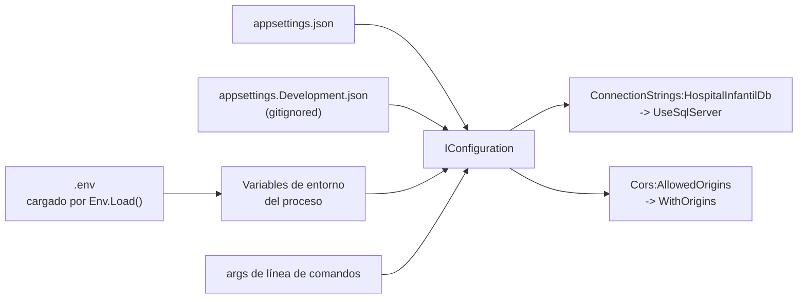

# Arranque, DI y configuración (`Program.cs`)

`Backend/Program.cs` tiene **68 líneas** y usa *top-level statements* (sin clase `Startup`). Es el único punto de composición del sistema. Contexto general en [[be-architecture]].

## 1. Secuencia de arranque verificada

| # | Línea | Qué hace | Nota |
| --- | --- | --- | --- |
| 1 | `Program.cs:8` | `Env.Load()` — DotNetEnv lee `Backend/.env` y lo vuelca a variables de entorno del proceso | Se ejecuta **antes** de `CreateBuilder`, por lo que el proveedor `EnvironmentVariables` ya ve esos valores |
| 2 | `Program.cs:10` | `WebApplication.CreateBuilder(args)` | Cadena de configuración por defecto: `appsettings.json` → `appsettings.{Environment}.json` → user secrets (solo en Development) → variables de entorno → argumentos |
| 3 | `Program.cs:16-19` | Lee `Cors:AllowedOrigins` como `string[]`; si es `null` usa `new[] { "" }` | Ver §4 |
| 4 | `Program.cs:21-30` | Registra la política CORS `FrontendCorsPolicy` | |
| 5 | `Program.cs:32-33` | `AddAuthentication(BearerTokenDefaults.AuthenticationScheme).AddBearerToken(...)` con expiración de **8 horas** | Ver [[be-auth-session]] |
| 6 | `Program.cs:34` | `AddAuthorization()` — sin políticas ni *fallback policy* | |
| 7 | `Program.cs:35` | `AddScoped<SessionTokenService>()` | |
| 8 | `Program.cs:37-39` | `AddControllers()`, `AddSwaggerGen()`, `AddOpenApi()` | Dos generadores de documento a la vez |
| 9 | `Program.cs:41-43` | `AddScoped<UserAccessRepository>()`, `AddScoped<AuthHandler>()`, `AddScoped<PlatformHandler>()` | |
| 10 | `Program.cs:45-50` | `AddDbContext<UserAccessDbContext>` con `UseSqlServer(GetConnectionString("HospitalInfantilDb"))` | Lifetime `Scoped` implícito |
| 11 | `Program.cs:52-57` | `AddDbContext<HumanResourcesDbContext>` con **la misma** cadena de conexión | Dos contextos sobre la misma base, distinto esquema. Ver [[be-dbcontext-entities]] |
| 12 | `Program.cs:59` | `builder.Build()` | |
| 13 | `Program.cs:61-67` | `MapOpenApi()`, `UseSwagger()`, `UseSwaggerUI()` — **el `if (app.Environment.IsDevelopment())` está comentado** | Ver §5 |
| 14 | `Program.cs:70` | `UseCors(FrontendCorsPolicy)` | |
| 15 | `Program.cs:72-73` | `UseAuthentication()`, `UseAuthorization()` | |
| 16 | `Program.cs:74-75` | `MapControllers()`, `Run()` | |

**[verificado]** Lo que **no** ocurre en el arranque: no hay `Database.Migrate()`, `EnsureCreated()`, *seed* de catálogos, `UseHttpsRedirection()`, `UseHsts()`, `AddHealthChecks()`, `UseExceptionHandler()`, `AddProblemDetails()`, `AddRateLimiter()`, `AddOutputCache()`, logging estructurado propio ni `AddHttpContextAccessor()`.

## 2. Tabla completa de registros DI y sus lifetimes

| Servicio | Lifetime | Línea | Quién lo consume | Interfaz |
| --- | --- | --- | --- | --- |
| `SessionTokenService` | **Scoped** | `Program.cs:35` | `AuthHandler` (`AuthHandler.cs:10`) | ninguna (clase concreta) |
| `UserAccessRepository` | **Scoped** | `Program.cs:41` | `AuthHandler`, `PlatformHandler` | ninguna |
| `AuthHandler` | **Scoped** | `Program.cs:42` | `AuthController` | ninguna |
| `PlatformHandler` | **Scoped** | `Program.cs:43` | `PlatformController` | ninguna |
| `UserAccessDbContext` | **Scoped** (por defecto de `AddDbContext`) | `Program.cs:45` | `UserAccessRepository` | ninguna |
| `HumanResourcesDbContext` | **Scoped** (por defecto de `AddDbContext`) | `Program.cs:52` | **nadie todavía** | ninguna |
| `ILogger<PlatformController>` | Singleton (del framework) | implícito | `PlatformController` | `ILogger<T>` |
| `IOptionsMonitor<BearerTokenOptions>` | Singleton (del framework) | implícito por `AddBearerToken` | `SessionTokenService` | sí |

**Consecuencia del grafo Scoped uniforme [verificado]:** en una misma petición HTTP, controller, handler y repositorio comparten **una única instancia de `UserAccessDbContext`**. Por eso funcionan las transacciones que abarcan varios `SaveChangesAsync` en [[be-repository]], y por eso el *change tracker* mantiene coherencia dentro de la petición.

**Dos `DbContext` sobre la misma conexión [verificado]:** desde el 2026-09-19 hay dos contextos registrados con la **misma** cadena `HospitalInfantilDb`, cada uno con sus propias entidades y su propio esquema SQL (`acceso_usuario` y `recursos_humanos`). Al ser instancias distintas tienen *change trackers* independientes: una transacción abierta en uno **no** cubre las escrituras del otro. Si alguna vez hace falta atomicidad entre ambos esquemas, habrá que compartir explícitamente la `DbConnection` y la `DbTransaction`, o unificar los dos contextos en uno.

**[inferencia]** `SessionTokenService` no tiene estado propio (`IOptionsMonitor` es singleton); podría ser `Singleton` sin cambiar el comportamiento. Registrarlo como `Scoped` es inocuo pero innecesario.

**Nota histórica:** el commit `d1b78f8` ("fix: add missing DI registrations for auth and SessionTokenService") corresponde precisamente a las líneas 32-35. Antes de ese commit `AuthHandler` no podía resolverse y **todo `/Auth` fallaba con 500**. Eso confirma que `SessionTokenService` **sí está registrado hoy**.

## 3. Configuración: de dónde sale cada valor



### 3.1 Claves de configuración consumidas por el código

| Clave de configuración | Nombre como variable de entorno | Consumidor | Obligatoria |
| --- | --- | --- | --- |
| `ConnectionStrings:HospitalInfantilDb` | `ConnectionStrings__HospitalInfantilDb` | `Program.cs:48` → EF Core | **Sí.** Sin ella, `UseSqlServer(null)` provoca fallo al abrir la primera conexión |
| `Cors:AllowedOrigins` (array) | `Cors__AllowedOrigins__0`, `Cors__AllowedOrigins__1`, … | `Program.cs:16-19` | No, pero su ausencia rompe el navegador (§4) |
| `ASPNETCORE_ENVIRONMENT` | `ASPNETCORE_ENVIRONMENT` | framework | No |
| `Logging:LogLevel:*` | — | `appsettings.json:2-7` | No |
| `AllowedHosts` | — | `appsettings.json:8`, valor `*` | No |

**[verificado]** Las cuatro variables presentes en `Backend/.env` son, **solo por nombre**: `ASPNETCORE_ENVIRONMENT`, `ConnectionStrings__HospitalInfantilDb`, `Cors__AllowedOrigins__0`, `Cors__AllowedOrigins__1`. **Ningún valor se reproduce en esta bóveda.** `.env` está en `Backend/.gitignore`.

**[verificado]** `Backend/.env` **no define ninguna variable de puerto** (`ASPNETCORE_URLS`, `ASPNETCORE_HTTP_PORTS`, `Kestrel__*`). Esto tiene consecuencias graves en Docker: ver [[be-deployment]] §"Desalineación de puertos".

### 3.2 `appsettings.json` vs `appsettings.Development.json`

| Archivo | Versionado | Contiene |
| --- | --- | --- |
| `Backend/appsettings.json` | Sí | Solo `Logging` y `AllowedHosts: "*"`. **No define conexión ni CORS** |
| `Backend/appsettings.Development.json` | **No** — ignorado en `Backend/.gitignore` | `Logging` y una sección `Cors:AllowedOrigins` con **dos orígenes de desarrollo** (`localhost` y una IP de red privada, ambos en el puerto de Vite) |

**Riesgo [inferencia]:** como `appsettings.Development.json` no está en Git, un clon limpio en entorno Development **no tiene orígenes CORS** hasta que se provee `.env`. En el runner de CI el archivo se copia desde `~/.env.backend`, no desde este JSON. Ver [[be-deployment]].

### 3.3 `Properties/launchSettings.json` (solo desarrollo local)

| Perfil | URLs | Entorno |
| --- | --- | --- |
| `http` | `http://localhost:5196` | Development |
| `https` | `https://localhost:7289` y `http://localhost:5196` | Development |

`launchBrowser: false` en ambos. **[verificado]** `launchSettings.json` **no se usa en contenedor**: Docker ejecuta `dotnet Backend.dll` directamente (ver [[be-deployment]]).

## 4. CORS en detalle

```csharp
// Backend/Program.cs:16-30
var allowedOrigins = builder.Configuration
    .GetSection("Cors:AllowedOrigins")
    .Get<string[]>()
    ?? new[] { "" };

builder.Services.AddCors(options =>
{
    options.AddPolicy(FrontendCorsPolicy, policy =>
    {
        policy.WithOrigins(allowedOrigins).AllowAnyHeader().AllowAnyMethod();
    });
});
```

| Aspecto | Estado |
| --- | --- |
| Política | Una sola, nombrada `FrontendCorsPolicy`, aplicada globalmente en `Program.cs:63` |
| Orígenes | Lista explícita desde configuración. Comparación **exacta** de esquema + host + puerto |
| Cabeceras | `AllowAnyHeader()` — permite `Authorization` y `Content-Type` |
| Métodos | `AllowAnyMethod()` — cubre `PUT` y el *preflight* `OPTIONS` |
| Credenciales | **`AllowCredentials()` NO está configurado** |
| Cabeceras expuestas | ninguna (`WithExposedHeaders` ausente) |

**[verificado]** Que falte `AllowCredentials` **no rompe nada hoy**: el token viaja en la cabecera `Authorization`, no en cookie, y el frontend no usa `credentials: 'include'` (ver [[fe-api-clients]]). Sí bloquearía una migración futura a cookies de sesión.

**Defecto [verificado]** — el *fallback* `new[] { "" }` registra la **cadena vacía como origen permitido**, que nunca coincide con un `Origin` real. Resultado: si `Cors:AllowedOrigins` falta, la API arranca sin error y responde correctamente a `curl`, pero **todo el SPA falla con errores de CORS en el navegador**. No hay log ni aviso. Ver [[be-findings]].

## 5. Swagger y OpenAPI

**[verificado]** Se registran **dos** generadores de documento simultáneamente:

| Mecanismo | Registro | Publicación | Ruta resultante |
| --- | --- | --- | --- |
| `Microsoft.AspNetCore.OpenApi` 10.0.9 | `AddOpenApi()` `Program.cs:39` | `MapOpenApi()` `Program.cs:56` | `/openapi/v1.json` |
| Swashbuckle 10.2.3 | `AddSwaggerGen()` `Program.cs:38` | `UseSwagger()` `Program.cs:58` | `/swagger/v1/swagger.json` |
| Swagger UI | — | `UseSwaggerUI()` `Program.cs:59` | `/swagger` |

**Riesgo [verificado]:** el bloque `if (app.Environment.IsDevelopment())` está **comentado** en `Program.cs:54-55` y `:60`. Por lo tanto **Swagger UI y ambos documentos OpenAPI se publican también en producción**, exponiendo el inventario completo de rutas y esquemas sin autenticación. Ver [[be-findings]].

**[verificado]** No hay configuración de esquema de seguridad en Swagger (`AddSecurityDefinition`/`AddSecurityRequirement`), así que la UI de Swagger **no ofrece un campo para pegar el bearer token**: los 5 endpoints protegidos no se pueden probar desde `/swagger` sin herramienta externa. No hay `XML comments`, `[ProducesResponseType]` ni `[Tags]`, por lo que el documento no describe los códigos de error ni los tipos de respuesta reales.

## 6. Autenticación y autorización configuradas

```csharp
// Backend/Program.cs:32-34
builder.Services.AddAuthentication(BearerTokenDefaults.AuthenticationScheme)
    .AddBearerToken(options => options.BearerTokenExpiration = TimeSpan.FromHours(8));
builder.Services.AddAuthorization();
```

- **[verificado]** El esquema es `BearerTokenDefaults.AuthenticationScheme` (token **opaco** de ASP.NET Core, no JWT). No hay `AddJwtBearer`, ni clave de firma, ni *issuer*/*audience*.
- **[verificado]** `AddAuthorization()` se llama **sin** `FallbackPolicy` ni `DefaultPolicy` personalizada. Por eso `UseAuthorization()` **no protege nada por sí solo**: solo actúan los `[Authorize]` puestos en acciones concretas.
- **[verificado]** No se llama a `MapIdentityApi<T>()`, así que **no existen** los endpoints `/refresh`, `/logout` ni `/manage/info` que `AddBearerToken` suele acompañar.

Detalle completo en [[be-auth-session]].

## 7. Dependencias NuGet declaradas

`Backend/Backend.csproj`:

| Paquete | Versión | Uso real en el código |
| --- | --- | --- |
| `BCrypt.Net-Next` | 4.2.0 | `AuthHandler.cs:25,60,80` — `Verify` y `HashPassword` |
| `DotNetEnv` | 3.2.0 | `Program.cs:8` — `Env.Load()` |
| `Microsoft.AspNetCore.OpenApi` | 10.0.9 | `AddOpenApi` / `MapOpenApi` |
| `Microsoft.EntityFrameworkCore.SqlServer` | 10.0.10 | `UseSqlServer`, y `Microsoft.Data.SqlClient.SqlException` en `PlatformControler.cs:5` |
| `Microsoft.EntityFrameworkCore.Design` | 10.0.10 | `PrivateAssets` — solo herramientas de diseño |
| `Microsoft.EntityFrameworkCore.Tools` | 10.0.10 | `PrivateAssets` — solo herramientas |
| `Swashbuckle.AspNetCore` | 10.2.3 | `AddSwaggerGen` / `UseSwagger` / `UseSwaggerUI` |

**[verificado]** `TargetFramework=net10.0`, `Nullable=enable`, `ImplicitUsings=enable`, `UserSecretsId` presente (un GUID identificador, **no es una credencial**).

**[verificado]** La compilación local del 2026-09-18 (`dotnet build`) termina con **0 advertencias y 0 errores**.

## 8. Al agregar un servicio nuevo

1. Crear la clase en `Handlers/` (caso de uso) o extender `UserAccessRepository` (acceso a datos).
2. Registrarla en `Program.cs` junto a las líneas 41-43 con `AddScoped` — **si se omite, la acción del controller devuelve 500 al resolver el controller**, que es exactamente el bug corregido en `d1b78f8`.
3. Mantener `Scoped` para todo lo que toque `UserAccessDbContext`: inyectar un `DbContext` Scoped en un servicio Singleton lanza `InvalidOperationException` al arrancar.
4. Si la operación debe estar protegida, añadir `[Authorize]` explícitamente: **no hay política global**.

## Enlaces

- [[be-index]] · [[be-architecture]] · [[be-auth-session]] · [[be-authorization-permissions]]
- [[be-controllers]] · [[be-handlers]] · [[be-repository]] · [[be-dbcontext-entities]]
- [[be-api-reference]] · [[be-deployment]] · [[be-findings]]
- [[db-infrastructure]] · [[db-index]]
- [[fe-api-clients]] · [[fe-session-state]] · [[architecture-overview]]
