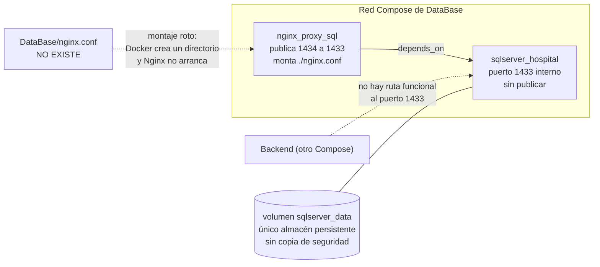

# Infraestructura de datos

Volver al índice: [[db-index]] · Aprovisionamiento del esquema: [[db-scripts-and-migrations]]

## Contenido real de `DataBase/`

```
DataBase/
├── docker-compose.yml     ← único archivo versionado
└── scripts/
    └── Init.sql           ← presente en disco, SIN seguimiento en Git
```

Verificado el 2026-09-18 y confirmado contra Git: `git ls-files DataBase` devuelve **únicamente** `DataBase/docker-compose.yml`. `git status` reporta `?? DataBase/scripts/`, es decir que ni la carpeta ni `Init.sql` están versionados.

`Init.sql` es un script de creación de esquemas, tablas y seed de catálogos que apareció en el árbol de trabajo mientras se redactaba esta bóveda. Ningún servicio de Compose y ningún paso de CI/CD lo ejecuta: su aplicación es manual. Su contenido, sus discrepancias con el mapeo EF y los riesgos que introduce se analizan en [[db-scripts-and-migrations]]. Contiene un hash de contraseña y datos personales reales, por lo que **no debe versionarse en su estado actual**.

Los dos archivos que `.agent/CONTEXT.md` da por existentes siguen **sin existir** (el script de `comentario` no es `Init.sql`: éste no crea esa columna):

| Archivo citado en el análisis previo | Estado real |
| --- | --- |
| `DataBase/useraccess_schema.png` | **No existe** en el árbol de trabajo ni en ningún commit del historial. Nunca fue versionado; ese documento lo describe como "sin seguimiento en Git". La referencia visual del esquema ya no está disponible |
| `DataBase/scripts/20260908_add_comentario_solicitud_usuarios.sql` | **No existe** en el árbol de trabajo ni en el historial (`git log --all --diff-filter=D -- DataBase` no devuelve ningún borrado). La carpeta `scripts/` está vacía |

Consecuencia directa: **la referencia gráfica del esquema y el único cambio de esquema documentado han desaparecido**, dejando el mapeo EF como fuente de verdad exclusiva. Ver [[db-scripts-and-migrations]] y [[db-table-solicitud-usuarios]].

## `DataBase/docker-compose.yml`

Dos servicios, un volumen, sin red declarada (usa la red por defecto del proyecto Compose), sin `healthcheck` y sin paso de aprovisionamiento.

### Servicio `sqlserver`

| Clave | Valor |
| --- | --- |
| `image` | `mcr.microsoft.com/mssql/server:2022-latest` |
| `container_name` | `sqlserver_hospital` |
| `restart` | `always` |
| `environment` | `ACCEPT_EULA: "Y"` y **`MSSQL_SA_PASSWORD`** |
| `volumes` | `sqlserver_data:/var/opt/mssql` |
| `ports` | **ninguno**: el 1433 no se publica en el host |

Observaciones:

- **La etiqueta `2022-latest` es móvil.** Un `docker compose pull` puede traer una versión acumulativa distinta. Para una base de datos conviene fijar una etiqueta inmutable.
- **No se declara `MSSQL_PID`**, así que se usa la edición por defecto de la imagen (Developer). Usarla en un entorno productivo real es una cuestión de licencia a resolver fuera de este repositorio.
- **El volumen nombrado `sqlserver_data` es el único lugar donde persisten los datos.** Un `docker compose down -v` los destruye, y como no hay script de creación ni seed ([[db-scripts-and-migrations]]), la base **no se puede reconstruir desde el repositorio**. Es el riesgo operativo más alto de esta capa.
- **No hay copia de seguridad, ni tarea programada, ni volumen de backups.** Ningún archivo del repositorio ejecuta `BACKUP DATABASE` ni exporta nada.
- **Sin `healthcheck`**: `depends_on` del proxy solo espera al arranque del contenedor, no a que SQL Server acepte conexiones.
- **Sin punto de entrada de inicialización.** La imagen de SQL Server no ejecuta automáticamente los `.sql` de una carpeta (a diferencia de las imágenes de MySQL o PostgreSQL), y el Compose no monta `./scripts` ni define ningún comando que aplique `Init.sql`. Tampoco se crea la base `hospital_infantil`, que ese script da por existente. El aprovisionamiento es enteramente manual. Ver [[db-scripts-and-migrations]].

### Riesgo: credencial literal versionada

`DataBase/docker-compose.yml:8` define **`MSSQL_SA_PASSWORD` con un valor literal escrito en el archivo versionado**. El valor no se reproduce en esta documentación de forma deliberada.

| Aspecto | Evaluación |
| --- | --- |
| Qué es | La contraseña de la cuenta `sa`, es decir la credencial de administrador total del motor |
| Dónde está | En Git, en texto claro, en todos los clones y en todo el historial |
| Impacto | Cualquier persona con acceso al repositorio tiene la contraseña de `sa`. Si la instancia real se creó con ella y sigue vigente, equivale a acceso administrativo completo a datos personales |
| Agravante | Se trata de un valor corto y de patrón muy común, del tipo que aparece en cualquier diccionario de ataque |
| Acción | Tratarla como **credencial comprometida**: rotarla en la instancia real, externalizarla a un archivo `.env` no versionado o a un secreto de Docker, y referenciarla en Compose solo por nombre de variable. Rotarla no borra el valor del historial de Git |

El resto de la configuración sensible **sí** está fuera del repositorio y se referencia solo por nombre de variable:

| Variable | Consumidor | Observación |
| --- | --- | --- |
| `ConnectionStrings__HospitalInfantilDb` | Backend, leída como `ConnectionStrings:HospitalInfantilDb` en `Backend/Program.cs:48` | Único punto de configuración de la base. Vive en `Backend/.env`, no versionado, cargado con `Env.Load()` (`Program.cs:8`). El nombre de base al que debe apuntar es **`hospital_infantil`**, según `DataBase/scripts/Init.sql:1` |
| `Cors__AllowedOrigins__0`, `__1` | Backend | Sin relación con la base de datos |
| `ASPNETCORE_ENVIRONMENT` | Backend | — |

Si la cadena de conexión no está definida, `GetConnectionString` devuelve `null` y `UseSqlServer(null)` **no falla en el arranque**: el error aparece en la primera consulta, como un 500 en tiempo de petición en lugar de un fallo de arranque claro. No hay validación de configuración ni `healthcheck` de base de datos en el backend. Ver [[be-deployment]].

### Servicio `nginx_sql`

| Clave | Valor |
| --- | --- |
| `image` | `nginx:latest` |
| `container_name` | `nginx_proxy_sql` |
| `restart` | `always` |
| `ports` | `1434:1433` |
| `volumes` | `./nginx.conf:/etc/nginx/nginx.conf:ro` |
| `depends_on` | `sqlserver` |

**`DataBase/nginx.conf` no existe en el repositorio.** Verificado: el único archivo de `DataBase/` es el propio Compose.

Consecuencias concretas de ese montaje roto:

1. Docker, al montar una ruta de origen inexistente como bind mount, **crea un directorio vacío** en el host con ese nombre.
2. Nginx recibe entonces un **directorio** donde espera un archivo de configuración, no arranca, y con `restart: always` entra en bucle de reinicio.
3. Como es el único servicio que publica puertos, **este Compose tal cual no expone SQL Server a nadie**: `sqlserver` no publica el 1433 y el proxy no llega a funcionar. Un backend que corra fuera de esta red Compose no puede conectarse.
4. Aunque el archivo existiera, un proxy TCP a SQL Server exige un bloque `stream { ... }` de nivel superior, no `http { ... }`. La imagen oficial de Nginx incluye `ngx_stream_module`, pero **la viabilidad concreta de este proxy no es verificable desde el repositorio** porque falta su configuración.

`Frontend/nginx.conf` **sí** existe, pero es un servidor HTTP para la SPA (fallback de `index.html` y caché de `/assets/`): no cubre en absoluto esta ausencia.



## Topología: tres Compose independientes, sin red común

| Archivo | Servicios | Publica |
| --- | --- | --- |
| `DataBase/docker-compose.yml` | `sqlserver`, `nginx_sql` | 1434 (si el proxy funcionara) |
| `Backend/docker-compose.yml` | API | 8081 → 5000 por defecto |
| `Frontend/docker-compose.yml` | Nginx con la SPA | 5173 → 80 por defecto |

No existe un Compose unificado ni una red externa compartida declarada. Cada proyecto Compose crea su propia red bridge, por lo que **el contenedor del backend no resuelve el nombre `sqlserver`** y debe alcanzar la base por dirección de host y puerto publicado. Como el proxy no funciona y `sqlserver` no publica puertos, ese camino no está operativo con los archivos del repositorio tal cual. La conexión real que usa el entorno del usuario está en `Backend/.env`, no versionado, y **no es verificable desde el repositorio**.

## Despliegue: la base de datos nunca se despliega

`.github/workflows/deploy-devel.yml` se activa con push a `devel` o `main` en un runner `self-hosted` y ejecuta `docker compose up -d --build` **solo** para `Backend/` y `Frontend/` (pasos "Desplegar Backend (C#)" y "Desplegar Frontend (React)", sin ningún paso equivalente para `DataBase/`).

Implicaciones para esta capa:

- **El ciclo de despliegue no aplica ningún cambio de esquema.** Un cambio en las entidades o en el mapeo EF llega a producción sin que las tablas cambien. La discordancia se manifiesta como error SQL en tiempo de ejecución.
- **El Compose de la base no se ejecuta nunca en CI/CD**: su estado real (roto por `nginx.conf`) no se detecta.
- No hay comprobación de salud posterior al despliegue ni reversión. Ver [[be-deployment]].

## Checklist antes de tocar infraestructura de datos

1. Confirmar dónde vive realmente la instancia conectada y si se creó con este Compose. El usuario indicó que existe una base conectada; **este Compose, por sí solo, no la reproduce**.
2. Rotar y externalizar `MSSQL_SA_PASSWORD`; dejar de versionar el valor.
3. Crear `DataBase/nginx.conf` con un bloque `stream`, o eliminar el servicio `nginx_sql` y publicar `1433` en `sqlserver` con la restricción de red adecuada.
4. Añadir `healthcheck` a `sqlserver` y hacer que `depends_on` lo espere (`condition: service_healthy`).
5. Fijar una etiqueta de imagen inmutable.
6. Definir copia de seguridad del volumen `sqlserver_data` **antes** de cualquier operación destructiva.
7. Resolver el aprovisionamiento del esquema ([[db-scripts-and-migrations]]) antes de asumir que un entorno nuevo puede arrancar.

## Enlaces

- [[db-index]] · [[db-scripts-and-migrations]] · [[db-schema-acceso-usuario]] · [[db-findings]] · [[db-queries-by-feature]]
- Backend: [[be-deployment]] · [[be-index]] · [[be-dbcontext-entities]]
- Arquitectura: [[architecture-overview]]
