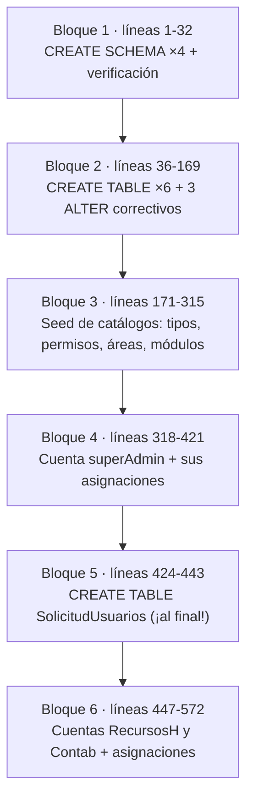
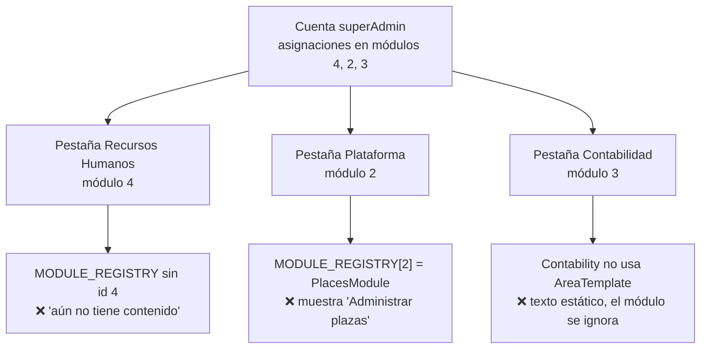

# `Init.sql` — análisis del script de creación y seed

Lectura completa y anotada de `DataBase/scripts/Init.sql` (572 líneas, ~13 KB). Es el único artefacto del repositorio que intenta **construir el esquema desde cero**, y la única fuente versionable de detalles físicos (IDENTITY, nombres de restricción, defaults). También es el artefacto con más defectos del repositorio.

Panorama general en [[db-scripts-and-migrations]]; el esquema tal como lo entiende la aplicación está en [[db-schema-acceso-usuario]].

## 1. Estado y procedencia del archivo

| Aspecto | Hecho verificado |
| --- | --- |
| Ruta | `DataBase/scripts/Init.sql` |
| Seguimiento en Git | **No versionado.** `git status` lo reporta como `?? DataBase/scripts/`; `git ls-files DataBase` solo devuelve `docker-compose.yml` |
| Aparición | Apareció en el árbol de trabajo el 2026-09-18, después de iniciar esta documentación. No está en el historial de Git |
| Quién lo ejecuta | **Nadie.** Ni `DataBase/docker-compose.yml`, ni los Dockerfiles, ni `.github/workflows/deploy-devel.yml` lo invocan. Ver [[db-infrastructure]] |

> [!warning] Este script no describe la instancia conectada
> Que el script exista **no** significa que la base `hospital_infantil` real se haya creado con él. Los identificadores que se deducen más abajo son **inferencias del orden de los `INSERT`** sobre columnas `IDENTITY`, no lecturas de `INFORMATION_SCHEMA`. Nada de este documento se comprobó ejecutando consultas contra la base real.

> [!danger] Contiene datos sensibles reales
> Las líneas 322 y 450 declaran el **mismo hash BCrypt literal**, compartido por las tres cuentas que el script inserta. Las líneas 347-354 contienen el **nombre completo y el correo personal reales** de una persona identificable, y las líneas 479-486 y 511-518 repiten un segundo nombre real. Ninguno de esos valores se reproduce en esta documentación. El archivo está **a un `git add` de entrar en el historial de Git de forma permanente.** Tratamiento recomendado en la sección 8.

## 2. Estructura del script

No es un script lineal: son **varios bloques pegados**, cada uno con su propio `USE [hospital_infantil]`, escritos en momentos distintos y en un orden que no respeta las dependencias del esquema. Agrupados por lote de `USE` quedan seis tramos (en [[db-scripts-and-migrations]] se resumen como cinco bloques lógicos, fundiendo los dos de creación de tablas):

Detalles de forma que delatan su origen como cuaderno de trabajo, no como script de aprovisionamiento:

- **No hay `CREATE DATABASE`.** Empieza con `USE [hospital_infantil]` (línea 1), así que la base debe existir antes. Compose no la crea. Ver [[db-infrastructure]].
- **No hay transacción**: cero `BEGIN TRAN`, cero `XACT_ABORT`. Un fallo a media ejecución deja la base a medio construir, sin rollback.
- **No es idempotente**: al reejecutarlo, los `CREATE SCHEMA` y `CREATE TABLE` fallan por objeto existente y los `INSERT` violan las restricciones `UNIQUE`. No hay `IF NOT EXISTS` en ninguna parte.
- **Consultas de depuración incrustadas** en el flujo: `select * from acceso_usuario.Areas` (línea 301), `select * from acceso_usuario.Modulos` y `Areas` (líneas 404-405), más tres `SELECT` de verificación (24-31, 407-420, 559-571). Son inofensivas pero confirman que el archivo se escribió ejecutando a mano.
- **`SolicitudUsuarios` se crea en la línea 424**, después de insertar usuarios y permisos. Funciona solo porque ninguna FK apunta a ella.

## 3. Esquemas creados

Líneas 8-18 crean **cuatro** esquemas:

| Esquema | Objetos que el script le crea |
| --- | --- |
| `acceso_usuario` | Las 7 tablas del dominio |
| `core` | **Ninguno** |
| `recursos_humanos` | **Ninguno** |
| `contabilidad` | **Ninguno** |

Los tres esquemas vacíos son **reserva de espacio de nombres para dominios no implementados**. Es el único indicio en el repositorio de cómo se pensaba particionar el futuro modelo de negocio, y es coherente con que Recursos Humanos y Contabilidad sean placeholders en la aplicación (ver [[architecture-overview]]). No infieras tablas a partir de estos nombres: no existen.

## 4. DDL: el script frente al mapeo EF

Las seis tablas del bloque 2 más `SolicitudUsuarios` del bloque 5. Comparadas contra `Backend/Data/UserAccessDbContext.cs` y las entidades ([[be-dbcontext-entities]]):

| Tabla | Líneas | PK | Restricciones | ¿Coincide con EF? |
| --- | --- | --- | --- | --- |
| `TipoUsuario` | 44-50 | `PK_TipoUsuario (Id)`, `smallint IDENTITY` | ninguna `UNIQUE` | Sí, salvo que **falta índice único en `NivelUsuario`** (§6.4) |
| `Usuarios` | 57-79 | `PK_Usuarios (Id)` | `FK_Usuarios_TipoUsuario`, `UQ_Usuarios_Alias`, `UQ_Usuarios_Correo`, `DEFAULT GETDATE()` en `FechaIngreso`, `DEFAULT 1` en `Activo` | Sí. Ver [[db-table-usuarios]] |
| `Areas` | 86-94 | `PK_Areas (Id)` | `UQ_Areas_Nombre`, `DEFAULT 1` en `Activo` | Sí. Ver [[db-table-areas]] |
| `Modulos` | 101-115 | `PK_Modulos (Id)` | `FK_Modulos_Areas`, `UQ_Modulos_Area_Nombre`, `DEFAULT 1` | Sí. Ver [[db-table-modulos]] |
| `Permisos` | 122-129 | `PK_Permisos (Id)` | `UQ_Permisos_Nombre` | Sí. Ver [[db-table-permisos]] |
| `UsuarioModuloPermisos` | 137-156 | `PK_UsuarioModuloPermisos (UsuarioId, ModuloId, PermisoId)` | las 3 FK con nombre explícito | Sí, **incluido el orden de la PK compuesta**. Ver [[db-table-usuario-modulo-permisos]] |
| `SolicitudUsuarios` | 424-438 | **NINGUNA** | solo `UQ_Solicitud_User` y `UQ_Solicitud_correo` | **No**: sin PK y sin `comentario` (§6.1 y §6.2) |

Las cinco FK se declaran **sin cláusula `ON DELETE`**, o sea `NO ACTION` en SQL. EF configura `DeleteBehavior.ClientSetNull`, que actúa en el lado del cliente; no hay cascadas en ninguno de los dos lados. Coherente. Ver [[db-relationships]].

### Los tres `ALTER` correctivos

Las líneas 159-169 corrigen decisiones del propio script, inmediatamente después de crear las tablas y antes de insertar:

| Línea | Cambio | Lectura |
| --- | --- | --- |
| 159-160 | `TipoUsuario.NivelUsuario`: `SMALLINT` → `VARCHAR(15) NOT NULL` | El nivel se concibió como código numérico y acabó siendo texto. Explica por qué hoy `NivelUsuario` es el nombre del rol |
| 163-164 | `TipoUsuario.Descripcion`: `VARCHAR(20) NULL` → `NVARCHAR(150) NOT NULL` | 20 caracteres eran insuficientes; las descripciones del seed llegan a ~130 |
| 167-168 | `Permisos.Descripcion`: `NVARCHAR(50) NULL` → `NVARCHAR(150) NOT NULL` | Igual |

El estado **final** de las tres columnas sí coincide con las entidades C#. Si alguna vez se reescribe este script, conviene plegar estos `ALTER` en los `CREATE TABLE`.

## 5. Seed de catálogos e identificadores deducidos

Todos los `Id` siguientes se **deducen del orden de los `VALUES`** sobre `IDENTITY(1,1)`. El script nunca los fija explícitamente, y formalmente SQL Server no garantiza ese orden en un `INSERT` de varias filas, aunque en la práctica se respeta.

**`TipoUsuario`** — líneas 179-201, cinco niveles:

| Id deducido | `NivelUsuario` |
| --- | --- |
| 1 | `super_admin` |
| 2 | `admin` |
| 3 | `general` |
| 4 | `supervisor` |
| 5 | `inicial` |

**`Permisos`** — líneas 207-225, cuatro permisos. Estos ids importan mucho porque el frontend los cruza con nombres y el backend compara por nombre literal:

| Id deducido | `Nombre` |
| --- | --- |
| 1 | `ver` |
| 2 | `editar` |
| 3 | `crear` |
| 4 | `eliminar` |

Confirma que el permiso `ver` es el id `1`, que es exactamente lo que el modal de activación fuerza como marcado y deshabilitado (ver [[fe-module-accounts]]). También confirma que existen filas `editar` y `crear`, los dos literales que el repositorio compara a mano (ver [[be-authorization-permissions]]).

**`Areas`** — líneas 231-253, cuatro áreas. Nótese que los nombres van **en minúsculas**, lo que encaja con el `TEMPLATE_REGISTRY` del frontend, que normaliza a minúsculas:

| Id deducido | `Nombre` | `Activo` | ¿Tiene componente? |
| --- | --- | --- | --- |
| 1 | `plataforma` | 1 | Sí, `Platform` |
| 2 | `recursos humanos` | 1 | Sí, `HumanResources` |
| 3 | `contabilidad` | 1 | Sí, `Contability` |
| 4 | `almacen` | **0** | **No.** Inofensivo hoy porque `GetAreas()` filtra por activas |

**`Modulos`** — líneas 259-315, cuatro módulos en **cuatro `INSERT` separados**, cada uno resolviendo su `AreaId` con una subconsulta por nombre de área (buen detalle: no cablea ids de área):

| Id deducido | `Nombre` | Área | Componente que montaría el frontend |
| --- | --- | --- | --- |
| 1 | `configuracion de cuentas` | plataforma | `AccountsModule` ✅ correcto |
| 2 | `Administrar Permisos` | plataforma | `PlacesModule` ❌ **monta plazas** |
| 3 | `Complemento de Pago` | contabilidad | `PermitsModule` ❌ y además Contabilidad no usa `AreaTemplate`, así que nunca se renderiza |
| 4 | `Administrar Plazas` | recursos humanos | **ninguno** ❌ pestaña sin contenido |

Solo **1 de 4** módulos resuelve al componente correcto. Análisis en §6.3 y en [[fe-templates-areas-modules]].

## 6. Defectos del script

### 6.1 `SolicitudUsuarios` se crea sin `PRIMARY KEY` · Crítica

`Init.sql:424-438` declara `Id INT IDENTITY(1,1) NOT NULL` y solo las dos restricciones `UNIQUE`. **No hay `CONSTRAINT ... PRIMARY KEY`.** Es la única tabla del esquema sin PK, y muy probablemente la razón de que EF la declare a mano con `HasKey(e => e.Id)` (`Backend/Data/UserAccessDbContext.cs:72`) en lugar de por convención, como hace con las demás.

Consecuencias: sin PK no hay índice agrupado ni garantía de unicidad de `Id`, y el seguimiento de entidades de EF opera sobre una clave que el motor no impone. Detalle en [[db-table-solicitud-usuarios]].

### 6.2 La columna `comentario` no se crea en ningún sitio · Crítica

El `CREATE TABLE` de `SolicitudUsuarios` termina en `PasswordHash`, y el único `ALTER` posterior (líneas 441-442) añade `Aprobado BIT NOT NULL DEFAULT 0`. **`comentario` no aparece.**

Sin embargo la entidad y el mapeo EF sí la declaran, y los DTO ya la exponen ([[be-dto-contracts]]). Una base levantada con este script hace fallar **toda** consulta a `SolicitudUsuarios` con `Invalid column name 'comentario'`, incluido el registro público de `POST /Auth/register`. El script de cambio incremental que `.agent/CONTEXT.md` describía (`20260908_add_comentario_solicitud_usuarios.sql`) **no existe** ni en el árbol ni en el historial.

### 6.3 El seed deja el sistema sin nadie capaz de administrar cuentas · Crítica

Este es el defecto más importante, porque inutiliza el producto entero.

El bloque 4 inserta la cuenta `superAdmin` con tipo `super_admin` y a continuación, bajo el comentario **«Asignar los 4 permisos al ModuloId 1»** (línea 362), ejecuta tres `INSERT` con los literales `ModuloId` **4**, **2** y **3** (líneas 372, 385, 398). El comentario dice 1; el código nunca inserta 1.

Y las cinco operaciones de escritura del backend exigen literalmente una asignación sobre `ModuloId == 1` (`Backend/Models/Repositories/UserAccessRepository.cs:151,222,241,312`). Resultado: **la cuenta de superadministrador recibe 403 al aprobar solicitudes, dar de baja usuarios, comentar y actualizar permisos.** Nadie más tiene asignaciones. El sistema queda sin administración y sin forma de arreglarlo desde la interfaz, porque el único camino para conceder permisos es… el módulo al que nadie puede entrar. Ver [[be-authorization-permissions]] y [[db-findings]].

La cadena completa de lo que vería esa cuenta al entrar, combinando el seed con los registros del frontend:

Verificado: `Frontend/src/templates/platform/platform.jsx:8` y `humanResources.jsx:8` pasan `areaKey` a `AreaTemplate`, mientras `Frontend/src/templates/contability/contability.jsx:1` es un componente simple sin `AreaTemplate`. Es decir, la cuenta sembrada **no alcanza el módulo de cuentas por ninguna ruta de interfaz**.

### 6.4 Un lote falla por `ModuloId` inexistente · Alta

El bloque 6 asigna permisos al usuario `Contab` sobre `ModuloId 1002` (línea 550), bajo el comentario «Asignar los 4 permisos al usuario Contab (ModuloId 1002)». **No existe ningún módulo 1002**: el script solo crea los ids 1 a 4. Ese `INSERT` falla con error 547 (violación de FK).

Como el script **no es transaccional**, todo lo anterior —las dos cuentas nuevas y las asignaciones de `RecursosH`— ya está persistido. La ejecución termina en un estado a medias, y el usuario `Contab` queda creado pero sin ningún permiso.

### 6.5 `RecursosH` recibe un módulo de otra área · Media

Línea 535: al usuario `RecursosH` se le asigna `ModuloId 2`, que según el propio seed es `Administrar Permisos` del área **plataforma**, no un módulo de recursos humanos. Esa cuenta acaba con una pestaña en Plataforma que renderiza el placeholder de plazas, y sin nada en su propia área.

### 6.6 Una contraseña compartida por tres cuentas · Crítica

Las líneas 322 y 450 declaran el mismo hash BCrypt literal y las tres cuentas lo reutilizan (`superAdmin`, `RecursosH`, `Contab`). Una sola contraseña conocida abre las tres. Súmese que el hash está en texto plano en un archivo del árbol de trabajo, y que `POST /Auth/changePassword` permite cambiar la contraseña de cualquier correo sin prueba de titularidad ([[be-auth-session]]).

### 6.7 `@UsuarioId` se calcula y se ignora · Baja

Línea 359: `SET @UsuarioId = SCOPE_IDENTITY();` captura el id de la cuenta recién insertada, pero los tres `INSERT` siguientes usan el literal `1` como `UsuarioId` (líneas 371, 384, 397). La variable nunca se lee. Además el `GO` de la línea 376 termina el lote y destruiría su ámbito de todos modos. El script solo funciona porque asume que `superAdmin` será el usuario número 1 — cierto en una base recién creada, falso en cualquier otra.

### 6.8 Falta el índice único de `TipoUsuario.NivelUsuario` · Media

Ninguna restricción `UNIQUE` protege `NivelUsuario`, a diferencia del resto de catálogos. `GET /Auth/userTypes` construye un diccionario con el nombre del nivel como clave y **falla con 500 ante un duplicado**. El seed no dispara el problema porque sus cinco niveles son distintos, pero nada impide insertar un sexto repetido. Ver [[db-table-tipo-usuario]].

### Resumen priorizado

| # | Gravedad | Defecto | Efecto si se ejecuta el script tal cual |
| --- | --- | --- | --- |
| 6.3 | Crítica | `super_admin` sin permisos sobre `ModuloId 1` | Sistema sin administración, irrecuperable desde la interfaz |
| 6.2 | Crítica | Falta la columna `comentario` | Toda consulta a `SolicitudUsuarios` falla, incluido el registro público |
| 6.6 | Crítica | Hash real compartido por 3 cuentas, en el árbol | Compromiso de credenciales y de datos personales |
| 6.1 | Crítica | `SolicitudUsuarios` sin PK | Sin unicidad ni índice agrupado; divergencia con EF |
| 6.4 | Alta | `ModuloId 1002` inexistente y sin transacción | El script muere a medias y deja la base inconsistente |
| 6.5 | Media | `RecursosH` con módulo de otra área | Cuenta con acceso incoherente |
| 6.8 | Media | Sin único en `NivelUsuario` | `GET /Auth/userTypes` puede responder 500 |
| 6.7 | Baja | `@UsuarioId` calculado y no usado | Solo funciona si la base está recién creada |

## 7. Lo que el script confirma y lo que no

**Respalda** (es su mayor valor): los nombres explícitos de las restricciones, que los `Id` son `IDENTITY(1,1)`, que `TipoUsuario.Id` es `smallint`, los `DEFAULT GETDATE()` y `DEFAULT 1`, el orden exacto de la PK compuesta, la ausencia de `CHECK` sobre `Sexo`, la ausencia de cascadas, y que los nombres de área se almacenan en minúsculas.

**No respalda**: el estado de la instancia conectada, la collation, los triggers, cualquier índice añadido a mano, ni los identificadores reales de los catálogos. Para eso hay que consultar `INFORMATION_SCHEMA` en la instancia, algo que esta documentación **no** hizo.

## 8. Si se quiere convertir en un script de aprovisionamiento usable

Lista de trabajo, en orden de prioridad. No es trabajo realizado, es lo que faltaría:

1. **Sacar el archivo del árbol antes de cualquier commit**, o añadir `DataBase/scripts/Init.sql` a `.gitignore`. Contiene un hash real y datos personales identificables (§1). Si ya se hubiera commiteado, rotar la contraseña de las tres cuentas no basta: habría que limpiar el historial.
2. Sustituir los datos sembrados por **valores de ejemplo**, y las contraseñas por un placeholder distinto por cuenta que se cambie en el primer acceso.
3. **Corregir el `ModuloId` de las asignaciones de `superAdmin` a `1`** (§6.3), y el `1002` de `Contab` por un módulo existente (§6.4). Sin esto, el entorno resultante no se puede administrar.
4. **Añadir `comentario nvarchar(max) NULL`** a `SolicitudUsuarios` y la `PRIMARY KEY` que le falta (§6.1, §6.2).
5. Envolver todo en **una transacción** con `SET XACT_ABORT ON`, y hacerlo **idempotente** con `IF NOT EXISTS` en esquemas, tablas e inserciones.
6. Reemplazar los `UsuarioId` y `ModuloId` literales por **subconsultas por nombre**, como ya hace bien el seed de módulos con `AreaId`.
7. Añadir `CREATE DATABASE ... IF NOT EXISTS` o documentar explícitamente que la base debe preexistir, y **conectarlo a algún paso real** de Compose o CI/CD, que hoy lo ignoran ([[db-infrastructure]]).
8. Quitar los `select *` de depuración y plegar los tres `ALTER` en sus `CREATE TABLE` (§4).
9. Añadir el índice único que falta en `NivelUsuario` (§6.8).
10. Alinear los ids de módulo con `MODULE_REGISTRY`, **o** —mejor— desacoplar el frontend de los ids resolviendo los componentes por nombre de módulo. Decisión de diseño, no solo de datos: ver [[fe-templates-areas-modules]].

## Enlaces

- [[db-index]] — mapa de la bóveda de datos
- [[db-scripts-and-migrations]] — panorama de artefactos de aprovisionamiento y ausencia de migraciones
- [[db-schema-acceso-usuario]] — el esquema según el mapeo EF
- [[db-findings]] — hallazgos #25 a #29, derivados de este script
- [[db-infrastructure]] — Compose de SQL Server, que no ejecuta este script
- [[db-relationships]] — FK y restricciones
- Tablas: [[db-table-solicitud-usuarios]] · [[db-table-usuarios]] · [[db-table-tipo-usuario]] · [[db-table-areas]] · [[db-table-modulos]] · [[db-table-permisos]] · [[db-table-usuario-modulo-permisos]]
- [[be-dbcontext-entities]] — el mapeo EF con el que se contrasta
- [[be-authorization-permissions]] — la comprobación de `ModuloId == 1` que el seed no satisface
- [[fe-templates-areas-modules]] — `MODULE_REGISTRY` y el desajuste de ids
- [[architecture-overview]] — arquitectura general
