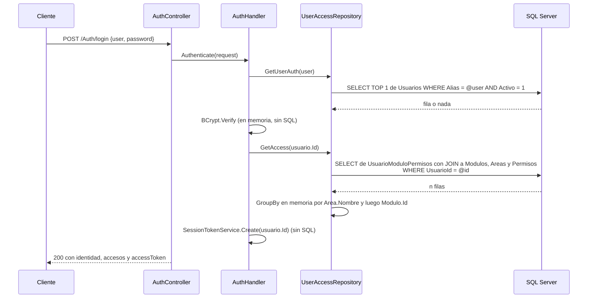
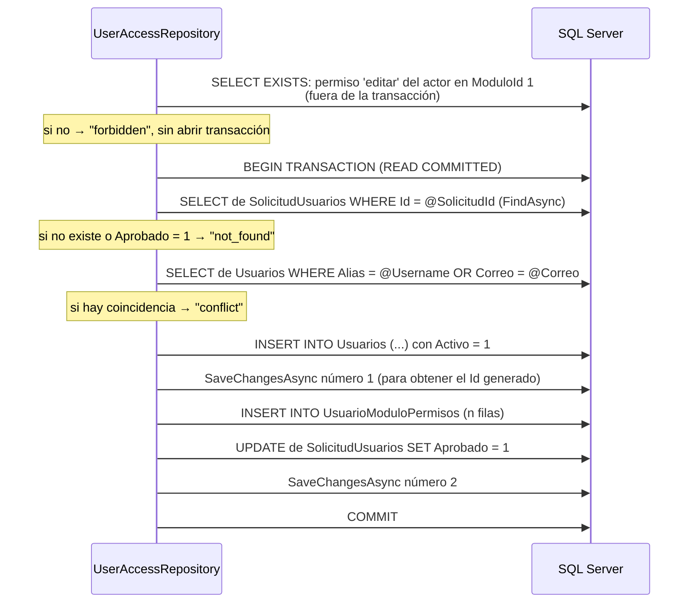
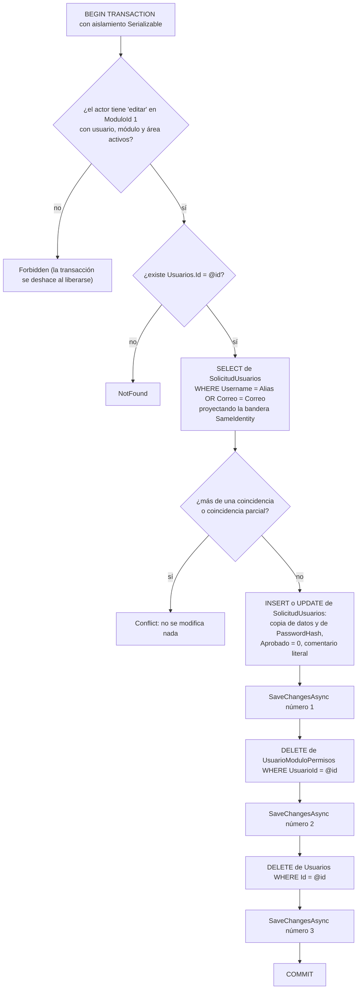
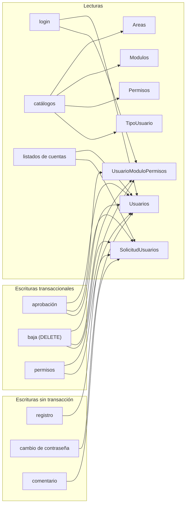

# Consultas SQL por funcionalidad

Volver al índice: [[db-index]] · Esquema: [[db-schema-acceso-usuario]] · Relaciones: [[db-relationships]]

Todo el acceso a datos pasa por **una única clase**: `Backend/Models/Repositories/UserAccessRepository.cs` (registrada como `Scoped` en `Backend/Program.cs:41`). No hay SQL crudo, ni procedimientos almacenados, ni un segundo contexto. Detalle de la clase desde la perspectiva del backend: [[be-repository]].

## Resumen: 17 métodos del repositorio

| Método | Tablas tocadas | Escribe | Transacción explícita | `AsNoTracking` |
| --- | --- | --- | --- | --- |
| `GetUserAuth(alias)` | `Usuarios` | — | No | No |
| `GetUserKeyAuth(alias, correo)` | `Usuarios`, `SolicitudUsuarios` | — | No | No |
| `CreateUserSolicitado(...)` | `SolicitudUsuarios` | `INSERT` | No — `SaveChangesAsync` simple | No |
| `GetAccess(usuarioId)` | puente + `Modulos` + `Areas` + `Permisos` | — | No | No |
| `GetAreasById(areasId)` | `Areas` | — | No | No |
| `GetUserTypes()` | `TipoUsuario` | — | No | No |
| `GetAreas()` | `Areas` | — | No | No |
| `GetPermisos()` | `Permisos` | — | No | No |
| `GetModulos(areasId)` | `Modulos` | — | No | No |
| `GetAllUsersRequest()` | `SolicitudUsuarios` | — | No | No |
| `GetAllRegisteredUsers()` | `Usuarios` | — | No | **Sí** |
| `DeactivateUser(...)` | puente, `Usuarios`, `SolicitudUsuarios`, `Modulos`, `Areas`, `Permisos` | `INSERT`/`UPDATE` + 2 `DELETE` | **Sí, `Serializable`** | No |
| `GetUserByEmail(correo)` | `Usuarios` | — | No | No |
| `UpdatePassword(usuario, hash)` | `Usuarios` | `UPDATE` | No — `SaveChangesAsync` simple | No |
| `UpdateUserRequestComment(...)` | `SolicitudUsuarios` + puente (permiso) | `UPDATE` | No — `SaveChangesAsync` simple | No |
| `ApproveUserTransactionAsync(...)` | `SolicitudUsuarios`, `Usuarios`, puente | `INSERT` + `UPDATE` | **Sí**, aislamiento por defecto | No |
| `GetUserPermissionsAdminAsync(id)` | `Usuarios` + puente + `Modulos` + `Areas` | — | No | No |
| `UpdateUserPermissionsTransactionAsync(...)` | puente, `Usuarios` | `DELETE` + `INSERT` + `UPDATE` | **Sí**, aislamiento por defecto | No |

Hechos destacables de esta tabla:

- **`GetAllRegisteredUsers` es el único método con `AsNoTracking`** en todo el repositorio (línea 134). Los cinco catálogos de sólo lectura (`GetAreas`, `GetAreasById`, `GetPermisos`, `GetModulos`, `GetUserTypes`) y las listas de solicitudes cargan el `ChangeTracker` sin necesidad.
- **Hay 3 transacciones explícitas**, todas creadas con `BeginTransactionAsync` y `await using`. `.agent/CONTEXT.md` afirmaba que no existía ninguna: eso ya no es cierto.
- **Solo una fija el nivel de aislamiento**: la baja usa `IsolationLevel.Serializable` (línea 145). Las otras dos usan el predeterminado de SQL Server (`READ COMMITTED`).
- **Ninguna transacción llama a `RollbackAsync`**: los retornos tempranos confían en la liberación del recurso.
- **`CancellationToken`**: lo aceptan los cuatro métodos nuevos (baja, comentario, aprobación, permisos). Las trece consultas originales **no lo propagan**, así que una petición HTTP cancelada por el cliente no cancela su consulta en SQL.
- **No hay paginación en ninguna consulta de listado.** Ni `Skip`/`Take`, ni límite, ni filtro de servidor.

## Flujo 1 — Login (`POST /Auth/login`)



- 2 consultas, ninguna escritura, sin transacción, sin `AsNoTracking` (`UserAccessRepository.cs:19-23` y `61-83`).
- **El token no se persiste.** `SessionTokenService` (`Backend/Handlers/SessionTokenService.cs`) produce un token bearer protegido con `DataProtection` que solo lleva la claim `NameIdentifier` con el `Id`. No hay tabla de sesiones, ni de tokens, ni de revocación: **la base de datos no participa en la gestión de sesión**. Caducidad de 8 horas fijada en `Backend/Program.cs:33`. Ver [[be-auth-session]].
- Como los tokens no se validan contra la base, un usuario borrado por una baja conserva un token válido hasta su expiración. Ver [[db-table-usuarios]].
- `GetAccess` no filtra `Modulo.Activo` ni `Area.Activo`: el JSON de accesos puede contener módulos y áreas desactivados.
- El agrupamiento en memoria significa que SQL Server devuelve la fila completa de módulo, área y permiso por cada asignación, con duplicación de datos de área y módulo en la red.

## Flujo 2 — Registro / solicitud de acceso (`POST /Auth/register`)

| Paso | SQL | Tabla |
| --- | --- | --- |
| 1 | `SELECT TOP 1 ... WHERE Alias = @user AND Correo = @email` | `Usuarios` |
| 2 | `SELECT TOP 1 ... WHERE Username = @user OR Correo = @email` | `SolicitudUsuarios` |
| 3 | `INSERT INTO SolicitudUsuarios (...)` + `SaveChangesAsync` | `SolicitudUsuarios` |

### Defecto verificado: la comprobación de duplicados ignora `Usuarios`

```csharp
// Backend/Models/Repositories/UserAccessRepository.cs:25-36
var usuario = await _context.Usuarios
    .FirstOrDefaultAsync(u => u.Alias == alias && u.Correo == correo);
var usuarioPeticion = await _context.SolicitudUsuarios
    .FirstOrDefaultAsync(u => u.Username == alias || u.Correo == correo);
if (usuarioPeticion != null || usuarioPeticion != null)
{
    return true;
}
return false;
```

Dos errores en la misma función, **ambos presentes todavía**:

1. La condición `usuarioPeticion != null || usuarioPeticion != null` comprueba dos veces la misma variable. **El resultado de la consulta a `Usuarios` se descarta**, y esa consulta se ejecuta para nada (coste de red y de `ChangeTracker`).
2. La consulta a `Usuarios` usa `&&` (alias **y** correo deben coincidir en la misma fila), mientras la de solicitudes usa `||`. Aunque se corrigiera la condición del `if`, seguiría sin detectar que el alias solicitado ya pertenece a otro usuario con distinto correo.

Efecto real: alguien puede solicitar acceso con el alias o el correo de una cuenta **ya existente**. La solicitud se inserta correctamente (los índices únicos de `SolicitudUsuarios` no chocan con los de `Usuarios`) y el fallo se traslada al momento de aprobar: `ApproveUserTransactionAsync` sí comprueba `Alias == Username || Correo == Correo` contra `Usuarios` (líneas 253-254) y devuelve `conflict`. La solicitud queda entonces atascada: no se puede aprobar y no existe operación de rechazo. Ver [[db-findings]].

Otros detalles de la inserción (`UserAccessRepository.cs:41-53`):

- `Aprobado = false` explícito, `FechaIngreso = DateOnly.FromDateTime(DateTime.Now)` (**hora local del servidor**, no UTC ni el default `getdate()` de SQL).
- `Comentario` **no se asigna** → se guarda `NULL`.
- La fecha de nacimiento se convierte con `DateOnly.ParseExact(request.birthDate, "yyyy-MM-dd")` en `AuthHandler.cs:61`, **sin `try/catch`**: una cadena con otro formato lanza `FormatException` → HTTP 500.
- Longitudes: el formulario del frontend admite nombres de hasta 50 y apellidos de hasta 25 caracteres, mientras las columnas son `varchar(30)` y `varchar(20)`. El DTO no valida longitud. Un valor demasiado largo produce error de truncamiento en SQL, no un 400 con mensaje. Ver [[fe-interfaces]] y [[db-findings]].

## Flujo 3 — Aprobación de solicitud (`POST /Platform/Users/Approve`)

**Flujo nuevo**, transaccional. `UserAccessRepository.ApproveUserTransactionAsync`, líneas 236-298.



Hechos:

- **La comprobación de permiso ocurre *antes* de `BeginTransactionAsync`** (líneas 239-245), al contrario que en la baja, donde ocurre dentro. Asimetría de implementación entre dos operaciones equivalentes.
- **Dos `SaveChangesAsync` dentro de la misma transacción**: el primero es obligatorio para obtener el `Id` IDENTITY del usuario nuevo antes de insertar las filas de la tabla puente.
- **El hash de contraseña se copia tal cual** de la solicitud (línea 270): no se vuelve a hashear. Correcto; volver a hashear un hash rompería el login.
- **`FechaIngreso` se copia de la solicitud** (línea 267): registra la fecha en que la persona *solicitó* acceso, no la de su alta como usuario. **La fecha de alta real no se guarda en ninguna parte.**
- **`TipoId` llega en el cuerpo de la petición** y no se valida contra el catálogo: solo la FK lo protege (error 547 → HTTP 409, `PlatformControler.cs:122`).
- **Los `ModuloId`/`PermisoId` no se validan** (ver [[db-table-usuario-modulo-permisos]]). Duplicados → error 2627 → HTTP 409.
- **No se registra quién aprobó ni cuándo.** El `actorId` se usa para autorizar y se descarta.
- La solicitud queda con `Aprobado = 1` y **conserva su `PasswordHash`**: el hash de credenciales vive ahora duplicado en dos tablas.
- La transacción garantiza que no queden usuarios sin permisos ni solicitudes marcadas sin usuario.

## Flujo 4 — Baja de usuario (`POST /Platform/Users/{id}/deactivate`)

**Flujo nuevo y con la semántica más sorprendente del sistema: borra la fila, no la desactiva.** `UserAccessRepository.DeactivateUser`, líneas 141-202.



Hechos verificados:

- **`Usuarios.Activo` nunca se pone a `0`.** El nombre "deactivate" es engañoso: es un traslado destructivo de `Usuarios` a `SolicitudUsuarios`. El `Id` del usuario se pierde para siempre.
- **Es la única operación con `IsolationLevel.Serializable`** (línea 145). Justificable por el patrón leer-decidir-escribir sobre índices únicos, pero mantiene bloqueos de rango durante **tres** `SaveChangesAsync` consecutivos. El interbloqueo (error 1205) está previsto y capturado en `PlatformControler.cs:64-67`.
- **La comprobación de permiso está dentro de la transacción serializable** (comentario del propio código: "los permisos se consultan dentro de la transacción"). Un 403 abre y deshace una transacción serializable.
- El orden de los borrados respeta las FK `ClientSetNull` (primero la tabla puente, después el usuario). Ver [[db-relationships]].
- Se escribe un literal con errata en los datos: `"usario previamente registrado"` (línea 188). Ver [[db-table-solicitud-usuarios]].
- **El `PasswordHash` del usuario borrado se conserva** en la tabla de solicitudes.
- **No se registra la fecha de baja ni quién la ejecutó.**
- Al perderse la fila de `Usuarios`, `POST /Auth/changePassword` con el correo de esa persona pasa a devolver `false` (no encuentra la cuenta) aunque su hash siga existiendo en `SolicitudUsuarios`.

## Flujo 5 — Actualización de permisos (`PUT /Platform/Users/Permissions`)

`UserAccessRepository.UpdateUserPermissionsTransactionAsync`, líneas 308-349. Lectura previa: `GetUserPermissionsAdminAsync` (líneas 299-306) vía `GET /Platform/Users/{id}/Permissions`.

| Paso | SQL | Nota |
| --- | --- | --- |
| 1 | `SELECT EXISTS` permiso `editar` en `ModuloId 1` | Fuera de la transacción |
| 2 | `BEGIN TRANSACTION` | Aislamiento por defecto |
| 3 | `SELECT de Usuarios con JOIN a la tabla puente WHERE Id = @userId` | Exige `Activo`; si no → `not_found` |
| 4 | `DELETE` de todas las filas de la tabla puente del usuario | Sustitución total |
| 5 | `UPDATE Usuarios SET TipoId = @TipoId` | |
| 6 | `INSERT` de las filas nuevas | |
| 7 | Un único `SaveChangesAsync` + `COMMIT` | EF ordena `DELETE` antes de `INSERT` |

La lectura de permisos actuales (`GetUserPermissionsAdminAsync`) carga la entidad `Usuario` completa **con seguimiento** y con `Include` de puente → módulo → área. El handler agrupa por `(AreaId, Area.Nombre, ModuloId, Modulo.Nombre)` (`Backend/Handlers/PlatformHandler.cs:135-145`) y proyecta a DTO, por lo que el `PasswordHash` que se cargó no se expone. La entidad completa, incluido el hash, sí viaja de SQL a memoria: una proyección habría evitado leer la columna.

Riesgos de esta operación detallados en [[db-table-usuario-modulo-permisos]]: sustitución total sin validación, sin auditoría y sin protección contra que el actor se quite sus propios permisos.

## Flujo 6 — Comentario de solicitud (`PUT /Platform/UserRequest/{id}/comment`)

| Paso | SQL | Nota |
| --- | --- | --- |
| 1 | `SELECT EXISTS` permiso **`crear`** en `ModuloId 1` | Único flujo que usa `crear`; si falta, **lanza excepción** en lugar de devolver código |
| 2 | `SELECT de SolicitudUsuarios WHERE Id = @requestId` (`FindAsync`) | Por PK |
| 3 | `UPDATE SolicitudUsuarios SET comentario = @comment` | `SaveChangesAsync` simple, **sin transacción** |

No necesita transacción: una sola sentencia de escritura. Acepta `null` para borrar el comentario y no valida longitud. Ver [[db-table-solicitud-usuarios]].

## Flujo 7 — Cambio de contraseña (`POST /Auth/changePassword`)

| Paso | SQL | Nota |
| --- | --- | --- |
| 1 | `SELECT TOP 1 de Usuarios WHERE Correo = @email` | **No filtra `Activo`** (`UserAccessRepository.cs:204-208`) |
| 2 | `UPDATE de Usuarios` con **todas** las columnas | `Update(usuario)` marca la entidad completa; `SaveChangesAsync` simple, sin transacción |

Riesgos de datos, todos vigentes:

- **Sin prueba de titularidad**: el endpoint no lleva `[Authorize]` (`Backend/Controllers/AuthController.cs:38-39`), no envía correo de confirmación, no usa token temporal y no pide la contraseña anterior. Conocer un correo registrado basta para intentar sustituir su `PasswordHash`. Es el riesgo más grave que toca esta capa de datos.
- Devuelve el booleano crudo de `SaveChangesAsync() > 0`, lo que **confirma al llamante si un correo existe** en la base: enumeración de cuentas.
- No filtra `Activo`; hoy es irrelevante porque ninguna fila llega a tener `Activo = 0` (ver [[db-table-usuarios]]), pero volverá a importar si la baja pasa a ser lógica.

## Flujo 8 — Catálogos

| Endpoint | Método | Tabla | Filtro | Clave del diccionario de respuesta |
| --- | --- | --- | --- | --- |
| `GET /Auth/areas` | `GetAreas()` | `Areas` | `Activo` | `Nombre` → riesgo de duplicado cubierto por `UQ_Areas_Nombre` |
| `GET /Auth/access` | `GetPermisos()` | `Permisos` | ninguno | `Id` → seguro |
| `POST /Auth/modules` | `GetModulos(areasId)` | `Modulos` | `Activo`, `AreaId IN (...)` | `Id` → seguro |
| `GET /Auth/userTypes` | `GetUserTypes()` | `TipoUsuario` | ninguno | `NivelUsuario` → **sin índice único: un duplicado provoca HTTP 500**. Ver [[db-table-tipo-usuario]] |

Los cuatro son de sólo lectura, sin transacción y **sin `AsNoTracking`**. Ninguno lleva `[Authorize]`: el catálogo completo de áreas, permisos, módulos y tipos es público. `GetAreasById` existe pero **no tiene ningún llamador** (código muerto en la capa de datos).

## Flujo 9 — Listados de cuentas

| Endpoint | Método | Tabla | Orden | Filtro | Paginación |
| --- | --- | --- | --- | --- | --- |
| `GET /Platform/UserRequest` | `GetAllUsersRequest()` | `SolicitudUsuarios` | **ninguno** | ninguno | **no** |
| `GET /Platform/Users` | `GetAllRegisteredUsers()` | `Usuarios` | `Nombre`, `ApellidoPaterno`, `Id` | ninguno | **no** |

Ambos endpoints **carecen de `[Authorize]`** (`Backend/Controllers/PlatformControler.cs:24-39`), a diferencia de los cinco de escritura, que sí lo llevan. Cualquiera con acceso de red a la API puede descargar la lista completa de solicitudes (con nombres, correos, fecha de ingreso y comentarios) y la de usuarios registrados (con nombres, correos, fecha de nacimiento, sexo y alias). Los DTO excluyen `PasswordHash`, pero el resto son datos personales. Ver [[be-api-reference]] y [[db-findings]].

`GetAllUsersRequest` no ordena: SQL Server puede devolver las filas en cualquier orden y cambiarlo entre ejecuciones. El frontend no reordena, así que la lista puede "saltar" entre recargas. El filtrado es totalmente del cliente (`useMemo` sobre el array completo), lo que implica transferir todas las filas para mostrar unas pocas.

## Vista general: qué toca cada tabla



**Areas, Modulos, Permisos y TipoUsuario no reciben ninguna escritura desde la aplicación.** Son catálogos de sólo lectura que se mantienen exclusivamente con acceso directo a SQL. Existe un seed en `DataBase/scripts/Init.sql`, pero **no está versionado en Git** y ningún paso de Compose ni de CI/CD lo ejecuta. Ver [[db-scripts-and-migrations]].

## Enlaces

- [[db-index]] · [[db-schema-acceso-usuario]] · [[db-relationships]] · [[db-findings]] · [[db-scripts-and-migrations]] · [[db-infrastructure]]
- Tablas: [[db-table-usuarios]] · [[db-table-solicitud-usuarios]] · [[db-table-usuario-modulo-permisos]] · [[db-table-areas]] · [[db-table-modulos]] · [[db-table-permisos]] · [[db-table-tipo-usuario]]
- Backend: [[be-repository]] · [[be-api-reference]] · [[be-auth-session]] · [[be-dbcontext-entities]] · [[be-index]]
- Frontend: [[fe-templates-areas-modules]] · [[fe-interfaces]]
- Arquitectura: [[architecture-overview]]
