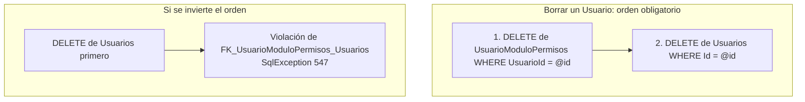
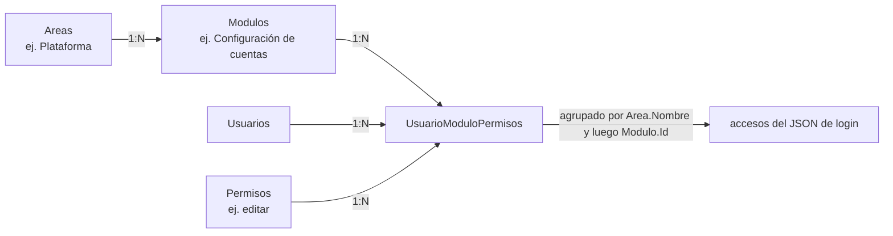

# Relaciones y semántica del modelo de accesos

Volver al índice: [[db-index]] · Visión general: [[db-schema-acceso-usuario]]

## Las 5 claves foráneas

Todas se declaran con nombre explícito y **todas** con `OnDelete(DeleteBehavior.ClientSetNull)`.

| Nombre de la FK | Tabla hija → padre | Columna | Ubicación |
| --- | --- | --- | --- |
| `FK_Modulos_Areas` | `Modulos` → `Areas` | `AreaId` | `Backend/Data/UserAccessDbContext.cs:52-55` |
| `FK_Usuarios_TipoUsuario` | `Usuarios` → `TipoUsuario` | `TipoId` | `Backend/Data/UserAccessDbContext.cs:143-146` |
| `FK_UsuarioModuloPermisos_Modulos` | `UsuarioModuloPermisos` → `Modulos` | `ModuloId` | `Backend/Data/UserAccessDbContext.cs:155-158` |
| `FK_UsuarioModuloPermisos_Permisos` | `UsuarioModuloPermisos` → `Permisos` | `PermisoId` | `Backend/Data/UserAccessDbContext.cs:160-163` |
| `FK_UsuarioModuloPermisos_Usuarios` | `UsuarioModuloPermisos` → `Usuarios` | `UsuarioId` | `Backend/Data/UserAccessDbContext.cs:165-168` |

No hay ninguna otra FK. En particular, **`SolicitudUsuarios` no tiene FK alguna**, ni como hija ni como padre.

### Qué significa `ClientSetNull` aquí

`DeleteBehavior.ClientSetNull` es el valor **por defecto de EF Core para relaciones requeridas**; declararlo explícitamente no cambia nada respecto a omitirlo. Su semántica:

- **En SQL**: la restricción se crea con `ON DELETE NO ACTION`. No hay cascada en la base.
- **En EF (cliente)**: si el padre está cargado en el `ChangeTracker` y se elimina, EF intenta poner la FK del hijo en `NULL`.
- **Como las 5 columnas FK son no anulables** (`int`/`short` sin `?`), ese intento produce una excepción en `SaveChangesAsync`, no un `NULL`.

Conclusión operativa: **borrar un padre exige borrar antes los hijos, a mano**. No hay borrado en cascada ni limpieza automática. Esto es exactamente lo que hace la baja de usuarios, que elimina primero las filas de `UsuarioModuloPermisos` y después la fila de `Usuarios` (`Backend/Models/Repositories/UserAccessRepository.cs:192-199`). Ver [[db-queries-by-feature]].

No interpretar `ClientSetNull` como permiso para dejar estas columnas en `NULL`: son obligatorias.



El error 547 (violación de FK) se captura explícitamente en `Backend/Controllers/PlatformControler.cs:60` y se traduce a HTTP 409.

## Semántica: área → módulo → asignación



Reglas del modelo, todas verificadas en el código:

1. **Un área contiene módulos.** `Modulos.AreaId` es obligatorio: no existen módulos huérfanos.
2. **Una fila de `UsuarioModuloPermisos` asigna exactamente un permiso a un usuario sobre un módulo.** No es "el conjunto de permisos del usuario en el módulo": para dar dos permisos hacen falta dos filas.
3. **La PK compuesta `(UsuarioId, ModuloId, PermisoId)`** impide duplicar exactamente la misma tripleta, y permite varias filas con el mismo `(UsuarioId, ModuloId)` y distinto `PermisoId`.
4. **La tabla puente es la única fuente de accesos efectivos.** `UserAccessRepository.GetAccess` (líneas 61-83) los lee y agrupa en memoria por `Modulo.Area.Nombre` y luego por `Modulo.Id`.
5. **El área se deduce navegando**, nunca se guarda: `UsuarioModuloPermisos → Modulos → Areas`.

## Lo que sigue NO existiendo en el modelo (verificado)

Estas ausencias del análisis previo **se mantienen ciertas** en el código del 2026-09-18:

| Ausencia | Verificación |
| --- | --- |
| **No hay relación directa usuario ↔ área** | `Usuario` no tiene propiedad `AreaId` ni colección de áreas (`Backend/Models/Schemas/UserAccess/Usuario.cs`). El área solo se alcanza por la tabla puente. |
| **No hay relación permiso ↔ área ni permiso ↔ módulo** | `Permiso` solo navega a `UsuarioModuloPermisos` (`Permiso.cs:14`). Cualquier `PermisoId` puede asignarse a cualquier `ModuloId`: no hay tabla que restrinja qué permisos son válidos para qué módulo. |
| **No hay relación tipo ↔ permiso** | `TipoUsuario` solo navega a `Usuarios` (`TipoUsuario.cs:14`). El tipo no otorga ningún permiso. |
| **No hay jerarquía ni herencia de permisos** | No existe columna de nivel, padre, orden ni peso en `Permisos`. Nada implica que "editar" incluya "ver". |
| **No hay permisos implícitos ni denegaciones** | La ausencia de fila es la única negación posible: no existe columna de denegación explícita ni bandera de revocación. |
| **No hay superadministrador** | Ninguna consulta del repositorio salta la comprobación de asignación por tipo, alias o bandera. |
| **La tabla puente y `Permisos` no tienen columna `Activo`** | Verificado en `Permiso.cs` y `UsuarioModuloPermiso.cs`. No se puede desactivar un permiso ni una asignación: solo borrar la fila. |
| **No hay auditoría** | Ninguna tabla guarda quién creó/modificó/aprobó, ni cuándo. No hay `SolicitudUsuarios.FechaAprobacion`, ni `AprobadoPor`, ni FK solicitud → usuario resultante. |

> Matiz importante frente al análisis previo: `TipoUsuario` sigue **sin** participar en la autorización, pero ya **se escribe** en dos flujos (aprobación y actualización de permisos fijan `Usuarios.TipoId`). Es un dato clasificatorio que se captura y persiste, pero que ninguna decisión del servidor consulta.

## Cómo autoriza realmente el servidor

Desde 2026-09-09 el repositorio **sí** comprueba permisos en la base de datos, con una consulta `EXISTS` repetida en cuatro métodos (`UserAccessRepository.cs:149-152, 220-223, 239-242, 310-313`). Su forma, en términos relacionales:

```
EXISTS (
  SELECT 1
  FROM acceso_usuario.UsuarioModuloPermisos ump
  JOIN acceso_usuario.Usuarios u ON u.Id = ump.UsuarioId
  JOIN acceso_usuario.Modulos m   ON m.Id = ump.ModuloId
  JOIN acceso_usuario.Areas a     ON a.Id = m.AreaId
  JOIN acceso_usuario.Permisos p  ON p.Id = ump.PermisoId
  WHERE ump.UsuarioId = @actorId
    AND u.Activo = 1 AND m.Activo = 1 AND a.Activo = 1
    AND ump.ModuloId = 1
    AND LOWER(LTRIM(RTRIM(p.Nombre))) = 'editar'   -- o 'crear'
)
```

Tres consecuencias de diseño que afectan a la capa de datos:

1. **`ModuloId = 1` está escrito a mano en el repositorio.** El identificador del módulo "configuración de cuentas" del `MODULE_REGISTRY` del frontend (`Frontend/src/templates/shared/areaTemplate.jsx:8-12`) se ha filtrado hasta la capa de persistencia. Si ese `Modulos.Id` cambiara en la base, toda la autorización del módulo de plataforma apuntaría al módulo equivocado, sin error visible. Ver [[fe-templates-areas-modules]] y [[db-table-modulos]].
2. **La autorización depende de `Permisos.Nombre`**, no de su `Id`: los literales `"editar"` y `"crear"` son cadenas comparadas con `Trim().ToLower()`. Renombrar una fila de `Permisos` desactiva silenciosamente operaciones de escritura. Ver [[db-table-permisos]].
3. **`Trim()` + `ToLower()` se traducen a funciones SQL sobre la columna**, lo que hace la comparación no-sargable e inutiliza `UQ_Permisos_Nombre` como índice de búsqueda. Con un catálogo pequeño el coste es despreciable; el problema es de corrección, no de rendimiento.

Estas comprobaciones sí filtran `Usuario.Activo`, `Modulo.Activo` y `Area.Activo` — a diferencia de `GetAccess`, que **no** filtra ninguno al construir el JSON del login. Ver esa asimetría en [[db-queries-by-feature]] y [[db-findings]].

## Integridad que el modelo NO protege

| Riesgo | Por qué el esquema no lo impide |
| --- | --- |
| Asignar un `PermisoId` que no tiene sentido para un módulo | No hay tabla módulo↔permiso permitidos |
| Asignar permisos sobre módulos o áreas inactivos | Las FK no miran `Activo` |
| Mismo alias/correo en `Usuarios` y en `SolicitudUsuarios` | Índices únicos separados por tabla, sin FK entre ellas |
| Dos solicitudes distintas para la misma persona (alias en una, correo en otra) | `UQ_Solicitud_User` y `UQ_Solicitud_correo` son índices independientes, no una restricción conjunta. La baja detecta este caso y responde `conflict` (`UserAccessRepository.cs:168-169`) |
| Usuario sin ninguna asignación | Nada exige al menos una fila en la tabla puente; ese usuario se autentica y recibe `accesos: []` |
| `Sexo` con un valor arbitrario de un carácter | El modelo no declara ninguna restricción CHECK; si existe en SQL, **no es verificable desde el repositorio** |

## Enlaces

- [[db-index]] · [[db-schema-acceso-usuario]] · [[db-queries-by-feature]] · [[db-findings]]
- Tablas implicadas: [[db-table-usuarios]] · [[db-table-modulos]] · [[db-table-areas]] · [[db-table-permisos]] · [[db-table-tipo-usuario]] · [[db-table-usuario-modulo-permisos]] · [[db-table-solicitud-usuarios]]
- Backend: [[be-dbcontext-entities]] · [[be-repository]] · [[be-auth-session]]
- Frontend: [[fe-templates-areas-modules]] · [[fe-interfaces]]
- Arquitectura: [[architecture-overview]]
