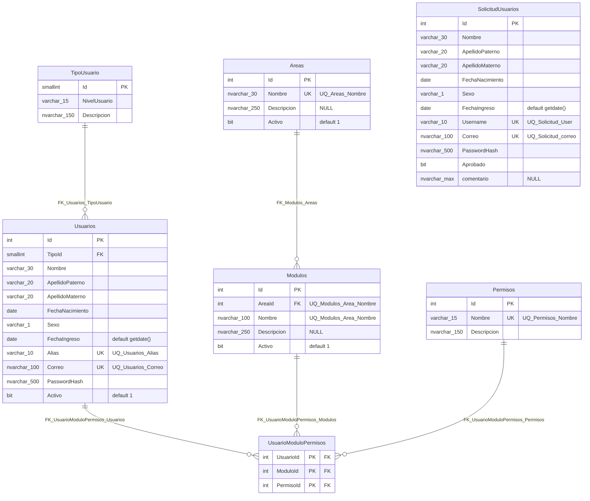
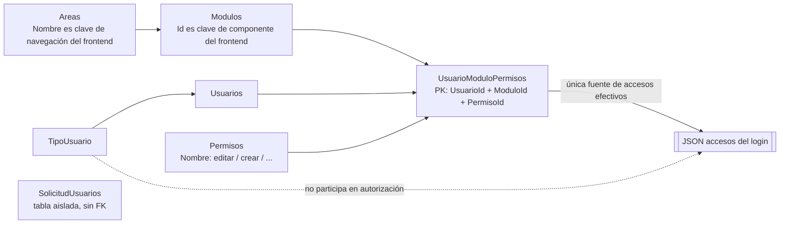

# Esquema `acceso_usuario` — visión general

Volver al índice: [[db-index]]

Las 7 tablas del dominio de accesos viven en el esquema SQL **`acceso_usuario`** de la base de datos apuntada por la cadena de conexión `ConnectionStrings:HospitalInfantilDb` (ver [[db-infrastructure]]). El esquema se declara explícitamente en cada `ToTable(...)` del contexto; **no** se usa el esquema `dbo` por defecto.

Hecho verificado — `Backend/Data/UserAccessDbContext.cs:33,44,60,74,107,117,153`: las siete llamadas a `ToTable` pasan `"acceso_usuario"` como segundo argumento.

## Inventario de tablas y DbSets

| Tabla SQL | Entidad C# | DbSet | Nota |
| --- | --- | --- | --- |
| `Areas` | `Area` | `Areas` | [[db-table-areas]] |
| `Modulos` | `Modulo` | `Modulos` | [[db-table-modulos]] |
| `Permisos` | `Permiso` | `Permisos` | [[db-table-permisos]] |
| `SolicitudUsuarios` | `SolicitudUsuario` | `SolicitudUsuarios` | [[db-table-solicitud-usuarios]] |
| **`TipoUsuario`** (singular) | `TipoUsuario` | **`TipoUsuarios`** (plural) | [[db-table-tipo-usuario]] |
| `Usuarios` | `Usuario` | `Usuarios` | [[db-table-usuarios]] |
| `UsuarioModuloPermisos` | `UsuarioModuloPermiso` | `UsuarioModuloPermisos` | [[db-table-usuario-modulo-permisos]] |

> **Trampa de nomenclatura.** El DbSet se llama `TipoUsuarios` pero la tabla SQL es `TipoUsuario`, en singular (`Backend/Data/UserAccessDbContext.cs:107`). No deducir nombres de tabla a partir de nombres de DbSet.

## Diagrama ER

`SolicitudUsuarios` aparece sin aristas porque **no tiene ninguna clave foránea**: está aislada del resto del esquema. Ver [[db-table-solicitud-usuarios]] y [[db-relationships]].

## Diagrama conceptual del modelo de accesos

## Convenciones de tipos y cómo se derivaron

Los tipos SQL de las notas de tabla se **infieren** del mapeo EF con estas reglas:

| Señal en el mapeo o la entidad | Tipo SQL inferido |
| --- | --- |
| `HasMaxLength(n)` + `IsUnicode(false)` | `varchar(n)` |
| `HasMaxLength(n)` sin `IsUnicode(false)` | `nvarchar(n)` |
| `HasColumnType("nvarchar(max)")` | `nvarchar(max)` — declarado explícitamente, no inferido |
| C# `int` | `int` |
| C# `short` | `smallint` |
| C# `bool` | `bit` |
| C# `DateOnly` | `date` |
| C# `string` sin `?` con `= null!` | columna `NOT NULL` |
| C# `string?` | columna `NULL` |

Detalle relevante y fácil de pasar por alto: **los nombres y apellidos son `varchar` (no Unicode) mientras los correos son `nvarchar`**. `Nombre`, `ApellidoPaterno`, `ApellidoMaterno`, `Sexo`, `Alias`/`Username` llevan `IsUnicode(false)`; `Correo` y `PasswordHash` no. Consecuencia real: un apellido con caracteres fuera de la code page de la collation de la columna puede almacenarse con pérdida. Ver [[db-findings]].

## Valores por defecto declarados en EF

| Columna | Default |
| --- | --- |
| `Areas.Activo` | `true` — `UserAccessDbContext.cs:37` |
| `Modulos.Activo` | `true` — `UserAccessDbContext.cs:48` |
| `Usuarios.Activo` | `true` — `UserAccessDbContext.cs:123` |
| `Usuarios.FechaIngreso` | `(getdate())` — `UserAccessDbContext.cs:134` |
| `SolicitudUsuarios.FechaIngreso` | `(getdate())` — `UserAccessDbContext.cs:91` |

`SolicitudUsuarios.Aprobado` **no** tiene default declarado en EF y `SolicitudUsuarios.comentario` tampoco. Si existen defaults físicos en SQL añadidos fuera del repositorio, eso **no es verificable desde el repositorio**.

Matiz de `HasDefaultValue(true)` (a diferencia de `HasDefaultValueSql`): EF trata el valor CLR por defecto (`false` para `bool`) como "no asignado", por lo que insertar una entidad con `Activo = false` explícito puede omitir la columna y dejar que SQL aplique el default `1`. Es una trampa conocida de EF Core; en el código actual no se inserta ninguna fila de `Areas`/`Modulos`, y el único INSERT en `Usuarios` fija `Activo = true` (`Backend/Models/Repositories/UserAccessRepository.cs:271`), así que hoy no se materializa. Ver [[db-findings]].

## Índices únicos declarados

| Nombre | Tabla | Columnas |
| --- | --- | --- |
| `UQ_Areas_Nombre` | `Areas` | `Nombre` |
| `UQ_Modulos_Area_Nombre` | `Modulos` | `AreaId`, `Nombre` (compuesto) |
| `UQ_Permisos_Nombre` | `Permisos` | `Nombre` |
| `UQ_Solicitud_User` | `SolicitudUsuarios` | `Username` |
| `UQ_Solicitud_correo` | `SolicitudUsuarios` | `Correo` |
| `UQ_Usuarios_Alias` | `Usuarios` | `Alias` |
| `UQ_Usuarios_Correo` | `Usuarios` | `Correo` |

Son 7 índices únicos con nombre explícito. **Ningún índice no único** se declara en EF: no hay índice sobre `Modulos.AreaId` por separado, ni sobre `UsuarioModuloPermisos.ModuloId`/`PermisoId`, ni sobre `Usuarios.TipoId`. SQL Server crea automáticamente un índice para la PK y para cada UNIQUE, pero **no** para columnas FK. Ver el impacto en [[db-findings]].

La unicidad es **por tabla**: `UQ_Usuarios_Alias` y `UQ_Solicitud_User` son independientes, así que el mismo alias puede existir simultáneamente en `Usuarios` y en `SolicitudUsuarios`. Esa coexistencia es precisamente lo que produce la baja de usuarios (ver [[db-queries-by-feature]]).

## Claves primarias

| Tabla | PK | Cómo se declara |
| --- | --- | --- |
| `Areas`, `Modulos`, `Permisos`, `TipoUsuario`, `Usuarios` | `Id` | Por convención de EF (propiedad llamada `Id`) |
| `SolicitudUsuarios` | `Id` | Explícita: `HasKey(e => e.Id)` + `ValueGeneratedOnAdd()` — `UserAccessDbContext.cs:72,92` |
| `UsuarioModuloPermisos` | **`(UsuarioId, ModuloId, PermisoId)`** | Explícita y compuesta: `HasKey(e => new { e.UsuarioId, e.ModuloId, e.PermisoId })` — `UserAccessDbContext.cs:151` |

`TipoUsuario.Id` es `short` → `smallint`, y por tanto `Usuarios.TipoId` también es `smallint`. Los DTO de petición respetan ese tipo (`ApproveUserRequest.TipoId` y `UpdateUserPermissionsRequest.TipoId` son `short`).

### Lo que confirma `DataBase/scripts/Init.sql`

El script de creación presente en el árbol de trabajo (sin versionar; ver [[db-scripts-and-migrations]]) respalda buena parte de lo inferido arriba: `IDENTITY(1,1)` en los siete `Id`, los tipos y longitudes de la tabla de convenciones, los 7 uniques declarados como restricciones `UNIQUE`, las 5 FK **sin cláusula `ON DELETE`**, los defaults `GETDATE()` y `Activo DEFAULT 1`, la ausencia total de índices no únicos y la ausencia de restricciones `CHECK`. Aporta además los nombres de las PK: `PK_TipoUsuario`, `PK_Usuarios`, `PK_Areas`, `PK_Modulos`, `PK_Permisos` y `PK_UsuarioModuloPermisos`, con la PK compuesta en el mismo orden que declara EF. También revela dos defaults que EF no declara: `SolicitudUsuarios.Aprobado DEFAULT 0`, y confirma que `comentario` no tiene ninguno porque **el script no crea esa columna**.

**Discrepancia importante**: `Init.sql` crea `SolicitudUsuarios` **sin `PRIMARY KEY`**, solo con sus dos restricciones `UNIQUE`. Es la única tabla sin PK, y contrasta con el `HasKey` explícito de EF. Ver [[db-table-solicitud-usuarios]] y [[db-findings]].

Que la instancia conectada corresponda a ese script, y por tanto que estos atributos físicos sean los vigentes, **no es verificable desde el repositorio**.

## Enlaces

- [[db-index]] · [[db-relationships]] · [[db-queries-by-feature]] · [[db-scripts-and-migrations]] · [[db-infrastructure]] · [[db-findings]]
- Tablas: [[db-table-usuarios]] · [[db-table-solicitud-usuarios]] · [[db-table-areas]] · [[db-table-modulos]] · [[db-table-permisos]] · [[db-table-tipo-usuario]] · [[db-table-usuario-modulo-permisos]]
- Backend: [[be-dbcontext-entities]] · [[be-repository]] · [[be-index]]
- Arquitectura: [[architecture-overview]]
