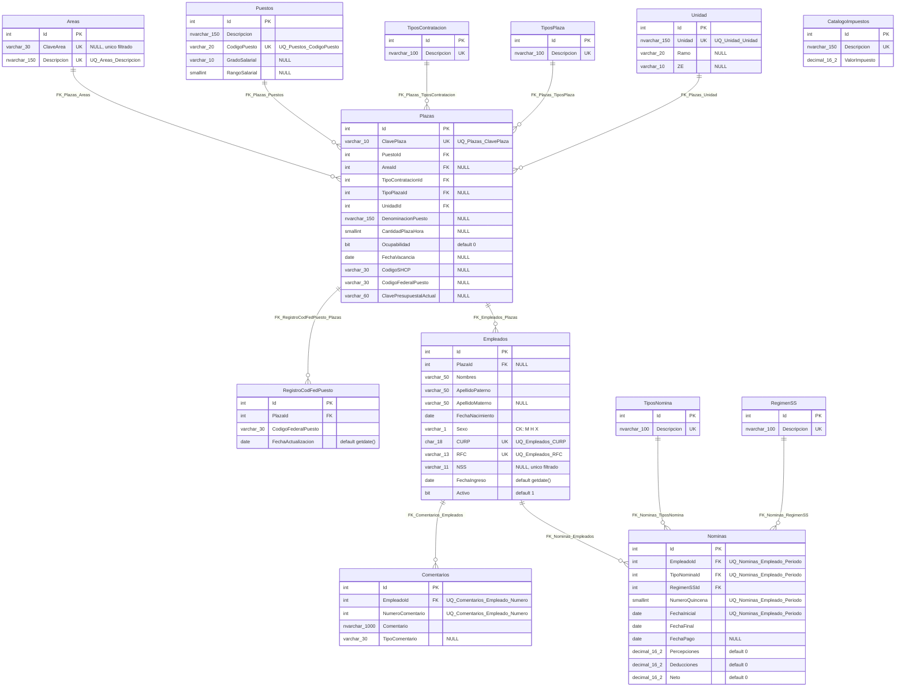

# Esquema `recursos_humanos` — visión general

Volver al índice: [[db-index]]

Las 13 tablas del dominio de recursos humanos viven en el esquema SQL **`recursos_humanos`** de la misma base que `acceso_usuario` (ver [[db-infrastructure]]). Tiene dos descripciones versionadas: el script `DataBase/scripts/RecursosHumanos.sql` y el mapeo EF de `Backend/Data/HumanResourcesDbContext.cs` con las 13 entidades de `Backend/Models/Schemas/HumanResources/`.

Desde el 2026-09-19 tiene repositorio, handler y controller con **lectura y escritura de `Areas`, `Puestos` y `Plazas`**, más los catálogos de tipos de contratación y unidades. Es el módulo **Administrar Plazas**, el primero de los cuatro de Recursos Humanos. Ver [[be-api-reference]] §4, [[fe-module-places]] y [[be-dbcontext-entities]].

Hecho verificado — el script se ejecutó contra la instancia conectada el **2026-09-19** dentro de una transacción única, y las 13 tablas, 11 claves foráneas, 13 índices únicos y 1 restricción `CHECK` se confirmaron después consultando `sys.foreign_keys`, `sys.check_constraints`, `sys.indexes` e `INFORMATION_SCHEMA.COLUMNS`.

## Origen del modelo

El esquema traduce un diagrama entidad-relación entregado por el usuario, escrito en `snake_case` (`id_empleado`, `fcha_nac`, `desc_area`). La traducción a la convención del repositorio fue una decisión explícita:

| En el diagrama | En la base |
| --- | --- |
| PK `id_<entidad>` | `Id` |
| FK `id_<entidad>` | `<Entidad>Id` — `PlazaId`, `TipoContratacionId` |
| `desc_*` | `Descripcion` |
| `fcha_*`, `fcah_vacancia` | `Fecha*` |
| `cod_*`, `cve_*`, `gdo_*`, `no_*`, `num_*` | `Codigo*`, `Clave*`, `Grado*`, `Numero*` |

Los nombres de tabla que el diagrama ya traía en PascalCase se conservaron literalmente, incluido el singular `Unidad` y el `RegimenSS` sin plural; los que venían en minúscula o singular se normalizaron a plural (`nominas` → `Nominas`, `plaza` → `Plazas`, `Empleado` → `Empleados`). El resultado es el mismo patrón mixto que ya tiene `acceso_usuario`, donde conviven `TipoUsuario` y `Usuarios` (ver [[db-schema-acceso-usuario]]).

## Inventario de tablas

| Tabla SQL | Rol | Referencia a |
| --- | --- | --- |
| `Areas` | Catálogo de áreas orgánicas, con clave jerárquica | — |
| `Puestos` | Catálogo de puestos, sin área | — |
| `TiposContratacion` | Catálogo | — |
| `TiposPlaza` | Catálogo | — |
| `Unidad` | Catálogo de unidad, ramo y ZE | — |
| `Plazas` | Plaza presupuestal | `Puestos`, `Areas`, `TiposContratacion`, `TiposPlaza`, `Unidad` |
| `RegistroCodFedPuesto` | Histórico de código federal por plaza | `Plazas` |
| `Empleados` | Persona empleada | `Plazas` |
| `Comentarios` | Comentarios por empleado | `Empleados` |
| `TiposNomina` | Catálogo | — |
| `RegimenSS` | Catálogo de régimen de seguridad social | — |
| `CatalogoImpuestos` | Catálogo aislado, sin FK | — |
| `Nominas` | Nómina quincenal por empleado | `Empleados`, `TiposNomina`, `RegimenSS` |

> **`recursos_humanos.Areas` no es `acceso_usuario.Areas`.** Son dos catálogos independientes, sin FK entre ellos. El de `acceso_usuario` son las áreas de la plataforma web, cuyo `Nombre` es clave de navegación del frontend (`TEMPLATE_REGISTRY`); el de aquí son áreas orgánicas del hospital a las que se adscriben las plazas. Renombrar uno no afecta al otro.

## El área es atributo de la plaza, no del puesto

El diagrama original colgaba `Puestos` de `Areas`. Los datos reales lo contradicen: el código de puesto `CFN3101773` («SUBDIRECTOR DE AREA») aparece con **12 denominaciones distintas** —Recursos Financieros, Recursos Humanos, Enseñanza, Mantenimiento, Asistencia Quirúrgica, entre otras— y `CFM2101041` figura como Titular del OIC, Director Médico y Director de Administración. Un mismo puesto tabular vive en muchas áreas.

Por eso `Puestos.AreaId` se eliminó y el área se movió a `Plazas.AreaId`, nullable. `Puestos` quedó como catálogo puro de 96 filas —código, descripción tabular, nivel salarial— y la **denominación** del cargo, que es la que varía por adscripción, vive en `Plazas.DenominacionPuesto`.

## La clave de área codifica jerarquía

`ClaveArea` tiene la forma `NBG-01-04-10-51-00`: institución, dirección, subdirección, departamento y servicio. El padre de un área se obtiene poniendo a `00` el último segmento distinto de cero:

```
NBG-01-01-02-27-51  SERVICIO DE TORAX Y ENDOSCOPIA
NBG-01-01-02-27-00  └ DEPARTAMENTO DE CIRUGIA CARDIOVASCULAR, TORAX Y ENDOSCOPIA
NBG-01-01-02-00-00    └ SUBDIRECCION DE ASISTENCIA MEDICA
NBG-01-01-00-00-00      └ DIRECCION MEDICA
NBG-01-00-00-00-00        └ DIRECCION GENERAL
```

**La jerarquía no se materializa en la base.** No hay columna de área padre: se quitó deliberadamente porque la clave real tiene defectos que producirían padres inexistentes. Los conocidos, sobre las 133 áreas cargadas:

1. `NBG-01-00-09-51-83 SERVICIO DE SEGURIDAD Y VIGILANCIA` — no existen ni `01-00-09-51-00` ni `01-00-09-00-00`. Sus hermanos (Intendencia `-59`, Lavandería `-82`, Transportes `-84`) viven en `01-04-09-51-*`, así que parece errata de `01-04` por `01-00`.
2. `NBG-01-04-0401-00-33 CENDI` — tercer segmento de cuatro dígitos; rompe el patrón.
3. Los segmentos **no son de ancho fijo**: coexisten `-00-02` y `-00-135`.
4. Padres ausentes: los 11 registros `01-03-06-00-*` y los 3 de `01-04-07-*` no tienen fila padre. Los departamentos de Recursos Humanos cuelgan de subdirección `07` mientras la `SUBDIRECCION DE RECURSOS HUMANOS` es `08`.

Cualquier árbol debe calcularse al leer, tolerando estos casos.

## Mapeo EF: trampas de nomenclatura

`HumanResourcesDbContext` declara una entidad por tabla, en singular, con el `DbSet` en plural. Cuatro nombres **no** se deducen de la tabla:

| Tabla SQL | Entidad C# | DbSet |
| --- | --- | --- |
| `TiposContratacion` | `TipoContratacion` | `TiposContratacion` |
| `TiposPlaza` | `TipoPlaza` | `TiposPlaza` |
| `TiposNomina` | `TipoNomina` | `TiposNomina` |
| **`Unidad`** (singular) | `Unidad` | **`Unidades`** |
| **`RegimenSS`** (singular) | `RegimenSS` | **`RegimenesSS`** |
| `CatalogoImpuestos` | `CatalogoImpuesto` | `CatalogoImpuestos` |
| `RegistroCodFedPuesto` (singular) | `RegistroCodFedPuesto` | `RegistroCodFedPuestos` |

Y dos **columnas cambian de nombre** al pasar a C#, porque el lenguaje prohíbe que un miembro se llame igual que el tipo que lo contiene (error CS0542):

| Columna SQL | Propiedad C# | Mapeo |
| --- | --- | --- |
| `Unidad.Unidad` | `Unidad.Nombre` | `.HasColumnName("Unidad")` |
| `Comentarios.Comentario` | `Comentario.Texto` | `.HasColumnName("Comentario")` |

Es el mismo recurso que ya usa `SolicitudUsuario.Comentario` → columna `comentario` en [[be-dbcontext-entities]]. **Al escribir SQL a mano o DTO, usar el nombre de columna, no el de la propiedad.**

> **`Area` existe dos veces en el backend.** `Backend.Models.Schemas.HumanResources.Area` y `Backend.Models.Schemas.UserAccess.Area` son clases distintas con el mismo nombre simple. Un archivo que importe ambos *namespaces* necesita alias o nombre completo. Son dominios distintos: áreas orgánicas del hospital frente a áreas de navegación de la plataforma.

## Diagrama ER



`CatalogoImpuestos` aparece sin aristas porque el diagrama de origen no le dibujó ninguna relación. Ver *Decisiones abiertas* más abajo.

## Convenciones de tipos

El diagrama no especificaba tipos de dato; los fijó el usuario y se aplicaron uniformemente:

| Clase de columna | Tipo SQL |
| --- | --- |
| Montos (`Percepciones`, `Deducciones`, `Neto`, `ValorImpuesto`) | `decimal(16,2)` |
| Contadores (`RangoSalarial`, `CantidadPlazaHora`, `NumeroQuincena`) | `smallint` — no son importes |
| Fechas | `date` — nunca `datetime` |
| `Sexo` | `varchar(1)` con `CK_Empleados_Sexo CHECK (Sexo IN ('M','H','X'))` |
| Identificadores fiscales | `CURP char(18)`, `RFC varchar(13)`, `NSS varchar(11)` |
| Descripciones y texto libre | `nvarchar` |
| Códigos y claves presupuestales | `varchar` |
| Banderas | `bit` con `DEFAULT` |

`CK_Empleados_Sexo` es la **primera y única restricción `CHECK` de la base**: `acceso_usuario` no tiene ninguna, y su `Usuarios.Sexo varchar(1)` acepta cualquier carácter.

Los nombres de `Empleados` son `varchar(50)` frente a los `varchar(30)`/`varchar(20)` de `acceso_usuario.Usuarios`, porque aquí son nombres legales de acta y CURP y no alias de plataforma.

## Índices únicos

**Dos son índices únicos filtrados, no restricciones `UNIQUE`:** `UQ_Empleados_NSS` (`WHERE NSS IS NOT NULL`) y `UQ_Areas_ClaveArea` (`WHERE ClaveArea IS NOT NULL`). La razón es la misma en ambos: en SQL Server un `UNIQUE` normal trata `NULL` como valor comparable y **solo admite una fila nula**, así que con una restricción ordinaria el segundo empleado sin NSS —o la segunda área sin clave— fallaría con violación de unicidad. Verificado en ejecución: dos altas consecutivas de área sin clave devuelven 201.

Los otros 12 son restricciones `UNIQUE` corrientes: `Descripcion` en cada catálogo, `UQ_Puestos_CodigoPuesto`, `UQ_Plazas_ClavePlaza`, `UQ_Unidad_Unidad`, `UQ_Empleados_CURP`, `UQ_Empleados_RFC`, `UQ_Comentarios_Empleado_Numero (EmpleadoId, NumeroComentario)` y `UQ_Nominas_Empleado_Periodo (EmpleadoId, TipoNominaId, NumeroQuincena, FechaInicial)`.

`Areas` tiene por tanto **dos claves candidatas**: `ClaveArea`, opcional, y `Descripcion`, obligatoria y única. La identidad efectiva de un área es su descripción; la clave es un dato adicional que la mayoría de los registros trae pero no todos.

Igual que en `acceso_usuario`, **ninguna FK tiene índice propio** y ninguna declara `ON DELETE`: todo borrado de un padre con hijos falla con error de integridad referencial.

## Decisiones abiertas

Puntos donde el diagrama de origen era ambiguo y el esquema aplicado tomó una postura que conviene revisar antes de construir backend encima:

1. **`Plazas.Ocupabilidad` es `bit`.** Confirmado contra el archivo real: la columna `OCUPADA O VACANTE` solo toma dos valores en 3 192 filas (3 058 ocupadas, 134 vacantes), así que `bit` es correcto.
2. **`CatalogoImpuestos` está aislado.** Si las deducciones de `Nominas` deben desglosarse por impuesto, falta una tabla puente `NominaImpuestos (NominaId, ImpuestoId, Monto)`.
3. **`Nominas.Neto` es columna normal, no calculada.** Nada garantiza que sea `Percepciones - Deducciones`; puede quedar inconsistente. La alternativa es `AS (Percepciones - Deducciones) PERSISTED`.
4. **`Plazas.CodigoFederalPuesto` y `RegistroCodFedPuesto.CodigoFederalPuesto` duplican el dato.** La lectura asumida es «vigente» contra «histórico», pero ninguna restricción lo garantiza.
5. **`Comentarios.TipoComentario` es texto libre `varchar(30)`**, sin catálogo: admite valores divergentes para el mismo concepto.
6. **`Unidad.ZE` es la zona económica**, confirmado por el archivo: `RAMO 12`, `UNIDAD NBG`, `ZE 2` constantes en las 3 192 filas. La tabla tiene una sola fila.
7. **`Empleados.PlazaId` es nullable**, para poder registrar a alguien antes de asignarle plaza. Si el proceso real exige plaza desde el alta, debe ser `NOT NULL`.
8. **`Plazas.TipoPlazaId` es nullable y `TiposPlaza` está vacía.** Ninguna de las 41 columnas del archivo de origen dice qué es un «tipo de plaza»; lo que sí existe es el tipo de contratación. Queda pendiente definir si la tabla sobra.
9. **`Empleados` no tiene número de empleado.** El archivo lo trae (`NÚMERO EMPLEADO`, 3 072 filas), y hará falta como clave de negocio en el módulo de empleados. También falta partir `NOMBRE COMPLETO`, que llega como un solo campo en orden apellido paterno, materno y nombres.

## El script

`DataBase/scripts/RecursosHumanos.sql` crea el esquema con guarda (`IF NOT EXISTS` sobre `sys.schemas`, porque `Init.sql` ya lo crea; ver [[db-init-sql]]) y a continuación las 13 tablas con `CREATE TABLE` planos, en orden de dependencia. **No es idempotente**: reejecutarlo falla en la primera tabla existente. Cierra con un `SELECT` de verificación sobre `sys.tables`.

El script **sí lleva semilla**, pero solo de catálogos institucionales: las 133 áreas con su clave, la unidad `NBG` (ramo 12, ZE 2), los tres tipos de contratación (`PERMANENTE`, `EVENTUAL`, `SUPLENCIA`), `ORDINARIA` como tipo de nómina e `ISSSTE` como régimen. **No contiene credenciales, hashes ni datos personales**, así que no comparte el impedimento de versionado de `Init.sql` (ver [[db-scripts-and-migrations]] y [[db-findings]]).

`Puestos` se carga por endpoint, no por script: sus 96 filas salen del archivo de validación quincenal.

**`Plazas` tiene 3 192 filas desde el 2026-09-19**, cargadas con un script generado en `/tmp` que **no se versionó**: son datos operativos, no catálogo, y la fuente son dos xlsx de `~/Downloads` que no están en el repositorio. De esas filas, **536 quedaron sin área** y 3 058 están ocupadas.

Siguen vacías **`TiposPlaza`**, **`CatalogoImpuestos`**, **`Empleados`**, **`Comentarios`**, **`RegistroCodFedPuesto`** y **`Nominas`**.

> **El orden físico de columnas no coincide con el del script.** Las tablas se crearon primero y luego se alteraron, así que en `Areas` el orden real es `Id, Descripcion, ClaveArea` mientras el `CREATE` declara `Id, ClaveArea, Descripcion`. Es irrelevante para EF y para cualquier `SELECT` con columnas nombradas, pero rompe un `INSERT` sin lista de columnas o un `SELECT *` posicional.

## Enlaces

- [[db-index]] · [[db-schema-acceso-usuario]] · [[db-relationships]] · [[db-scripts-and-migrations]] · [[db-init-sql]] · [[db-infrastructure]] · [[db-findings]]
- Arquitectura: [[architecture-overview]]
