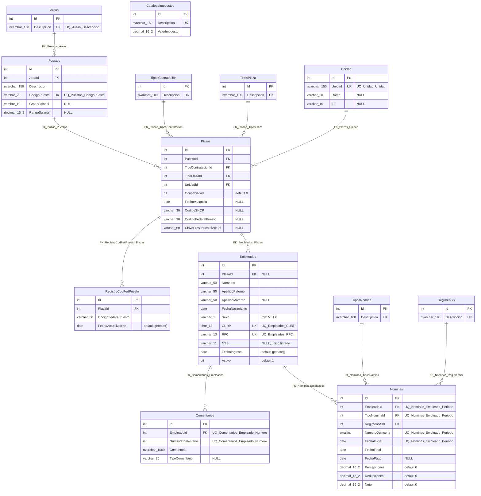

# Esquema `recursos_humanos` — visión general

Volver al índice: [[db-index]]

Las 13 tablas del dominio de recursos humanos viven en el esquema SQL **`recursos_humanos`** de la misma base que `acceso_usuario` (ver [[db-infrastructure]]). Tiene dos descripciones versionadas: el script `DataBase/scripts/RecursosHumanos.sql` y el mapeo EF de `Backend/Data/HumanResourcesDbContext.cs` con las 13 entidades de `Backend/Models/Schemas/HumanResources/`.

**No tiene repositorio, handler ni endpoints.** El contexto está registrado en DI (`Program.cs:52-57`) y ningún servicio lo consume todavía. Detalle del mapeo en [[be-dbcontext-entities]].

Hecho verificado — el script se ejecutó contra la instancia conectada el **2026-09-19** dentro de una transacción única, y las 13 tablas, 11 claves foráneas, 13 índices únicos y 1 restricción `CHECK` se confirmaron después consultando `sys.foreign_keys`, `sys.check_constraints`, `sys.indexes` e `INFORMATION_SCHEMA.COLUMNS`.

## Origen del modelo

El esquema traduce un diagrama entidad-relación entregado por el usuario, escrito en `snake_case` (`id_empleado`, `fcha_nac`, `desc_area`). La traducción a la convención del repositorio fue una decisión explícita:

| En el diagrama | En la base |
| --- | --- |
| PK `id_<entidad>` | `Id` |
| FK `id_<entidad>` | `<Entidad>Id` — `PlazaId`, `TipoContratacionId` |
| `desc_*` | `Descripcion` |
| `fcha_*`, `fcah_vacancia` | `Fecha*` |
| `cod_*`, `cve_*`, `gdo_*`, `no_*`, `num_*` | `Codigo*`, `Clave*`, `Grado*`, `Numero*` |

Los nombres de tabla que el diagrama ya traía en PascalCase se conservaron literalmente, incluido el singular `Unidad` y el `RegimenSS` sin plural; los que venían en minúscula o singular se normalizaron a plural (`nominas` → `Nominas`, `plaza` → `Plazas`, `Empleado` → `Empleados`). El resultado es el mismo patrón mixto que ya tiene `acceso_usuario`, donde conviven `TipoUsuario` y `Usuarios` (ver [[db-schema-acceso-usuario]]).

## Inventario de tablas

| Tabla SQL | Rol | Referencia a |
| --- | --- | --- |
| `Areas` | Catálogo de áreas orgánicas | — |
| `Puestos` | Catálogo de puestos por área | `Areas` |
| `TiposContratacion` | Catálogo | — |
| `TiposPlaza` | Catálogo | — |
| `Unidad` | Catálogo de unidad, ramo y ZE | — |
| `Plazas` | Plaza presupuestal | `Puestos`, `TiposContratacion`, `TiposPlaza`, `Unidad` |
| `RegistroCodFedPuesto` | Histórico de código federal por plaza | `Plazas` |
| `Empleados` | Persona empleada | `Plazas` |
| `Comentarios` | Comentarios por empleado | `Empleados` |
| `TiposNomina` | Catálogo | — |
| `RegimenSS` | Catálogo de régimen de seguridad social | — |
| `CatalogoImpuestos` | Catálogo aislado, sin FK | — |
| `Nominas` | Nómina quincenal por empleado | `Empleados`, `TiposNomina`, `RegimenSS` |

> **`recursos_humanos.Areas` no es `acceso_usuario.Areas`.** Son dos catálogos independientes, sin FK entre ellos. El de `acceso_usuario` son las áreas de la plataforma web, cuyo `Nombre` es clave de navegación del frontend (`TEMPLATE_REGISTRY`); el de aquí son áreas orgánicas del hospital a las que pertenecen los puestos. Renombrar uno no afecta al otro.

## Mapeo EF: trampas de nomenclatura

`HumanResourcesDbContext` declara una entidad por tabla, en singular, con el `DbSet` en plural. Cuatro nombres **no** se deducen de la tabla:

| Tabla SQL | Entidad C# | DbSet |
| --- | --- | --- |
| `TiposContratacion` | `TipoContratacion` | `TiposContratacion` |
| `TiposPlaza` | `TipoPlaza` | `TiposPlaza` |
| `TiposNomina` | `TipoNomina` | `TiposNomina` |
| **`Unidad`** (singular) | `Unidad` | **`Unidades`** |
| **`RegimenSS`** (singular) | `RegimenSS` | **`RegimenesSS`** |
| `CatalogoImpuestos` | `CatalogoImpuesto` | `CatalogoImpuestos` |
| `RegistroCodFedPuesto` (singular) | `RegistroCodFedPuesto` | `RegistroCodFedPuestos` |

Y dos **columnas cambian de nombre** al pasar a C#, porque el lenguaje prohíbe que un miembro se llame igual que el tipo que lo contiene (error CS0542):

| Columna SQL | Propiedad C# | Mapeo |
| --- | --- | --- |
| `Unidad.Unidad` | `Unidad.Nombre` | `.HasColumnName("Unidad")` |
| `Comentarios.Comentario` | `Comentario.Texto` | `.HasColumnName("Comentario")` |

Es el mismo recurso que ya usa `SolicitudUsuario.Comentario` → columna `comentario` en [[be-dbcontext-entities]]. **Al escribir SQL a mano o DTO, usar el nombre de columna, no el de la propiedad.**

> **`Area` existe dos veces en el backend.** `Backend.Models.Schemas.HumanResources.Area` y `Backend.Models.Schemas.UserAccess.Area` son clases distintas con el mismo nombre simple. Un archivo que importe ambos *namespaces* necesita alias o nombre completo. Son dominios distintos: áreas orgánicas del hospital frente a áreas de navegación de la plataforma.

## Diagrama ER

`CatalogoImpuestos` aparece sin aristas porque el diagrama de origen no le dibujó ninguna relación. Ver *Decisiones abiertas* más abajo.

## Convenciones de tipos

El diagrama no especificaba tipos de dato; los fijó el usuario y se aplicaron uniformemente:

| Clase de columna | Tipo SQL |
| --- | --- |
| Montos (`Percepciones`, `Deducciones`, `Neto`, `ValorImpuesto`, `RangoSalarial`) | `decimal(16,2)` |
| Fechas | `date` — nunca `datetime` |
| `Sexo` | `varchar(1)` con `CK_Empleados_Sexo CHECK (Sexo IN ('M','H','X'))` |
| Identificadores fiscales | `CURP char(18)`, `RFC varchar(13)`, `NSS varchar(11)` |
| Descripciones y texto libre | `nvarchar` |
| Códigos y claves presupuestales | `varchar` |
| Banderas | `bit` con `DEFAULT` |

`CK_Empleados_Sexo` es la **primera y única restricción `CHECK` de la base**: `acceso_usuario` no tiene ninguna, y su `Usuarios.Sexo varchar(1)` acepta cualquier carácter.

Los nombres de `Empleados` son `varchar(50)` frente a los `varchar(30)`/`varchar(20)` de `acceso_usuario.Usuarios`, porque aquí son nombres legales de acta y CURP y no alias de plataforma.

## Índices únicos

`UQ_Empleados_NSS` es un **índice único filtrado** (`WHERE NSS IS NOT NULL`), no una restricción `UNIQUE`. La razón: en SQL Server un `UNIQUE` normal trata `NULL` como un valor comparable y solo admite una fila nula, lo que habría bloqueado el segundo empleado registrado sin NSS. `CURP` y `RFC` sí son `UNIQUE` ordinarias porque son `NOT NULL`.

Los otros 12 son restricciones `UNIQUE` corrientes: `Descripcion` en cada catálogo, `UQ_Puestos_CodigoPuesto`, `UQ_Unidad_Unidad`, `UQ_Empleados_CURP`, `UQ_Empleados_RFC`, `UQ_Comentarios_Empleado_Numero (EmpleadoId, NumeroComentario)` y `UQ_Nominas_Empleado_Periodo (EmpleadoId, TipoNominaId, NumeroQuincena, FechaInicial)`.

Igual que en `acceso_usuario`, **ninguna FK tiene índice propio** y ninguna declara `ON DELETE`: todo borrado de un padre con hijos falla con error de integridad referencial.

## Decisiones abiertas

Puntos donde el diagrama de origen era ambiguo y el esquema aplicado tomó una postura que conviene revisar antes de construir backend encima:

1. **`Plazas.Ocupabilidad` es `bit`**, interpretado como ocupada/vacante. Si el negocio necesita porcentaje de ocupación o un catálogo de estados, el tipo es incorrecto.
2. **`CatalogoImpuestos` está aislado.** Si las deducciones de `Nominas` deben desglosarse por impuesto, falta una tabla puente `NominaImpuestos (NominaId, ImpuestoId, Monto)`.
3. **`Nominas.Neto` es columna normal, no calculada.** Nada garantiza que sea `Percepciones - Deducciones`; puede quedar inconsistente. La alternativa es `AS (Percepciones - Deducciones) PERSISTED`.
4. **`Plazas.CodigoFederalPuesto` y `RegistroCodFedPuesto.CodigoFederalPuesto` duplican el dato.** La lectura asumida es «vigente» contra «histórico», pero ninguna restricción lo garantiza.
5. **`Comentarios.TipoComentario` es texto libre `varchar(30)`**, sin catálogo: admite valores divergentes para el mismo concepto.
6. **`Unidad.ZE` quedó `varchar(10)` sin interpretar**, porque el diagrama no aclara qué significa la abreviatura.
7. **`Empleados.PlazaId` es nullable**, para poder registrar a alguien antes de asignarle plaza. Si el proceso real exige plaza desde el alta, debe ser `NOT NULL`.

## El script

`DataBase/scripts/RecursosHumanos.sql` crea el esquema con guarda (`IF NOT EXISTS` sobre `sys.schemas`, porque `Init.sql` ya lo crea; ver [[db-init-sql]]) y a continuación las 13 tablas con `CREATE TABLE` planos, en orden de dependencia. **No es idempotente**: reejecutarlo falla en la primera tabla existente. Cierra con un `SELECT` de verificación sobre `sys.tables`.

A diferencia de `Init.sql`, el script **no contiene datos semilla, credenciales ni datos personales**, así que no comparte el impedimento de versionado que aquél tiene (ver [[db-scripts-and-migrations]] y [[db-findings]]). Los catálogos quedaron vacíos: `Areas`, `Puestos`, `TiposContratacion`, `TiposPlaza`, `Unidad`, `TiposNomina`, `RegimenSS` y `CatalogoImpuestos` necesitan valores antes de poder insertar una plaza o una nómina.

## Enlaces

- [[db-index]] · [[db-schema-acceso-usuario]] · [[db-relationships]] · [[db-scripts-and-migrations]] · [[db-init-sql]] · [[db-infrastructure]] · [[db-findings]]
- Arquitectura: [[architecture-overview]]
