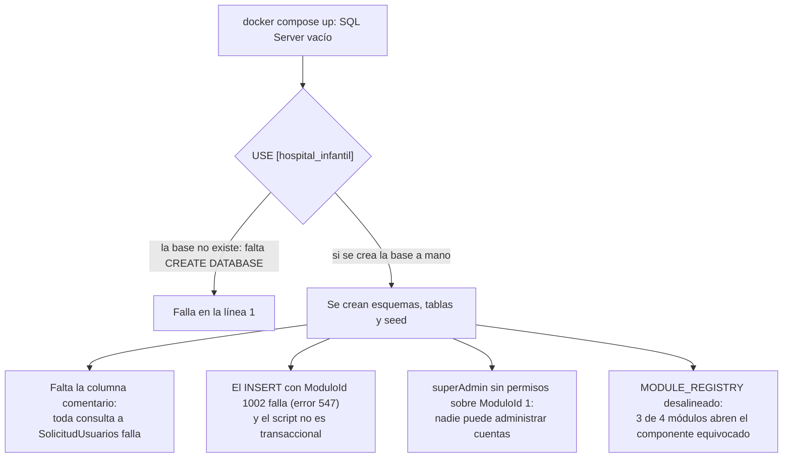

# Migraciones, scripts y aprovisionamiento

Volver al índice: [[db-index]] · Infraestructura: [[db-infrastructure]]

## Inventario verificado

| Artefacto | Estado el 2026-09-18 |
| --- | --- |
| `DataBase/scripts/Init.sql` | **Existe** en el árbol de trabajo (~13 KB). **Sin seguimiento en Git**: `git status` lo reporta como `?? DataBase/scripts/` y `git ls-files DataBase` solo devuelve `docker-compose.yml` |
| Carpeta `Backend/Migrations/` con migraciones EF | **No existe.** `find Backend -iname "*igration*"` (excluyendo `obj/` y `bin/`) no devuelve nada |
| Snapshot del modelo (`*ModelSnapshot.cs`) | **No existe** |
| `CREATE DATABASE` | **No existe**: `Init.sql` empieza con `USE [hospital_infantil]`, así que la base debe existir antes |
| Llamada a `Database.Migrate()` o `EnsureCreated()` | **No existe** en `Backend/Program.cs` (líneas 52-68) |
| Paso de aprovisionamiento en Compose o CI/CD | **No existe.** Ver [[db-infrastructure]] |
| Script de cambio incremental de `SolicitudUsuarios.comentario` | **No existe** ni en el árbol ni en el historial de Git, y **`Init.sql` no crea esa columna** |
| Diagrama o imagen del esquema | **No existe.** `DataBase/useraccess_schema.png` no está en el árbol ni en ningún commit |

> **Nota de procedencia.** `Init.sql` apareció en el árbol de trabajo mientras se redactaba esta documentación (marca de tiempo posterior al inicio del análisis) y **no está versionado**. Por tanto: describe una intención de aprovisionamiento, pero **no se puede afirmar que la instancia conectada corresponda a este script**. Nada de lo que sigue se comprobó ejecutando consultas contra la base real. Los identificadores que se deducen abajo son **inferencias del orden de inserción**, no lecturas de la base.

Herramientas de EF **sí** están referenciadas en `Backend/Backend.csproj:14-22` (`Design` y `Tools`, ambas `10.0.10`), pero no se ha generado ninguna migración. La forma del mapeo (clases `partial`, `OnModelCreatingPartial`, nombres de FK explícitos, BOM en las entidades) es la firma de `dotnet ef dbcontext scaffold`: **el modelo se generó desde la base**, no al contrario. `Init.sql` es coherente con eso: es el script escrito a mano del que se hizo scaffolding.

## Qué contiene `Init.sql`

> [!info] Análisis dedicado
> Esta sección resume el script. La lectura completa y anotada —DDL línea a línea contra el mapeo EF, identificadores deducidos del seed, los 8 defectos priorizados y el plan para volverlo usable— está en **[[db-init-sql]]**.

Script secuencial con lotes `GO`, **sin transacción, sin comprobaciones de existencia y no idempotente**. Incluye además sentencias `select *` sueltas de depuración (líneas 301, 404-405). Cinco bloques:

1. **Esquemas** (líneas 8-18): crea `core`, `recursos_humanos`, `contabilidad` y `acceso_usuario`. Los tres primeros quedan **vacíos**: ninguna tabla se crea en ellos y ninguna entidad EF los referencia. Son reserva para dominios futuros.
2. **Tablas** (líneas 44-157) de `TipoUsuario`, `Usuarios`, `Areas`, `Modulos`, `Permisos` y `UsuarioModuloPermisos`, más `ALTER`s correctivos (líneas 159-169).
3. **Seed de catálogos** (líneas 179-315): tipos, permisos, áreas y módulos.
4. **Usuarios iniciales y sus asignaciones** (líneas 321-421 y 447-554).
5. **`SolicitudUsuarios`** (líneas 424-443), creada al final y ampliada con `Aprobado` por `ALTER`.

## Lo que el script confirma del SQL físico

Estos puntos dejan de ser inferencias del mapeo EF y pasan a estar respaldados por DDL (siempre con la reserva de procedencia de arriba):

| Aspecto | Confirmado |
| --- | --- |
| Nombre de la base | `hospital_infantil` |
| Esquema | `acceso_usuario`, más tres esquemas vacíos reservados |
| IDENTITY | `IDENTITY(1,1)` en los seis `Id` de tabla con PK numérica, y también en `SolicitudUsuarios.Id` |
| Nombres de PK | `PK_TipoUsuario`, `PK_Usuarios`, `PK_Areas`, `PK_Modulos`, `PK_Permisos`, `PK_UsuarioModuloPermisos` |
| PK compuesta | `PRIMARY KEY (UsuarioId, ModuloId, PermisoId)` en el mismo orden que declara EF |
| Uniques | Los 7 declarados como **restricciones `UNIQUE`** (no como índices independientes), con los nombres que EF espera |
| FK | Las 5, **sin cláusula `ON DELETE`** → `NO ACTION`, coherente con `ClientSetNull`. Ver [[db-relationships]] |
| Defaults | `FechaIngreso DEFAULT GETDATE()` en `Usuarios` y `SolicitudUsuarios`; `Activo DEFAULT 1` en `Usuarios`, `Areas` y `Modulos`; **`Aprobado BIT NOT NULL DEFAULT 0`** |
| Tipos y longitudes | Coinciden con lo inferido en [[db-schema-acceso-usuario]], incluido el uso de `varchar` para nombres/apellidos/alias y `nvarchar` para correo y hash |
| Índices no únicos | Ninguno. Confirma el hallazgo sobre columnas FK sin índice |
| CHECK | Ninguno. `Sexo` no tiene restricción de valores |

Dos matices sobre los defaults: `SolicitudUsuarios.Aprobado` **sí** tiene default `0` en SQL, aunque EF no lo declare (la aplicación siempre asigna el valor explícitamente, así que no hay conflicto). Y `comentario` no aparece, luego no tiene default ninguno.

## Discrepancias verificadas entre `Init.sql` y el mapeo EF

### 1. `SolicitudUsuarios` se crea **sin clave primaria**

```sql
-- DataBase/scripts/Init.sql:424-438
CREATE TABLE acceso_usuario.SolicitudUsuarios (
    Id INT IDENTITY(1,1) NOT NULL,
    ...
    CONSTRAINT UQ_Solicitud_User UNIQUE (Username),
    CONSTRAINT UQ_Solicitud_correo UNIQUE (Correo)
);
```

No hay `PRIMARY KEY`. Es la única tabla del esquema sin PK, y contrasta con EF, que **sí** declara `HasKey(e => e.Id)` (`Backend/Data/UserAccessDbContext.cs:72`) — probablemente esa declaración explícita existe justamente porque el scaffolding no encontró PK y hubo que añadirla al modelo a mano.

Consecuencias:

- **EF cree que hay una PK y la base no la tiene.** `FindAsync(requestId)` sigue funcionando porque EF usa la clave de su modelo para construir el `WHERE`, pero la base no garantiza unicidad de `Id` ni aporta un índice agrupado por esa columna.
- Sin PK ni índice sobre `Id`, cada `FindAsync` y cada `UPDATE` por `Id` (aprobación, edición de comentario) requiere recorrido completo de la tabla.
- Sin restricción, nada impide dos filas con el mismo `Id` si alguien inserta con `IDENTITY_INSERT ON`.
- No es verificable desde el repositorio si la instancia real recibió después un `ALTER TABLE ... ADD CONSTRAINT PRIMARY KEY`.

### 2. `Init.sql` **no crea la columna `comentario`**

La deriva de esquema descrita en [[db-table-solicitud-usuarios]] **queda confirmada y agravada**: ni el script ni ningún otro artefacto del repositorio crean `SolicitudUsuarios.comentario`, pero EF la mapea (`UserAccessDbContext.cs:76-78`) y la API la devuelve (`Backend/Handlers/PlatformHandler.cs:82`).

Efecto concreto: **una base creada ejecutando `Init.sql` tal cual no funciona.** Toda consulta a `SolicitudUsuarios` —registro público incluido— falla con `Invalid column name 'comentario'`. Falta un `ALTER TABLE acceso_usuario.SolicitudUsuarios ADD comentario NVARCHAR(MAX) NULL;`.

### 3. `TipoUsuario.NivelUsuario` sigue sin `UNIQUE`

Confirmado: el script no añade restricción de unicidad. El hallazgo sobre `GET /Auth/userTypes` se mantiene (ver [[db-table-tipo-usuario]]), mitigado solo por el hecho de que el seed inserta cinco valores distintos.

### 4. Correcciones de tipo dentro del propio script

`TipoUsuario.NivelUsuario` se crea como `SMALLINT` y se convierte a `VARCHAR(15)`; `TipoUsuario.Descripcion` pasa de `VARCHAR(20) NULL` a `NVARCHAR(150) NOT NULL`; `Permisos.Descripcion` pasa de `NVARCHAR(50) NULL` a `NVARCHAR(150) NOT NULL` (líneas 159-169). El estado final coincide con EF, pero el script arrastra su propia historia en lugar de declarar el estado deseado.

## El seed de catálogos y los identificadores que implica

Los `Id` siguientes se **deducen del orden de inserción** sobre columnas `IDENTITY(1,1)` en una base recién creada. No son lecturas de la base y **no son verificables desde el repositorio**. En el caso de `Permisos`, además, un `INSERT` de varias filas no garantiza formalmente el orden de asignación de IDENTITY, aunque en la práctica lo siga.

### `TipoUsuario` (líneas 179-201)

| `Id` probable | `NivelUsuario` |
| --- | --- |
| 1 | `super_admin` |
| 2 | `admin` |
| 3 | `general` |
| 4 | `supervisor` |
| 5 | `inicial` |

Cinco niveles con descripciones que prometen semántica de privilegios ("acceso total", "permisos limitados"). **Ninguna de esas descripciones se aplica en el código**: el tipo no autoriza nada (ver [[db-table-tipo-usuario]]). Es documentación dentro de los datos, no comportamiento.

### `Permisos` (líneas 207-225)

| `Id` probable | `Nombre` |
| --- | --- |
| 1 | `ver` |
| 2 | `editar` |
| 3 | `crear` |
| 4 | `eliminar` |

Resultados importantes:

- **Los literales del servidor coinciden con el catálogo**: existen filas `editar` y `crear`, que son las que buscan las cuatro comprobaciones `EXISTS` (ver [[db-table-permisos]]). El riesgo de renombrado sigue vigente, pero hoy la autorización encuentra sus filas.
- **La suposición del frontend de que el permiso `Id = 1` es "Ver" queda respaldada**: `ver` es el primer permiso insertado. Esa regla vivía solo en el frontend (`.agent/MEMORY.md`); ahora hay un seed coherente con ella, aunque siga sin estar garantizada por el esquema.
- **`eliminar` no se usa en ninguna parte del código.** Ni el backend ni el frontend lo comprueban: es un permiso asignable sin efecto.

### `Areas` (líneas 231-253)

| `Id` probable | `Nombre` | `Activo` |
| --- | --- | --- |
| 1 | `plataforma` | 1 |
| 2 | `recursos humanos` | 1 |
| 3 | `contabilidad` | 1 |
| 4 | `almacen` | **0** |

- **Los nombres están en minúsculas**, y el `TEMPLATE_REGISTRY` del frontend usa claves en minúsculas aplicando `toLowerCase()` (`Frontend/src/pages/principalPage/principalPage.jsx:10-23`): la correspondencia funciona para las tres primeras. La etiqueta visible viene del registro, no de la base.
- `almacen` está **inactiva** y no tiene componente en el frontend. Como `GetAreas` filtra `Activo`, no aparece en el catálogo; y como no tiene módulos, no aparece en los accesos de nadie.
- Confirma el acoplamiento descrito en [[db-table-areas]]: estos tres nombres son contrato con el frontend.

### `Modulos` (líneas 259-315) — y una incoherencia grave con el frontend

| `Id` probable | `Nombre` | Área |
| --- | --- | --- |
| 1 | `configuracion de cuentas` | plataforma |
| 2 | `Administrar Permisos` | plataforma |
| 3 | `Complemento de Pago` | contabilidad |
| 4 | `Administrar Plazas` | recursos humanos |

Contrastado con el registro del frontend (`Frontend/src/templates/shared/areaTemplate.jsx:8-12`, `{1: AccountsModule, 2: PlacesModule, 3: PermitsModule}`):

| `Modulos.Id` | Módulo real según el seed | Componente que renderizaría el frontend | ¿Correcto? |
| --- | --- | --- | --- |
| 1 | `configuracion de cuentas` (plataforma) | `AccountsModule` | **Sí** |
| 2 | `Administrar Permisos` (plataforma) | `PlacesModule` (administrar plazas) | **No** |
| 3 | `Complemento de Pago` (contabilidad) | `PermitsModule` (administrar permisos) | **No** |
| 4 | `Administrar Plazas` (recursos humanos) | ninguno registrado → "sin contenido" | **No** |

Es decir: **tres de los cuatro módulos del seed apuntan al componente equivocado o a ninguno.** La pestaña "Administrar Permisos" de Plataforma mostraría la vista de plazas, y la de plazas de Recursos Humanos no mostraría nada. El `MODULE_REGISTRY` parece haberse escrito contra un orden de catálogo distinto del que produce este script. Es la materialización exacta del riesgo documentado en [[db-table-modulos]] y [[fe-templates-areas-modules]].

Buena noticia dentro del problema: **`Modulos.Id = 1` sí es `configuracion de cuentas` del área `plataforma`**, luego el literal `ModuloId == 1` escrito a mano en las cuatro comprobaciones de autorización del repositorio apunta al módulo correcto. El acoplamiento sigue siendo frágil, pero no está desalineado.

## Los usuarios iniciales del script y su problema de permisos

El script inserta tres cuentas (líneas 328-357 y 464-521). **No se reproducen aquí sus datos**: contienen un **hash BCrypt literal** asignado a la variable `@PasswordHash` y **datos personales reales** (nombres y direcciones de correo, una de ellas de un dominio público). Solo se documenta su estructura:

| Alias | Tipo | Asignaciones que el script intenta crear |
| --- | --- | --- |
| `superAdmin` | `super_admin` | `ModuloId` **4**, **2** y **3**, con los 4 permisos cada uno |
| `RecursosH` | `admin` | `ModuloId` **2**, con los 4 permisos |
| `Contab` | `admin` | `ModuloId` **1002**, con los 4 permisos |

Cuatro defectos verificados en este bloque:

1. **`superAdmin` no recibe ningún permiso sobre `ModuloId = 1`.** El comentario del script dice "Asignar los 4 permisos al ModuloId 1" (línea 362), pero las tres sentencias insertan los identificadores literales `4`, `2` y `3` (líneas 372, 385, 398). Como toda la autorización de escritura del servidor exige `editar`/`crear` sobre `ModuloId == 1`, **la cuenta de superadministrador del seed no puede aprobar solicitudes, ni dar de baja usuarios, ni editar comentarios, ni actualizar permisos**: los cuatro endpoints responden 403. El sistema quedaría sin nadie capaz de administrar cuentas, que es justo el problema de arranque en frío descrito más abajo.
2. **`ModuloId = 1002` no existe.** Solo hay módulos 1 a 4, así que ese `INSERT` viola `FK_UsuarioModuloPermisos_Modulos` (error 547). Como el script **no tiene transacción**, el lote falla dejando el resto ya aplicado: el usuario `Contab` existe sin ninguna asignación.
3. **Identificadores de usuario escritos a mano.** Las asignaciones de `superAdmin` usan el literal `1` como `UsuarioId` (líneas 371, 384, 397) en lugar de la variable `@UsuarioId` que el propio script calcula con `SCOPE_IDENTITY()` (línea 359). Si esa cuenta no fuera la primera fila, los permisos se asignarían a otra persona.
4. **Un único hash compartido por las tres cuentas.** La misma variable `@PasswordHash` se reutiliza en los tres `INSERT`, así que **una sola contraseña conocida abre las tres cuentas**, incluida la de tipo `super_admin`. Añádase que `RecursosH` y `Contab` comparten también nombre y apellidos.

### Riesgo de seguridad de `Init.sql`

| Aspecto | Evaluación |
| --- | --- |
| Contenido sensible | Un hash BCrypt de contraseña real reutilizado en tres cuentas, y datos personales reales (nombres y correos) |
| Situación en Git | **Hoy no está versionado** (`?? DataBase/scripts/`). Eso lo salva por ahora |
| Riesgo | Si se hace `git add DataBase/scripts/`, el hash y los datos personales entran en el historial de forma permanente. Dado que `.gitignore` solo contiene `.agent/`, nada lo impide |
| Acción | Antes de versionar: extraer las credenciales a variables o a un script de arranque no versionado, sustituir los datos personales por valores de ejemplo y rotar la contraseña de esas tres cuentas |

Ver también la credencial de `sa` versionada en [[db-infrastructure]].

## El arranque en frío sigue sin resolverse

`Init.sql` acerca el objetivo pero no lo alcanza. Ejecutarlo tal cual sobre un SQL Server recién levantado con `DataBase/docker-compose.yml`:



Faltan, en concreto: `CREATE DATABASE`, la columna `comentario`, la PK de `SolicitudUsuarios`, corregir los `ModuloId` de las asignaciones iniciales, envolver todo en una transacción y hacerlo idempotente. Y ningún paso de Compose ni de CI/CD lo ejecuta ([[db-infrastructure]]).

## Lo que sigue sin ser verificable desde el repositorio

Aunque `Init.sql` resuelve muchas dudas sobre la **intención**, no certifica el estado de la instancia conectada. Sigue sin ser verificable:

- Si la base real se creó con este script o divergió de él.
- Si `SolicitudUsuarios` tiene hoy PK y la columna `comentario`.
- Los `Id` reales de áreas, módulos, permisos y tipos (aquí solo se infieren del orden de inserción).
- Si las asignaciones de `superAdmin` se corrigieron a mano después.
- La collation de la base y de cada columna, determinante para la sensibilidad a mayúsculas de los uniques y de las comparaciones de `Alias`, `Correo` y `Permisos.Nombre`.
- Triggers, vistas, procedimientos, funciones o índices añadidos fuera de este script.
- Si hay tablas adicionales en `acceso_usuario` sin entidad EF, o si los esquemas `core`, `recursos_humanos` y `contabilidad` siguen vacíos.
- Si algún usuario tiene `Activo = 0` (el código nunca escribe ese valor, ver [[db-table-usuarios]]).

## Recomendación de secuencia

1. **Versionar el aprovisionamiento**, pero antes limpiarlo: quitar el hash y los datos personales, quitar las sentencias `select *` de depuración.
2. **Completarlo**: `CREATE DATABASE` (o documentar que es requisito previo), PK de `SolicitudUsuarios`, columna `comentario`, y una transacción con `SET XACT_ABORT ON`.
3. **Corregir el seed**: asignar a la cuenta administradora los permisos sobre `ModuloId = 1`, usar `SCOPE_IDENTITY()` en lugar de literales y eliminar el `ModuloId = 1002` inexistente.
4. **Alinear `MODULE_REGISTRY` con los `Modulos.Id` reales**, o desacoplar el frontend del identificador numérico.
5. **Hacerlo idempotente** (`IF NOT EXISTS`) para poder reejecutarlo sin destruir datos.
6. **Decidir el mecanismo de evolución**: migraciones EF con una migración inicial marcada como ya aplicada, o scripts numerados con tabla de control. No mezclar ambos.
7. **Aplicar los cambios en el despliegue**, que hoy no toca la base en absoluto ([[db-infrastructure]], [[be-deployment]]).
8. **Definir copias de seguridad** del volumen antes de cualquier paso automatizado.

## Enlaces

- [[db-init-sql]] — análisis completo y anotado del script
- [[db-index]] · [[db-infrastructure]] · [[db-schema-acceso-usuario]] · [[db-findings]] · [[db-queries-by-feature]] · [[db-relationships]]
- Tablas afectadas: [[db-table-solicitud-usuarios]] · [[db-table-areas]] · [[db-table-modulos]] · [[db-table-permisos]] · [[db-table-tipo-usuario]] · [[db-table-usuarios]] · [[db-table-usuario-modulo-permisos]]
- Backend: [[be-dbcontext-entities]] · [[be-deployment]] · [[be-index]] · [[be-repository]] · [[be-auth-session]]
- Frontend: [[fe-templates-areas-modules]] · [[fe-interfaces]]
- Arquitectura: [[architecture-overview]]
