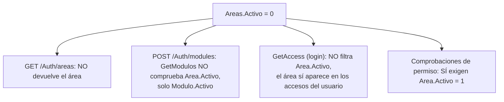

# `acceso_usuario.Areas`

Entidad `Area` · DbSet `Areas` · Mapeo en `Backend/Data/UserAccessDbContext.cs:31-40` · Entidad en `Backend/Models/Schemas/UserAccess/Area.cs`

Catálogo de áreas funcionales del hospital (Plataforma, Recursos Humanos, Contabilidad…). Es el nivel superior de la jerarquía de navegación.

## Columnas

| Columna | Tipo SQL inferido | Nulable | Default | Restricción / propósito |
| --- | --- | --- | --- | --- |
| `Id` | `int` | No | IDENTITY (convención) | PK por convención |
| `Nombre` | `nvarchar(30)` | No | — | Único: `UQ_Areas_Nombre` (línea 35). **Es contrato con el frontend** |
| `Descripcion` | `nvarchar(250)` | **Sí** | — | Opcional; ningún endpoint la devuelve hoy |
| `Activo` | `bit` | No | `true` (línea 37) | Los catálogos filtran por esta columna |

Navegación: `Modulos` (colección). Área es el lado "uno" de `FK_Modulos_Areas`.

`Nombre` es `nvarchar` (no lleva `IsUnicode(false)`), a diferencia de `Permisos.Nombre` y `TipoUsuario.NivelUsuario`, que son `varchar`. Asimetría del mapeo, no un requisito conocido.

## Operaciones SQL

| Método | SQL | Filtro | Seguimiento | Ubicación |
| --- | --- | --- | --- | --- |
| `GetAreas()` | `SELECT` | `Activo` | Con seguimiento | `UserAccessRepository.cs:99-106` |
| `GetAreasById(areasId)` | `SELECT ... WHERE Id IN (...)` | `Activo` | Con seguimiento | `UserAccessRepository.cs:85-92` — **sin llamadores en el código actual** |
| Lecturas indirectas | `JOIN` desde `Modulos` | `Activo` en las comprobaciones de permiso; **sin filtro** en `GetAccess` | Con seguimiento | `UserAccessRepository.cs:65, 151, 222, 241, 312` |

**No existe ninguna escritura sobre esta tabla.** No hay `INSERT`, `UPDATE` ni `DELETE` de áreas en todo el repositorio: es un catálogo de sólo lectura para la aplicación, poblado exclusivamente a mano en SQL.

## Filas según el seed de `Init.sql`

`DataBase/scripts/Init.sql:231-253` inserta cuatro áreas. Los `Id` se **deducen del orden de inserción** sobre `IDENTITY(1,1)`; no son lecturas de la base y el script no está versionado ([[db-scripts-and-migrations]]).

| `Id` probable | `Nombre` | `Activo` | Componente del frontend |
| --- | --- | --- | --- |
| 1 | `plataforma` | 1 | `Platform` |
| 2 | `recursos humanos` | 1 | `HumanResources` |
| 3 | `contabilidad` | 1 | `Contability` |
| 4 | `almacen` | **0** | ninguno |

Observaciones:

- **Los nombres están en minúsculas y sin acentos**, lo que encaja con las claves del `TEMPLATE_REGISTRY` y con el `toLowerCase()` de la resolución: los tres primeros se resuelven correctamente. La etiqueta visible en el menú viene del registro del frontend, no de esta columna.
- `almacen` está **inactiva**: no aparece en `GET /Auth/areas`, no tiene módulos y por tanto no aparece en los accesos de nadie. Es la única fila que ejercita el filtro `Activo`.
- El área lógica `inicio` del frontend no corresponde a ninguna de estas filas.

Ninguna lectura de esta tabla usa `AsNoTracking`, aunque nunca se modifican. Ver [[db-findings]].

## `Nombre` es un contrato rígido con el frontend

El JSON de `accesos` que devuelve el login se agrupa por **nombre de área**, no por su `Id`:

```csharp
// Backend/Models/Repositories/UserAccessRepository.cs:71
.GroupBy(p => p.Modulo.Area.Nombre)
```

Y el frontend resuelve el componente de área con un diccionario de claves literales en minúsculas:

```javascript
// Frontend/src/pages/principalPage/principalPage.jsx:10-15
const TEMPLATE_REGISTRY = {
    inicio: { label: 'Inicio', component: Start },
    plataforma: { label: 'Plataforma', component: Platform },
    'recursos humanos': { label: 'Recursos Humanos', component: HumanResources },
    contabilidad: { label: 'Contabilidad', component: Contability },
};
```

La resolución solo aplica `toLowerCase()` (`principalPage.jsx:23`): **no recorta espacios ni normaliza acentos**. Consecuencias concretas de un `UPDATE` en esta columna:

| Cambio en `Areas.Nombre` | Efecto en la aplicación |
| --- | --- |
| `Plataforma` → `Plataforma ` (espacio final) | El área aparece en el menú pero no encuentra componente: pantalla de error al abrirla |
| `Recursos Humanos` → `RH` | Igual: el área existe, la vista no |
| `Contabilidad` → `Contabilidad.` | Igual |
| Cualquier renombrado consistente con el registro | Funciona, pero exige cambiar también el frontend |

Un cambio de `Nombre` **conservando el `Id`** rompe la navegación, mientras que cambiar el `Id` conservando el `Nombre` no la rompe (el nombre es la clave real de esta capa). Es el opuesto de lo que ocurre con [[db-table-modulos]], donde el `Id` es lo que importa. Ver [[fe-templates-areas-modules]].

Además, el área lógica `inicio` del frontend **no corresponde a ninguna fila** de esta tabla: se añade siempre al menú (`principalPage.jsx:32`) y no requiere asignación de permisos.

## Asimetría del filtro `Activo`



Desactivar un área produce por tanto un estado incoherente, verificable en el código:

- El usuario **sigue viendo** la pestaña de esa área en el menú, porque viene del JSON de `accesos` que no filtra `Activo` (`UserAccessRepository.cs:61-83`).
- El nombre del módulo puede quedar indefinido, porque el catálogo de áreas no la incluye y el frontend convierte nombres de área a `Id` usando ese catálogo.
- Cualquier escritura del módulo de cuentas queda **denegada**, porque las comprobaciones `EXISTS` sí exigen `Area.Activo = 1` (`UserAccessRepository.cs:151`).

Desactivar el área de Plataforma bloquearía a todos los administradores de cuentas sin quitarles la pestaña. Ver [[db-findings]].

## Enlaces

- [[db-table-modulos]] — hijas vía `FK_Modulos_Areas`
- [[db-table-usuario-modulo-permisos]] — el área se alcanza navegando desde aquí
- [[db-relationships]] · [[db-queries-by-feature]] · [[db-schema-acceso-usuario]] · [[db-findings]] · [[db-index]]
- Backend: [[be-repository]] · [[be-api-reference]] · [[be-dbcontext-entities]]
- Frontend: [[fe-templates-areas-modules]] · [[fe-interfaces]]
