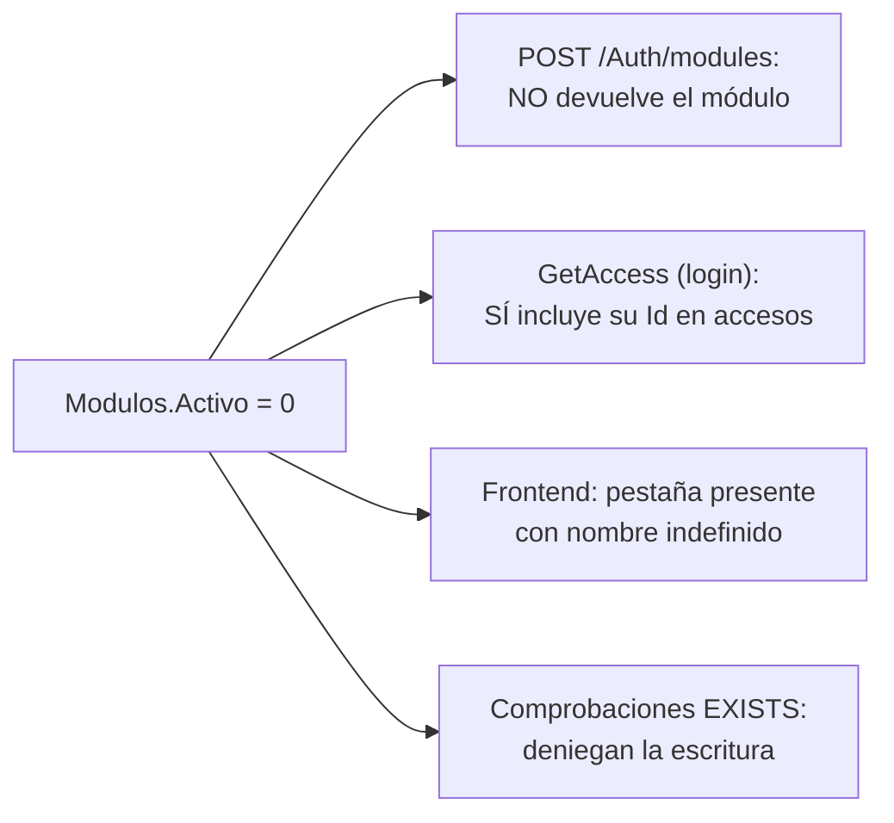

# `acceso_usuario.Modulos`

Entidad `Modulo` · DbSet `Modulos` · Mapeo en `Backend/Data/UserAccessDbContext.cs:42-56` · Entidad en `Backend/Models/Schemas/UserAccess/Modulo.cs`

Catálogo de módulos (pestañas) que pertenecen a un área. Es el nivel intermedio de la jerarquía y el objeto sobre el que se asignan permisos.

## Columnas

| Columna | Tipo SQL inferido | Nulable | Default | Restricción / propósito |
| --- | --- | --- | --- | --- |
| `Id` | `int` | No | IDENTITY (convención) | PK por convención. **Es contrato con el frontend y con la autorización del backend** |
| `AreaId` | `int` | No | — | FK `FK_Modulos_Areas` → [[db-table-areas]]; parte de `UQ_Modulos_Area_Nombre` |
| `Nombre` | `nvarchar(100)` | No | — | Único **junto con `AreaId`**: `UQ_Modulos_Area_Nombre` (línea 46) |
| `Descripcion` | `nvarchar(250)` | **Sí** | — | Opcional; ningún endpoint la devuelve |
| `Activo` | `bit` | No | `true` (línea 48) | Filtrado en `GetModulos` y en las comprobaciones de permiso |

Navegaciones: `Area` (requerida) y `UsuarioModuloPermisos` (colección).

La unicidad es **compuesta**: el mismo `Nombre` de módulo puede repetirse en áreas distintas (por ejemplo un "Reportes" en Plataforma y otro en Contabilidad), pero no dos veces dentro de la misma área.

No existe índice declarado sobre `AreaId` por separado. El índice compuesto `(AreaId, Nombre)` sí puede servir para filtrar por `AreaId`, ya que es la columna principal.

## Operaciones SQL

| Método | SQL | Filtro | Seguimiento | Ubicación |
| --- | --- | --- | --- | --- |
| `GetModulos(areasId)` | `SELECT ... WHERE AreaId IN (...) AND Activo` | `Modulo.Activo`; **no** comprueba `Area.Activo` | Con seguimiento | `UserAccessRepository.cs:116-122` |
| `GetAccess(usuarioId)` | `JOIN` vía `Include(Modulo).ThenInclude(Area)` | **sin filtro de `Activo`** | Con seguimiento | `UserAccessRepository.cs:63-68` |
| `GetUserPermissionsAdminAsync(id)` | `JOIN` vía `Include`s | **sin filtro de `Activo`** | Con seguimiento | `UserAccessRepository.cs:301-305` |
| Comprobaciones de permiso (4 métodos) | `EXISTS` con `JOIN` | `Modulo.Activo` **y** `Area.Activo` | — | `UserAccessRepository.cs:151, 222, 241, 312` |

**No existe ninguna escritura sobre esta tabla**: ni `INSERT`, ni `UPDATE`, ni `DELETE`. Como [[db-table-areas]], es un catálogo que solo se puebla manualmente en SQL.

## Filas reales de la instancia conectada

Leídas de la base el **2026-09-19**, no deducidas del seed. Siete filas, todas `Activo = 1`:

| `Id` | `Nombre` | Área | Componente en `MODULE_REGISTRY` |
| --- | --- | --- | --- |
| 1 | `configuracion de cuentas` | plataforma (1) | `AccountsModule` |
| 2 | `Administrar Plazas` | recursos humanos (2) | `PlacesModule` |
| 3 | `Administrar Permisos` | plataforma (1) | `PermitsModule` |
| **4** | **`Administrar Empleados`** | recursos humanos (2) | `EmployeesModule` (andamio) |
| **5** | **`Registrar Nominas`** | recursos humanos (2) | `PayrollModule` (andamio) |
| **6** | **`Generar FOMOPE`** | recursos humanos (2) | `FomopeModule` (andamio) |
| 1002 | `Complemento de Pago` | contabilidad (3) | ninguno → "sin contenido" |

**El `MODULE_REGISTRY` del frontend está alineado** para los ids 1 al 6; el único módulo sin componente es `1002`. La advertencia histórica de que «tres de los cuatro módulos abren el componente equivocado» venía de deducir los `Id` del orden de inserción de `DataBase/scripts/Init.sql:259-315`, y ese orden **no** es el de la instancia conectada. Queda como aviso sobre el método, no como defecto vigente.

Los ids **4, 5 y 6** se insertaron con `SET IDENTITY_INSERT ON` para que el registro del frontend quedara legible. El `IDENTITY` sigue en **2001** —hay un hueco entre 6 y 1002 por un reseed anterior—, así que la próxima alta automática tomará 2002 sin colisionar con los ids forzados.

`Id = 1` es `configuracion de cuentas` del área `plataforma`, luego el literal `ModuloId == 1` de las comprobaciones de autorización apunta al módulo correcto.

Nótese la inconsistencia de estilo en los nombres: `configuracion de cuentas` en minúsculas sin acento, frente al resto en formato título. Esos nombres son los que el frontend muestra como etiqueta de pestaña.

`GetModulos` no valida que el usuario tenga acceso a las áreas que pide: recibe una lista de `AreaId` del cuerpo de la petición (`POST /Auth/modules`) y devuelve los módulos activos de esas áreas. El endpoint no lleva `[Authorize]` (`Backend/Controllers/AuthController.cs:76-77`), por lo que el catálogo completo de módulos es enumerable sin credenciales pasando cualquier lista de identificadores. Ver [[be-api-reference]] y [[db-findings]].

## `Id` es un contrato rígido, en dos sitios a la vez

### 1. En el frontend, elige el componente a renderizar

```javascript
// Frontend/src/templates/shared/areaTemplate.jsx:11-18
const MODULE_REGISTRY = {
    1: AccountsModule,
    2: PlacesModule,
    3: PermitsModule,
    4: EmployeesModule,
    5: PayrollModule,
    6: FomopeModule,
};
```

El registro es **global por `Id`**, no por combinación área+nombre (`areaTemplate.jsx:50`). Si un módulo de Contabilidad recibiera el `Id` 1, se renderizaría el módulo de configuración de cuentas dentro de Contabilidad.

### 2. En el backend, `ModuloId == 1` está escrito a mano en la capa de datos

Éste es el acoplamiento más severo, y es nuevo respecto a `.agent/CONTEXT.md`. Las cuatro comprobaciones de autorización del repositorio comparan contra el literal `1`:

```csharp
// Backend/Models/Repositories/UserAccessRepository.cs:147-152
// El módulo 1 corresponde a configuración de cuentas en MODULE_REGISTRY.
// ...
access.ModuloId == 1 && access.Modulo.Activo && access.Modulo.Area.Activo &&
access.Permiso.Nombre.Trim().ToLower() == "editar", cancellationToken);
```

Repetido en las líneas 151 (baja), 222 (comentarios, con `"crear"`), 241 (aprobación) y 312 (actualización de permisos). El propio comentario del código reconoce que el valor procede del `MODULE_REGISTRY` del frontend.

Impacto si el `Modulos.Id` de "configuración de cuentas" no fuera 1 en la instancia real:

| Escenario | Efecto |
| --- | --- |
| El módulo de cuentas tiene otro `Id` | Nadie puede aprobar, dar de baja ni editar comentarios: todas las escrituras devuelven 403 aunque los permisos estén bien asignados |
| Otro módulo (de cualquier área) tiene el `Id` 1 | Quien tenga `editar` en **ese** módulo puede aprobar y borrar usuarios. **Escalada de privilegios entre áreas** |
| Se recrea el catálogo y los IDENTITY cambian | Ambos efectos, sin ningún error visible: la autorización simplemente apunta a otra fila |

El seed de `Init.sql` **es coherente** con este literal: su primer módulo insertado es `configuracion de cuentas` del área `plataforma`, luego recibiría el `Id` 1. Pero que la instancia conectada tenga ese contenido **no es verificable desde el repositorio**, y el script no está versionado. Sigue siendo una suposición sobre datos que gobierna toda la autorización de escritura. Ver [[db-findings]] y [[fe-templates-areas-modules]].

## Asimetría del filtro `Activo`



Un módulo inactivo sigue apareciendo en el JSON de `accesos` porque `GetAccess` no filtra `Activo` (`UserAccessRepository.cs:63-68`), pero desaparece del catálogo que resuelve nombres. El frontend dibuja la pestaña sin nombre y no la oculta (`areaTemplate.jsx`). Desactivar el módulo 1 también anularía todas las operaciones de escritura de cuentas, porque las comprobaciones `EXISTS` exigen `Modulo.Activo = 1`.

## Enlaces

- [[db-table-areas]] — padre vía `FK_Modulos_Areas`
- [[db-table-usuario-modulo-permisos]] — hijas: asignaciones sobre este módulo
- [[db-table-permisos]] — el otro eje de la asignación
- [[db-relationships]] · [[db-queries-by-feature]] · [[db-schema-acceso-usuario]] · [[db-findings]] · [[db-index]]
- Backend: [[be-repository]] · [[be-api-reference]] · [[be-auth-session]] · [[be-dbcontext-entities]]
- Frontend: [[fe-templates-areas-modules]] · [[fe-interfaces]]
