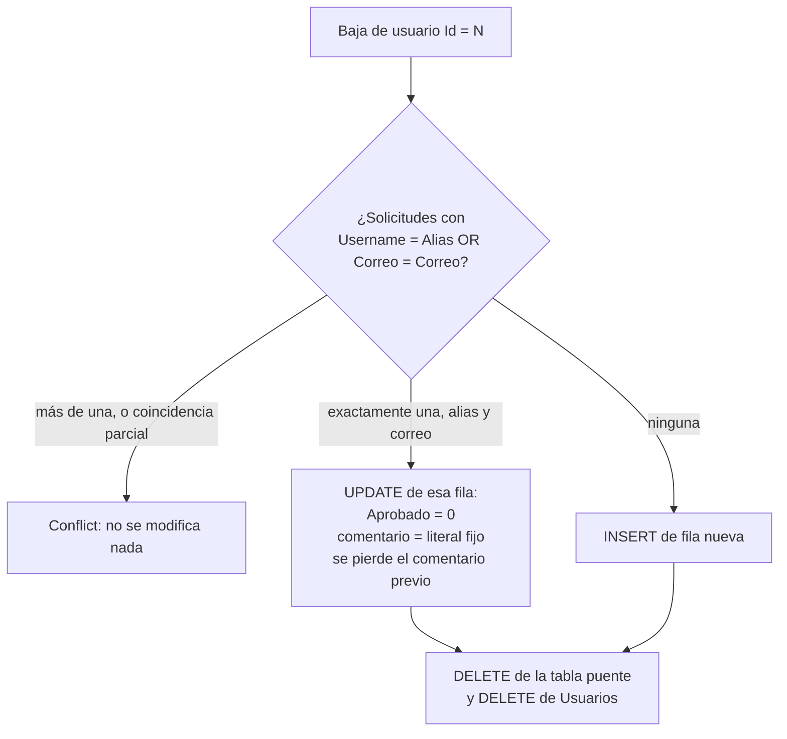

# `acceso_usuario.SolicitudUsuarios`

Entidad `SolicitudUsuario` · DbSet `SolicitudUsuarios` · Mapeo en `Backend/Data/UserAccessDbContext.cs:70-103` · Entidad en `Backend/Models/Schemas/UserAccess/SolicitudUsuario.cs`

Solicitudes de acceso pendientes o procesadas. Es una tabla **aislada**: sin ninguna clave foránea, ni entrante ni saliente.

**Cambio importante de semántica respecto a `.agent/CONTEXT.md`:** esta tabla ya no es solo la bandeja de entrada del registro. También es el **destino de las bajas**: cuando se da de baja a un usuario activo, su fila de `Usuarios` se borra y sus datos se escriben aquí. Es, de hecho, la tabla de "personas que no son cuentas ahora mismo".

## Columnas

| Columna | Tipo SQL inferido | Nulable | Default | Restricción / propósito |
| --- | --- | --- | --- | --- |
| `Id` | `int` | No | IDENTITY (`ValueGeneratedOnAdd()`, línea 92) | PK **explícita en EF**: `HasKey(e => e.Id)` (línea 72). **Pero `Init.sql` crea la tabla sin `PRIMARY KEY`**: ver abajo |
| `Nombre` | `varchar(30)` | No | — | `IsUnicode(false)` |
| `ApellidoPaterno` | `varchar(20)` | No | — | `IsUnicode(false)` |
| `ApellidoMaterno` | `varchar(20)` | No | — | `IsUnicode(false)` |
| `FechaNacimiento` | `date` | No | — | Del registro llega como `yyyy-MM-dd` y se convierte con `DateOnly.ParseExact` |
| `Sexo` | `varchar(1)` | No | — | Sin CHECK declarado |
| `FechaIngreso` | `date` | No | `(getdate())` (línea 91) | El registro la fija explícitamente con la fecha **local del servidor** |
| `Username` | `varchar(10)` | No | — | Único: `UQ_Solicitud_User` |
| `Correo` | `nvarchar(100)` | No | — | Único: `UQ_Solicitud_correo` |
| `PasswordHash` | `nvarchar(500)` | No | — | Hash BCrypt |
| `Aprobado` | `bit` | No | **sin default declarado en EF** | El registro asigna `false`; la aprobación lo pone en `true`; la baja lo **vuelve a poner** en `false` |
| `comentario` | `nvarchar(max)` | **Sí** | Sin default | Propiedad C# `string? Comentario`, mapeada con nombre de columna en minúsculas |

Sin navegaciones: la clase no declara ninguna propiedad de navegación (`SolicitudUsuario.cs` termina en `Comentario`).

### Sin clave primaria en SQL

`DataBase/scripts/Init.sql:424-438` crea esta tabla con `Id INT IDENTITY(1,1) NOT NULL` y **solo** las restricciones `UQ_Solicitud_User` y `UQ_Solicitud_correo`: no declara `PRIMARY KEY`. Es la única tabla del esquema sin PK, y probablemente la razón de que EF la declare explícitamente con `HasKey` en lugar de por convención.

Consecuencias: EF opera sobre una clave que la base no garantiza (`FindAsync` funciona porque construye el `WHERE` desde el modelo), no hay índice sobre `Id`, y cada búsqueda o `UPDATE` por `Id` —aprobación y edición de comentario— implica recorrido completo de la tabla. Si la instancia real recibió después un `ALTER TABLE ... ADD CONSTRAINT PRIMARY KEY`, **no es verificable desde el repositorio**. Ver [[db-scripts-and-migrations]] y [[db-findings]].

### La columna `comentario` es un caso especial

```csharp
// Backend/Data/UserAccessDbContext.cs:76-78
entity.Property(e => e.Comentario)
    .HasColumnName("comentario")
    .HasColumnType("nvarchar(max)");
```

- Es la **única** columna del esquema con nombre físico en minúsculas y con `HasColumnName` explícito. Todas las demás usan el nombre de la propiedad C#. El mapeo explícito existe precisamente porque la columna se creó a mano en SQL con otra convención.
- Es la **única** columna con `HasColumnType` explícito en lugar de `HasMaxLength`.
- `.agent/CONTEXT.md` §15 documenta un script `DataBase/scripts/20260908_add_comentario_solicitud_usuarios.sql` que habría creado esta columna. **Ese script no existe hoy en el repositorio ni en el historial de Git** (`git ls-files DataBase` devuelve solo `docker-compose.yml`). Ver [[db-scripts-and-migrations]].
- **`DataBase/scripts/Init.sql` tampoco la crea**: su `CREATE TABLE` de `SolicitudUsuarios` (líneas 424-438) termina en `PasswordHash`, y el único `ALTER` posterior añade `Aprobado`.
- Resultado: la columna existe en el mapeo EF y presuntamente en la instancia conectada, pero **ningún artefacto del repositorio la crea**. Una base levantada con `Init.sql` no la tendría, y **toda** consulta a `SolicitudUsuarios` —incluido el registro público— fallaría con "Invalid column name 'comentario'". Éste es el ejemplo más claro del riesgo descrito en [[db-findings]].

## Escrituras que recibe

| Operación | SQL | Transacción | Ubicación |
| --- | --- | --- | --- |
| Registro público (`POST /Auth/register`) | `INSERT` | No, `SaveChangesAsync` simple | `UserAccessRepository.cs:38-59` |
| Aprobación | `UPDATE Aprobado = 1` | **Sí**, explícita | `UserAccessRepository.cs:292` |
| Baja de un usuario activo | `INSERT` **o** `UPDATE` de todas las columnas | **Sí**, explícita, `Serializable` | `UserAccessRepository.cs:171-191` |
| Edición de comentario (`PUT /Platform/UserRequest/{id}/comment`) | `UPDATE` | No, `SaveChangesAsync` simple | `UserAccessRepository.cs:218-234` |

### Registro: `comentario` queda en NULL

`CreateUserSolicitado` (líneas 41-53) construye la entidad **sin** asignar `Comentario`. Como la columna es anulable y no tiene default, cada solicitud nueva guarda `NULL`. Conviven por tanto `NULL` y `''` (cadena vacía) como "sin comentario", según el origen de la fila. Cualquier consumidor debe tratar ambos.

### La baja reutiliza filas y puede destruir información

`DeactivateUser` (líneas 160-191) busca solicitudes cuyo `Username` coincida con el `Alias` del usuario **o** cuyo `Correo` coincida, y proyecta además una bandera `SameIdentity` que exige que coincidan *ambos*:

- **> 1 coincidencia**, o **cualquier coincidencia parcial** (alias sí y correo no, o al revés) → devuelve `Conflict` y no toca nada (líneas 168-169). Esto protege los índices `UQ_Solicitud_User` y `UQ_Solicitud_correo`, que por separado no impiden que dos filas distintas reclamen partes de una misma identidad.
- **Exactamente 1 coincidencia total** → **reutiliza esa fila** y sobrescribe todas sus columnas.
- **0 coincidencias** → inserta una fila nueva.

En el camino de reutilización, la fila existente (normalmente la solicitud ya aprobada que originó la cuenta) se sobrescribe así:

```csharp
// Backend/Models/Repositories/UserAccessRepository.cs:187-188
solicitud.Aprobado = false;
solicitud.Comentario = "usario previamente registrado";
```

Efectos verificados:

1. **Se pierde el historial de aprobación**: `Aprobado` vuelve a `false`, sin registro de que esa solicitud sí fue aprobada alguna vez.
2. **Se pierde cualquier comentario previo**, que se sustituye por un literal fijo.
3. **El literal contiene una errata: `"usario"` en lugar de `"usuario"`.** Está escrito en el código y por tanto **queda almacenado en los datos**. Corregirlo después exige un `UPDATE` de saneamiento sobre las filas ya escritas, no solo un cambio de código.
4. **El `PasswordHash` del usuario borrado se copia aquí** (línea 186). El hash de credenciales de una persona dada de baja permanece indefinidamente en la tabla de solicitudes, que además se expone sin autenticación por `GET /Platform/UserRequest` (aunque el DTO de respuesta no incluye el hash; ver [[be-api-reference]]).
5. `FechaIngreso` se copia del usuario (línea 183), no se pone la fecha de baja. **La fecha de baja no se registra en ninguna parte.**



### Edición de comentario

`UpdateUserRequestComment` (líneas 218-234) comprueba el permiso `crear` del actor sobre `ModuloId == 1` y, si no lo tiene, **lanza `UnauthorizedAccessException`**. Es el único método del repositorio que señala falta de permiso mediante excepción; los otros tres devuelven un código (`"forbidden"` o `UserDeactivationStatus.Forbidden`). El controlador captura esa excepción en `Backend/Controllers/PlatformControler.cs:90-93` y responde HTTP 403. Inconsistencia de estilo que conviene conocer al extender la capa.

Acepta `null` como comentario (`UpdateCommentRequest.Comentario` es `string?`), es decir que permite borrar un comentario. No hay validación de longitud: la columna es `nvarchar(max)` y el DTO no declara `[MaxLength]`, así que el tamaño de la petición es el único límite práctico.

## Lecturas que recibe

| Consulta | Filtros | Seguimiento | Ubicación |
| --- | --- | --- | --- |
| `GetUserKeyAuth(alias, correo)` | `Username == @alias \|\| Correo == @correo` | Con seguimiento | `UserAccessRepository.cs:29-30` |
| `GetAllUsersRequest()` | **Ninguno**: sin filtro por `Aprobado`, sin `ORDER BY`, sin paginación | Con seguimiento (no usa `AsNoTracking`) | `UserAccessRepository.cs:124-129` |
| Búsqueda al aprobar | `FindAsync(requestId)` por PK | Con seguimiento | `UserAccessRepository.cs:248` |
| Búsqueda al editar comentario | `FindAsync(requestId)` por PK | Con seguimiento | `UserAccessRepository.cs:227` |
| Búsqueda de conflictos en la baja | `Username == @alias \|\| Correo == @correo` | Con seguimiento | `UserAccessRepository.cs:160-167` |

`GetAllUsersRequest` devuelve la tabla completa. Como las bajas también escriben aquí, esta lista mezcla ahora tres poblaciones distintas sin forma de distinguirlas por columna: solicitudes nuevas pendientes, solicitudes ya aprobadas (`Aprobado = 1`) y personas dadas de baja (`Aprobado = 0` con el comentario literal). El único discriminador disponible es el texto del comentario, lo que convierte un campo libre en un estado de negocio de facto. Ver [[db-findings]].

## Lo que esta tabla sigue sin tener

- **Sin FK a `Usuarios`**: imposible saber qué cuenta originó una solicitud o qué solicitud originó una cuenta.
- **Sin `TipoId`**: el tipo se elige en el momento de aprobar y llega en el cuerpo de la petición (`ApproveUserRequest.TipoId`), no se propone en la solicitud.
- **Sin `Activo`**, sin fecha de aprobación, sin identificador del aprobador, sin motivo de rechazo y sin estado de rechazo. `Aprobado` es booleano: no existe el estado "rechazada", solo "no aprobada todavía".
- **Sin las asignaciones deseadas**: los permisos iniciales se envían al aprobar y se escriben directamente en [[db-table-usuario-modulo-permisos]].

## Enlaces

- [[db-table-usuarios]] — destino de la aprobación y origen de la baja
- [[db-table-usuario-modulo-permisos]] — dónde acaban los permisos elegidos al aprobar
- [[db-table-tipo-usuario]] — el `TipoId` que se elige al aprobar
- [[db-queries-by-feature]] · [[db-relationships]] · [[db-schema-acceso-usuario]] · [[db-scripts-and-migrations]] · [[db-findings]] · [[db-index]]
- Backend: [[be-repository]] · [[be-api-reference]] · [[be-dbcontext-entities]]
- Frontend: [[fe-interfaces]] · [[fe-templates-areas-modules]]
