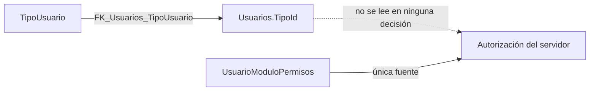

# `acceso_usuario.TipoUsuario`

Entidad `TipoUsuario` · DbSet **`TipoUsuarios`** · Mapeo en `Backend/Data/UserAccessDbContext.cs:105-113` · Entidad en `Backend/Models/Schemas/UserAccess/TipoUsuario.cs`

Catálogo de clasificación de usuarios. Es la única tabla del esquema cuyo **nombre SQL es singular**.

> `entity.ToTable("TipoUsuario", "acceso_usuario");` — `UserAccessDbContext.cs:107`. El DbSet plural `TipoUsuarios` **no** es el nombre de la tabla. No crear una tabla `TipoUsuarios` suponiendo lo contrario.

## Columnas

| Columna | Tipo SQL inferido | Nulable | Default | Restricción / propósito |
| --- | --- | --- | --- | --- |
| `Id` | **`smallint`** | No | IDENTITY (convención) | PK por convención. C# `short`: el tipo se propaga a `Usuarios.TipoId` y a los DTO |
| `NivelUsuario` | `varchar(15)` | No | — | Nombre del nivel. `IsUnicode(false)` (línea 112). **Sin índice único declarado en EF** |
| `Descripcion` | `nvarchar(150)` | No | — | Requerida; ningún endpoint la devuelve |

Navegación: `Usuarios` (colección). Es el lado "uno" de `FK_Usuarios_TipoUsuario`.

Dos detalles con consecuencias reales:

1. **`Id` es `smallint`, no `int`.** Cualquier DTO, parámetro o columna nueva que lo referencie debe usar `short`. Ya se respeta en `ApproveUserRequest.TipoId` y `UpdateUserPermissionsRequest.TipoId` (ambos `short`), y en `RegisteredUser.TipoId`.
2. **`NivelUsuario` no tiene índice único**, a diferencia de `Areas.Nombre` y `Permisos.Nombre`. Nada en el esquema impide dos tipos con el mismo nivel. Esto rompe un endpoint, ver abajo.

## Operaciones SQL

| Método | SQL | Filtro | Seguimiento | Ubicación |
| --- | --- | --- | --- | --- |
| `GetUserTypes()` | `SELECT` | **Ninguno** | Con seguimiento | `UserAccessRepository.cs:94-97` |
| Lectura indirecta | Nunca: ningún `Include(u => u.Tipo)` en el repositorio | — | — | — |

**No existe ninguna escritura.** Catálogo de sólo lectura, poblado a mano en SQL.

## Filas según el seed de `Init.sql`

`DataBase/scripts/Init.sql:179-201` inserta cinco niveles. Los `Id` se **deducen del orden de los `VALUES`** sobre `IDENTITY(1,1)`; el script no está versionado ([[db-scripts-and-migrations]]).

| `Id` probable | `NivelUsuario` | Lo que promete su descripción |
| --- | --- | --- |
| 1 | `super_admin` | Acceso total a plataforma, usuarios, áreas, módulos y permisos |
| 2 | `admin` | Permisos administrativos sobre la plataforma |
| 3 | `general` | Permisos completos en sus áreas autorizadas |
| 4 | `supervisor` | Permisos limitados: revisión y seguimiento |
| 5 | `inicial` | Solo visualización |

**Ninguna de esas promesas se aplica en el código.** Son descripciones almacenadas en datos, no comportamiento: el tipo no otorga ni restringe nada (ver abajo). Un usuario `inicial` con `editar` asignado en la tabla puente puede editar, y un `super_admin` sin asignaciones no puede hacer nada — que es exactamente lo que ocurre con la cuenta administradora del propio seed, ver [[db-findings]].

Los cinco valores de `NivelUsuario` son distintos, lo que evita de facto el defecto de `GET /Auth/userTypes` descrito abajo. Nada en el esquema garantiza que siga siendo así.

El script también crea el primer `ALTER` que convierte `NivelUsuario` de `SMALLINT` a `VARCHAR(15)` (líneas 159-160) y `Descripcion` de `VARCHAR(20) NULL` a `NVARCHAR(150) NOT NULL` (líneas 163-164): el estado final coincide con el mapeo EF.

`Usuarios.TipoId` **sí** se escribe, en dos flujos: aprobación (`UserAccessRepository.cs:261`) y actualización de permisos (`UserAccessRepository.cs:329`). En ninguno de los dos se comprueba que el `TipoId` recibido exista en este catálogo: la única defensa es `FK_Usuarios_TipoUsuario`, cuya violación (error SQL 547) se captura en `Backend/Controllers/PlatformControler.cs:122` para la aprobación y se traduce a HTTP 409. En la actualización de permisos esa captura **no** existe (`PlatformControler.cs:172-176` solo tiene un `catch` genérico), así que un `TipoId` inexistente produce HTTP 500.

Los controladores solo validan `TipoId <= 0` (`PlatformControler.cs:105, 156`).

## Defecto verificado: `GetUserTypes` se rompe con niveles duplicados

El handler construye el diccionario de respuesta con `NivelUsuario` como **clave**:

```csharp
// Backend/Handlers/AuthHandler.cs:85-94
foreach (var t in types)
{
    response.UserTypes.Add(t.NivelUsuario, t.Id);
}
```

`Dictionary<string, short>.Add` lanza `ArgumentException` con una clave repetida. Como la base **no** impone unicidad sobre `NivelUsuario`, dos filas con el mismo nivel (incluso con distinta capitalización, que en `Dictionary<string,...>` por defecto sí distingue, o idénticas) hacen fallar `GET /Auth/userTypes` con HTTP 500. El mismo patrón se repite en `GetAreas` (`AuthHandler.cs:102`), protegido allí por `UQ_Areas_Nombre`, y en `GetAccess`/`GetModules`, que usan `Id` como clave y son seguros.

Es un defecto de **integridad de datos que se manifiesta como error de API**: falta un índice único que el resto del esquema sí tiene. `Init.sql` tampoco lo añade, y su seed evita el problema solo porque los cinco niveles que inserta son distintos. Ver [[db-findings]].

## El tipo se guarda pero no autoriza nada



Verificado: ninguna consulta del repositorio filtra, compara ni ramifica por `TipoId` o `NivelUsuario`. Las cuatro comprobaciones `EXISTS` de autorización usan exclusivamente la tabla puente y `Permisos.Nombre`. El `TipoId` tampoco aparece en `AuthResponse`, así que el frontend no lo recibe al iniciar sesión (sí lo recibe en la lista de usuarios registrados, `RegisteredUser.TipoId`, y en `GET /Platform/Users/{id}/Permissions`).

Situación respecto al análisis previo: `.agent/CONTEXT.md` decía que el tipo "no se usa para otorgar privilegios" — **sigue siendo cierto** —, pero ya no es cierto que no se escriba: dos flujos lo fijan. Es un dato clasificatorio que se captura, se persiste y se muestra, sin efecto en ninguna decisión.

Si en el futuro el tipo debe otorgar privilegios, hará falta una tabla que relacione tipo con permisos/módulos (no existe hoy) o una regla explícita en el servidor. Ver [[db-relationships]].

## Enlaces

- [[db-table-usuarios]] — hijas vía `FK_Usuarios_TipoUsuario`
- [[db-table-solicitud-usuarios]] — el `TipoId` se elige al aprobar, no se propone en la solicitud
- [[db-table-usuario-modulo-permisos]] — la autorización real vive aquí, no en el tipo
- [[db-relationships]] · [[db-queries-by-feature]] · [[db-schema-acceso-usuario]] · [[db-findings]] · [[db-index]]
- Backend: [[be-repository]] · [[be-api-reference]] · [[be-dbcontext-entities]]
- Frontend: [[fe-interfaces]] · [[fe-templates-areas-modules]]
