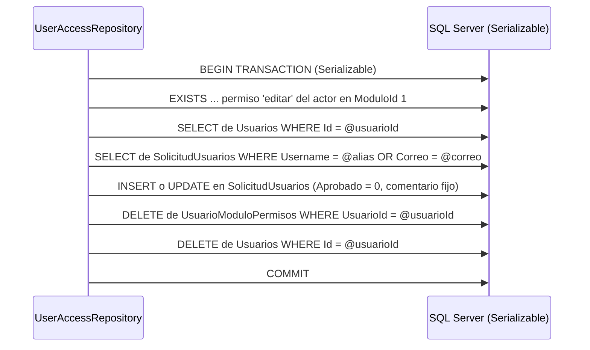

# `acceso_usuario.Usuarios`

Entidad `Usuario` · DbSet `Usuarios` · Mapeo en `Backend/Data/UserAccessDbContext.cs:115-147` · Entidad en `Backend/Models/Schemas/UserAccess/Usuario.cs`

Cuentas operativas del sistema. Es la **única** tabla que se consulta al iniciar sesión.

## Columnas

| Columna | Tipo SQL inferido | Nulable | Default | Restricción / propósito |
| --- | --- | --- | --- | --- |
| `Id` | `int` | No | IDENTITY (convención EF, no verificable físicamente) | PK por convención |
| `TipoId` | `smallint` | No | — | FK `FK_Usuarios_TipoUsuario` → [[db-table-tipo-usuario]] |
| `Nombre` | `varchar(30)` | No | — | `IsUnicode(false)` (línea 136) |
| `ApellidoPaterno` | `varchar(20)` | No | — | `IsUnicode(false)` (línea 131) |
| `ApellidoMaterno` | `varchar(20)` | No | — | `IsUnicode(false)` (línea 128) |
| `FechaNacimiento` | `date` | No | — | C# `DateOnly`, sin hora |
| `Sexo` | `varchar(1)` | No | — | Un carácter; el modelo **no** declara CHECK de valores |
| `FechaIngreso` | `date` | No | `(getdate())` (línea 134) | Al aprobar **se copia de la solicitud**, no se usa la fecha de aprobación |
| `Alias` | `varchar(10)` | No | — | Único: `UQ_Usuarios_Alias`; **es el identificador de login** |
| `Correo` | `nvarchar(100)` | No | — | Único: `UQ_Usuarios_Correo` |
| `PasswordHash` | `nvarchar(500)` | No | — | Hash BCrypt; nunca contraseña en claro |
| `Activo` | `bit` | No | `true` (línea 123) | El login exige `Activo = 1` |

Navegaciones: `Tipo` (`TipoUsuario`) y `UsuarioModuloPermisos` (colección).

Puntos que suelen confundirse:

- **La tabla no tiene columna `Username`.** El campo equivalente se llama `Alias`; `Username` solo existe en [[db-table-solicitud-usuarios]]. El DTO público de la API expone `alias`, y el frontend lo renombra a `usuario` para reutilizar sus tarjetas (ver [[fe-interfaces]]).
- **No tiene `Aprobado`.** Existir en esta tabla *es* estar aprobado. `Aprobado` es de la tabla de solicitudes; no confundir con `Activo`.
- **No guarda fechas de auditoría** (creación, última modificación, último acceso, cambio de contraseña).

## Escrituras que recibe

| Operación | Tipo de SQL | Transacción | Ubicación |
| --- | --- | --- | --- |
| Aprobación de solicitud | `INSERT` | **Sí**, explícita | `UserAccessRepository.cs:259-275` |
| Cambio de contraseña | `UPDATE` | No, `SaveChangesAsync` simple | `UserAccessRepository.cs:210-216` |
| Actualización de permisos | `UPDATE` de `TipoId` | **Sí**, explícita | `UserAccessRepository.cs:329` |
| Baja de usuario | **`DELETE`** | **Sí**, explícita, `Serializable` | `UserAccessRepository.cs:198-199` |

Fuera de la aplicación, `DataBase/scripts/Init.sql` inserta tres cuentas iniciales (aliases `superAdmin`, `RecursosH` y `Contab`) con `Activo = 1`. **Las tres comparten el mismo hash de contraseña** y sus datos personales son reales, por lo que ni el hash ni los correos se reproducen en esta documentación. Además, la cuenta de tipo `super_admin` no recibe permisos sobre el `ModuloId = 1`, así que no puede administrar cuentas. Ver [[db-scripts-and-migrations]] y [[db-findings]].

### La baja BORRA la fila: `Activo = false` nunca se escribe

Hallazgo central de esta tabla, y divergencia directa respecto a `.agent/CONTEXT.md`.

`UserAccessRepository.DeactivateUser` (líneas 141-202) **no** cambia `Activo`. Copia los datos del usuario a `SolicitudUsuarios`, borra sus filas de la tabla puente y ejecuta `_context.Usuarios.Remove(usuario)`. Es un **borrado físico**:

Consecuencias verificadas:

1. **Ninguna ruta de código produce `Activo = 0`.** El único `INSERT` fija `Activo = true` y ningún `UPDATE` toca la columna. Así que, salvo filas creadas manualmente en SQL, `Usuarios.Activo` es siempre `1` en la práctica. El filtro `u.Activo` del login y de las comprobaciones de permisos nunca descarta nada hoy.
2. **La columna `Activo` y el filtro `Activo` del login son, en la práctica, código muerto** mientras la baja siga borrando.
3. **Se pierde el `Id`.** Nada conecta la fila borrada con la solicitud creada: no hay FK ni columna de trazabilidad. Si esa persona se reincorpora vía aprobación, recibe un `Id` nuevo.
4. **El hash de contraseña se duplica hacia `SolicitudUsuarios`** (`UserAccessRepository.cs:186`) y sobrevive a la baja. Ver [[db-table-solicitud-usuarios]].
5. **El `Id` borrado puede quedar referenciado desde fuera**: el frontend guarda el usuario de sesión en `localStorage` y el token bearer lleva el `Id` en la claim `NameIdentifier` (`Backend/Handlers/SessionTokenService.cs:15`). Ese token sigue siendo criptográficamente válido hasta 8 horas después (`Backend/Program.cs:33`), apuntando a un usuario inexistente. Las comprobaciones `EXISTS` de permisos fallarán (sin filas en la tabla puente), pero los endpoints de lectura sin `[Authorize]` seguirán respondiendo. Ver [[be-auth-session]] y [[db-findings]].
6. **Un `DELETE` a este nivel es irreversible** sin copia de seguridad: no hay tabla histórica ni marca de borrado lógico.
7. El `DELETE` se ejecuta bajo aislamiento `Serializable` en tres `SaveChangesAsync` consecutivos, lo que mantiene bloqueos de rango durante toda la operación y eleva el riesgo de interbloqueo. El error 1205 se captura en `Backend/Controllers/PlatformControler.cs:64-67`.

## Lecturas que recibe

| Consulta | Filtros | Seguimiento EF | Ubicación |
| --- | --- | --- | --- |
| `GetUserAuth(alias)` | `Alias == @alias && Activo` | Con seguimiento | `UserAccessRepository.cs:19-23` |
| `GetUserKeyAuth(alias, correo)` | `Alias == @alias && Correo == @correo` | Con seguimiento | `UserAccessRepository.cs:27-28` — **su resultado se descarta por un defecto lógico**, ver [[db-queries-by-feature]] |
| `GetAllRegisteredUsers()` | **Ninguno** | `AsNoTracking` | `UserAccessRepository.cs:131-139` — activos e inactivos, ordenado por `Nombre`, `ApellidoPaterno`, `Id`, **sin paginación** |
| `GetUserByEmail(correo)` | `Correo == @correo`, **sin filtrar `Activo`** | Con seguimiento | `UserAccessRepository.cs:204-208` |
| `GetUserPermissionsAdminAsync(id)` | `Id == @id`, con `Include` de puente → módulo → área | Con seguimiento | `UserAccessRepository.cs:299-306` |
| Comprobación de existencia al aprobar | `Alias == @username || Correo == @correo` | Con seguimiento | `UserAccessRepository.cs:253-254` |

`GetAllRegisteredUsers` es el **único** método del repositorio que usa `AsNoTracking`. Todas las demás lecturas, incluidas las de catálogo que nunca se modifican, cargan el `ChangeTracker`. Ver [[db-findings]].

## Detalle: `UpdatePassword` reescribe toda la fila

`UserAccessRepository.UpdatePassword` (líneas 210-216) llama a `_context.Usuarios.Update(usuario)`, que marca la entidad completa como `Modified`. EF genera un `UPDATE` con **todas** las columnas, no solo `PasswordHash`. Como la entidad viene de la misma unidad de trabajo, el efecto neto es el mismo, pero se escriben columnas que no cambiaron y se amplía la superficie de una posible sobreescritura concurrente. Bastaba con modificar la propiedad y llamar a `SaveChangesAsync`.

Además, el flujo de cambio de contraseña **no verifica titularidad del correo** y **no filtra `Activo`**. Ver [[db-queries-by-feature]] y [[db-findings]].

## Enlaces

- [[db-table-tipo-usuario]] — padre vía `TipoId`
- [[db-table-usuario-modulo-permisos]] — hijas: asignaciones de acceso
- [[db-table-solicitud-usuarios]] — origen (aprobación) y destino (baja) de estas filas
- [[db-relationships]] · [[db-queries-by-feature]] · [[db-schema-acceso-usuario]] · [[db-findings]] · [[db-index]]
- Backend: [[be-repository]] · [[be-dbcontext-entities]] · [[be-api-reference]] · [[be-auth-session]]
- Frontend: [[fe-interfaces]] · [[fe-index]]
