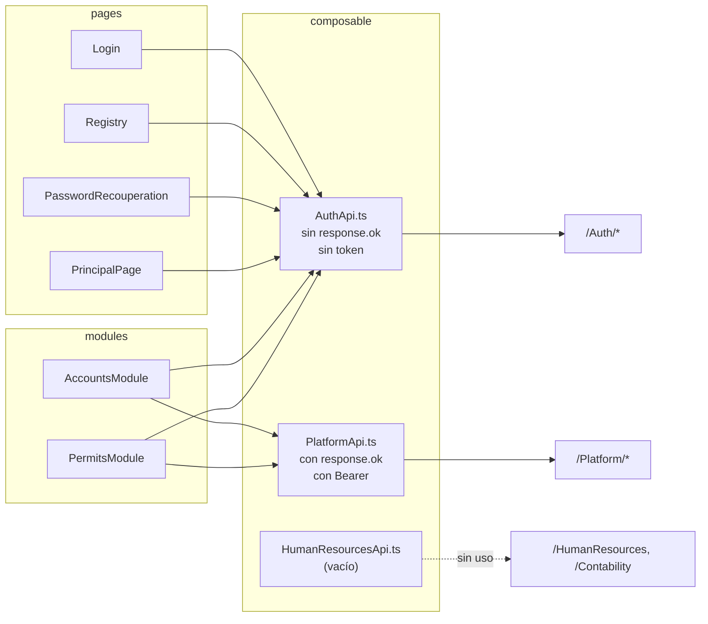

# Clientes API — `src/composable/`

Tres archivos. **No son hooks de React**: son módulos TypeScript que exportan funciones `async` sobre `fetch`. Ver la explicación del nombre en [[fe-architecture]].

| Archivo | Líneas | Base URL | Funciones |
| --- | --- | --- | --- |
| `AuthApi.ts` | 103 | `${VITE_API_BASE_URL}/Auth` | 7 |
| `PlatformApi.ts` | 149 | `${VITE_API_BASE_URL}/Platform` | 7 |
| `HumanResourcesApi.ts` | 140 | `${VITE_API_BASE_URL}/HumanResources` | 14 |
| `Session.ts` | 23 | — (no hace `fetch`) | 3 |
| `HumanResourcesApi.ts` | 0 | — | **archivo vacío** |

La base se calcula en el ámbito del módulo:

```ts
const API_BASE_URL = `${import.meta.env.VITE_API_BASE_URL}/Auth`;
```
(`AuthApi.ts:4`; equivalente en `PlatformApi.ts:3`)

`VITE_API_BASE_URL` es la única variable de entorno del frontend y se **incrusta en el bundle** durante el build ([[fe-config-deployment]]). Si no está definida, el literal se convierte en `"undefined/Auth"` y todas las peticiones fallan con una URL relativa inválida. No hay valor por defecto ni comprobación. *(Inferencia.)*

## 1. Dos generaciones de clientes en el mismo proyecto

### `HumanResourcesApi.ts` (2026-09-19)

Catorce funciones sobre `/HumanResources`: `getAreas`, `getPuestos`, `getPlazas`, `getTiposContratacion`, `getUnidades`, y el alta, edición y baja de áreas, puestos y plazas. Sigue el patrón bueno de `PlatformApi.ts` —comprueba `response.ok` y lanza `Error` con el mensaje del servidor—, con dos diferencias:

- **No envía `Authorization`**: ningún endpoint de `/HumanResources` lleva `[Authorize]` (decisión explícita del usuario; la protección llegará con un gateway). Por lo mismo **no pasa por `Session.ts`**: esos endpoints no pueden devolver 401.
- `getPlazas` construye la *query string* con `URLSearchParams`, omitiendo los filtros nulos o vacíos. Es el único cliente con paginación.

Para los errores de carga masiva extrae el motivo útil con `MensajeDeFallo`: primero `detalle[0].motivo`, luego el caso de duplicado, y como último recurso `message`.

### `Session.ts` (2026-09-19)

No es un cliente HTTP: centraliza el cierre de sesión. `clearSession(notice?)` borra `localStorage.user`, deja el aviso en `sessionStorage` y hace `window.location.replace('/')`; `throwSessionExpired()` lo invoca y lanza; `takeSessionNotice()` lo consume una sola vez, y el login lo muestra. Los **cinco** `401` y las **cinco** guardas `if (!accessToken)` de `PlatformApi.ts` pasan por ahí. Ver [[fe-session-state]].

La diferencia de calidad entre `AuthApi.ts` y `PlatformApi.ts` es el hecho más importante de esta nota.

| Característica | `AuthApi.ts` | `PlatformApi.ts` |
| --- | --- | --- |
| Comprueba `response.ok` | **No, en ninguna función** | Sí, en las 7 |
| Acepta `AbortSignal` | No | Sí en los 2 GET de listado |
| Envía `Authorization` | No | Sí en las 5 funciones nuevas |
| Normaliza errores | No | Sí: lanza `Error` con mensaje en español |
| Distingue 401 | No | Sí, con mensaje propio |
| Tipos de retorno | interfaces (algunas erróneas) | interfaces + un `Promise<any>` |

Consecuencia directa de la primera fila: en `AuthApi.ts`, **una respuesta 400 o 401 se parsea como si fuera el DTO de éxito**. Las páginas compensan a mano (`login.jsx:28` mira `message` e `id`; `registry.jsx:129` mira `success`), pero no hay garantía sistemática.

## 2. `AuthApi.ts` — función por función

| # | Función | Método y ruta | Payload | Retorno declarado | Comprueba `ok` |
| --- | --- | --- | --- | --- | --- |
| 1 | `registerUser(credentials)` | `POST /Auth/register` | `RegisterRequest` | `RegisterResponse` | no |
| 2 | `loginUser(credentials)` | `POST /Auth/login` | `LoginRequest` | `LoginResponse` | no |
| 3 | `GetModulesCatalog(params)` | `POST /Auth/modules` | `ModulesRequest` | `ModulesResponse` | no |
| 4 | `GetUserTypesCatalog()` | `GET /Auth/userTypes` | — | `UserTypesResponse` | no |
| 5 | `GetAccessCatalog()` | `GET /Auth/GetAccessCatalog` | — | `AccessResponse` | no |
| 6 | `GetAccess()` | `GET /Auth/access` | — | `AccessResponse` | no |
| 7 | `GetAreas()` | `GET /Auth/areas` | — | `AreaResponse` | no |
| 8 | `changePassword(credentials)` | `POST /Auth/changePassword` | `ChangePasswordRequest` | `boolean` | no |

Las siete funciones con cuerpo envían `Content-Type: application/json`. Curiosidad: las cuatro `GET` también lo envían, lo cual es inocuo pero innecesario (`AuthApi.ts:47, 59, 71, 83`).

### Observaciones por función

- **`registerUser`** (`:6-17`): tipa el payload como `RegisterRequest`, cuya propiedad `firstName` **no existe** en lo que realmente se envía (`registry.jsx` manda `name`). El mismatch nunca se detecta porque no hay typecheck ([[fe-interfaces]]).
- **`loginUser`** (`:19-30`): devuelve el objeto tal cual; el llamador debe distinguir éxito de 401 por contenido.
- **`GetModulesCatalog`** (`:32-42`): declara `Promise<ModulesResponse>` pero hace `const result = await response.json()` **sin anotar el tipo** (`:40`) y devuelve el JSON real, que trae `modulos`, no `modules`. Los tres llamadores usan `?.modulos` (`principalPage.jsx:106`, `accountsModule.jsx:57`, `permitsModule.jsx:74`). Con typecheck activo esto sería un error de compilación.
- **`GetUserTypesCatalog`** (`:44-54`): mismo patrón sin anotación. Los llamadores aplican `typesResp?.userTypes || typesResp?.UserTypes` ([[fe-module-accounts]]).
- **`GetAccessCatalog`** (`:56-66`): apunta a **`/Auth/GetAccessCatalog`, ruta que no existe** en `AuthController` ([[be-api-reference]]). **Nadie la invoca.** Código muerto con trampa: si alguien la usa creyendo que es el catálogo de permisos, obtendrá un 404 parseado sin error.
- **`GetAccess`** (`:68-78`): la función correcta para el catálogo de permisos. El servidor devuelve `{permisos:{...}}`; el tipo declara `{access:{...}}` (erróneo).
- **`GetAreas`** (`:80-90`): devuelve `{areas:{nombreArea:id}}`. El único tipo de `AuthApi` que sí coincide con el JSON real.
- **`changePassword`** (`:92-103`): tipa el retorno como `boolean` y el endpoint efectivamente devuelve un booleano plano en el cuerpo ([[be-api-reference]]). Un 500 con cuerpo HTML rompería el `json()` y produciría una excepción, que la página captura como error de conexión.

## 3. `PlatformApi.ts` — función por función

### 3.1 Lecturas de listado (sin token)

```ts
export async function getUsers(signal?: AbortSignal): Promise<UsersResponse> {
    const response = await fetch(`${API_BASE_URL}/UserRequest`, { signal });
    if (!response.ok) throw new Error(`Error fetching users: ${response.statusText}`);
    return response.json();
}
```
(`PlatformApi.ts:5-11`; `getRegisteredUsers` es idéntica contra `/Users`, `:13-19`)

| Función | Ruta | Devuelve | Token |
| --- | --- | --- | --- |
| `getUsers(signal?)` | `GET /Platform/UserRequest` | `{solicitudes: Users[]}` | **no envía** |
| `getRegisteredUsers(signal?)` | `GET /Platform/Users` | `{usuarios: RegisteredUser[]}` | **no envía** |

Los mensajes de error de estas dos son los únicos **en inglés** del archivo, y se descartan: ambos módulos capturan la excepción y muestran su propio texto en español.

**Hecho relevante de seguridad**: estos dos endpoints **no llevan `[Authorize]`** en el servidor (`Backend/Controllers/PlatformControler.cs:24, 31`), así que la ausencia de token es coherente con la API pero significa que **datos personales de solicitudes y usuarios son legibles sin sesión**. Ver [[be-auth-session]] y [[fe-findings]].

### 3.2 Mutaciones (con token obligatorio)

Las cinco siguen el mismo esqueleto de cuatro pasos:

```ts
if (!accessToken) throw new Error('Inicia sesión nuevamente para ...');
const response = await fetch(url, { method, headers: { Authorization: `Bearer ${accessToken}`, ... }, body });
if (response.status === 401) throw new Error('Tu sesión expiró o no es válida. Inicia sesión nuevamente.');
const result = await response.json().catch(() => null);
if (!response.ok || !result?.success) throw new Error(result?.message ?? '<mensaje por defecto>');
return result;
```

| Función | Método y ruta | Cuerpo enviado | Retorno |
| --- | --- | --- | --- |
| `deactivateUser(userId, accessToken?)` | `POST /Platform/Users/{id}/deactivate` | **ninguno** (y sin `Content-Type`) | `DeactivateUserResponse` |
| `updateUserRequestComment(userId, comment, accessToken?)` | `PUT /Platform/UserRequest/{id}/comment` | `{comentario}` | `{success, message}` |
| `approveUser(solicitudId, tipoId, permisos, accessToken?)` | `POST /Platform/Users/Approve` | `{solicitudId, tipoId, permisos:[{moduloId, permisosIds}]}` | `{success, message}` |
| `getUserPermissions(userId, accessToken?)` | `GET /Platform/Users/{id}/Permissions` | — | **`Promise<any>`** |
| `updateUserPermissions(userId, tipoId, permisos, accessToken?)` | `PUT /Platform/Users/Permissions` | `{userId, tipoId, permisos:[{moduloId, permisosIds}]}` | `{success, message}` |

Detalles verificados:

- **`accessToken` es opcional en la firma** de las cinco, con un `throw` temprano si falta (`:22, 41, 70, 97, 126`). Esto es lo que produce el mensaje "Inicia sesión nuevamente para habilitar la baja de usuarios." cuando un usuario tiene en `localStorage` un objeto de una sesión anterior a la introducción del token. Es un buen comportamiento.
- **`json().catch(() => null)`**: tolera respuestas sin cuerpo o con HTML, en lugar de lanzar un `SyntaxError` opaco.
- **Doble condición de éxito**: `response.ok` **y** `result.success === true`. Coherente con los DTO del servidor, que devuelven `{success, code, message}` ([[be-dto-contracts]]).
- **`getUserPermissions` devuelve `any`** (`:96`): es la única función sin tipo en toda la capa. El consumidor accede a `currentPerms.tipoId` y `currentPerms.permisos[].{areaId, areaName, moduloId, moduloName, permisosIds}` sin ninguna garantía de tipo (`permitsModule.jsx:144-152`). El backend sí tiene un DTO formal (`UserPermissionsResponse`); **falta la interfaz TS espejo** ([[fe-interfaces]]).
- **Ninguna mutación acepta `AbortSignal`** ni `CancellationToken` del lado cliente, aunque varios endpoints del servidor sí reciben `CancellationToken`.
- **No hay reintentos, ni backoff, ni timeout.** Una petición que no responda deja el modal en estado "Guardando..." indefinidamente.

## 4. `HumanResourcesApi.ts`

Archivo **existente y vacío** (0 bytes). No se importa en ninguna parte. El backend sí expone `POST /HumanResources` y `POST /Contability` devolviendo texto de prueba ([[be-api-reference]]), pero el frontend nunca los llama: `PlacesModule` y `Contability` son placeholders estáticos ([[fe-templates-areas-modules]]).

## 5. Mapa endpoint → consumidor

| Endpoint | Cliente | Se llama desde |
| --- | --- | --- |
| `POST /Auth/login` | `loginUser` | `login.jsx:27` |
| `POST /Auth/register` | `registerUser` | `registry.jsx:113` |
| `POST /Auth/changePassword` | `changePassword` | `passwordRecuperation.jsx:53` |
| `GET /Auth/areas` | `GetAreas` | `principalPage.jsx:97` |
| `GET /Auth/access` | `GetAccess` | `principalPage.jsx:98` |
| `POST /Auth/modules` | `GetModulesCatalog` | `principalPage.jsx:66`, `accountsModule.jsx:56`, `permitsModule.jsx:73` |
| `GET /Auth/userTypes` | `GetUserTypesCatalog` | `accountsModule.jsx:223`, `permitsModule.jsx:139` |
| `GET /Auth/GetAccessCatalog` | `GetAccessCatalog` | **nadie (ruta inexistente)** |
| `GET /Platform/UserRequest` | `getUsers` | `accountsModule.jsx:172` |
| `GET /Platform/Users` | `getRegisteredUsers` | `accountsModule.jsx:169`, `permitsModule.jsx:39` |
| `POST /Platform/Users/Approve` | `approveUser` | `accountsModule.jsx:128` |
| `PUT /Platform/UserRequest/{id}/comment` | `updateUserRequestComment` | `accountsModule.jsx:292` |
| `POST /Platform/Users/{id}/deactivate` | `deactivateUser` | `accountsModule.jsx:253` |
| `GET /Platform/Users/{id}/Permissions` | `getUserPermissions` | `permitsModule.jsx:143` |
| `PUT /Platform/Users/Permissions` | `updateUserPermissions` | `permitsModule.jsx:182` |
| `POST /HumanResources`, `POST /Contability` | — | **sin cliente ni consumidor** |

## 6. Tolerancias de casing implementadas

Tres tolerancias reales, ninguna de las cuales corrige la causa:

| Sitio | Tolerancia | Por qué existe |
| --- | --- | --- |
| `accountsModule.jsx:224`, `permitsModule.jsx:140` | `typesResp?.userTypes \|\| typesResp?.UserTypes \|\| {}` | Defensa ante que el DTO C# se llame `UserTypes`; con la serialización actual llega `userTypes`. Evita que `Object.entries(undefined)` lance y rompa el render |
| `ModulesRequest` enviado como `AreasId` (`principalPage.jsx:66`) y como `areasId` (`accountsModule.jsx:56`, `permitsModule.jsx:73`) | El binder de ASP.NET Core es insensible a mayúsculas | Nunca se unificó tras añadir los modales |
| `principalPage.jsx:56-59` y `areaTemplate.jsx:21-23` | `toLowerCase()` al comparar nombres de área | Nombres de área de SQL vs claves del registro frontend ([[fe-templates-areas-modules]]) |

Ninguna de las tres normaliza espacios (`trim()`), salvo la resolución de **nombres de permiso**, que sí lo hace (`catalogs?.access?.[id]?.trim().toLowerCase()`).

## 7. Diagrama de la capa



## 8. Reglas para añadir un cliente nuevo

Seguir el patrón de `PlatformApi.ts`, no el de `AuthApi.ts`:

1. Comprobar `response.ok` **siempre**.
2. Aceptar `signal?: AbortSignal` en las lecturas.
3. Si el endpoint es `[Authorize]`, exigir `accessToken` y lanzar antes de la petición si falta.
4. Tratar el 401 con un mensaje específico de "vuelve a iniciar sesión".
5. `await response.json().catch(() => null)` antes de inspeccionar `success`.
6. Anotar el tipo de retorno con una interfaz real de `interfaces/` — no `any`, no confiar en la anotación de la firma sin anotar el `json()`.
7. Mensajes de error en español y accionables.

## Enlaces

- Mapa: [[fe-index]] · Arquitectura y por qué no son hooks: [[fe-architecture]]
- Tipos que consumen estos clientes: [[fe-interfaces]]
- Quién los llama: [[fe-pages]], [[fe-module-accounts]], [[fe-module-permits]]
- Token que envían: [[fe-session-state]] · Variable de entorno: [[fe-config-deployment]]
- Defectos: [[fe-findings]]
- Lado servidor: [[be-api-reference]], [[be-dto-contracts]], [[be-auth-session]], [[be-flows]], [[be-index]]
- Datos: [[db-index]], [[db-schema-acceso-usuario]], [[db-table-areas]], [[db-table-modulos]], [[db-table-permisos]], [[db-table-usuario-modulo-permisos]]
- Visión global: [[architecture-overview]]
