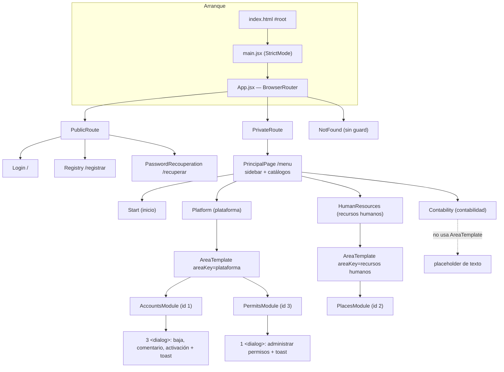
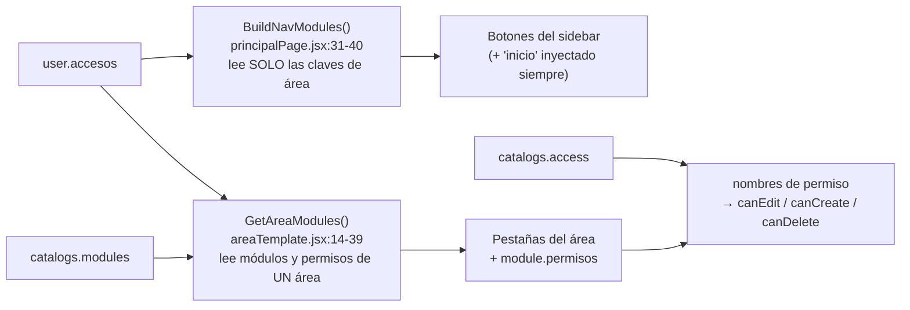

# Arquitectura del frontend

Esta es la nota central de la bóveda. Describe **cómo está organizada la SPA**, qué responsabilidad tiene cada carpeta, cómo se compone el árbol de componentes y por dónde circulan los datos. Todo lo afirmado aquí es **hecho verificado** sobre el código de `Frontend/` salvo donde se marque *inferencia*.

## 1. Lo que es y lo que no es

**Es**: una SPA de React 19 empaquetada con Vite, servida como archivos estáticos por Nginx, que consume una API HTTP de ASP.NET Core (ver [[be-index]]).

**No es** (y conviene no describirlo así):

- No es una app con enrutamiento por módulo: existe **una sola URL privada**, `/menu`.
- No usa framework de UI (sin Tailwind, sin MUI, sin CSS Modules, sin CSS-in-JS). Solo CSS global importado desde componentes.
- No tiene estado global: **ni Context, ni Redux/Zustand/Jotai, ni React Query/SWR**. Verificado por ausencia total de `createContext`, `useContext`, `Provider` y de dependencias de store en `Frontend/package.json:12-24`.
- No tiene capa de "servicios inyectados" ni DI. Los clientes HTTP son módulos con funciones exportadas que se importan directamente donde se usan.
- No es TypeScript: es **JSX + TS parcial**. Las vistas son `.jsx`; solo `src/composable/*.ts` y `src/interfaces/**/*.ts` son TypeScript, y **nunca se comprueban tipos** porque no hay `tsconfig.json` ni script de typecheck (ver [[fe-config-deployment]]).

## 2. Árbol de carpetas y responsabilidad de cada capa

```
Frontend/
├── index.html                  Documento base, #root, favicon, title. lang="en" (errata)
├── vite.config.js              Solo el plugin de React. Sin proxy, sin alias, sin puerto fijo
├── package.json                4 scripts: dev, build, lint, preview
├── .oxlintrc.json              oxlint con plugins react + oxc
├── nginx.conf / Dockerfile / docker-compose.yml   Empaquetado y servicio estático
└── src/
    ├── main.jsx                Monta React en StrictMode. Importa global.css y luego index.css
    ├── App.jsx                 BrowserRouter + 5 rutas. Sin estado
    ├── components/             UN solo archivo: RouteGuards.jsx
    ├── pages/                  Pantallas ligadas a una URL. Dueñas del estado de formulario/sesión
    ├── templates/              Áreas y módulos. NO están ligados a URL: se eligen por estado
    │   ├── shared/             areaTemplate.jsx: contenedor de pestañas reutilizable
    │   ├── start/              Inicio (contenido estático institucional)
    │   ├── platform/           Área Plataforma + módulos accounts y permits
    │   ├── humanResources/     Área Recursos Humanos + módulo places (placeholder)
    │   └── contability/        Área Contabilidad (placeholder, no usa areaTemplate)
    ├── composable/             Clientes fetch. NO son hooks de React
    ├── interfaces/             Tipos TS de request/response
    ├── global.css              Tokens institucionales + reset + utilidades
    ├── index.css               Restos de plantilla Vite que SIGUEN importándose
    ├── App.css                 Restos de plantilla Vite que NO se importan (muerto)
    └── assets/                 react.svg, vite.svg, hero.png — sin referencias en el código
```

### Contrato de cada capa

| Capa | Responsabilidad real | De qué depende | Qué NO hace |
| --- | --- | --- | --- |
| `main.jsx` | Montar el árbol y fijar el orden de importación de CSS | `global.css`, `index.css`, `App` | No provee contexto ni store |
| `App.jsx` | Declarar rutas y envolverlas en guards | `react-router-dom`, páginas, `RouteGuards` | No guarda estado, no carga datos |
| `components/` | Guards de navegación | `localStorage`, `Navigate` | No hay librería de componentes compartidos; es la única pieza de esta carpeta |
| `pages/` | Estado de formularios, llamadas de autenticación, lectura/escritura de `localStorage`, redirecciones | `composable/`, `templates/`, CSS propio | No conocen la lógica interna de los módulos |
| `templates/` (área) | Adaptar `AreaTemplate` a una clave de área | `areaTemplate.jsx` | No hacen fetch |
| `templates/shared/areaTemplate.jsx` | Derivar módulos del área desde `user.accesos`, dibujar pestañas y resolver el componente por ID | props `user`, `catalogs`, `areaKey` | No hace fetch ni valida permisos |
| `templates/**/<modulo>` | Datos del módulo, filtros, modales, mutaciones | `composable/`, props `user`/`catalogs`/`module` | No leen `localStorage` directamente (reciben `user` por prop) |
| `composable/` | Envolver `fetch`: URL, método, headers, `Authorization`, parseo, normalización de errores | `import.meta.env.VITE_API_BASE_URL`, `interfaces/` | No hooks, no cache, no reintentos, no interceptores |
| `interfaces/` | Tipos de contrato | Nada | No validan en runtime |

### El punto más malinterpretado: `composable/` no son hooks

`src/composable/AuthApi.ts` y `src/composable/PlatformApi.ts` exportan **funciones `async` planas**. No llaman a ningún hook, no pueden llamarlo y no siguen las reglas de hooks. El nombre de la carpeta viene del vocabulario de Vue ("composables"), pero el contenido es lo que en React se llamaría `api/` o `services/`. Consecuencia práctica: **no hay deduplicación de peticiones, ni cache, ni estados de carga compartidos**; cada componente reimplementa `loading` / `error` / cancelación a mano. Detalle en [[fe-api-clients]].

## 3. Composición de componentes



Ubicaciones: `Frontend/src/App.jsx:11-19`, `Frontend/src/pages/principalPage/principalPage.jsx:10-15` (registro de áreas), `Frontend/src/templates/shared/areaTemplate.jsx:8-12` (registro de módulos).

**Asimetría a tener presente**: `Platform` y `HumanResources` son envoltorios de 12 líneas sobre `AreaTemplate` (`platform.jsx:3-12`, `humanResources.jsx:3-12`), pero `Contability` **no usa `AreaTemplate`**: es una vista plana (`contability.jsx:1-8`). Cualquier módulo futuro de Contabilidad exige decidir primero si se migra a `AreaTemplate`.

## 4. Flujo de datos

### 4.1 Diagrama general

```mermaid
sequenceDiagram
    participant U as Usuario
    participant L as Login (page)
    participant AA as composable/AuthApi
    participant API as API /Auth
    participant LS as localStorage
    participant PP as PrincipalPage
    participant AT as AreaTemplate
    participant M as Módulo (accounts / permits)
    participant PA as composable/PlatformApi

    U->>L: usuario + contraseña
    L->>AA: loginUser({user,password})
    AA->>API: POST /Auth/login
    API-->>AA: {id,nombre,alias,correo,accessToken,accesos[]}
    AA-->>L: LoginResponse
    L->>LS: setItem('user', JSON.stringify(respuesta))
    L->>L: window.location.href = '/menu'  (recarga dura)

    PP->>LS: JSON.parse(getItem('user'))
    PP->>PP: BuildNavModules(user) → botones del sidebar
    PP->>AA: GetAreas()            (secuencial)
    PP->>AA: GetAccess()           (secuencial)
    PP->>AA: GetModulesCatalog({AreasId:[...]})
    PP->>PP: setCatalogs({areas, access, modules}); setLoading(false)

    PP->>AT: props user + catalogs
    AT->>AT: GetAreaModules(user,catalogs,areaKey) → [{id,name,permisos}]
    AT->>M: props user + catalogs + module

    M->>PA: getUsers() / getRegisteredUsers()
    PA->>API: GET /Platform/UserRequest | /Platform/Users   (SIN token)
    M->>PA: approveUser / deactivateUser / updateUserRequestComment / updateUserPermissions
    PA->>API: POST|PUT con Authorization: Bearer user.accessToken
```

### 4.2 Las tres props que lo gobiernan todo

Solo existen tres props que bajan por el árbol. No hay otras.

| Prop | Origen | Forma | Consumidores |
| --- | --- | --- | --- |
| `user` | `JSON.parse(localStorage.getItem('user'))` en `principalPage.jsx:93` | `{id, nombre, alias, correo, accessToken, accesos[]}` | `Start` (saludo), `AreaTemplate` (derivar módulos), `AccountsModule` / `PermitsModule` (token y filtrado de sí mismo) |
| `catalogs` | 3 fetch en `principalPage.jsx:97-106` | `{areas: {nombreArea: id}, access: {idPermiso: nombre}, modules: {idModulo: nombre}}` | `AreaTemplate` (nombre de pestaña), módulos (resolver nombres de permiso, píldoras de área, checkboxes de permiso) |
| `module` | Derivada en `areaTemplate.jsx:14-39` | `{id, name, permisos: number[]}` | Solo los componentes de módulo: título y cálculo de `canEdit` / `canCreate` / `canDelete` |

Detalle importante sobre `catalogs`: los nombres de las claves **no coinciden** con las propiedades JSON del backend. `catalogs.access` se llena con `accessResp?.permisos` y `catalogs.modules` con `modulos?.modulos` (`principalPage.jsx:102-106`). Es decir, `access`/`modules` son nombres internos de React; el servidor devuelve `permisos`/`modulos`. Las interfaces TS declaran los nombres equivocados — ver [[fe-interfaces]].

### 4.3 Forma de `user.accesos` y cómo se desdobla

El backend devuelve `accesos` como **array de diccionarios: nombre de área → array de diccionarios: ID de módulo → array de IDs de permiso** (`Backend/Models/Response/UserAccess/AuthResponse.cs:10`). Ilustración con valores ficticios:

```json
{
  "accesos": [
    { "Plataforma": [ { "1": [1, 2, 3] }, { "3": [1, 2] } ] },
    { "Recursos Humanos": [ { "2": [1] } ] }
  ]
}
```

Esa única estructura alimenta dos derivaciones distintas:



Nota de nomenclatura que genera confusión al leer el código: en `principalPage.jsx` las funciones `BuildNavModules` y `ProcessModules` operan sobre **áreas**, no sobre módulos, y el estado se llama `navModules` / `activeModule` aunque contenga áreas (`principalPage.jsx:82-83`).

### 4.4 Consecuencias arquitectónicas de no tener estado global

Todas son **hechos verificados** con consecuencia *inferida*:

1. **Cada módulo refetchea por su cuenta.** `AccountsModule` y `PermitsModule` llaman ambos a `getRegisteredUsers()` sin compartir resultado (`accountsModule.jsx:169`, `permitsModule.jsx:39`). Cambiar de pestaña vuelve a pedir la lista.
2. **Los catálogos se piden una sola vez por montaje de `PrincipalPage`** y se protegen con `useRef` (`yaCargado`, `principalPage.jsx:86-90`) para no duplicarlos bajo StrictMode. Pero los módulos piden catálogos *adicionales* por su cuenta: `GetUserTypesCatalog()` y `GetModulesCatalog()` por área (`accountsModule.jsx:222-224`, `accountsModule.jsx:56`).
3. **Un cambio de permisos no se refleja en la sesión activa.** `user.accesos` se congeló al hacer login. Si un administrador se cambia sus propios permisos, debe cerrar y abrir sesión. Ver [[fe-session-state]].
4. **La comunicación entre hermanos no existe.** Se ve en el intento fallido de `accountsModule.jsx:143-148`, que despacha un `Event('refresh')` sobre un botón para provocar una recarga de la lista; nada escucha ese evento (ver [[fe-findings]]).
5. **El "logout" y el "login" usan `window.location.href`** en lugar del router (`login.jsx:34`, `principalPage.jsx:115`). Es una recarga completa del documento: descarta todo el estado de React y vuelve a ejecutar `main.jsx`. Eso es lo que hace que el estado stale nunca se note.

## 5. Manejo de errores y estados de carga

No hay ningún patrón compartido. El inventario real:

| Sitio | Carga | Error | Cancelación |
| --- | --- | --- | --- |
| `Login` | `loading` local, spinner | `try/catch` + `message` | No |
| `Registry` | `loading` local | `try/catch` + `serverError` | No |
| `PasswordRecouperation` | `loading` local | `try/catch` + modal | No |
| `PrincipalPage` (catálogos) | `loading` → "Cargando..." | **Ninguno**: no hay `try/catch/finally` en `principalPage.jsx:92-108` | No |
| `AccountsModule` (listado) | `loading` + texto por vista | `try/catch` → `error` | `AbortController` + bandera `active` (`accountsModule.jsx:161-190`) |
| `AccountsModule` (mutaciones) | `deactivating` / `savingComment` / `submittingRef` | Mensajes en el modal, y `alert()` en la aprobación (`accountsModule.jsx:151`) | No |
| `PermitsModule` | `loading` | `error` en listado; `alert()` en modal (`permitsModule.jsx:161,199`) | Bandera `mounted`, **sin** `AbortController` |

El caso grave es `PrincipalPage`: si cualquiera de los tres fetch de catálogo falla (red caída, CORS, JSON inválido), la promesa rechaza, `setLoading(false)` nunca se ejecuta y la pantalla queda **permanentemente en "Cargando..."** sin mensaje ni reintento. Ver [[fe-findings]].

## 6. Cómo añadir algo sin romper el patrón

Receta derivada del código actual (no una propuesta de refactor):

1. **¿Nueva pantalla pública o con URL propia?** → `src/pages/<nombre>/` + ruta en `App.jsx` + guard correspondiente ([[fe-routing-guards]]).
2. **¿Nueva área?** → confirmar el nombre exacto en `Areas.Nombre` de SQL ([[db-table-areas]]), añadir entrada al `TEMPLATE_REGISTRY` con la clave en minúsculas y crear un envoltorio de `AreaTemplate` ([[fe-templates-areas-modules]]).
3. **¿Nuevo módulo?** → confirmar `Modulos.Id` y su `AreaId` reales ([[db-table-modulos]]), registrar el ID en `MODULE_REGISTRY`, crear `templates/<area>/<modulo>/`, consumir `module.permisos` para la presentación y **añadir la comprobación equivalente en el servidor**, porque ocultar un botón no protege nada.
4. **¿Nueva llamada HTTP?** → función en `composable/` que compruebe `response.ok`, acepte `AbortSignal`, y envíe `Authorization: Bearer` si el endpoint es `[Authorize]`; tipo en `interfaces/` con las propiedades JSON **reales** ([[fe-api-clients]], [[be-api-reference]]).
5. **¿Estilos?** → reutilizar los tokens de `global.css`; evitar estilos inline y `!important` ([[fe-design-system]]).

## Enlaces

- Mapa: [[fe-index]]
- Rutas y guards: [[fe-routing-guards]] · Páginas: [[fe-pages]]
- Mecanismo de áreas y módulos: [[fe-templates-areas-modules]]
- Módulos funcionales: [[fe-module-accounts]], [[fe-module-permits]]
- Contratos: [[fe-api-clients]], [[fe-interfaces]] · Sesión: [[fe-session-state]]
- Presentación: [[fe-design-system]] · Infra: [[fe-config-deployment]] · Deuda: [[fe-findings]]
- Sistema completo: [[architecture-overview]]
- Backend: [[be-index]], [[be-api-reference]], [[be-dto-contracts]], [[be-auth-session]], [[be-flows]]
- Datos: [[db-index]], [[db-schema-acceso-usuario]], [[db-table-areas]], [[db-table-modulos]], [[db-table-permisos]], [[db-table-usuario-modulo-permisos]]
