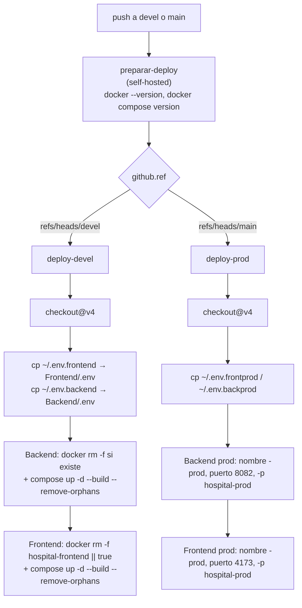

# Configuración, build y despliegue

## 1. `package.json`

`Frontend/package.json` — cuatro scripts y nada más:

| Script | Comando | Qué hace |
| --- | --- | --- |
| `dev` | `vite` | servidor de desarrollo con HMR; **no se fija puerto** (Vite usa 5173 por defecto) |
| `build` | `vite build` | bundle de producción en `dist/` |
| `lint` | `oxlint` | linter Rust, configurado por `.oxlintrc.json` |
| `preview` | `vite preview` | sirve `dist/` localmente para revisión |

**No existen**: `typecheck`, `test`, `format`, `prepare`/husky, ni hook de pre-commit.

### Dependencias declaradas

| Paquete | Rango declarado |
| --- | --- |
| `react`, `react-dom` | `^19.2.7` |
| `react-router-dom` | `^7.18.1` |
| `@types/react` | `^19.2.17` |
| `@types/react-dom` | `^19.2.3` |
| `@vitejs/plugin-react` | `^6.0.3` |
| `oxlint` | `^1.71.0` |
| `typescript` | `^7.0.2` |
| `vite` | `^8.1.1` |

Tres dependencias de producción en total. No hay librería de UI, de estado, de formularios, de fechas, de iconos ni de HTTP: todos los SVG están escritos a mano en el JSX y todas las peticiones usan `fetch` nativo ([[fe-api-clients]]).

`typescript` y `@types/*` están instalados **solo para el soporte del editor**: sin `tsconfig.json` no se ejecuta el compilador en ningún momento.

> Las versiones resueltas exactas están en `package-lock.json`. Este documento no las repite para no quedar desactualizado; `.agent/CONTEXT.md` registró Vite `8.1.5` y oxlint `1.74.0` en el lockfile al 2026-09-08. *(Pendiente de verificar contra el lockfile actual si importa la versión exacta.)*

## 2. `vite.config.js`

```js
export default defineConfig({ plugins: [react()] })
```
(7 líneas, `vite.config.js:1-7`)

Lo que **no** se configura y conviene saber:

| Ausente | Consecuencia |
| --- | --- |
| `server.proxy` | En desarrollo el navegador llama directo a la API → **depende de CORS** del backend ([[be-deployment]]) |
| `server.port` / `server.host` | No hay puerto fijo ni escucha en `0.0.0.0` |
| `resolve.alias` | Todos los imports son rutas relativas (`'../../../composable/PlatformApi'`) |
| `build.outDir` / `sourcemap` | `dist/` sin sourcemaps de producción |
| `base` | Asume que la SPA se sirve en la raíz del dominio |

## 3. Variable de entorno

**Una sola**: `VITE_API_BASE_URL`, declarada en `src/vite-env.d.ts` y consumida en los dos clientes (`AuthApi.ts:4`, `PlatformApi.ts:3`).

Hechos que gobiernan su uso:

- El prefijo `VITE_` es lo que hace que Vite la exponga al código del navegador. Se **incrusta literalmente en el bundle** durante `vite build`: es pública por construcción. **No poner secretos en variables `VITE_*`.**
- Debe ser una dirección **resoluble desde el navegador del usuario final**, no desde el contenedor. Un `http://localhost:5196` funciona en la máquina del desarrollador y falla en cualquier despliegue.
- Se concatena como `${VITE_API_BASE_URL}/Auth` y `${VITE_API_BASE_URL}/Platform`, así que su valor **no debe llevar barra final**.
- Si falta, el literal resultante es `"undefined/Auth"`: todas las peticiones fallan sin mensaje explicativo. No hay valor por defecto ni validación de arranque ([[fe-interfaces]]).
- Se lee de `Frontend/.env` en local. Ese archivo está en `.gitignore` y **su contenido no se reproduce en esta documentación**.
- Importante para Docker: al ser de **build time**, cambiarla **exige reconstruir la imagen**; no basta reiniciar el contenedor.

## 4. Linting

`.oxlintrc.json`:

```json
{ "plugins": ["react", "oxc"],
  "rules": { "react/rules-of-hooks": "error",
             "react/only-export-components": ["warn", { "allowConstantExport": true }] } }
```

Estado verificado al 2026-09-18: `npx oxlint` finaliza **sin errores y con 5 advertencias**, todas de `no-unused-vars` sobre parámetros:

| Archivo:línea | Parámetro |
| --- | --- |
| `templates/humanResources/places/placesModules.jsx:1:25` | `user` |
| `templates/humanResources/places/placesModules.jsx:1:31` | `catalogs` |
| `templates/contability/contability.jsx:1:24` | `user` |
| `templates/contability/contability.jsx:1:30` | `catalogs` |
| `templates/shared/areaTemplate.jsx:41:50` | `title` |

> Corrección respecto a `.agent/CONTEXT.md`, que registraba **7** advertencias incluyendo `user`/`catalogs` de `permitsModule`. Ese módulo ya usa las tres props, así que sus dos advertencias desaparecieron ([[fe-module-permits]]).

oxlint **no comprueba tipos** ni ejecuta reglas de exhaustividad de dependencias de `useEffect`.

## 5. Ausencia de tsconfig, typecheck y tests

Los tres huecos, con su consecuencia concreta:

| Hueco | Consecuencia verificable |
| --- | --- |
| **Sin `tsconfig.json`** | Vite/esbuild transpila los `.ts` descartando tipos. Las interfaces erróneas de [[fe-interfaces]] (`AccessResponse.access`, `ModulesResponse.modules`, `RegisterRequest.firstName`) **no producen ningún error** |
| **Sin script de typecheck** | Ni en local ni en CI. Un `tsc --noEmit` hoy fallaría, lo que a su vez desincentiva añadirlo |
| **Sin tests** | Cero archivos `.test.*` / `.spec.*`; ningún runner instalado. Regresiones como el `dispatchEvent('refresh')` que no refresca ([[fe-module-accounts]]) o el filtro que oculta solicitudes por colisión de IDs pasan inadvertidas |

`npm run build` **solo certifica que el bundle se genera**: no valida tipos, ni contratos con la API, ni comportamiento.

## 6. `index.html`

```html
<html lang="en">
  <link rel="icon" type="image/png" href="/favicon.png" />
  <title>Hospital Infantil Federico Gomez</title>
  <div id="root"></div>
  <script type="module" src="/src/main.jsx"></script>
```

- **`lang="en"` con interfaz en español**: defecto de accesibilidad y SEO ([[fe-design-system]]).
- Usa `favicon.png`; `public/favicon.svg` y `public/icons.svg` existen **sin referencia**.
- Sin `<meta name="description">`, sin Open Graph, sin `theme-color`.
- Sin CSP: ninguna mitigación declarativa frente al riesgo de XSS que afecta al token en `localStorage` ([[fe-session-state]]).

## 7. Nginx

`Frontend/nginx.conf` (19 líneas), copiado a `/etc/nginx/conf.d/default.conf`:

```nginx
server {
    listen 80;
    root /usr/share/nginx/html;
    location / { try_files $uri $uri/ /index.html; }      # SPA fallback
    location /assets/ { expires 1y; add_header Cache-Control "public, immutable"; }
}
```

| Aspecto | Realidad |
| --- | --- |
| SPA fallback | **Imprescindible**: sin él, recargar `/menu` o `/registrar` daría 404 de Nginx en lugar de entrar al router ([[fe-routing-guards]]) |
| Cache de assets | 1 año `immutable`, correcto porque Vite genera nombres con hash |
| Cache de `index.html` | **sin directiva explícita** → hereda el comportamiento por defecto; con un `index.html` cacheado por un proxy intermedio, un despliegue nuevo podría servir HTML viejo apuntando a assets inexistentes. *(Inferencia; no observado.)* |
| Proxy a la API | **no hay** `location /Auth` ni `/Platform` ni `/api`. El navegador va directo al backend → **CORS obligatorio** ([[be-deployment]]) |
| HTTPS | no se configura aquí |
| Cabeceras de seguridad | sin `X-Content-Type-Options`, `X-Frame-Options`, `Referrer-Policy` ni CSP |
| Compresión | sin `gzip`/`brotli` declarado |

## 8. Docker

### `Frontend/Dockerfile` — multietapa

```dockerfile
FROM node:20-alpine AS builder
WORKDIR /app
COPY package*.json ./
RUN npm install
COPY . .
RUN npm run build

FROM nginx:alpine
COPY --from=builder /app/dist /usr/share/nginx/html
COPY nginx.conf /etc/nginx/conf.d/default.conf
EXPOSE 80
CMD ["nginx", "-g", "daemon off;"]
```

Observaciones verificadas:

| # | Observación |
| --- | --- |
| 1 | **`npm install`, no `npm ci`**: puede resolver versiones distintas de las del lockfile dentro de los rangos `^`. Builds no reproducibles |
| 2 | `node:20-alpine` y `nginx:alpine` **sin fijar parche**: la imagen base cambia entre builds |
| 3 | **No hay `.dockerignore`**: `COPY . .` mete al contexto `node_modules` local, `dist`, `.git` y **`Frontend/.env`**. El `.env` acaba dentro de la etapa de construcción; no llega a la imagen final (solo se copia `dist`), pero sí queda en la caché de capas del builder. `.gitignore` **no** sustituye a `.dockerignore` |
| 4 | El `.env` en el contexto es además lo que hace que el build tome `VITE_API_BASE_URL`; si no se copia, el bundle sale con `undefined` |
| 5 | Etapa final ligera: solo Nginx + estáticos. Correcto |
| 6 | Sin `HEALTHCHECK`, sin usuario no root explícito |

### `Frontend/docker-compose.yml`

```yaml
services:
  frontend:
    image: hospital-frontend:${FRONTEND_IMAGE_TAG:-devel}
    container_name: ${FRONTEND_CONTAINER_NAME:-hospital-frontend}
    build: { context: ., dockerfile: Dockerfile }
    ports: [ "${FRONTEND_HOST_PORT:-5173}:80" ]
    volumes: [ ".:/app", "/app/node_modules" ]
    environment: [ "CHOKIDAR_USEPOLLING=true" ]
```

| Variable | Default |
| --- | --- |
| `FRONTEND_IMAGE_TAG` | `devel` |
| `FRONTEND_CONTAINER_NAME` | `hospital-frontend` |
| `FRONTEND_HOST_PORT` | `5173` |

**Los montajes y `CHOKIDAR_USEPOLLING` son residuos de una configuración de desarrollo y no hacen nada útil aquí**: la imagen final es Nginx sirviendo `/usr/share/nginx/html`, no Node observando `/app`. Montar `.:/app` sobre una imagen de Nginx crea un directorio irrelevante; no hay hot reload. **Todo cambio de código exige reconstruir la imagen.**

Tampoco hay `restart: unless-stopped` (el Compose del backend sí lo tiene, según `.agent/CONTEXT.md`), ni red declarada, ni dependencia del backend.

## 9. CI/CD — `.github/workflows/deploy-devel.yml`

Disparador: `push` a `devel` o a `main`. Runner: **`self-hosted`** en los tres jobs.



### Lo que hace, para el frontend

1. Copia `~/.env.frontend` (o `~/.env.frontprod`) del **filesystem del runner** a `Frontend/.env`. Los valores viven fuera del repositorio y **no se exponen** en el workflow. Es lo que hace que `VITE_API_BASE_URL` entre al build.
2. `docker rm -f hospital-frontend || true`.
3. `docker compose up -d --build --remove-orphans` desde `Frontend/`.

En producción define solo `FRONTEND_CONTAINER_NAME=hospital-frontend-prod` y `FRONTEND_HOST_PORT=4173`, y usa el proyecto Compose `hospital-prod`.

### Carencias verificadas del pipeline

| # | Carencia | Impacto |
| --- | --- | --- |
| 1 | **No ejecuta `npm run lint`** ni build de verificación previo | Un fallo de compilación solo se descubre durante el `docker build`, con el contenedor ya eliminado |
| 2 | **Elimina el contenedor antes de construir** | Ventana de indisponibilidad; si el build falla, el sitio **queda caído** hasta arreglarlo |
| 3 | Sin tests (no existen) | — |
| 4 | Sin healthcheck posterior ni smoke test | Un despliegue roto se reporta como éxito |
| 5 | Sin rollback ni versionado de imagen | `FRONTEND_IMAGE_TAG` **no se sobreescribe en el job de producción**: el default de Compose sigue siendo `devel` salvo que el entorno del runner lo defina. Producción y devel pueden compartir etiqueta de imagen |
| 6 | Sin `concurrency` | Dos pushes seguidos pueden solaparse en el mismo runner |
| 7 | No despliega `DataBase/` ni aplica cambios de esquema | Los cambios de SQL son manuales ([[db-index]]) |
| 8 | Ambos jobs son `self-hosted` sin `labels` | No se garantiza que backend y frontend caigan en la misma máquina, aunque en la práctica se asuma |

## 10. Ejecución local de referencia

Desde `Frontend/`, con Node compatible (los paquetes exigen `^20.19.0 || >=22.12.0`) y `Frontend/.env` presente:

```sh
npm ci            # preferible a npm install para reproducir el lockfile
npm run dev       # desarrollo con HMR
npm run lint      # 0 errores, 5 advertencias esperadas
npm run build     # genera dist/
npm run preview   # sirve dist/ para revisión
```

Recordatorio: el frontend **no funciona solo**. Necesita el backend arriba y su `Cors:AllowedOrigins` incluyendo el origen exacto desde el que se sirve la SPA, porque no hay proxy en Vite ni en Nginx ([[be-deployment]]).

## 11. Checklist antes de desplegar un cambio de frontend

1. `npm run lint` sin errores nuevos.
2. `npm run build` correcto.
3. `VITE_API_BASE_URL` del entorno destino es resoluble **desde el navegador** y sin barra final.
4. Ese origen está en la lista CORS del backend.
5. Si se tocó un contrato, verificar la propiedad JSON real, no la interfaz TS ([[fe-interfaces]]).
6. Si se añadió un área o un módulo, confirmar nombre/ID reales en SQL ([[fe-templates-areas-modules]]).
7. Revisar la pantalla en ancho estrecho: el shell privado no tiene breakpoints ([[fe-design-system]]).
8. Tras el despliegue, comprobar a mano una recarga en `/menu` (valida el fallback de Nginx) y una mutación con sesión fresca (valida el token).

## Enlaces

- Mapa: [[fe-index]] · Arquitectura: [[fe-architecture]]
- Consumidora de `VITE_API_BASE_URL`: [[fe-api-clients]] · Tipo de la variable: [[fe-interfaces]]
- Por qué importa el fallback SPA: [[fe-routing-guards]]
- Orden de importación de CSS y deuda visual: [[fe-design-system]]
- Token de sesión afectado por la falta de CSP: [[fe-session-state]]
- Defectos consolidados: [[fe-findings]]
- Despliegue del backend y CORS: [[be-deployment]], [[be-index]], [[be-auth-session]], [[be-api-reference]], [[be-dto-contracts]], [[be-flows]]
- Cambios de esquema fuera del pipeline: [[db-index]], [[db-schema-acceso-usuario]], [[db-table-areas]], [[db-table-modulos]], [[db-table-permisos]], [[db-table-usuario-modulo-permisos]]
- Visión global: [[architecture-overview]]
