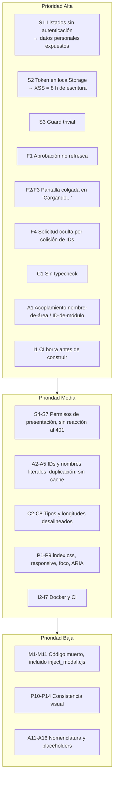

# Hallazgos del frontend

Todos los hallazgos proceden de **lectura del código** al 2026-09-18. No se ejecutó la aplicación en un navegador, no se golpeó la API ni se consultó la base. Donde el impacto es deducido y no observado, se marca como *inferencia*.

Prioridad: **Alta** = rompe o expone algo hoy · **Media** = falla en escenarios concretos o dificulta el mantenimiento · **Baja** = limpieza y consistencia.

## 1. Defectos funcionales (bugs)

| # | Prioridad | Defecto | Ubicación | Impacto |
| --- | --- | --- | --- | --- |
| F1 | **Alta** | Tras aprobar una solicitud, la lista **no se refresca**: se despacha `new Event('refresh')` sobre el botón conmutador y **nadie escucha ese evento**. La rama alternativa `window.location.reload()` es inalcanzable porque el ref siempre existe | `accountsModule.jsx:142-148` | La solicitud aprobada sigue en la lista; se puede intentar aprobarla otra vez y obtener un conflicto del servidor. *(Impacto inferido.)* Ver [[fe-module-accounts]] |
| F2 | **Alta** | Carga de catálogos **sin `try/catch/finally`**: si `GetAreas`, `GetAccess` o `GetModulesCatalog` fallan, `setLoading(false)` nunca corre | `principalPage.jsx:92-108` | La app queda en "Cargando..." de forma permanente, sin mensaje ni reintento. Es el fallo de mayor visibilidad. Ver [[fe-pages]] |
| F3 | **Alta** | `JSON.parse(localStorage.getItem('user'))` **sin protección**; si la clave es inválida (o manipulada) lanza dentro de la promesa | `principalPage.jsx:93` | Misma pantalla colgada que F2, en lugar de redirigir al login. Ver [[fe-session-state]] |
| F4 | **Alta** | El filtro "excluirme de la lista" compara `SolicitudUsuarios.Id` con `Usuarios.Id`, que son PK de tablas distintas sin FK entre ellas | `accountsModule.jsx:321` | Una solicitud cuyo Id coincida numéricamente con el Id del administrador conectado **se oculta sin motivo** y no puede aprobarse desde la UI. Ver [[db-schema-acceso-usuario]] |
| F5 | Media | `disabled={submittingRef.current}` sobre un `useRef`: mutar un ref **no vuelve a renderizar** | `accountsModule.jsx:367` | El botón conmutador nunca se muestra deshabilitado durante una mutación; el candado real son los `if` de las funciones, que sí protegen |
| F6 | Media | SVG del toast **inválido**: `d="M22 11.08V12a10 10 10 0 1 1-5.93-9.14"` tiene un parámetro de más en el comando de arco `a` (espera 7) | `accountsModule.jsx:687`, `permitsModule.jsx:413` | El círculo del icono de éxito no se dibuja como se pretende. *(Inferencia.)* |
| F7 | Media | Pestaña con nombre **vacío** cuando el módulo está en `user.accesos` pero no en `catalogs.modules` (módulo inactivo o de área inactiva); no se filtra ni se pone texto de respaldo | `areaTemplate.jsx:31, 67` | Pestaña sin etiqueta, imposible de identificar. Ver [[fe-templates-areas-modules]] |
| F8 | Media | En `permitsModule.openEdit`, si `getUserPermissions` lanza, ya se fijó `editingUser` pero el diálogo no se abre | `permitsModule.jsx:130, 156-162` | Estado inconsistente: `alert()` de error y un `editingUser` colgado hasta el siguiente intento. *(Inferencia.)* |
| F9 | Media | `openEdit` **no comprueba `canEdit`** (a diferencia de `openActivation`, que sí lo hace) | `permitsModule.jsx:128` | No explotable desde la UI (el botón solo se pinta con `canEdit`), pero la función pierde su guarda defensiva |
| F10 | Baja | Rama de autobaja **inalcanzable**: `filteredUsers` excluye al usuario conectado, así que nunca se puede abrir su diálogo | `accountsModule.jsx:257-259` vs `:321` | Código muerto que sugiere una capacidad inexistente |
| F11 | Baja | `disabled={deactivating}` en el botón "Activar", que solo aparece en la vista de solicitudes donde `deactivating` nunca es `true` | `accountsModule.jsx:408` | Inofensivo; confunde al leer |
| F12 | Baja | `submittingRef.current = false` asignado dos veces en la ruta de éxito (antes de `cancelEdit` y en el `finally`) | `permitsModule.jsx:189, 201` | Redundante; el efecto es que `cancelEdit` no aborta por el candado, lo que probablemente es intencional |

## 2. Seguridad y autorización

| # | Prioridad | Hallazgo | Ubicación | Impacto |
| --- | --- | --- | --- | --- |
| S1 | **Alta** | Los dos `GET` de listado **no exigen sesión** ni en el cliente ni en el servidor: `getUsers`/`getRegisteredUsers` no envían token y los endpoints no llevan `[Authorize]` | `PlatformApi.ts:5-19`; `Backend/Controllers/PlatformControler.cs:24, 31` | **Datos personales de solicitudes y de usuarios registrados (nombre, correo, alias, fecha de nacimiento, sexo) son legibles sin autenticación alguna.** Ver [[be-auth-session]] |
| S2 | **Alta** | El **bearer token vive en `localStorage`**, legible por cualquier JavaScript de la página | `login.jsx:33`, consumido en los 5 puntos de mutación | Un XSS o una dependencia comprometida obtiene un token válido hasta 8 h para aprobar cuentas, dar de baja y reescribir permisos. Agravado por la ausencia de CSP en `index.html`. Ver [[fe-session-state]] |
| S3 | **Alta** | `isAuthenticated()` solo comprueba que la cadena no sea `null`, `'undefined'` ni `''` | `RouteGuards.jsx:3-6` | `localStorage.setItem('user','x')` basta para entrar a `/menu`. Es navegación de UI, **no autorización**. Ver [[fe-routing-guards]] |
| S4 | Media | Los permisos del cliente son de **presentación**: `module.permisos` viene de un JSON que el usuario puede editar | `accountsModule.jsx:40-46`, `permitsModule.jsx:29-32` | Modificar `accesos` hace aparecer pestañas y botones. Las mutaciones sí las valida el servidor por token; las lecturas no (ver S1) |
| S5 | Media | Los modales de asignación ofrecen **todas** las áreas de `catalogs.areas` y **todos** los permisos de `catalogs.access`, no solo los que el administrador posee | `accountsModule.jsx:584, 614`; `permitsModule.jsx:310, 340` | Un administrador con permisos sobre un solo área puede conceder permisos sobre cualquier área. Falta acotar la oferta (y validarlo en el servidor) |
| S6 | Media | **No hay reacción al 401**: el cliente lanza un mensaje, pero no se borra `localStorage` ni se redirige al login | patrón común de `PlatformApi.ts` | Con el token vencido el usuario sigue navegando una UI que ya no puede escribir, hasta que cierre sesión a mano |
| S7 | Media | El logout **no revoca** nada en el servidor | `principalPage.jsx:113-116` | Un token copiado antes del logout sigue válido hasta expirar |
| S8 | Baja | Sin CSP, sin `X-Frame-Options`, sin `Referrer-Policy` en `nginx.conf` ni en `index.html` | `nginx.conf`, `index.html` | Superficie de XSS/clickjacking sin mitigación declarativa. Ver [[fe-config-deployment]] |

## 3. Contratos y tipos

| # | Prioridad | Hallazgo | Ubicación | Impacto |
| --- | --- | --- | --- | --- |
| C1 | **Alta** | **Sin `tsconfig.json` ni script de typecheck**: los tipos de `interfaces/` nunca se verifican | `Frontend/` | Todas las desalineaciones siguientes son invisibles para las herramientas. Deuda que se refuerza a sí misma |
| C2 | Media | `AccessResponse` declara `access`; el servidor devuelve `permisos` | `interfaces/response/Auth.ts:28-30` | El componente usa la propiedad correcta; el tipo miente |
| C3 | Media | `ModulesResponse` declara `modules`; el servidor devuelve `modulos` | `interfaces/response/Auth.ts:32-34` | Igual que C2; sería error de compilación con typecheck |
| C4 | Media | `RegisterRequest` declara `firstName`; se envía `name` | `interfaces/request/Auth.ts:13` vs `registry.jsx:104` | Contrato documentado incorrectamente |
| C5 | Media | `getUserPermissions` devuelve **`Promise<any>`**; el backend sí tiene un DTO formal (`UserPermissionsResponse`) | `PlatformApi.ts:93-118` | Un renombrado de `moduloName`/`permisosIds` rompería el modal en silencio |
| C6 | Media | Las siete funciones de `AuthApi.ts` **no comprueban `response.ok`** | `AuthApi.ts` completo | Un 400/401 se parsea como DTO de éxito; las páginas compensan a mano. Ver [[fe-api-clients]] |
| C7 | Media | `ModulesRequest` se envía como `AreasId` en un sitio y `areasId` en dos | `principalPage.jsx:66` vs `accountsModule.jsx:56`, `permitsModule.jsx:73` | Funciona por el binding case-insensitive de ASP.NET Core; inconsistencia a unificar |
| C8 | Media | Longitudes de registro divergentes: UI acepta nombres de 50 y apellidos de 25; SQL limita a 30 y 20. El correo no tiene tope en la UI y SQL lo limita a 100 | `registry.jsx:42, 50, 58, 84` | Datos aceptados por la UI que la base rechaza. Ver [[db-schema-acceso-usuario]] |
| C9 | Baja | `GetAccessCatalog()` apunta a `/Auth/GetAccessCatalog`, **ruta inexistente**, y no la llama nadie | `AuthApi.ts:56-66` | Trampa: quien la use recibirá un 404 parseado sin error |
| C10 | Baja | `vite-env.d.ts` declara `VITE_API_BASE_URL: string` no opcional | `vite-env.d.ts:4` | Afirma falsamente que siempre está definida; si falta, las URL son `"undefined/Auth"` |
| C11 | Baja | Faltan interfaces para los cuerpos de aprobar/permisos/comentario y para el resultado `{success, message}` | `PlatformApi.ts:63-148` | Objetos inline repetidos. Ver [[fe-interfaces]] |

## 4. Arquitectura y mantenibilidad

| # | Prioridad | Hallazgo | Ubicación | Impacto |
| --- | --- | --- | --- | --- |
| A1 | **Alta** | **Acoplamiento rígido con los catálogos SQL**: áreas por nombre normalizado y módulos por ID literal, codificados en el frontend | `principalPage.jsx:10-15`, `areaTemplate.jsx:8-12` | Renombrar un área o recrear el catálogo de módulos produce componentes equivocados, pestañas sin nombre o áreas sin vista. Ver [[fe-templates-areas-modules]], [[db-table-areas]], [[db-table-modulos]] |
| A2 | Media | El permiso "Ver" se fuerza comparando **`id === '1'`** literal | `accountsModule.jsx:73, 615`; `permitsModule.jsx:90, 341` | Si "Ver" no es el ID 1 en `Permisos`, se fuerza el permiso equivocado y se pinta como no editable. Ver [[db-table-permisos]] |
| A3 | Media | Los nombres de permiso `'editar'`, `'crear'`, `'eliminar'` se comparan como cadenas | `accountsModule.jsx:43-45` | Renombrarlos en SQL apaga los botones **en silencio** |
| A4 | Media | **Duplicación masiva** entre `accountsModule` y `permitsModule`: 8 bloques casi idénticos, incluido el grid de 3 columnas del modal (~100 líneas cada uno) | ver tabla en [[fe-module-permits]] § 7 | Cada arreglo hay que aplicarlo dos veces; ya divergieron (`addPermissionSet` limpia el módulo en uno y no en el otro) |
| A5 | Media | Sin estado global ni cache: `getRegisteredUsers()` se pide por separado en cada módulo y los catálogos se repiden por área en cada modal | `accountsModule.jsx:169`, `permitsModule.jsx:39`, `accountsModule.jsx:56` | Peticiones redundantes y estados de carga reimplementados a mano en cada sitio |
| A6 | Media | Carga de catálogos **secuencial** (`await GetAreas()` y luego `await GetAccess()`) cuando son independientes | `principalPage.jsx:97-98` | Un round-trip evitable en el arranque del shell |
| A7 | Media | `selectedId` de `AreaTemplate` se inicializa una sola vez, sin `useEffect` de sincronización | `areaTemplate.jsx:47` | Si `modules` cambiara tras el primer render, la pestaña activa quedaría desincronizada. Hoy no se observa porque el template se monta con los catálogos ya cargados. *(Inferencia.)* |
| A8 | Media | `permitsModule` usa solo la bandera `mounted`, **sin `AbortController`**, aunque el cliente acepta `signal` | `permitsModule.jsx:34-52` | Peticiones que siguen en vuelo al desmontar |
| A9 | Media | **No se puede dejar a un usuario sin permisos** desde la UI: el guardado exige `addedPermissions.length > 0` | `permitsModule.jsx:401` | Revocar todo obliga a dar de baja la cuenta o a intervenir la base |
| A10 | Media | `errores`/`alert()` nativos para fallos de mutación, mezclados con modales y toasts propios | `accountsModule.jsx:151`, `permitsModule.jsx:161, 199` | Experiencia incoherente y no estilizable |
| A11 | Baja | Nomenclatura engañosa: `BuildNavModules`, `ProcessModules`, `navModules`, `activeModule` operan sobre **áreas** | `principalPage.jsx:31-51, 82-83` | Dificulta leer el código |
| A12 | Baja | Píldoras que simulan eventos de `<select>`: `onClick={() => handleAreaChange({ target: { value } })}` | `accountsModule.jsx:589, 603`; `permitsModule.jsx:315, 329` | Residuo del rediseño; acopla el manejador a una forma de evento inexistente |
| A13 | Baja | `title` recibido y no usado en `AreaTemplate`; `user`/`catalogs` ignorados en `PlacesModule` y `Contability` | `areaTemplate.jsx:41`, `placesModules.jsx:1`, `contability.jsx:1` | Las 5 advertencias de oxlint |
| A14 | Baja | `Contability` **no usa `AreaTemplate`** | `contability.jsx:1-8` | Añadirle módulos exige migrarla primero |
| A15 | Baja | `HumanResourcesApi.ts` existe **vacío**; `POST /HumanResources` y `POST /Contability` no tienen consumidor | `composable/HumanResourcesApi.ts` | Archivo fantasma |
| A16 | Baja | Sin tests de ninguna clase | `Frontend/` | F1 y F4 son exactamente el tipo de defecto que un test detectaría |

## 5. Presentación y accesibilidad

Resumen; el detalle está en [[fe-design-system]] § 7.

| # | Prioridad | Hallazgo | Ubicación |
| --- | --- | --- | --- |
| P1 | Media | `index.css` **sobreescribe los tokens institucionales** (tamaño base, pesos de `h1`/`h2`, color de texto, fondo) y activa `color-scheme: light dark` sin tema oscuro propio | `main.jsx:4`, `index.css:18-22, 33-90` |
| P2 | Media | **Sin responsive en el shell privado**: 0 media queries; sidebar de 260 px fijo, sin menú colapsable | `principalPage.css` |
| P3 | Media | `button { outline: none }` global elimina el foco visible de **todos** los botones; solo `.accounts-action` lo repone | `global.css:96-101` |
| P4 | Media | Pestañas con `role="tab"` y `aria-selected` pero **sin navegación por flechas, sin `tablist` funcional, sin `tabpanel`/`aria-controls`** | `areaTemplate.jsx:54-70` |
| P5 | Media | Los modales de overlay (`Registry`, `PasswordRecouperation`) **no atrapan ni restauran el foco** | `registry.jsx:330`, `passwordRecuperation.jsx:175` |
| P6 | Media | El toast **no tiene `aria-live` ni `role="status"`** | `accountsModule.jsx:684`, `permitsModule.jsx:410` |
| P7 | Media | Filtros de `permitsModule` **sin `<label>` ni `id`**, solo `placeholder` | `permitsModule.jsx:210-223` |
| P8 | Media | `<html lang="en">` con interfaz completamente en español | `index.html:2` |
| P9 | Media | La lista de usuarios registrados **no muestra `activo`**: activos e inactivos aparecen mezclados sin distinción | `accountsModule.jsx:393-400`, `permitsModule.jsx:238-245` |
| P10 | Baja | Tres patrones de modal distintos y dos de notificación (toast + banner) | páginas y módulos |
| P11 | Baja | Colores literales fuera de la paleta: `#388e3c`, `#b91c1c`, `#3b82f6`, `#22c55e`, `#b8a882`, `#d0b990`, `#999`, `#666`… | `accountsModule.css`, `login.css:148`, `permitsModule.jsx:253` |
| P12 | Baja | `!important`, `margin-top` duplicado y píxeles crudos en vez de tokens en el CSS del modal nuevo | `accountsModule.css:282, 427-429, 280-509` |
| P13 | Baja | Franja de pestañas acoplada al padding del padre mediante márgenes negativos | `areaTemplate.css:13-14, 43` |
| P14 | Baja | Textos con y sin acento mezclados ("Cerrar sesion" junto a "¿Está seguro...?") | todo el JSX |

## 6. Infraestructura y proceso

| # | Prioridad | Hallazgo | Ubicación | Impacto |
| --- | --- | --- | --- | --- |
| I1 | **Alta** | El CI **elimina el contenedor antes de construir** y no ejecuta lint ni build previo | `deploy-devel.yml:48-49` | Si el build falla, el frontend **queda caído**. Ver [[fe-config-deployment]] |
| I2 | Media | **Sin `.dockerignore`**: `COPY . .` incluye `node_modules`, `dist`, `.git` y `Frontend/.env` en el contexto de build | `Frontend/Dockerfile:6` | Contexto inflado y `.env` en la caché de capas del builder |
| I3 | Media | `npm install` en lugar de `npm ci`, e imágenes base sin fijar parche | `Dockerfile:5, 1, 10` | Builds no reproducibles |
| I4 | Media | Montajes `.:/app`, `/app/node_modules` y `CHOKIDAR_USEPOLLING` **no hacen nada** en una imagen de Nginx | `docker-compose.yml:10-14` | Sugiere hot reload inexistente; cada cambio exige reconstruir |
| I5 | Media | `FRONTEND_IMAGE_TAG` **no se sobreescribe** en el job de producción | `deploy-devel.yml:76-83` | Producción y devel pueden compartir etiqueta de imagen |
| I6 | Media | Sin healthcheck, sin smoke test, sin rollback, sin `concurrency` en el workflow | `deploy-devel.yml` | Un despliegue roto se reporta como éxito |
| I7 | Media | Nginx **sin proxy** a `/Auth` y `/Platform` | `nginx.conf` | La SPA depende por completo de CORS del backend ([[be-deployment]]) |
| I8 | Baja | `index.html` sin directiva de cache explícita en Nginx | `nginx.conf` | Riesgo de servir HTML viejo con assets con hash inexistentes. *(Inferencia.)* |
| I9 | Baja | Sin `restart: unless-stopped` en el Compose del frontend | `docker-compose.yml` | El contenedor no vuelve solo tras un reinicio del host |

## 7. Código muerto y artefactos

| # | Elemento | Ubicación | Nota |
| --- | --- | --- | --- |
| M1 | **`inject_modal.cjs`** | `templates/platform/accounts/inject_modal.cjs` | Script de andamiaje de un solo uso que **reescribe `accountsModule.jsx` por `String.replace`**. Reinyectaría la versión **obsoleta** del modal (con `<select>` y un `confirmActivation` que solo hace `console.log`). **No es idempotente: volver a ejecutarlo corrompería el componente.** Versionado en Git y copiado a la imagen Docker por falta de `.dockerignore`. **Debe borrarse.** Ver [[fe-module-accounts]] § 9 |
| M2 | `src/App.css` | 185 líneas | No se importa en ninguna parte |
| M3 | `platform.css`, `humanResources.css`, `placesModules.css`, `contability.css` | 0 bytes cada uno | Vacíos y sin import |
| M4 | `composable/HumanResourcesApi.ts` | 0 bytes | Vacío |
| M5 | `GetAccessCatalog()` | `AuthApi.ts:56-66` | Ruta inexistente, sin llamadores |
| M6 | `src/assets/react.svg`, `vite.svg`, `hero.png` | — | Restos de la plantilla, sin referencias |
| M7 | `public/favicon.svg`, `public/icons.svg` | — | Sin referencias (`index.html` usa `favicon.png`) |
| M8 | `Frontend/README.md` | — | README genérico de React+Vite, no documentación del dominio |
| M9 | Utilidades de `global.css` (`.text-primary`, `.bg-*`) y `.sidebar-empty`, `.sidebar-loading`, `.checkbox-label` | CSS | Definidas y no usadas |
| M10 | Campo `alias` de la sesión | `localStorage.user` | Se guarda y no se muestra en ninguna vista |
| M11 | Rama de autobaja | `accountsModule.jsx:257-259` | Inalcanzable (ver F10) |

## 8. Desviaciones respecto a `.agent/CONTEXT.md` (2026-09-08)

El análisis previo se usó como pista. Estas son las diferencias reales con el código de hoy:

| Afirmación de `.agent/CONTEXT.md` | Estado real al 2026-09-18 |
| --- | --- |
| "Administración de permisos: **pendiente**. Vista con título y texto" | **Implementada y con persistencia.** `permitsModule.jsx` tiene 424 líneas, busca cuentas, lee `GET /Platform/Users/{id}/Permissions` y sobreescribe con `PUT /Platform/Users/Permissions`. Ver [[fe-module-permits]] |
| "Aprobar/rechazar solicitudes: **no existe operación**. Botón visual «Activar» sin acción" | **Implementada.** Modal de activación en tres columnas + `POST /Platform/Users/Approve` con transacción en el servidor. Ver [[fe-module-accounts]] |
| "Los botones «Activar», «Desactivar» y chat **siguen siendo visuales**: no tienen `onClick`" | **Los tres tienen `onClick` y abren modales que persisten**: aprobación, baja (`POST /Platform/Users/{id}/deactivate`) y comentario (`PUT /Platform/UserRequest/{id}/comment`) |
| "«Desactivar» se muestra si tiene **`editar`**" | Ahora depende del permiso **`eliminar`** (`canDelete`, `accountsModule.jsx:45, 417`) |
| "Si una cuenta ya está inactiva, «Desactivar» se muestra deshabilitado con título explicativo" | **Ya no existe esa lógica.** `activo` no se lee ni se muestra; activos e inactivos aparecen mezclados (P9) |
| "No se envía token en futuras peticiones, no hay renovación/expiración de sesión" | **El login devuelve `accessToken`** (bearer opaco, **expiración 8 h**), se guarda en `localStorage` y se envía en las 5 mutaciones. Sigue sin haber refresco ni revocación. Ver [[fe-session-state]] |
| "`LoginResponse`: identidad mínima más `accesos`. Tampoco incluye token o expiración" | `LoginResponse` **ya declara `accessToken`** (`interfaces/response/Auth.ts:13`) y coincide con el DTO del servidor |
| "`AuthApi.ts`: **siete** funciones fetch" | **Ocho** funciones; se añadió `GetUserTypesCatalog()` (`GET /Auth/userTypes`) |
| "`PlatformApi.ts`: `getUsers()` y `getRegisteredUsers()`" | **Siete** funciones: se añadieron `deactivateUser`, `updateUserRequestComment`, `approveUser`, `getUserPermissions`, `updateUserPermissions`, las cinco con `Authorization: Bearer` y manejo explícito del 401 |
| "`interfaces/response/Platform.ts`: `UsersResponse` y `RegisteredUsersResponse`" | Cinco interfaces; se añadieron `DeactivateUserResponse` y el campo `Users.comentario?` |
| "Tipos TS del modal de tipos de usuario: no mencionados" | Existe `UserTypesResponse`, y `UserTypesResponse.userTypes` **sí está alineada** con el JSON. La tolerancia `userTypes \|\| UserTypes` de los módulos es defensa extra, no una corrección |
| "`npm run lint`: **siete** advertencias" | **Cinco** advertencias. Las dos de `permitsModule` desaparecieron porque el módulo ya usa `user`, `catalogs` y `module` |
| "El modal de activación compila `addedPermissions` pero **aún no persiste**" (MEMORY, 2026-09-08) | **Ya persiste.** `confirmActivation` llama a `approveUser(...)`; el `console.log("Activación Mock")` solo sobrevive dentro de `inject_modal.cjs` |
| "El botón de chat abre una conversación / envía mensajes: no implementado" | El botón de chat abre un **editor de comentario único por solicitud** que persiste en `SolicitudUsuarios.comentario`. **No es mensajería**: no hay historial, ni autor, ni fecha |
| "Cambio de contraseña sin prueba de identidad" | **Sin cambios**: sigue igual (`passwordRecuperation.jsx`) |
| "`GetAccessCatalog()` apunta a ruta inexistente y no se usa" | **Sin cambios** (C9) |
| "CSS vacíos de platform/permits/humanResources/places/contability" | `permitsModule.css` **no existe**; el módulo importa `accountsModule.css`. Los otros cuatro siguen vacíos |
| "No hay `tsconfig.json`, typecheck ni tests" | **Sin cambios** (C1, A16) |
| "Deuda de presentación: `index.css`, foco, `lang`, responsive del shell" | **Sin cambios** (P1–P3, P8) |
| No mencionaba `inject_modal.cjs` | Existe y es un artefacto destructivo (M1) |

## 9. Diagrama de riesgo por capa

## 10. Orden de trabajo sugerido

1. **S1** — poner `[Authorize]` en los dos listados y enviar el token desde `getUsers`/`getRegisteredUsers`. Es el único hallazgo con exposición de datos personales hoy.
2. **F2 + F3** — `try/catch/finally` y estado de error en la carga de catálogos; ante `JSON.parse` fallido, limpiar la sesión y redirigir al login.
3. **F1** — refrescar la lista tras aprobar (volver a llamar al fetch, o mover la carga a una función reutilizable).
4. **F4** — no comparar IDs de tablas distintas: excluirse solo en la vista de registrados.
5. **S6** — manejador central del 401 que limpie `localStorage` y redirija.
6. **C1** — añadir `tsconfig.json` + script `typecheck`; luego corregir C2–C5 y C7.
7. **M1** — borrar `inject_modal.cjs`.
8. **I1 + I2** — añadir lint/build al workflow antes de eliminar el contenedor, y crear `.dockerignore`.
9. **A4** — extraer el modal de asignación compartido por los dos módulos antes de que divergan más.
10. **P1 + P3** — quitar la importación de `index.css` y reponer el foco visible global.

## Enlaces

- Mapa: [[fe-index]] · Arquitectura: [[fe-architecture]]
- Origen de cada hallazgo: [[fe-routing-guards]], [[fe-pages]], [[fe-templates-areas-modules]], [[fe-module-accounts]], [[fe-module-permits]], [[fe-api-clients]], [[fe-interfaces]], [[fe-session-state]], [[fe-design-system]], [[fe-config-deployment]]
- Contraparte de servidor: [[be-index]], [[be-api-reference]], [[be-dto-contracts]], [[be-auth-session]], [[be-flows]], [[be-deployment]]
- Contraparte de datos: [[db-index]], [[db-schema-acceso-usuario]], [[db-table-areas]], [[db-table-modulos]], [[db-table-permisos]], [[db-table-usuario-modulo-permisos]]
- Visión global: [[architecture-overview]]
