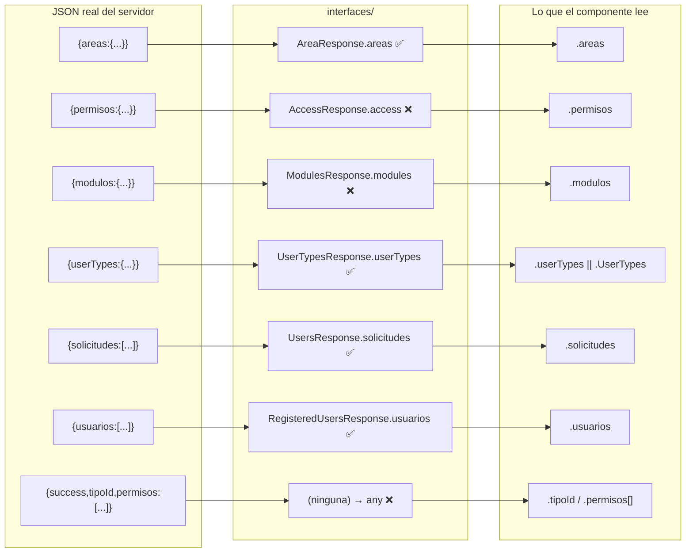

# Interfaces TS — `src/interfaces/`

Tres archivos, ningún `tsconfig.json`, ningún script de typecheck. **Los tipos de esta carpeta no se verifican nunca**: Vite transpila los `.ts` con esbuild descartando los tipos, y `oxlint` no hace comprobación de tipos. Por tanto, una interfaz equivocada **no produce ningún error** y solo engaña al desarrollador y al editor.

```
src/interfaces/
├── request/Auth.ts      5 declaraciones
├── response/Auth.ts     6 alias + 5 interfaces
└── response/Platform.ts 5 interfaces
```

`src/vite-env.d.ts` completa la tipificación del entorno:

```ts
/// <reference types="vite/client" />
interface ImportMetaEnv { readonly VITE_API_BASE_URL: string; }
interface ImportMeta { readonly env: ImportMetaEnv; }
```
(`vite-env.d.ts:1-9`)

Declarada como `string` no opcional, lo que **afirma falsamente** que siempre estará definida.

## 1. `interfaces/request/Auth.ts`

| Declaración | Contenido | ¿Coincide con lo que se envía? |
| --- | --- | --- |
| `AreasListId = number[]` | alias | sí |
| `LoginRequest` | `{user, password}` | **sí** (`login.jsx:22-23`) |
| `RegisterRequest` | `{user, password, email, birthDate, firstName, lastName, lastNameTwo, sex}` | **NO**: se envía `name`, no `firstName` |
| `ModulesRequest` | `{AreasId: number[]}` | parcialmente: se envía `AreasId` en un sitio y `areasId` en dos |
| `ChangePasswordRequest` | `{email, password}` | **sí** (`passwordRecuperation.jsx:53-56`) |

## 2. `interfaces/response/Auth.ts`

### Alias de tipos estructurales (`:1-6`)

```ts
export type Modulo = Record<string, number[]>;        // { "1": [1,2,3] }
export type Acceso = Record<string, Modulo[]>;        // { "Plataforma": [ {...}, {...} ] }
export type AreaCatalog = Record<string, number>;     // { "Plataforma": 1000 }
export type AccessCatalog = Record<number, string>;   // { 1: "Ver" }
export type ModulesCatalog = Record<number, string>;  // { 1: "Configuracion de cuentas" }
export type UserTypesCatalog = Record<string, number>;// { "Administrador": 1 }
```

Estos seis alias **sí describen fielmente** la forma real del JSON, incluida la sutileza de que `Modulo` indexa por `string` (las claves de diccionario en JSON siempre son cadenas, aunque en C# el `Dictionary` sea `<int, ...>`). Es la parte mejor hecha del archivo.

### Interfaces

| Interfaz | Declara | El servidor devuelve | Veredicto |
| --- | --- | --- | --- |
| `LoginResponse` | `{id, nombre, alias, correo, accessToken, accesos: Acceso[], message?}` | exactamente eso | **correcta** |
| `RegisterResponse` | `{success, message}` | exactamente eso | **correcta** |
| `AreaResponse` | `{areas: AreaCatalog}` | `{areas: {...}}` | **correcta** |
| `AccessResponse` | `{access: AccessCatalog}` | `{permisos: {...}}` | **INCORRECTA** |
| `ModulesResponse` | `{modules: ModulesCatalog}` | `{modulos: {...}}` | **INCORRECTA** |
| `UserTypesResponse` | `{userTypes: UserTypesCatalog}` | `{userTypes: {...}}` | **correcta** |

> `LoginResponse.accessToken` es nuevo respecto a `.agent/CONTEXT.md`, que describía el login como "sin token ni expiración". Hoy el token existe, se tipa y se usa ([[fe-session-state]]).

> `UserTypesResponse` **sí es correcta**: el DTO C# se llama `UserTypes` y la serialización camelCase por defecto de ASP.NET Core lo emite como `userTypes`. La tolerancia `|| typesResp?.UserTypes` de los módulos es defensa extra, no una corrección de un error existente ([[fe-api-clients]]).

## 3. `interfaces/response/Platform.ts`

| Interfaz | Campos | Veredicto |
| --- | --- | --- |
| `UsersResponse` | `{solicitudes: Users[]}` | correcta |
| `RegisteredUsersResponse` | `{usuarios: RegisteredUser[]}` | correcta |
| `DeactivateUserResponse` | `{success, code, message}` | correcta |
| `RegisteredUser` | `id, tipoId, nombre, apellidoPaterno, apellidoMaterno, fechaNacimiento, sexo, fechaIngreso, alias, correo, activo` | correcta en nombres; ver nota de fechas |
| `Users` | `id, usuario, nombre, apellidoPaterno, apellidoMaterno, correo, fechaIngreso, aprobado, comentario?` | correcta |

Este archivo es el mejor alineado de los tres. `Users.comentario?` refleja el campo `SolicitudUsuarios.comentario` nullable ([[db-schema-acceso-usuario]]) y lo consume el modal de comentarios ([[fe-module-accounts]]).

**Nota sobre fechas**: `fechaNacimiento` y `fechaIngreso` se tipan como `string`, y el backend las expone como `DateOnly`, serializado a `"yyyy-MM-dd"`. El tipo es correcto en el plano de JSON. Ningún componente actual las renderiza, así que el formato no se ha ejercitado. *(Pendiente de verificar si se muestran en el futuro.)*

## 4. Interfaces que **faltan**

| Contrato usado en el código | Tipo actual | Debería ser |
| --- | --- | --- |
| Respuesta de `GET /Platform/Users/{id}/Permissions` | `Promise<any>` (`PlatformApi.ts:96`) | interfaz espejo de `UserPermissionsResponse`: `{success, message, code, tipoId, permisos: [{areaId, areaName, moduloId, moduloName, permisosIds}]}` |
| Cuerpo de `POST /Platform/Users/Approve` | objeto inline en la firma (`PlatformApi.ts:66`) | `ApproveUserRequest` |
| Cuerpo de `PUT /Platform/Users/Permissions` | objeto inline (`PlatformApi.ts:123`) | `UpdateUserPermissionsRequest` |
| Cuerpo de `PUT /Platform/UserRequest/{id}/comment` | objeto inline `{comentario}` | `UpdateCommentRequest` |
| Retornos `{success, message}` de aprobar/comentar/permisos | inline repetido 3 veces | un `OperationResult` compartido |
| Forma de `catalogs` que viaja por props | **sin tipo alguno** (es JSX) | — no tipificable sin migrar los componentes a `.tsx` |

La ausencia de la primera es la más costosa: el mapeo de `permitsModule.jsx:146-152` depende de nombres exactos (`moduloName`, `permisosIds`) sin ninguna red de seguridad. Un renombrado en el DTO C# rompería el modal en silencio, mostrando "undefined - undefined" en la lista de asignaciones. *(Inferencia.)*

## 5. Tabla consolidada de desalineaciones reales

| # | Ubicación | Declara | Realidad | Impacto hoy |
| --- | --- | --- | --- | --- |
| 1 | `request/Auth.ts:13` `RegisterRequest.firstName` | `firstName` | `registry.jsx:104` envía `name`; el DTO C# espera `Name` | Ninguno en runtime; el contrato documenta mal el flujo |
| 2 | `response/Auth.ts:28-30` `AccessResponse.access` | `access` | `{permisos}`; `principalPage.jsx:104` usa `.permisos` | Ninguno en runtime; confunde al leer |
| 3 | `response/Auth.ts:32-34` `ModulesResponse.modules` | `modules` | `{modulos}`; los 3 llamadores usan `.modulos` | Ninguno en runtime; sería error de compilación con typecheck |
| 4 | `request/Auth.ts:18-20` `ModulesRequest.AreasId` | `AreasId` | se envía `AreasId` **y** `areasId` según el sitio | Funciona por binding case-insensitive de ASP.NET Core |
| 5 | `PlatformApi.ts:96` `getUserPermissions` | `Promise<any>` | `UserPermissionsResponse` | Sin validación; renombrados rompen en silencio |
| 6 | `AuthApi.ts:40, 52, 64, 76, 88` | firma tipada, `json()` sin anotar | el `any` del `json()` anula la firma | El compilador no detectaría los casos 2 y 3 ni con typecheck activado en modo laxo |
| 7 | `vite-env.d.ts:4` | `VITE_API_BASE_URL: string` | puede estar ausente | URLs `"undefined/Auth"` sin aviso |
| 8 | `AuthApi.ts:56-66` `GetAccessCatalog` | `AccessResponse` | ruta `/Auth/GetAccessCatalog` **inexistente** | Función muerta; produciría un 404 parseado como éxito |

Impacto conjunto: **ninguna de estas desalineaciones rompe la aplicación hoy**, porque los componentes acceden a las propiedades correctas a mano. El daño es de mantenibilidad: el tipo miente, el editor autocompleta mal, y **activar `tsc --noEmit` hoy produciría errores**, lo que a su vez desincentiva añadir el typecheck. Es una deuda que se refuerza a sí misma ([[fe-findings]]).

## 6. Diagrama de correspondencia real



Leer así: donde hay ❌, el componente **acierta** y la interfaz **miente**.

## 7. Orden de corrección sugerido

1. Añadir `tsconfig.json` con `strict:false` y `noEmit`, y un script `typecheck`. Sin esto, cualquier arreglo se vuelve a degradar.
2. Corregir `AccessResponse.access → permisos` y `ModulesResponse.modules → modulos`, y anotar el `json()` en `AuthApi.ts`.
3. Corregir `RegisterRequest.firstName → name`.
4. Crear la interfaz de `UserPermissionsResponse` y quitar el `any`.
5. Unificar `ModulesRequest` en una sola grafía y usarla en los tres llamadores.
6. Extraer `ApproveUserRequest`, `UpdateUserPermissionsRequest`, `UpdateCommentRequest` y un `OperationResult`.
7. Eliminar `GetAccessCatalog()`.
8. Hacer `VITE_API_BASE_URL` opcional en el tipo y validarlo al arrancar.

## Enlaces

- Mapa: [[fe-index]] · Arquitectura: [[fe-architecture]]
- Clientes que usan estos tipos: [[fe-api-clients]]
- Consumidores concretos: [[fe-pages]], [[fe-module-accounts]], [[fe-module-permits]]
- Ausencia de tsconfig y de CI de tipos: [[fe-config-deployment]] · Defectos: [[fe-findings]]
- DTO del servidor: [[be-dto-contracts]], [[be-api-reference]], [[be-auth-session]], [[be-flows]], [[be-index]]
- Origen de los datos: [[db-index]], [[db-schema-acceso-usuario]], [[db-table-areas]], [[db-table-modulos]], [[db-table-permisos]], [[db-table-usuario-modulo-permisos]]
- Visión global: [[architecture-overview]]
