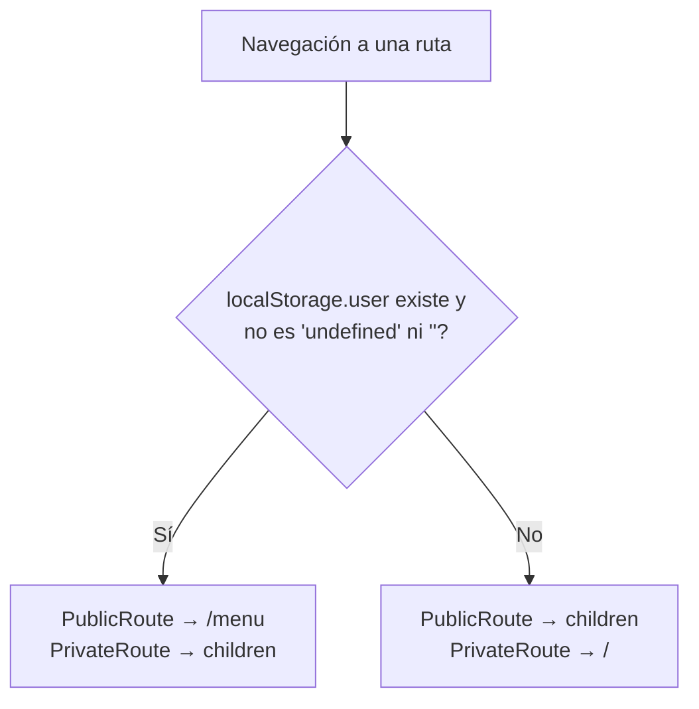

# Routing y guards

## 1. Rutas reales

Declaradas en `Frontend/src/App.jsx:11-19`. Son **cinco y no hay más**: no hay rutas anidadas, ni parámetros, ni `lazy`, ni `Suspense`, ni layout routes, ni `loader`/`action` de React Router 7 (se usa solo el modo declarativo `BrowserRouter` + `Routes`).

| Path | Componente | Guard | Origen |
| --- | --- | --- | --- |
| `/` | `Login` | `PublicRoute` | `App.jsx:13` |
| `/registrar` | `Registry` | `PublicRoute` | `App.jsx:14` |
| `/recuperar` | `PasswordRecuperation` | `PublicRoute` | `App.jsx:15` |
| `/menu` | `PrincipalPage` | `PrivateRoute` | `App.jsx:16` |
| `*` | `NotFound` | **sin guard** | `App.jsx:17` |

Notas verificadas:

- El componente importado como `PasswordRecuperation` en `App.jsx:4` se declara internamente como `function PasswordRecouperation` (`passwordRecuperation.jsx:8`, con errata en "Recouperation"). El import funciona porque es un `export default`.
- `NotFound` no tiene guard: es accesible con y sin sesión, y su único enlace va a `/` (`notFound.jsx:15`). Si el usuario tiene sesión, ese enlace lo devuelve a `/menu` por efecto de `PublicRoute`. *(Inferencia a partir del código.)*
- Las áreas y los módulos **no son rutas**. Ver § 4.

## 2. `RouteGuards.jsx` completo

`Frontend/src/components/RouteGuards.jsx` tiene 18 líneas y es el archivo entero de la carpeta `components/`.

```js
function isAuthenticated() {
  const user = localStorage.getItem('user');
  return user !== null && user !== 'undefined' && user !== '';
}
```
(`RouteGuards.jsx:3-6`)

| Guard | Comportamiento | Línea |
| --- | --- | --- |
| `PublicRoute` | Si `isAuthenticated()` → `<Navigate to="/menu" replace />`; si no, renderiza `children` | `RouteGuards.jsx:10-12` |
| `PrivateRoute` | Si `isAuthenticated()` → `children`; si no, `<Navigate to="/" replace />` | `RouteGuards.jsx:16-18` |

Ambos usan `replace`, así que la redirección no deja entrada en el historial.



## 3. Por qué esto es navegación de UI y **no** autorización

Esta distinción es la más importante de la nota. Cuatro razones, todas verificables:

1. **`isAuthenticated()` no valida nada del contenido.** Cualquier cadena distinta de `null`, `'undefined'` y `''` pasa el control: `'null'`, `'0'`, `'x'`, `'{}'` o un JSON manipulado a mano. No se hace `JSON.parse`, no se comprueba que exista `id`, `alias` ni `accessToken`, y no se valida expiración.
2. **`localStorage` lo controla el usuario.** Basta abrir la consola del navegador y escribir `localStorage.setItem('user','x')` para que `/menu` sea accesible. *(Inferencia directa del código; no se ejecutó.)* Lo que se ve entonces es un shell degradado: `JSON.parse('x')` lanza en `principalPage.jsx:93`, la promesa de carga rechaza y la pantalla queda en "Cargando..." (ver [[fe-findings]]).
3. **Los guards no consultan al servidor.** No hay endpoint de validación de sesión, ni `/me`, ni verificación del token al montar. El único uso del token es como cabecera en las mutaciones de Plataforma ([[fe-api-clients]]).
4. **Los permisos de módulo son decorativos en el cliente.** `module.permisos` decide qué botones se pintan (`accountsModule.jsx:40-46`). Quien modifique `localStorage.user.accesos` puede hacerse aparecer botones. Lo que realmente protege es que el endpoint sea `[Authorize]` en el backend; y los dos `GET` de listados **no lo son** (`Backend/Controllers/PlatformControler.cs:24,31`), por lo que solicitudes y usuarios registrados son legibles sin sesión alguna. Ver [[be-auth-session]] y [[fe-findings]].

**Conclusión para redacción futura**: describir `PublicRoute`/`PrivateRoute` como "evitan que la UI muestre pantallas sin sentido según el estado local del navegador". No describirlos como control de acceso.

## 4. Áreas y módulos no son rutas

La navegación interna de `/menu` es **estado de React**:

- El área activa vive en `useState` (`principalPage.jsx:83`, `activeModule`, inicializado a `'inicio'`), y se cambia con `onClick={() => setActiveModule(module.key)}` (`principalPage.jsx:140`).
- El módulo activo vive en `useState` dentro de `AreaTemplate` (`areaTemplate.jsx:47`, `selectedId`, inicializado al primer módulo).

Consecuencias verificadas:

| Efecto | Detalle |
| --- | --- |
| La URL nunca cambia | Siempre `/menu`, en cualquier área y módulo |
| No hay enlace profundo | No se puede compartir "la pestaña de permisos" |
| No hay historial de módulo | El botón Atrás del navegador sale de `/menu`, no vuelve a la pestaña previa |
| Recargar vuelve a Inicio | `activeModule` se reinicializa a `'inicio'` |
| Login y logout son recargas duras | `window.location.href` en `login.jsx:34` y `principalPage.jsx:115`, no `navigate()` |

El SPA fallback de Nginx (`Frontend/nginx.conf:10-12`, `try_files $uri $uri/ /index.html`) existe para que `/menu` y `/registrar` funcionen al recargar o al entrar directo. Sin él, esas URL darían 404 de Nginx. Ver [[fe-config-deployment]].

## 5. Cierre de sesión

`handleLogout` en `principalPage.jsx:113-116`:

```js
localStorage.removeItem('user');
window.location.href = '/';
```

No hay endpoint de logout ni revocación del bearer en el servidor: el token sigue siendo válido hasta expirar (8 h, ver [[fe-session-state]] y [[be-auth-session]]). Borrar la clave solo hace que los guards dejen de permitir `/menu`.

Hay un segundo camino de cierre de sesión, en `accountsModule.jsx:257-259`: si se da de baja a la propia cuenta, se borra `localStorage.user` y se redirige a `/`. Es **código inalcanzable** en la práctica, porque el filtro de la lista excluye al usuario activo (`accountsModule.jsx:321`). Ver [[fe-findings]].

## Enlaces

- Mapa: [[fe-index]] · Arquitectura: [[fe-architecture]]
- Páginas afectadas: [[fe-pages]] · Sesión y token: [[fe-session-state]]
- Permisos de módulo: [[fe-templates-areas-modules]], [[fe-module-accounts]], [[fe-module-permits]]
- Contratos HTTP: [[fe-api-clients]] · Defectos: [[fe-findings]]
- SPA fallback y despliegue: [[fe-config-deployment]], [[be-deployment]]
- Autenticación real del servidor: [[be-auth-session]], [[be-api-reference]], [[be-flows]]
- Sistema completo: [[architecture-overview]], [[be-index]], [[db-index]]
