# Sesión y estado del cliente

## 1. Toda la sesión es una clave de `localStorage`

No hay cookies, ni `sessionStorage`, ni Context, ni store. La sesión es **exactamente** `localStorage.user`, un JSON serializado.

| Operación | Dónde | Código |
| --- | --- | --- |
| Escritura | `login.jsx:33` | `localStorage.setItem('user', JSON.stringify(UserAccess))` |
| Borrado en login fallido | `login.jsx:29, 37` | `localStorage.removeItem('user')` |
| Lectura para guards | `RouteGuards.jsx:4` | `localStorage.getItem('user')` (sin parsear) |
| Lectura para la app | `principalPage.jsx:93` | `JSON.parse(localStorage.getItem('user'))` (sin `try/catch`) |
| Borrado en logout | `principalPage.jsx:114` | `localStorage.removeItem('user')` |
| Borrado en autobaja | `accountsModule.jsx:258` | inalcanzable ([[fe-module-accounts]]) |

Después de la lectura de `principalPage.jsx:93`, el objeto viaja como prop `user` hacia abajo. **Ningún otro componente vuelve a leer `localStorage`.**

## 2. Qué se guarda exactamente

Se guarda el DTO de login **completo, sin filtrar** (`login.jsx:33`). Su forma (`interfaces/response/Auth.ts:8-17`, confirmada en `Backend/Models/Response/UserAccess/AuthResponse.cs`):

```json
{
  "id": 100,
  "nombre": "Nombre Apellido",
  "alias": "ejemplo",
  "correo": "ejemplo@example.invalid",
  "accessToken": "<bearer opaco de ASP.NET Core>",
  "accesos": [
    { "Plataforma": [ { "1": [1, 2, 3] }, { "3": [1, 2] } ] }
  ]
}
```

*(Valores ilustrativos, no datos del hospital.)*

| Campo | Consumido en | Para qué |
| --- | --- | --- |
| `id` | `accountsModule.jsx:321, 257`, `permitsModule.jsx:56` | excluirse de las listas; rama de autobaja |
| `nombre` | `principalPage.jsx:125-127`, `start.jsx:90` | iniciales del avatar y saludo |
| `correo` | `principalPage.jsx:128` | subtítulo del sidebar |
| `alias` | — | **no se usa en ninguna vista** |
| `accessToken` | `accountsModule.jsx:132, 253, 292`, `permitsModule.jsx:143, 186` | cabecera `Authorization: Bearer` |
| `accesos` | `principalPage.jsx:34, 44`, `areaTemplate.jsx:15` | sidebar, pestañas y `module.permisos` |

## 3. El token: qué es y qué implica

> Corrección respecto a `.agent/CONTEXT.md`, que afirmaba "no se envía token en futuras peticiones, no hay renovación/expiración". Eso **ya no es cierto**.

Hechos verificados en el backend, relevantes para el frontend:

- El token lo genera `SessionTokenService.Create(userId)` (`Backend/Handlers/SessionTokenService.cs:11-26`): es un **bearer opaco protegido** del esquema `BearerTokenDefaults`, con `IssuedUtc` y `ExpiresUtc`, y una única claim `ClaimTypes.NameIdentifier` = ID de usuario.
- La expiración configurada es **8 horas**: `AddBearerToken(options => options.BearerTokenExpiration = TimeSpan.FromHours(8))` (`Backend/Program.cs:33`).
- **No es un JWT legible**: está cifrado con Data Protection. El frontend no puede inspeccionar su expiración ni su contenido. *(Hecho verificado por el mecanismo; consecuencia inferida.)*
- **No hay refresh token** ni endpoint de renovación.
- Los endpoints `[Authorize]` extraen el ID del token y lo usan como `actorId` para auditar quién realiza la acción (`Backend/Controllers/PlatformControler.cs:44, 79, 106, 156`).

### Consecuencias en la experiencia de uso

| Situación | Qué pasa |
| --- | --- |
| Sesión con más de 8 h | Los guards **siguen permitiendo `/menu`** (solo miran que la clave exista) y los listados siguen cargando, porque los GET de `/Platform` no exigen token. La primera **mutación devuelve 401** y ahí se detecta la expiración |
| Reacción al 401 | **Desde el 2026-09-19 el 401 cierra la sesión.** `throwSessionExpired()` borra `localStorage.user`, deja un aviso en `sessionStorage` y hace `window.location.replace('/')`; el login lo consume y lo muestra. Ya no hay que cerrar sesión a mano |
| `localStorage` de una sesión previa a la introducción del token | `accessToken` es `undefined` → el cliente cierra la sesión por la misma vía, sin llegar a hacer la petición |
| Cerrar sesión | Solo borra la clave local; **el token sigue válido en el servidor** hasta expirar. No hay revocación ([[be-auth-session]]) |

## 4. Qué falta

| Falta | Impacto |
| --- | --- |
| **Refresco de permisos.** `accesos` se congela en el login | Un cambio hecho desde [[fe-module-permits]] no llega a la sesión abierta del usuario afectado. Debe cerrar y volver a iniciar sesión |
| **Detección de expiración en el cliente.** El token es opaco y no se guarda `ExpiresUtc` | No se puede avisar antes de fallar ni renovar proactivamente: la expiración se descubre al recibir el primer 401 |
| **Interceptor de `fetch`.** El cierre por 401 está resuelto, pero cada función de `PlatformApi.ts` lo invoca por separado | Un cliente nuevo que olvide comprobar el 401 vuelve a dejar la sesión zombi. Ver [[fe-api-clients]] |
| **Validación de la forma del objeto.** No se comprueba que existan `id`/`accessToken` al arrancar `/menu` | `JSON.parse` puede lanzar y dejar la pantalla en "Cargando..." ([[fe-findings]]) |
| **Endpoint de perfil / rehidratación.** No hay `/me` | Tras recargar, el estado se reconstruye desde `localStorage`, no desde el servidor |
| **Revocación en logout.** No hay endpoint | Un token filtrado sigue sirviendo hasta 8 h |
| **Almacenamiento resistente a XSS.** El token está en `localStorage`, legible por cualquier JS de la página | Ver § 5 |

## 5. Riesgos, ordenados por gravedad

1. **Token de portador en `localStorage`.** Cualquier XSS en la SPA (incluida una dependencia comprometida) puede leerlo y usarlo durante hasta 8 h contra los endpoints de aprobación, baja y permisos. Es el riesgo de mayor gravedad del frontend. Mitigación habitual: cookie `HttpOnly` + `SameSite`, lo que exige cambios coordinados de backend y CORS ([[be-auth-session]]).
2. **Objeto de sesión manipulable.** El usuario puede editar `accesos` en la consola para hacerse aparecer pestañas y botones. Eso no le otorga permisos reales en las mutaciones **porque el servidor valida el token**, pero sí le da acceso a los listados, que **no exigen token** (`GET /Platform/UserRequest`, `GET /Platform/Users`). El resultado neto: **datos personales de solicitudes y usuarios son legibles sin autenticación alguna**.
3. **`isAuthenticated()` trivial.** `localStorage.setItem('user','x')` basta para entrar a `/menu` ([[fe-routing-guards]]).
4. **Sin cierre por inactividad ni caducidad visible.** Una estación compartida conserva la sesión indefinidamente para efectos de navegación.
5. **Permisos obsoletos.** Un usuario al que se le revocan permisos conserva su UI anterior hasta reingresar; los botones que pulse fallarán en el servidor, pero verá pantallas que ya no le corresponden.
6. **`JSON.parse` sin protección** en el arranque del shell privado: rompe la pantalla en lugar de reencaminar al login.

## 6. Diagrama del ciclo de vida

```mermaid
stateDiagram-v2
    [*] --> SinSesion
    SinSesion --> Autenticando: submit en Login
    Autenticando --> SinSesion: 401 o red caída (removeItem)
    Autenticando --> ConSesion: 200 con id → setItem('user') + location.href='/menu'

    ConSesion --> ConSesion: navegar áreas/módulos (solo estado de React)
    ConSesion --> ConSesion: mutaciones con Bearer OK
    ConSesion --> TokenVencido: transcurren 8 h o se reinicia el backend
    TokenVencido --> TokenVencido: los guards siguen permitiendo /menu;\nlecturas OK hasta intentar una mutación
    TokenVencido --> SinSesion: primera mutación devuelve 401\nthrowSessionExpired: removeItem + replace('/')
    ConSesion --> SinSesion: "Cerrar sesion" (removeItem + location.href='/')

    note right of TokenVencido
        No hay refresco, ni aviso,
        ni logout automático.
        El token sigue válido en el
        servidor hasta expirar.
    end note
```



## 7. Estado efímero de React (lo que se pierde al recargar)

Para completar el cuadro: además de `localStorage`, la app mantiene estado en memoria que **no se persiste en ningún sitio**.

| Estado | Dónde | Se pierde al |
| --- | --- | --- |
| Área activa (`activeModule`) | `principalPage.jsx:83` | recargar o cambiar de ruta |
| Los tres catálogos (`catalogs`) | `principalPage.jsx:84` | recargar (se vuelven a pedir) |
| Módulo activo (`selectedId`) | `areaTemplate.jsx:47` | recargar o cambiar de área |
| Filtros de nombre y correo | módulos | cambiar de módulo |
| Contenido de los modales | módulos | cerrar el modal |
| `realUserTypes`, `realAllModules` | módulos | desmontar el módulo |

Como el login y el logout usan `window.location.href` (recarga dura), **todo este estado se reconstruye desde cero en cada transición de sesión** — lo que, paradójicamente, es lo que evita que el estado stale se note ([[fe-architecture]]).

## Enlaces

- Mapa: [[fe-index]] · Arquitectura y ausencia de store: [[fe-architecture]]
- Guards que solo miran esta clave: [[fe-routing-guards]]
- Quién la escribe y quién la lee: [[fe-pages]]
- Quién consume `accesos`: [[fe-templates-areas-modules]]
- Quién consume `accessToken`: [[fe-api-clients]], [[fe-module-accounts]], [[fe-module-permits]]
- Riesgos consolidados: [[fe-findings]]
- Autenticación del servidor y expiración: [[be-auth-session]], [[be-api-reference]], [[be-flows]], [[be-index]], [[be-dto-contracts]]
- Modelo de permisos en datos: [[db-index]], [[db-schema-acceso-usuario]], [[db-table-permisos]], [[db-table-usuario-modulo-permisos]], [[db-table-areas]], [[db-table-modulos]]
- Visión global: [[architecture-overview]]
