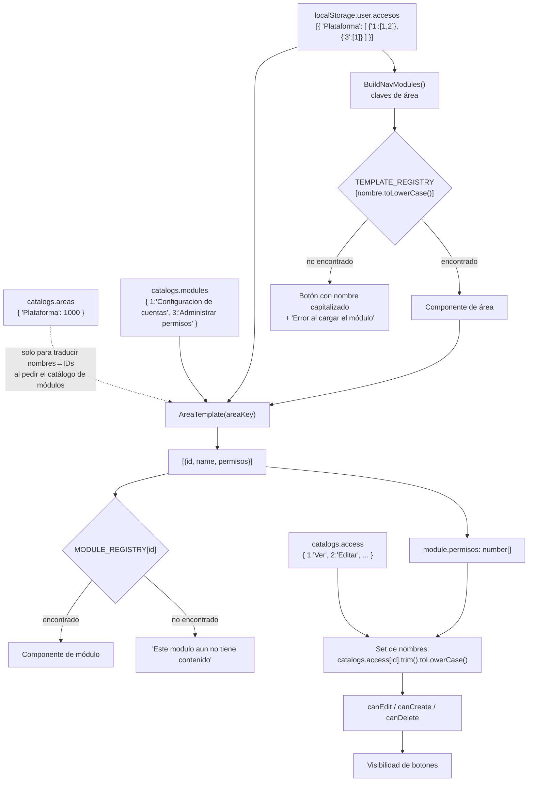

# Templates, áreas y módulos

Esta nota explica el **mecanismo de doble registro** que convierte los datos de catálogo de SQL en componentes de React, y el acoplamiento rígido que eso crea.

## 1. Los dos registros

Hay exactamente dos diccionarios codificados a mano en el frontend. Uno indexa por **nombre de área normalizado**; el otro por **ID numérico de módulo**.

### `TEMPLATE_REGISTRY` — por nombre de área

`Frontend/src/pages/principalPage/principalPage.jsx:10-15`

| Clave (debe ser el `Areas.Nombre` en minúsculas) | Etiqueta mostrada | Componente | Archivo |
| --- | --- | --- | --- |
| `inicio` | Inicio | `Start` | `templates/start/start.jsx` |
| `plataforma` | Plataforma | `Platform` | `templates/platform/platform.jsx` |
| `recursos humanos` | Recursos Humanos | `HumanResources` | `templates/humanResources/humanResources.jsx` |
| `contabilidad` | Contabilidad | `Contability` | `templates/contability/contability.jsx` |

Resolución en `ResolveModule(key)` (`principalPage.jsx:22-29`):

```js
const entry = TEMPLATE_REGISTRY[key.toLowerCase()];
return { key, label: entry?.label ?? Capitalize(key), component: entry?.component ?? null };
```

Normalización aplicada: **solo `toLowerCase()`**. No hay `trim()`, no hay eliminación de acentos, no hay normalización Unicode. `'inicio'` se inyecta siempre y no necesita existir en la base (`principalPage.jsx:32`).

### `MODULE_REGISTRY` — por ID de módulo

`Frontend/src/templates/shared/areaTemplate.jsx:8-12`

| ID codificado | Componente | Archivo | Estado funcional |
| --- | --- | --- | --- |
| `1` | `AccountsModule` | `templates/platform/accounts/accountsModule.jsx` | **Funcional con persistencia** ([[fe-module-accounts]]) |
| `2` | `PlacesModule` | `templates/humanResources/places/placesModules.jsx` | **Funcional con persistencia**: catálogos de áreas y puestos |
| `3` | `PermitsModule` | `templates/platform/permits/permitsModule.jsx` | **Funcional con persistencia** ([[fe-module-permits]]) |
| `4` | `EmployeesModule` | `templates/humanResources/employees/employeesModule.jsx` | Andamio: título y propósito, sin operaciones |
| `5` | `PayrollModule` | `templates/humanResources/payroll/payrollModule.jsx` | Andamio: título y propósito, sin operaciones |
| `6` | `FomopeModule` | `templates/humanResources/fomope/fomopeModule.jsx` | Andamio: título y propósito, sin operaciones |

El registro es **global por ID**, no por combinación área+nombre. Si en SQL existiese un módulo con `Id = 2` dentro del área Plataforma, `AreaTemplate` pintaría `PlacesModule` ("Administrar Plazas") dentro de Plataforma. *(Inferencia directa de `areaTemplate.jsx:50`.)*

Los tres andamios comparten `templates/humanResources/humanResources.css` en lugar de tener hoja propia, con el mismo criterio por el que `permitsModule.jsx` importa `../accounts/accountsModule.css`. Declaran **solo** la prop `module`, no `catalogs` ni `user`, para no añadir advertencias de parámetro sin uso al `lint`.

### Cruce verificado contra la instancia

Comprobado el **2026-09-19** contra `POST /Auth/modules` con las tres áreas: los seis IDs del registro corresponden al módulo que se espera, y **no hay entradas del registro sin módulo en la base**.

| ID | Nombre en la base | Área | Componente |
| --- | --- | --- | --- |
| `1` | `configuracion de cuentas` | plataforma | `AccountsModule` |
| `2` | `Administrar Plazas` | recursos humanos | `PlacesModule` |
| `3` | `Administrar Permisos` | plataforma | `PermitsModule` |
| `4` | `Administrar Empleados` | recursos humanos | `EmployeesModule` |
| `5` | `Registrar Nominas` | recursos humanos | `PayrollModule` |
| `6` | `Generar FOMOPE` | recursos humanos | `FomopeModule` |
| `1002` | `Complemento de Pago` | contabilidad | **ninguno** → "sin contenido" |

El único módulo sin componente es `1002`. Al construirlo hay que añadir su entrada aquí; sin ella no se monta, por más permisos que tenga el usuario. Cruzar con [[db-table-modulos]] antes de crear o reordenar catálogos.

## 2. Los envoltorios de área

`Platform` y `HumanResources` son adaptadores mínimos que solo fijan `areaKey`:

```jsx
<AreaTemplate user={user} catalogs={catalogs} areaKey="plataforma" title="Plataforma" />
```
(`platform.jsx:5-10`; equivalente en `humanResources.jsx:5-10` con `areaKey="recursos humanos"`)

La prop `title` **se recibe y nunca se usa** en `AreaTemplate` (`areaTemplate.jsx:41`); es una de las 5 advertencias de oxlint ([[fe-config-deployment]]).

`Contability` **no usa `AreaTemplate`**: es una vista plana con `<h1>Contabilidad</h1>` y un párrafo (`contability.jsx:1-8`). Recibe `user` y `catalogs` y los ignora (2 advertencias de lint). Añadirle módulos exigirá migrarla al patrón de `AreaTemplate`.

`Start` sí usa `user` (para el saludo, `start.jsx:90`) e ignora `catalogs`. Su contenido son dos arrays literales: `PURPOSE_CARDS` (3 tarjetas, `start.jsx:3-19`) e `INSTITUTIONAL_PAGES` (12 reseñas institucionales, `start.jsx:21-82`). **Son textos locales**: no hay URL clicables, ni CMS, ni fetch. Su exactitud factual no se validó como parte de esta documentación.

## 3. Cómo `AreaTemplate` resuelve pestañas y permisos

`Frontend/src/templates/shared/areaTemplate.jsx`

### `GetAreaModules(user, catalogs, areaKey)` — líneas 14-39

1. Recorre `user.accesos` (array de diccionarios área → módulos).
2. Busca la clave cuyo `toLowerCase()` coincide con `areaKey.toLowerCase()` (`areaTemplate.jsx:21-23`). Aquí sí hay tolerancia de casing, pero **tampoco hay `trim()`**.
3. Para cada diccionario de módulos de esa área, por cada clave `moduleId`:
   - `id = Number(moduleId)` — las claves llegan como **string** porque JSON no admite claves numéricas ([[be-dto-contracts]]).
   - `name = catalogs.modules[id]` — puede quedar **`undefined`** si el módulo no está en el catálogo cargado.
   - `permisos = moduloDict[moduleId] ?? []` — array de IDs de permiso, **sin nombres**.
4. Devuelve `[{id, name, permisos}]`. Memoizado con `useMemo` sobre `[user, catalogs, areaKey]` (`areaTemplate.jsx:42-45`).

### Selección de pestaña

```js
const [selectedId, setSelectedId] = useState(modules[0]?.id ?? null);
```
(`areaTemplate.jsx:47`)

Se inicializa **una sola vez**, en el primer render. No hay `useEffect` de sincronización: si `modules` cambiara después (por ejemplo porque `catalogs` llega más tarde), `selectedId` se quedaría en el valor anterior o en `null`. En la práctica no se observa porque `PrincipalPage` no monta el template hasta que `loading === false` (`principalPage.jsx:153-156`). *(Inferencia.)*

El orden de las pestañas es **el orden de iteración de las claves del JSON de accesos**, no un orden explícito de SQL. No hay `ORDER BY` que lo garantice ni `sort()` en el cliente.

### Estados de la vista (`areaTemplate.jsx:52-90`)

| Condición | Qué se muestra |
| --- | --- |
| `modules.length === 0` | Franja vino con "Sin modulos disponibles" y el mensaje "No tienes modulos asignados en esta area." |
| Módulo seleccionado **con** componente en `MODULE_REGISTRY` | `<ModuleComponent user catalogs module />` |
| Módulo seleccionado **sin** componente | Título del módulo + "Este modulo aun no tiene contenido asignado." |
| Módulo con `name === undefined` | La pestaña se dibuja **vacía**; no se filtra ni se pone un texto de respaldo |

Ese último caso ocurre cuando el JSON de login incluye un módulo que el catálogo no devolvió — típicamente un módulo con `Activo = false`, o de un área inactiva, porque el login no filtra activos al construir `accesos` mientras que el catálogo de módulos sí filtra ([[be-flows]], [[db-table-modulos]]). Es un defecto real ([[fe-findings]]).

## 4. Diagrama de resolución completa



## 5. Cómo se convierten IDs de permiso en capacidades

Patrón idéntico en los dos módulos funcionales (`accountsModule.jsx:40-46`, `permitsModule.jsx:29-32`):

```js
const permissions = new Set(
  (module?.permisos ?? []).map((id) => catalogs?.access?.[id]?.trim().toLowerCase())
);
const canEdit   = permissions.has('editar');
const canCreate = permissions.has('crear');
const canDelete = permissions.has('eliminar');   // solo en accountsModule
```

Propiedades verificadas de este mecanismo:

- **No asume IDs numéricos concretos** para editar/crear/eliminar: los resuelve por nombre a través del catálogo. Eso es deliberado y correcto.
- **Sí asume los nombres exactos** `'editar'`, `'crear'`, `'eliminar'` en `Permisos.Nombre`, tolerando espacios y mayúsculas. Renombrar un permiso en SQL a "Modificar" apaga silenciosamente los botones. Ver [[db-table-permisos]].
- **Depende de que `catalogs.access` haya cargado.** Si ese fetch falló, `catalogs.access` es `null`, el `Set` se llena de `undefined` y **ningún botón de acción aparece**, sin mensaje de error. *(Inferencia.)*
- Se recalcula en **cada render** (no está memoizado). Coste despreciable.
- Los permisos son **por módulo**: `module.permisos` solo contiene los de la pestaña activa. Un módulo no hereda permisos de otro.
- En cambio, dentro de los modales de asignación se ofrecen **todas** las áreas de `catalogs.areas` y **todos** los permisos de `catalogs.access`, no solo aquellos que el administrador posee. Ver [[fe-findings]].

Contraste importante: `PlacesModule` y `Contability` **no consumen permisos en absoluto**; `AreaTemplate` tampoco los usa para decidir si pintar una pestaña. Es decir, el permiso `ver` no filtra pestañas: la pestaña existe porque hay una fila en `UsuarioModuloPermisos` ([[db-table-usuario-modulo-permisos]]), sea cual sea el permiso.

## 6. Acoplamiento con los datos de SQL: tabla de riesgos

| Cambio en la base | Efecto en el frontend | Dónde |
| --- | --- | --- |
| Renombrar `Areas.Nombre` (incluso solo el casing + un espacio) | El área aparece en el sidebar pero sin componente → "Error al cargar el módulo" | `principalPage.jsx:23` |
| Añadir un área nueva | Aparece en el sidebar y falla al abrirse hasta que se añada al `TEMPLATE_REGISTRY` | `principalPage.jsx:10-15` |
| Cambiar `Modulos.Id` o recrear el catálogo con otros IDs | Se pinta el componente equivocado, o "aun no tiene contenido" | `areaTemplate.jsx:8-12` |
| Poner `Modulos.Activo = false` sin quitar las asignaciones | Pestaña con nombre vacío | `areaTemplate.jsx:31, 67` |
| Poner `Areas.Activo = false` | Desaparece del catálogo de áreas; sus módulos no se resuelven por nombre → pestañas sin nombre | `principalPage.jsx:53-68` |
| Renombrar `Permisos.Nombre` | Los botones de acción desaparecen sin aviso | `accountsModule.jsx:41-45` |
| Cambiar el permiso cuyo ID es `1` | Se rompe la regla "Ver forzado" de los modales, que compara `id === '1'` como literal | `accountsModule.jsx:615`, `permitsModule.jsx:341` |

## 7. Módulos placeholder

`PlacesModule` (`placesModules.jsx:1-10`):

```jsx
<h2 className="area-module-title">{module?.name ?? 'Administrar Plazas'}</h2>
<p className="content-placeholder">Modulo de administracion de plazas.</p>
```

Recibe `user` y `catalogs` sin usarlos. Su CSS (`placesModules.css`) está **vacío y no se importa**. Lo mismo ocurre con `contability.css`, `humanResources.css` y `platform.css`: los cuatro son archivos de 0 bytes sin import ([[fe-design-system]]).

No existe `composable/HumanResourcesApi.ts` con contenido: el archivo está creado pero **vacío** ([[fe-api-clients]]), aunque el backend expone `POST /HumanResources` y `POST /Contability` con texto de prueba ([[be-api-reference]]).

## Enlaces

- Mapa: [[fe-index]] · Arquitectura y flujo de props: [[fe-architecture]]
- Quién monta los templates: [[fe-pages]] (`PrincipalPage`)
- Módulos con lógica real: [[fe-module-accounts]], [[fe-module-permits]]
- Contratos consumidos: [[fe-api-clients]], [[fe-interfaces]]
- Permisos de sesión congelados: [[fe-session-state]] · Estilos de pestañas: [[fe-design-system]]
- Defectos derivados del acoplamiento: [[fe-findings]]
- Origen de los datos: [[db-index]], [[db-schema-acceso-usuario]], [[db-table-areas]], [[db-table-modulos]], [[db-table-permisos]], [[db-table-usuario-modulo-permisos]]
- Construcción de `accesos` en el servidor: [[be-flows]], [[be-dto-contracts]], [[be-api-reference]], [[be-auth-session]], [[be-index]]
- Visión global: [[architecture-overview]]
